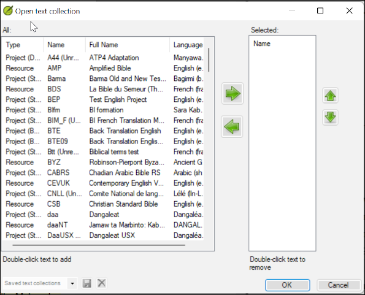
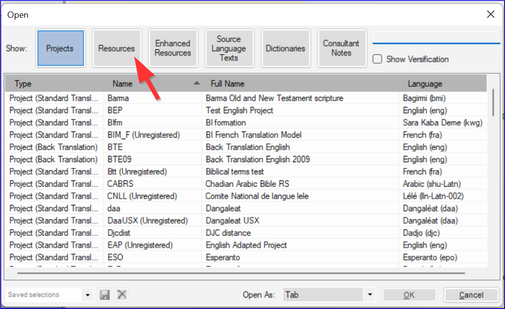

import ReactPlayer from "react-player";

**Introducción** A medida que trabaje con su texto en Paratext 9 querrá ver una variedad de recursos. En este módulo aprenderá a abrir recursos y a organizar su escritorio.

**Antes de empezar** Se dispone a escribir texto en un proyecto existente. Antes de poder hacerlo, alguien debe haber instalado ya el programa, creado un proyecto para sus datos e instalado recursos para usted.

**¿Por qué es importante?** El traductor que organiza bien su escritorio dispone de todos los recursos necesarios para su trabajo.

**¿Qué va a hacer?** Iniciará el programa Paratext 9 y abrirá un diseño (combinación de texto) previamente guardado. Si es necesario, abrirá otros recursos, cambiará la disposición de las ventanas y volverá a guardar la disposición del texto.

:::info Vídeos

Hay varios vídeos disponibles para ayudarle con los distintos tipos de recursos y la disposición de las ventanas. Más abajo se ofrecen algunas sugerencias. Haga clic en el enlace para ver el vídeo de resumen. 

<ReactPlayer controls url="https://vimeo.com/368328862" />

  
 
  
  

    

<ReactPlayer controls url="https://vimeo.com/368328956" />

    
    

    

  

  
  

<ReactPlayer controls url="https://vimeo.com/377612892" />

    
    

      
 
      
      

        

<ReactPlayer controls url="https://vimeo.com/382483908" />

        
        

        

      

      
      

<ReactPlayer controls url="https://vimeo.com/377612971" />

        
        

          
 
          
          

            

<ReactPlayer controls url="https://vimeo.com/377613013" />

            
            

            

          

          
          

:::
          

<h3 id="ed3427390c2b484f8c1343a8944fe332" spaces-before="0">
  <strong x-id="1">Cambios en Paratext 9</strong>
</h3>

  Los menús cambiaron en Paratext 9.0. Para ver el menú, ahora tiene que hacer clic en el icono de menú ≡. Ahora hay dos tipos de menús.

El menú principal de Paratext se encuentra en la barra de título. Cada ventana (o pestaña) tiene su propio menú.

  
  

    
 
    
    

      

      
      

      

    

    
    

      Al hacer clic en uno de estos iconos de menú, aparecen todos las herramientas y solo tiene que hacer clic sobre la que necesite.
    

    
    

      :::tip
    

    
    

      En este manual, cuando dice <strong x-id="1">≡ Paratext</strong>, bajo<strong x-id="1">Menú</strong> &gt; <strong x-id="1">Comando</strong> (por ejemplo <strong x-id="1">≡ Paratext</strong>, bajo <strong x-id="1">Paratext</strong> &gt; <strong x-id="1">Abrir</strong>). Significa hacer clic en el icono de menú Paratext ≡ y, a continuación, en el menú (por ejemplo, Paratext), elegir el comando (por ejemplo, Abrir).
    

    
    

      And when it says <strong x-id="1">≡ Tab</strong>, under <strong x-id="1">Menu</strong> &gt; <strong x-id="1">Command</strong> it means click on the tab menu icon, then under the menu (e.g. Tools) click on the command (e.g. Wordlist). The most common Tab is the project menu so it may just say ”<strong x-id="1">≡ project</strong> <strong x-id="1">menu</strong>”.
    

    
    

:::
    

<h2 id="c07b16862b1d4f55821e9a5398e26435" spaces-before="0">
  2.1 Cargar el programa
</h2>

<ol start="1">
  <li>
    

      Double-click on Paratext 9 icon on the <strong x-id="1">desktop</strong>
    

    

      
    

  </li>
</ol>

<ul>
  <li>
    <strong x-id="1">O</strong> <ol start="1">
      <li>
        (From the <strong x-id="1">Start</strong> menu, choose <strong x-id="1">Paratext 9</strong>)
      </li>
    </ol>
  </li>
</ul>

<h2 id="d65baaea138b4d72b0dbaaadd85f23d5" spaces-before="0">
  2.2 Abrir un diseño guardado
</h2>

<ol start="1">
  <li>
    Click the <strong x-id="1">≡ Paratext</strong> menu, then under the <strong x-id="1">Layout</strong> menu
  </li>
  
  <li>
    

      Elija un diseño guardado (combinación de texto).
    

    <ul>
      <li>
        

          <em x-id="4">Your screen should look something like the picture below (if not, see below).</em>
        

        

          
        

      </li>
    </ul>
  </li>
</ol>

<h2 id="71e308de0d1f4c71b54acfb4d760fae8" spaces-before="0">
  2.3 Crear un nuevo diseño de texto
</h2>

  Si aún no ha guardado un diseño, le recomendamos que haga lo siguiente:

<h3 id="f5f12c7b122148ca9b9b4edd7c7eb807" spaces-before="0">
  <strong x-id="1">Abrir y ordenar las ventanas</strong>
</h3>

<ul>
  <li>
    1 = Colección de textos <ul>
      <li>
        <strong x-id="1">≡ Paratext</strong> menu, under <strong x-id="1">Paratext</strong> choose <strong x-id="1">Open Text Collection</strong>, select several resources, click <strong x-id="1">Right arrow</strong> button, click <strong x-id="1">OK</strong>. See <a href="/2.OD#204f93f95d7e4da7aa004d8b2aefaa86">2.5</a>)
      </li>
    </ul>
  </li>
  <li>
    2 =Your project <ul>
      <li>
        <strong x-id="1">≡ Paratext</strong> menu under <strong x-id="1">Paratext</strong> > <strong x-id="1">Open</strong>, Projects
      </li>
    </ul>
  </li>
  <li>
    5 = Traducciones de vocablos bíblicos <ul>
      <li>
        <strong x-id="1">≡ Tab</strong> menu, under Tools > <strong x-id="1">Biblical Terms renderings</strong>
      </li>
    </ul>
  </li>
  <li>
    3 = Textos en los idiomas originales <ul>
      <li>
        <strong x-id="1">≡ Paratext</strong> menu, under <strong x-id="1">Paratext</strong> > <strong x-id="1">Open > Source language text</strong>
      </li>
    </ul>
  </li>
  <li>
    4 = Recursos aumentados <ul>
      <li>
        <strong x-id="1">≡ Paratext</strong> menu, under <strong x-id="1">Paratext</strong> > <strong x-id="1">Open > Enhanced resources</strong>
      </li>
    </ul>
  </li>
  <li>
    Disponga las ventanas como desee. See Paratext videos 0.2.1b, 0.2.1c, and 0.2.3d.
  </li>
</ul>

  :::info Actualización

  In Paratext 9.3 (and above) you can use the main Paratext menu to arrange windows by <strong x-id="1">rows</strong> and <strong x-id="1">columns</strong>.

:::

  :::tip

  ¡Recuerda guardar tu diseño!

:::

<h3 id="d4ebb0ef8d0f49998351a50a09b5942b" spaces-before="0">
  Guardar el diseño
</h3>

  Una vez que las ventanas están organizadas como se desea:

<ol start="1">
  <li>
    <strong x-id="1">≡ Paratext</strong>, under <strong x-id="1">Layout</strong> &gt; <strong x-id="1">Save current layout</strong>
  </li>
  
  <li>
    Escriba un nuevo nombre
  </li>
  
  <li>
    OR to replace an existing layout, <ol start="1">
      <li>
        Click the dropdown to the right
      </li>
      
      <li>
        Elija el nombre del diseño guardado.
      </li>
    </ol>
  </li>
  
  <li>
    Haga clic en <strong x-id="1">Aceptar</strong>
  </li>
</ol>

<h2 id="75e26e8bdc3345529b5b3fc702f4c748" spaces-before="0">
  2.4 Eliminar un diseño de texto
</h2>

  Si quiere borrar un diseño guardado,

<ol start="1">
  <li>
    <strong x-id="1">≡ Paratext</strong> menu, under <strong x-id="1">Layout</strong> &gt; <strong x-id="1">Delete layout</strong>
  </li>
  
  <li>
    Haga clic en el menú desplegable de la derecha
  </li>
  
  <li>
    Elija el nombre del diseño guardado.
  </li>
  
  <li>
    Click <strong x-id="1">Delete</strong>
  </li>
</ol>

<h2 id="204f93f95d7e4da7aa004d8b2aefaa86" spaces-before="0">
  2.5 Abrir recursos en una colección de textos
</h2>

  Con Paratext, es posible tener varios proyectos/recursos abiertos al mismo tiempo. Sin embargo, en lugar de tener demasiadas ventanas, es mejor tener varios textos en una sola ventana.

  :::info Actualización

  In Paratext 9.3 the Text Collection can also be opened directly from the <strong x-id="1">≡ Paratext</strong> menu

:::

<h3 id="72a473aaf424486aaa027854c81aa784" spaces-before="0">
  Nuevo método - Abrir directamente desde el menú de Paratext
</h3>

1. **≡ Paratext** menu, under **Paratext** > **Open text collection**

1. Seleccione varios recursos utilizando la tecla Ctrl mientras hace clic en el recurso.

1. Click on the **Right arrow button**.

1. Repita la operación si es necesario.

1. Utilice las flechas arriba y abajo para reordenarlos según sea necesario.

  
  

    
 
    
    

      

      
      

      

    

    
    

      Guardar la colección
    

    
    <ol start="1">
      <li>
        Haga clic en el cuadro de texto de la esquina inferior izquierda.
      </li>
      
      <li>
        Escriba un nombre para la colección que guardará y haga clic en el icono de guardar
      </li>
      
      <li>
        Click <strong x-id="1">OK</strong>. <ul>
          <li>
            <em x-id="4">The text collection opens</em>.
          </li>
        </ul>
      </li>
    </ol>

<h3 id="4ce29225a23d4f53998f378f3d1f993f" spaces-before="0">
  Método anterior - diálogo de Abrir
</h3>

1. **≡ Paratext** menu, under **Paratext** > **Open**

1. Haga clic en el botón Recursos (en la parte superior).

1. Seleccione varios recursos utilizando la tecla Ctrl mientras hace clic en el recurso.

1. Repita la operación si es necesario.

1. Click on the **Open as** dropdown list.

1. Choose **Text collection panel**

1. Click **OK**

  
  

    
 
    
    

      

      
      

      

    

    
    

      :::tip
    

    
    

      Se sugiere que los recursos se muestren en el orden de más literal a menos literal (para centrarse en los textos más fieles a los textos fuente). Para los recursos en inglés: ESV, RSV, NIV, NLT. Para los recursos españoles, se sugiere el siguiente orden: RVR95EE, NVI-S, DHHE94EE, NTV.
    

    
    

:::
    

    
    

      There are several ways to change the order of texts in the collection
    

    
    

1. **≡ Tab**, **Modify text collection**

      
      

        
 
        
        

          

          
          

          

        

        
        

**From the Select Texts dialog**

1. Use the arrow buttons to change the order as necessary

1. Make any other changes

1. Click **OK**

          
          

            
 
            
            

              

              
              

              

            

            
            

              :::tip
            

            
            

              Puede cambiar el texto del segundo panel haciendo clic en el enlace azul de la abreviatura del texto. You can also use the <strong x-id="1">≡ Tab</strong> under V<strong x-id="1">iew</strong> menu to change the view (preview, unformatted or standard).
            

            
            

:::
            

<h2 id="ddb656b63852444cbe84a309b3bb9923" spaces-before="0">
  2.6 Abrir un recurso aumentado
</h2>

1. **≡ Paratext** menu, under **Paratext** > **Open**

1. Click on **Enhanced Resources**

  
  

    
 
    
    

      

      
      

      

    

    
    

      :::tip
    

    
    

      Los recursos aumentados también contienen un diccionario, imágenes, mapas, etc. Al abrir un recurso aumentado, también se abre una guía.
    

    
    

:::
    

<h2 id="7ea1b54db25c492c832d9d92995b4030" spaces-before="0">
  2.7 Abrir un diccionario
</h2>

  :::tip

  Si no utiliza un recurso mejorado, puede abrir un diccionario de la lengua de origen con glosas en otros idiomas.

:::

1. **≡ Paratext** menu, under **Paratext** > **Open**

1. Click **Dictionaries**

1. Choose “A Concise Greek-English Dictionary of the New Testament” OR “Trilingual Hebrew-English Lexicon of the Old Testament”

1. Click **OK**

1. **View** > choose a language (e.g. **French**)

  
  

    
 
    
    

      

      
      

      

    

    
    

      :::tip
    

    
    

      Es útil añadir ventanas de diccionario a la ocultación automática (haga clic con el botón derecho en el nombre de la pestaña y elija Mover a auto ocultar).
    

    
    

:::
    

    
    

      Otros diccionarios (en inglés pero con fotos)
    

    
    <ul>
      <li>
        "Plants and Trees in the Bible"
      </li>
      <li>
        "Animals in the Bible" (en español - Animales de la Biblia)
      </li>
    </ul>

<h2 id="9fe3171ca9784daf8bc9ff0681bcaa59" spaces-before="0">
  2.8 Trabajar con el texto en los idiomas originales
</h2>

  You can open the source language text with glosses in an alternative language than English, e.g. Gloss FR.

1. **≡ Paratext**, under **Paratext** > **Open**

1. Click **Source Language Texts**

1. Choose HEB/GRK

1. Click **OK.**

  
  

    
 
    
    

      

      
      

      

    

    
    

      If you have downloaded the special gloss resource, you can load them as follows
    

    
    <ol start="1">
      <li>
        <strong x-id="1">≡ Tab</strong> under <strong x-id="1">View</strong> &gt; <strong x-id="1">Additional glosses</strong>
      </li>
      
      <li>
        Choose the specific resource that has the glosses (e.g. GlossFR)
      </li>
      
      <li>
        Click <strong x-id="1">OK.</strong>
      </li>
    </ol>
