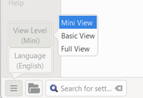

**Introduction**  In this module you will learn how to print a draft of your translation for checking and revising.

**Before you start**  You have entered and checked your translation in Paratext 9 and are now ready to print out a copy. In Paratext 9.4, your project does not need to be registered before you can print.

**Why this is important**  It is much easier to revise and check your work on paper than on the computer. You can also give it to more people if it is on paper.

**What you are going to do**  You will first produce a PDF version of your translation, which you can print or share with others (including non-Paratext users). If necessary, you can copy the PDF file onto your USB stick and take it to a computer with a printer.

:::info Upgrade Paratext 9.4

**PTXPrint** ने पुराने Draft PDF को बदल दिया है।

अभी यह सिर्फ अरबी, चीनी (सरल), अंग्रेजी, फ्रेंच, हंगेरियन, इंडोनेशियाई, पुर्तगाली, रोमानियाई, रूसी और स्पेनिश में उपलब्ध है।

अगर यह इंस्टॉल नहीं है, तो यह पहले आपको इसे डाउनलोड और इंस्टॉल करने के लिए कहेगा। PTXPrint बहुत शक्तिशाली है और इसमें कई विकल्प हैं। हम सलाह देते हैं कि आप एक भाषा चुनें और फिर **Mini View** का उपयोग करें।

:::

## 14.1 Create your first PDF file {#f6c39f92a81d44aead7aa92c0f6bb317}

:::caution

Make sure you have completed the **markers check** before printing a draft.

:::

1. **≡ Tab**, under **Project** &gt; **Export Draft PDF** **(PTX Print)**
2. At the bottom left, click the **menu button**
3. Click **View Level &gt;**  **Mini View**
4. Click **Basic** at the top left of the sidebar
5. Check that your project is selected.
6. **Either** choose **Single book**, then choose the book and chapters
7. **OR** If you want to print your priority or more than one book, choose **Portions or multiple books** and enter the references manually.

### Choose the page settings as follows {#ff7614d604f1485c8c6c4de117939575}

1. Click **Layout** on the left sidepanel. Choose the page settings as follows
2. Page size:
	- 210mm, 297mm (A4) or
	- 148mm, 210mm (A5)
3. Adjust the **Base Font size** as necessary (normallly 11pt)
4. Adjust the **Base Line Spacing** (single spacing is 120% of font)
5. Turn off **Two Column Layout**

### Choose the font for the text {#2f450c521a5a46e69f24dc8ef01b4262}

1. Click **Fonts+Scripts** on the left sidebar
2. Choose the font for the **Body Text (Regular)**: Charis SIL (or Charis SIL Compact)
3. Size: 10 (or 11)

### Print (Make PDF) {#bcd83f846ef549d2ac75fcb83c8df8e6}

1. Click on the **Print (Make PDF)** button
2. PTXPrint will make the PDF
	- _The PDF opens in your default PDF program._

### Need further changes? {#d80d8aac8a4a43f7a53d3502637d61c0}

:::tip

The Mini View is good to test your PDF. If you want to any changes, you can change the view level to **Basic View**. Full view is very advanced and good for your final publication.

:::

1. Change to Basic View
	1. At the bottom left, click the **menu button**
	2. Click **View Level >**  **Basic View**
2. Click **Layout** towards the top left of the sidebar
	1. Choose the **Margins**
	2. Check **Mirror Pages**
3. Click **Header+Footer** in the sidebar.
	1. Choose what you want in the **Header** (the text at the top of the page).
	2. Choose what you want in the **Footer**
	3. Make any other choices as needed.
4. Click **Print (Make PDF)**and wait, the file will open in your PDF reader.

### Print an A5 Booklet {#4ef8b4336abd46cf8f7383fcd9ae08c2}

:::tip

Make sure you have changed to Basic View

:::

In PTXPrint

1. Click on **Finishing** in the sidebar
2. Under **Booklet Pagination, Pages Per Spread**
3. Choose **2-up**
4. Check that the physical paper size is correct.
5. Click **Print (Make PDF)**

In you PDF software

1. **File** &gt; **Print**
2. Print the 2-up version double-sided
- Click on the **Printer Properties** button
	- _A dialog is displayed which will may be different but will have a way of setting double-sided._ For example
	- Click on **Finishing**
	- Choose **duplex** or **two sided**.
	- Click **OK**
- Click **Print**

:::tip

If you want to follow a punctuation system (such as French) and have spaces automatically inserted before complex punctuation, then see a consultant to have changes made to your PrintDraftChanges.txt

:::

## 14.3 Copy PDF file to a USB stick {#2f0e6aec647e495db41b1992e5f40094}

:::info

Paratext saves the PDF file in the PrintDrafts folder of your project folder. For example, C:\My Paratext 9 Projects\XXX\local\ptxprint

:::

:::tip

There are many ways to copy files. One method is described below.

:::

1. Hold the Windows Key and type **E**
	- _Windows Explorer opens_
2. Go to your **My Paratext 9 Projects** folder
3. Double-click on your project folder
4. Double-click the **local** folder then the **ptxprint**
5. Right-click on the desired PDF file
6. Choose **Send to**
7. Choose your USB stick.
