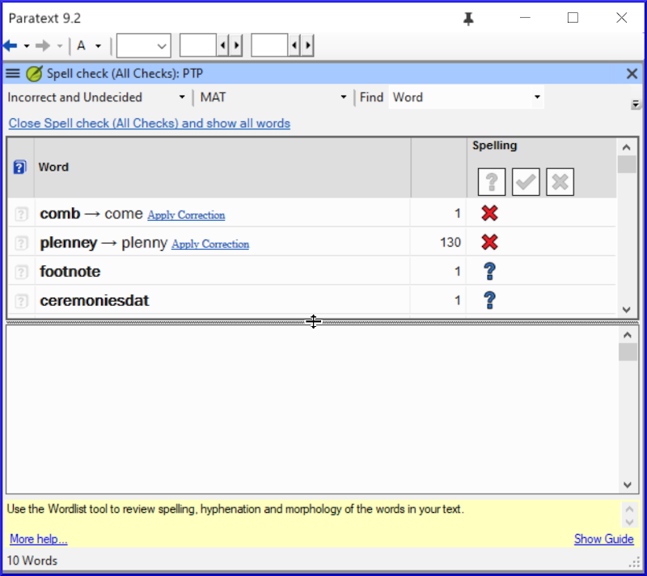
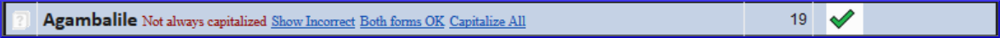

**Introduction**
This module explains how to check for spelling mistakes in the text you have typed into your project in Paratext 9.

**Before you start**
You have typed your text in Paratext 9 and have done some checks but there may still be spelling mistakes.

**Why is this important?**
It is important to correct any spelling mistakes so that your text will communicate clearly.

**What you are going to do**

- Configure the wordlist to build up a base of correct words.
- Work through your text with red squiggly lines showing words that Paratext does not know are correct.
- Work through your wordlist, either correcting mistakes or telling Paratext 9 that the words are correct.
- Use a variety of checks from the word list.
- Add a spelling discussion note to words that need further discussion before deciding on a correct spelling.

## 8.1 Configure the word list {#40e175d827144d3fa7fe8764eb52a38c}

:::tip

Before you can check the spelling, it is important to have a base of words that are known to be correct. There are three things we can do: 

:::

### **Approve the spelling of common words** {#6aaf90870de448588c0ce9fb64b65d43}

In Paratext

- **≡ Tab**, under **Tools** > **Wordlist**

In the Wordlist

- **≡ Tab**, under **Tools** > **Approve spelling of common words**
- Enter a number

:::tip

The number is the number of times the words must appear to automatically mark it as being spelled correctly. The default is 100 but you can choose more (if you have doubts about the text) or less (if you are confident about the accuracy of the typist). 

:::

- Click **OK**
- Click **Yes** (to confirm that you cannot undo)

### **Check the words that Paratext thinks are incorrect** {#a3207d4ca59241fbb6584235ec8b4f40}

In the Wordlist (**≡ Tab** under **Tools** > **Word List**)

- **≡ Tab**, under **Tools** > **Spell Check > All checks**
	- _A list of word s is displayed._
- Click on a word in the top pane.
- If the word is correct – click the green checkbox  at the top of the column

	

- If the word is incorrect, but Paratext 9 has suggested the correct word, then click the blue link for the correct word.
- If the word is incorrect, and Paratext 9 hasn’t suggested the correct word, click on the red checkbox  and correct the word. (See 9.3)

	

**Check similarly spelled words**

In the Wordlist

- **≡ Tab**, under **Tools** > **Find Similar Words**
- Enter letters which sound alike separated by / (e.g. s/sh/z)

:::tip

Depending on your language, tick or untick “Ignore all diacritics when comparing words”. 

:::

- Click **OK**
	- _A list of words is displayed._
- Correct the words (as described above).

## 8.2 Spell checking – from the text {#06eb94ff7f984dbfb77c59578610d96f}

In Paratext

- **≡ Tab**, under **View** > **Display spelling**

:::tip

A progress meter is displayed initially, then all the words that are either unknown or incorrect have red squiggly lines underneath. 

:::

### **Making corrections** {#08424f2265db451283ac532555f4c971}

:::tip

Paratext 9 will underline in red the words that have not been approved in the word list. This either means that the word is misspelled or unknown. 

:::

- Right-click a word which is underlined in either red or grey
	- _A dialogue is displayed_

		

- Either type the correction in the box or select the correct word from the list
- Click **OK**

:::tip

When possible, it is better to use the spelling check even when making minor corrections as Paratext 9 will remember the correction and you can apply the correction if it happens again. 

:::

When there is more than one correction, a dialog box is displayed.
Choose as appropriate:

- **Yes** = changes this verse and looks for the next
- **No** = skips this verse and looks for the next
- Yes to all – **is dangerous**, use with caution
- **Cancel** = stops further changes

## 8.3 Spell checking – current book {#d0eb209e6e9e4a9b83571d8c0b77bb2d}

- **≡ Tab**, under **Tools** > **Spell Check Current Book**
	- _A window appears with a list of some words in the current book._

		

- Make corrections as explained above 8.2
- Click **More items available** to see additional words.
- Continue as needed.

## 8.4 Spell checking – from the wordlist {#fe059d94b4fe4f05ae6e9347e11db06c}

### **Using the checks** {#8ce90200e78a4da1b8d11f1454d58f5e}

In the Wordlist

- **≡ Tab**, under **Tools**> **Spell check >**
- Choose the desired check (see descriptions below)

	

	- _A list of words is displayed_.
- Make the corrections as needed.
- Click **More items available** to see more words.
- Continue as needed.
- When the list is finished, a message is displayed

	

- Click **Yes**.

**All checks** This runs all of the checks. This is very useful as it will find all types of errors especially words with multiple types of errors.

**Missing Capitals**

- A list of words is displayed which have capitalised forms but are not always capitalised (that is both forms are used). The list shows the word with a lower case, then the capitalised form below it, which has a blue link to the word

	

- Click the blue link to the capitalised form

	

- Click the appropriate blue link.
- _Show incorrect_ (to see the verses)
- _The two forms are acceptable_ (to accept both forms)
- _Capitalise All_ (to correct all the words)

**Single Character Typos**
A list of words is displayed with links to other words which are similar but only have one letter different.

**Unusual Letter Combinations**
A list of words is displayed which have unusual combination of letters (such as consonant or vowel clusters …).

**Diacritic Errors**
A list of words is displayed with links to other words which are the same except for the diacritics.

**Common Typos**
A list of words is displayed which have the same type of problem which have already been corrected in other words. E.g. if you have already corrected "teh" as "the", and it finds "tehm" it will suggest "them".

**Unknown Morphology**
A list of words is displayed which the computer has not been able to guess the morphology based on other words.

**Find incorrectly joined or split words ** In the Wordlist (**≡ Tab**, under **Tools** – Wordlist)

- **≡ Tab**, under **Tools**> **Find Incorrectly Joined or Split Words**

	

- Type in any punctuation which can be in the middle of a word e.g. - '
- Click **OK**
	- _A list of words is displayed with similar words grouped together._

		

**Correct a word which was incorrectly marked**

- Find the word in the list (using the filter if necessary)
- Click on the line to see the word in context
- Click the correct spelling status.

## 8.5 Spelling discussion note {#96300d4d8f45490db1b21e2bcdef0c93}

:::tip

If you have not made a final decision on the spelling, you can add a spelling discussion note. 

:::

- Double-click on the note icon (in the first column)

	

- Type in the note
- Assign the note as necessary.
- Click **OK**.
