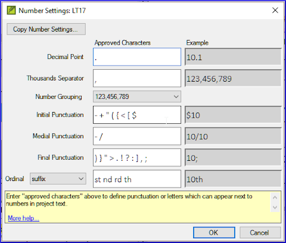

**Introduction**  In this module you will learn how to run the remaining basic checks (references, quoted text, numbers, punctuation in pairs and quotations). As in the first two basic checks modules, it is easier to run the checks from Assignments and Progress. However, if you want to check more than one book then you need to run the checks from the checking menu.

**Before you start**  You have typed your translation into Paratext. Make sure you have done the checks described in modules [BC1](/5.BC1) and [BC2](/12.BC2) before continuing. And that either your administrator has done the setup for the checks or is available to do the setup with you.

**Why this is important**  Paratext has eleven basic checks. You have already seen the first six checks. This last set of checks helps you find errors related to material referred from other books. You want to be sure the references are accurate so that the reader can find those passages.

**What you are going to do**  As before, most of the checks require your administrator to do some setup. In this module you will:

- Confirm that the setup is done
- Run the basic check
- Correct any errors.

## 19.1 Unmatched pairs of Punctuation {#37c2805933944d69852bddc3b8b8c520}

:::tip

This check looks at punctuation that occurs in pairs (opening and closing) and lists errors where it is not matched by the other half of the pair. This may be deliberate but is more likely to be an error, e.g. ( ), [ ], etc. 

:::

**Setup – inventory**

1. **≡ Tab**, under **Tools** &gt; **Checking Inventories** &gt; **Unmatched pairs of punctuation**:
	- _If the list is empty, then there are no errors._
2. If necessary, click **Options…** to add other pairs.
3. Click **OK**.

**Run the check**

1. **≡ Tab**, under **Tools** &gt; **Run Basic Checks**
2. Check “**Unmatched pairs of punctuation**”
3. Click **OK**
	- _A list of errors is displayed._
4. Make any corrections as needed.

## 19.2 References {#03533bb10f7a4a0a9d600b3684876edf}

### Settings {#13450fc38203431a8a92bfadc41599a8}

:::caution

Before you can run the references check, your **Administrator** must define various settings. 

:::

1. **≡ Tab**, under **Project** > **Scripture reference settings**

2. For each setting, type the punctuation in the box
	- _The sample will be updated on the right._

Book names

1. Click the **Book names** tab

2. Fill-in the three columns [1] with abbreviation, short name and long name.

3. Choose **Abbreviations** [2] and [3] for both cross-references and references

4. Click **OK.**
	- _Paratext will update the \toc fields in the text._

:::caution

 Paratext will inform you if there are any inconsistencies between these book name settings and the \toc lines and will advise you to Resolve conflicts. This needs to be done by the Administrator.

:::

### Check {#fb34163adfba4da4980a20476539efe8}

1. **≡ Tab**, under **Tools** &gt; **Run Basic Checks**
2. Click **References**
3. Click **OK**
4. Correct any errors.

## 19.3 Numbers check {#038fe67d3fd342c591ee4004ab5d4819}

### Settings {#e3ccf79de0524459a0cb1c6860b1c22c}

:::caution

Before you can run the numbers check, your Administrator must define various number settings.

:::

1. **≡ Tab,** under **Project settings** > **Number settings**

2. Fill in the dialog box with the correct information.

3. Click **OK.**

:::caution

You may need to remove unneeded items.

:::

### Check {#6bc0906c4efa4d44bc49ef74f42c53b5}

1. **≡ Tab**, under **Tools** &gt; **Run basic checks**
2. Click **Numbers**
3. Click **OK**

## 19.4 Quotation {#9764347cc21744099fe2122e180c5cd2}

The quotations check ensures you have been consistent in marking the direct speech correctly. It only checks the quotations you have marked. 

:::info Update

The new "Quotation Types" Basic Check knows where quotations should occur in the text based on Glyssen (audio script) data and can ensure that they are all marked appropriately. It is more advanced than this course. But if you want more details, watch the video on [Quotation Types in Paratext 9.4.](https://vimeo.com/859138745) 

:::

### Settings {#22033012b57b40c7a8e2a901cd735140}

:::caution

Before you can run the quotation check, your Administrator must define the rules for your quotations. 

:::

1. **≡ Tab**, under **Project settings** &gt; **Quotation rules**
2. Fill-in the quotation marks used for each level [1] - [9]
3. **Check Flag all quotes near other errors [12]**
4. Click **OK**.

### Quotation check {#62f2574a47824607bcca515faed0a6da}

1. **≡ Tab**, under **Tools** &gt; **Run basic checks**
2. **Quotations**
3. Click **OK**.
	- _A list of errors is displayed. It also includes four correct quotations before and after the possible error._
4. Double-click the first item which doesn’t start with …
5. Correct as necessary.
6. Click the **Rerun** button to confirm you have corrected the error.

## 19.5 Footnote Quotes {#dba28acec0d943519d752763b6afa537}

:::caution

The Footnote quotes check (previously Quoted text) looks at text in a footnote (after the \fk or the \fq marker) or in a cross-reference (after the \xk or the \xq marker) to make sure it matches text in the verse where the footnote or cross-reference is located.

:::

1. **≡ Tab**, under **Tools** &gt; **Run basic checks**
2. **Footnote Quotes**
3. Click **OK**.
	- _A list of errors is displayed._
4. Make corrections as needed.
