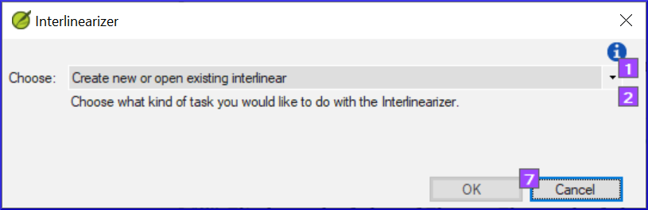
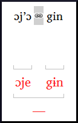

**Introduction**
The previous module explained how to create a back translation that expresses what a reader understands when he reads or hears the text. There is another type of back translation that is sometimes used and that is a word-for-word style back translation. Some consultants may ask for this style of back translation. If you need to make one of these, you can use Paratext’s project Interlinearizer function.

:::tip

Please note that in Paratext 9 you can only use the Interlinearizer on registered projects. 

:::

**Before you start**
You have typed, checked and revised your translation in Paratext and are now preparing for a consultant check by doing a word-for-word back translation. Before you can start your Administrator must have created a separate project for your word-for-word back translation. [This is separate from the readable back translation in the previous module.]

**Why this is important**
Your consultant needs to have a copy of your translation in a language they can understand. The back translation done in the previous module is very useful but there are times when a literal translation is more helpful.

**What you will do**
You will use the project interlinearizer to produce a word for word gloss of the text. Firstly, you will setup the interlinearizer, and then correct any errors. The computer’s initial guesses are often wrong but it learns as it goes and becomes quite accurate quickly. The idea is for the gloss to be correct even though the word order is not correct. When you are happy with the verse you can approve the glosses and move to the next verse with unapproved glosses.

### 17.1 Configure the project interlinearizer {#819f444b3d23407b88179e5002b7304a}

1. Click in your project
1. **≡ Tab**, under **Tools** > **Open Project interlinearizer**

	

1. Click to dropdown the list [1].
1. Choose to create glosses based on a model text. This is usually your reference text or your free back translation project [2]
1. Choose your model text [3].
1. Click **OK**

### 17.2 Correct the interlinearized text {#ba44496bd8ba4e57b880f8d3e1b644d1}

To correct glosses

1. Click the incorrect gloss
	- _A list is displayed_.
1. Either click on the correct gloss in the list
	- _or type the correct gloss in the textbox_
1. Click **Enter**

### 17.3 Translate/gloss a phrase {#2120285dfa0b46188e1b02cd05aa98fb}

1. Click between two words

	

1. Click the icon  **Link words**

	

1. Click the red line
1. Type the gloss

### 17.4 Add extra words {#fba8cb806d0e440ebcf982ce1af4304f}

- Click in the space between two glosses
- Type the extra word(s)

### 17.5 Specify the morphology – break a word into morphemes {#9531803e353a44a792820d14f46ac171}

1. Click **Add word parse**
1. Add **spaces** to separate the morphemes and add **+** prefixes and suffixes (see guide)
1. Click on the word in the translation line (top line)
1. Click **OK**

### 17.6 Approve and Export the text {#ff2e24b57d2b4977af5c6e51be8373b0}

When you approve and export the text any remaining red glosses will be approved.

- Click **Approve glosses**
- To continue, click **Next Unapproved Verse**

### 17.7 Help {#743d93237d2c47f1acd151e3ddbabf9f}

For more help on using the Interlinearizer function see the following topics in the Paratext Help:

1. Introduction to Project Interlinearizer
1. How do I open the Project Interlinearizer?
1. How do I generate an interlinear back translation?
1. How do I create a back translation project with the Interlinearizer?
1. How do I create a text revision/adaptation project with the Interlinearizer?
1. What do the colours of glosses mean in the Interlinearizer?
