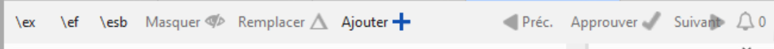

**Introduction**
With Paratext 9.2 (and above) you can create a study Bible based on your translation by adding introductory paragraphs, sidebars and detailed footnotes and additional cross-references to help your user have a deeper understanding of the Bible text.

**Before you start**
Before you can create a study Bible you will want to translate and consultant check your New Testament (or portions). Then your administrator can create a new project (see below).

**Why is this important?**
Study Bible information is created in a separate project with links to the translated text. If the translated text changes the link can be broken. Links can be fixed, but it is less likely to be a problem if the text is stable.

**What will you do?**
You (or your administrator) will create a **Study Bible Additions project**. As the name suggests, this is where you can add the study materials (without affecting your translation).

This separate project contains a read-only copy of your project and your additional text. When you are ready you can merge the Study Bible Additions project with your translation project into a third project.

- Create a new project of Study Bible Additions based on your translation
- Register the new project
- Add the additional material (introductions, sidebars, footnotes and cross-references)
- Hide any non-biblical text in the base translation (e.g. headings)
- Merge the projects to create a publication project.

## Create a Study Bible Additions project {#8462e69d5fc54fdc8bcdb4472cd6b16e}

1. Use the Paratext menu to create a new project
1. Set the type of project to Study Bible Additions (Annexe de la Bible d’étude)
1. Choose your translation project for the “based on” project.
1. You will need to register the new project.
	- _A grey-out read-only copy of your project is displayed, with a toolbar at the top._

		

## Add the additional material {#4df8e5eb5df54902b1601b18f77dd221}

### Introductory material {#fa418b3a2a9a4cccba72f265ab7a5ce2}

1. Position your cursor where you would like the additional material
1. Click **Add +** on the toolbar
1. A blue box with an \ip is added.
1. Type the text.

### Sidebar text {#b65a8b7b80ed4cfcad152cc668e3c909}

1. Position your cursor where you would like additional material
1. click **\esb** on the toolbar
1. A sidebar panel is opened with a \ms marker added
1. Type the title after the \ms marker
1. Press Enter
1. Choose a marker for the following text.
1. Type the text.
1. Continue as needed.

### Extended cross-reference {#ac935db795464eaeaca0fbeb57ab05ac}

1. Position your cursor where you would like the cross-reference caller
1. click **\ex** on the toolbar
1. A footnote panel is opened with a \ex markers added
1. Type in the cross-reference.

### Extended footnote {#b75757c81c824e22bf17695b6cd56a17}

1. Position your cursor where you would like the additional footnote
1. click **\ef** on the toolbar
1. A footnote panel is opened with the appropriate \ef markers
1. Add footnotes as needed.

### Hide non-scriptural material {#fc270bb63d5e4f1baa363ab2e53e8dca}

You can hide non-scriptural material such as headings from the translation

1. Position your cursor where you would like the additional footnote
1. Click **Hide** on the toolbar
1. The text is displayed in a greyed-out box.

## Compare versions {#6440ee97846b48ee80e0a89e6527abe9}

1. Open a Study Bible Additions project
1. From the **Project** menu,
1. Under **Project**, choose **Compare Versions**
	- _The changes in the additions are displayed_.

## Merge the projects to create a publication project {#ceee8c8d97a043f399240f2674cce7b4}

To publish the study Bible, you need to create a publication project.

1. Click the Project menu
1. Choose “Create merged publication project”

	

1. Click the dropdown list “Merged publication project”.
1. Create a new project or choose a previous project
1. Click **Create**
	- _Paratext merges the translation project and the Bible Study Additions project and displays the Merged publication project._
1. If necessary change the view to Preview.

## Making changes {#e8b01c991c734d83a3eb5af179cb7624}

You now have three projects.

1. Your original translation project,
1. The Bible Study Additions project and
1. The Merged publication project.
- _Any corrections to the translation_ should be made to the _original translation project_.
	- These corrections will be updated in the Bible Study Additions project when you next recreate the merge publication project.
	- _Any corrections to the Bible study material_ should be made in the _Bible Study Additions project_.
- The _merged publication project_ is read-only and cannot be changed.
	- To update the changes, recreate the merged publication project again.

## Bible Study Additions project - Compare versions {#d0d70541f7cf4373a8490a69fdc7ed29}

In Paratext 9.3, can now Compare versions

1. Open a Study Bible Additions project
1. From the **Project** menu,
1. Under **Project**, choose **Compare Versions**

## Printing the Study Bible with PTXPrint {#2ad8ffb635fb4372bd5a84be4f767fb1}

PTXPrint version 2.1.x (and above) can print the merged publication project. For detailed instructions, see [https://software.sil.org/ptxprint/how-to-study-bible-layout/](https://software.sil.org/ptxprint/how-to-study-bible-layout/)

