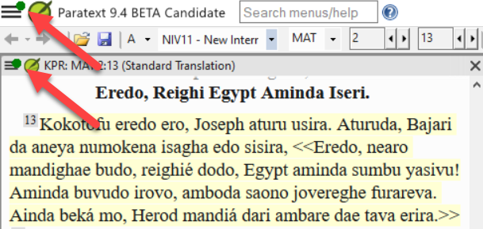
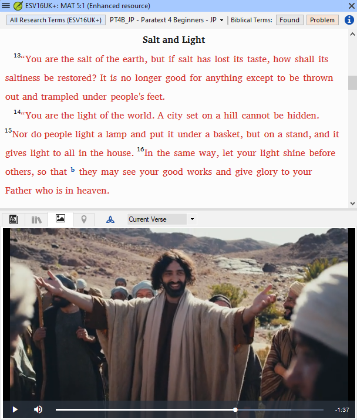

## **What’s New in Paratext 9.4 Beta** {#ef25a726728f449c90b3fdabf820eab6}

(taken from [https://paratext.org/features/whats-new/whats-new-in-paratext-9-4-beta/](https://paratext.org/features/whats-new/whats-new-in-paratext-9-4-beta/))

**Some Highlights**

- **Notification of updates for projects on the user’s computer:** Now, Paratext can check whether the projects on one’s computer have been updated on the Send-Receive server. If the project has been edited, users will be notified with a green dot in both the main and project menus (see image below). Settings for checking for updates are available in the **Send/Receive projects** window. [Main menu video demo](https://paratext.org/features/whats-new/whats-new-in-paratext-9-4-beta/?vimeography_gallery=157&vimeography_video=857678678)

	

- **Notification of updates for installed resources.** A green dot in the main menu can also indicate updates to resource texts on the local computer. Access to the settings for this feature is in the **Download/Install resources** window.
- **Improved Right-to-Left interface.** Paratext now correctly displays right-to-left user interfaces (like Arabic). [RTL video demo](https://paratext.org/features/whats-new/whats-new-in-paratext-9-4-beta/?vimeography_gallery=157&vimeography_video=858761461)

	

- **Option to hide project notes.** Numerous red flags in the text can easily become an obstacle to reading. Users can now choose to hide or display project note flags in the text. Access from the **View menu &gt; Show Project Notes**. [Project menu video demo](https://paratext.org/features/whats-new/whats-new-in-paratext-9-4-beta/?vimeography_gallery=157&vimeography_video=857939433)

	

- **Improved quotation checking.** The new “Quotation Types” Basic Check knows where quotations should occur in the text based on [Glyssen](https://software.sil.org/glyssen/) data and can ensure that they are all marked appropriately. [Quotation types video demo](https://paratext.org/features/whats-new/whats-new-in-paratext-9-4-beta/?vimeography_gallery=157&vimeography_video=859138745)
- **Added video to Enhanced Resources.** Now the Media tab for Enhanced Resources contains video clips from [LUMO](https://lumoproject.com/) and UBS’s “Bible Lands as Classroom” series. [Enhanced resources videos – video demo](https://paratext.org/features/whats-new/whats-new-in-paratext-9-4-beta/?vimeography_gallery=157&vimeography_video=858761461)

	

- **Import/Export Biblical terms lists.** This feature should enhance project teams’ workflow with the Biblical Terms tool, allowing them to create and exchange the Biblical Terms lists as the project progresses. Please install the latest Beta update patch (coming soon) for full functionality. [Biblical terms video demo](https://paratext.org/features/whats-new/whats-new-in-paratext-9-4-beta/?vimeography_gallery=157&vimeography_video=858020833)

**And Many More Improvements!**

- Added the ability to use FieldWorks dictionary with Paratext Interlinearizer. [▶ FieldWorks integration video demo](https://paratext.org/features/whats-new/whats-new-in-paratext-9-4-beta/?vimeography_gallery=157&vimeography_video=859073261)
- Added the ability to change the ordering for cross-references, footnotes, and sidebars in Study Bible Additions projects. [▶ Study Bible Additions video demo](https://paratext.org/features/whats-new/whats-new-in-paratext-9-4-beta/?vimeography_gallery=157&vimeography_video=858761672)
- Added capability to “Manage layouts”. [▶ Main menu video demo](https://paratext.org/features/whats-new/whats-new-in-paratext-9-4-beta/?vimeography_gallery=157&vimeography_video=857678678)
- Made paralll passage matches easier to see.
- New/improved items in the Project Menu ([▶ Project menu video demo](https://paratext.org/features/whats-new/whats-new-in-paratext-9-4-beta/?vimeography_gallery=157&vimeography_video=857939433)):
	- Exporting to PTXprint is now available from the project menu.
	- Improvements to “Insert table”.
	- Derived projects can open the base project.
- Additional Features ([▶ Additional Features video demo](https://paratext.org/features/whats-new/whats-new-in-paratext-9-4-beta/?vimeography_gallery=157&vimeography_video=859466352)):
	- Improved Compare Versions to provide clear contrast between differences.
	- Ability to handle alternate quotation marks
	- Reference check gives more specific error messages
- Assignments and Progress accepts familiar book codes (for example: “GEN”)
- Enhanced Resource dictionary terms are no longer repeated
- When you use “Give feedback”, Paratext will Mark a point in Project History
- [Scripture Burrito](https://docs.burrito.bible/en/latest/) 1.0 import/export
- Various bug fixes
