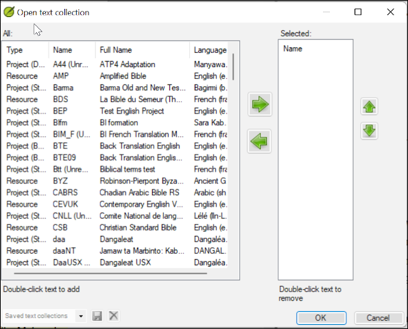
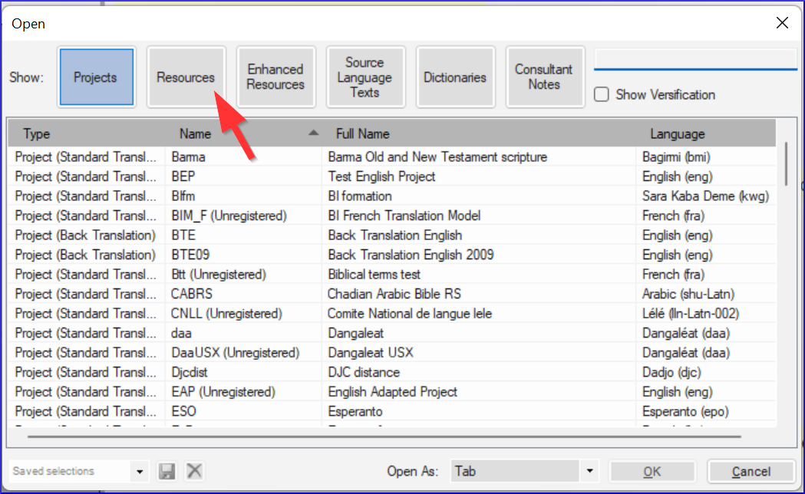

**Introduction**  As you work with your text in Paratext 9 you will want to see a variety of resources. In this module, you will learn how to open resources and organise your desktop.

**Before you start** You are getting ready to type text into an existing project. Before you can do this, someone must have already installed the program, created a project for your data and installed resources for you.

**Why is this important?**  The translator who organises his/her desktop well has all the resources necessary for his/her work.

**What are you going to do?** You will start the Paratext 9 program and open a previously saved layout (text combination). If needed you will open other resources, change the arrangement of the windows and resave the text layout.

:::info Videos

There are a number of videos available to help you with the different types of resources and arranging the windows. Some suggestions are given below. Click on the link to see the video summary.

[https://vimeo.com/368328862](https://vimeo.com/368328862)

  
 
  
  

    

[https://vimeo.com/368328956](https://vimeo.com/368328956)

    
    

    

  

  
  

[https://vimeo.com/377612892](https://vimeo.com/377612892)

    
    

      
 
      
      

        

[https://vimeo.com/382483908](https://vimeo.com/382483908)

        
        

        

      

      
      

[https://vimeo.com/377612971](https://vimeo.com/377612971)

        
        

          
 
          
          

            

[https://vimeo.com/377613013](https://vimeo.com/377613013)

            
            

            

          

          
          

:::
          

<h3 id="ed3427390c2b484f8c1343a8944fe332" spaces-before="0">
  <strong x-id="1">Paratekst 9-dakı deyişləri</strong>
</h3>

  The menus changed in Paratext 9.0. To see the menu, you now need to click on the menu icon ≡. There are now two types of menus.

The main Paratext menu is on the title bar. Each window (or tab) has its own menu.

  
  

    
 
    
    

      

      
      

      

    

    
    

      When you click on one of these menu icons all the menus are displayed, and you just need to click on the command.
    

    
    

      :::tip
    

    
    

      In this manual, when it says <strong x-id="1">≡ Paratext</strong>, under <strong x-id="1">Menu</strong> &gt; <strong x-id="1">Command</strong> (e.g. <strong x-id="1">≡ Paratext</strong>, under <strong x-id="1">Paratext</strong> &gt; <strong x-id="1">Open</strong>). It means click on the Paratext menu icon ≡, then under the menu (e.g. Paratext) choose the command (e.g. Open).
    

    
    

      And when it says <strong x-id="1">≡ Tab</strong>, under <strong x-id="1">Menu</strong> &gt; <strong x-id="1">Command</strong> it means click on the tab menu icon, then under the menu (e.g. Tools) click on the command (e.g. Wordlist). The most common Tab is the project menu so it may just say ”<strong x-id="1">≡ project</strong> <strong x-id="1">menu</strong>”.
    

    
    

:::
    

<h2 id="c07b16862b1d4f55821e9a5398e26435" spaces-before="0">
  2.1 Load the program
</h2>

<ol start="1">
  <li>
    

      Double-click on Paratext 9 icon on the <strong x-id="1">desktop</strong>
    

    

      
    

  </li>
</ol>

<ul>
  <li>
    <strong x-id="1">OR</strong> <ol start="1">
      <li>
        (From the <strong x-id="1">Start</strong> menu, choose <strong x-id="1">Paratext 9</strong>)
      </li>
    </ol>
  </li>
</ul>

<h2 id="d65baaea138b4d72b0dbaaadd85f23d5" spaces-before="0">
  2.2 Open a saved layout
</h2>

<ol start="1">
  <li>
    Click the <strong x-id="1">≡ Paratext</strong> menu, then under the <strong x-id="1">Layout</strong> menu
  </li>
  
  <li>
    

      Choose a saved layout (text combination).
    

    <ul>
      <li>
        

          <em x-id="4">Your screen should look something like the picture below (if not, see below).</em>
        

        

          
        

      </li>
    </ul>
  </li>
</ol>

<h2 id="71e308de0d1f4c71b54acfb4d760fae8" spaces-before="0">
  2.3 Create a new text layout
</h2>

  If you haven’t already saved a layout, then we recommend you do the following:

<h3 id="f5f12c7b122148ca9b9b4edd7c7eb807" spaces-before="0">
  <strong x-id="1">Open and arrange the windows</strong>
</h3>

<ul>
  <li>
    1= Text collection <ul>
      <li>
        <strong x-id="1">≡ Paratext</strong> menu, under <strong x-id="1">Paratext</strong> choose <strong x-id="1">Open Text Collection</strong>, select several resources, click <strong x-id="1">Right arrow</strong> button, click <strong x-id="1">OK</strong>. See <a href="/2.OD#204f93f95d7e4da7aa004d8b2aefaa86">2.5</a>)
      </li>
    </ul>
  </li>
  <li>
    2 =Your project <ul>
      <li>
        <strong x-id="1">≡ Paratext</strong> menu under <strong x-id="1">Paratext</strong> > <strong x-id="1">Open</strong>, Projects
      </li>
    </ul>
  </li>
  <li>
    5 = Renderings <ul>
      <li>
        <strong x-id="1">≡ Tab</strong> menu, under Tools > <strong x-id="1">Biblical Terms renderings</strong>
      </li>
    </ul>
  </li>
  <li>
    3 = Source text <ul>
      <li>
        <strong x-id="1">≡ Paratext</strong> menu, under <strong x-id="1">Paratext</strong> > <strong x-id="1">Open > Source language text</strong>
      </li>
    </ul>
  </li>
  <li>
    4 = Enhanced resource <ul>
      <li>
        <strong x-id="1">≡ Paratext</strong> menu, under <strong x-id="1">Paratext</strong> > <strong x-id="1">Open > Enhanced resources</strong>
      </li>
    </ul>
  </li>
  <li>
    Arrange the windows as desired. See Paratext videos 0.2.1b, 0.2.1c, and 0.2.3d.
  </li>
</ul>

  :::info Upgrade

  In Paratext 9.3 (and above) you can use the main Paratext menu to arrange windows by <strong x-id="1">rows</strong> and <strong x-id="1">columns</strong>.

:::

  :::tip

  Remember to save your layout!

:::

<h3 id="d4ebb0ef8d0f49998351a50a09b5942b" spaces-before="0">
  Save the layout
</h3>

  Once the windows are arranged as desired:

<ol start="1">
  <li>
    <strong x-id="1">≡ Paratext</strong>, under <strong x-id="1">Layout</strong> &gt; <strong x-id="1">Save current layout</strong>
  </li>
  
  <li>
    Type a new name
  </li>
  
  <li>
    OR to replace an existing layout, <ol start="1">
      <li>
        Click the dropdown to the right
      </li>
      
      <li>
        Choose the name of the saved layout.
      </li>
    </ol>
  </li>
  
  <li>
    Click <strong x-id="1">OK</strong>
  </li>
</ol>

<h2 id="75e26e8bdc3345529b5b3fc702f4c748" spaces-before="0">
  2.4 Delete a text layout
</h2>

  If you want to delete a saved layout,

<ol start="1">
  <li>
    <strong x-id="1">≡ Paratext</strong> menu, under <strong x-id="1">Layout</strong> &gt; <strong x-id="1">Delete layout</strong>
  </li>
  
  <li>
    Click the dropdown  to the right
  </li>
  
  <li>
    Choose the name of the saved layout.
  </li>
  
  <li>
    Click <strong x-id="1">Delete</strong>
  </li>
</ol>

<h2 id="204f93f95d7e4da7aa004d8b2aefaa86" spaces-before="0">
  2.5 Open resources in a Text collection
</h2>

  With Paratext, it is possible to have several project/resources open at the same time. However, rather than having too many windows, it is better to have several texts in one window.

  :::info Upgrade  In Paratext 9.3 the Text Collection can also be opened directly from the <strong x-id="1">≡ Paratext</strong> menu

:::

<h3 id="72a473aaf424486aaa027854c81aa784" spaces-before="0">
  New method - Open directly from Paratext menu
</h3>

1. **≡ Paratext** menu, under **Paratext** > **Open text collection**

1. Select several resources using the Ctrl key as you click on the resource.

1. Click on the **Right arrow button**.

1. Repeat as necessary.

1. Use the up and down arrows to reorder them as needed.

  
  

    
 
    
    

      

      
      

      

    

    
    

      Save the collection
    

    
    <ol start="1">
      <li>
        Click in the text box in the bottom left corner.
      </li>
      
      <li>
        Type a name for the saved collection and click the save icon
      </li>
      
      <li>
        Click <strong x-id="1">OK</strong>. <ul>
          <li>
            <em x-id="4">The text collection opens</em>.
          </li>
        </ul>
      </li>
    </ol>

<h3 id="4ce29225a23d4f53998f378f3d1f993f" spaces-before="0">
  Previous method - Open dialog
</h3>

1. **≡ Paratext** menu, under **Paratext** > **Open**

1. Click on the Resources button (at the top).

1. Select several resources using the Ctrl key as you click on the resource.

1. Repeat as necessary.

1. Click on the **Open as** dropdown list.

1. Choose **Text collection panel**

1. Click **OK**

  
  

    
 
    
    

      

      
      

      

    

    
    

      :::tip
    

    
    

      It is suggested that resources be displayed in the order of more literal to less literal (to focus on the texts that are most faithful to the source texts). For English resources: ESV, RSV, NIV, NLT. For French resources, the following order is suggested: TOB, NVSR78Col, NBS, BDS, FC97, PDV11.
    

    
    

:::
    

    
    

      There are several ways to change the order of texts in the collection
    

    
    

1. **≡ Tab**, **Modify text collection**

      
      

        
 
        
        

          

          
          

          

        

        
        

**From the Select Texts dialog**

1. Use the arrow buttons to change the order as necessary

1. Make any other changes

1. Click **OK**

          
          

            
 
            
            

              

              
              

              

            

            
            

              :::tip
            

            
            

              You can change the text in the second pane by clicking on the blue link of the abbreviation for the text. You can also use the <strong x-id="1">≡ Tab</strong> under V<strong x-id="1">iew</strong> menu to change the view (preview, unformatted or standard).
            

            
            

:::
            

<h2 id="ddb656b63852444cbe84a309b3bb9923" spaces-before="0">
  2.6 Open an Enhanced Resource
</h2>

1. **≡ Paratext** menu, under **Paratext** > **Open**

1. Click on **Enhanced Resources**

  
  

    
 
    
    

      

      
      

      

    

    
    

      :::tip
    

    
    

      Enhanced resources also contain a dictionary, images, maps etc. When you open an Enhanced Resource, a guide opens as well.
    

    
    

:::
    

<h2 id="7ea1b54db25c492c832d9d92995b4030" spaces-before="0">
  2.7 Open a dictionary
</h2>

  :::tip

  If you do not use an enhanced resource, you can open a source language dictionary with glosses in other languages.

:::

1. **≡ Paratext** menu, under **Paratext** > **Open**

1. Click **Dictionaries**

1. Choose “A Concise Greek-English Dictionary of the New Testament” OR “Trilingual Hebrew-English Lexicon of the Old Testament”

1. Click **OK**

1. **View** > choose a language (e.g. **French**)

  
  

    
 
    
    

      

      
      

      

    

    
    

      :::tip
    

    
    

      It is useful to add dictionary windows to the autohide, (right-click on the tab name, choose move to autohide).
    

    
    

:::
    

    
    

      Other dictionaries (in English but with photos)
    

    
    <ul>
      <li>
        "Plants and Trees in the Bible"
      </li>
      <li>
        "Animals in the Bible"
      </li>
    </ul>

<h2 id="9fe3171ca9784daf8bc9ff0681bcaa59" spaces-before="0">
  2.8 Working with the Source language text
</h2>

  You can open the source language text with glosses in an alternative language than English, e.g. Gloss FR.

1. **≡ Paratext**, under **Paratext** > **Open**

1. Click **Source Language Texts**

1. Choose HEB/GRK

1. Click **OK.**

  
  

    
 
    
    

      

      
      

      

    

    
    

      If you have downloaded the special gloss resource, you can load them as follows
    

    
    <ol start="1">
      <li>
        <strong x-id="1">≡ Tab</strong> under <strong x-id="1">View</strong> &gt; <strong x-id="1">Additional glosses</strong>
      </li>
      
      <li>
        Choose the specific resource that has the glosses (e.g. GlossFR)
      </li>
      
      <li>
        Click <strong x-id="1">OK.</strong>
      </li>
    </ol>
