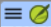

**Introducción**  A medida que trabajas con tu texto en Paratext 9 querrás ver una variedad de recursos. En este módulo aprenderá a abrir recursos y a organizar su escritorio.

**Antes de empezar** Se está preparando para escribir texto en un proyecto existente. Antes de poder hacerlo, alguien debe haber instalado ya el programa, creado un proyecto para sus datos e instalado recursos para usted.

¿Por qué es importante? El traductor que organiza bien su escritorio dispone de todos los recursos necesarios para su trabajo.

¿Qué va a hacer? Iniciará el programa Paratext 9 y abrirá un diseño (combinación de texto) previamente guardado. Si es necesario, abrirá otros recursos, cambiará la disposición de las ventanas y volverá a guardar la disposición del texto.

:::info Video

Hay varios vídeos disponibles para ayudarle con los distintos tipos de recursos y la disposición de las ventanas. A continuación se ofrecen algunas sugerencias. Haga clic en el enlace para ver el vídeo.

[**0.2.1b**](https://vimeo.com/368328862) Conceptos básicos de Proyectos y Recursos

[**0.2.1d**](https://vimeo.com/368328956) Cómo Organizar Ventanas

[**0.2.2a**](https://vimeo.com/377612892) Cómo abrir y modificar una colección de textos

[**0.2.3a**](https://vimeo.com/382483908) Cómo controlar qué ventanas se desplazan juntas

[**0.2.3c**](https://vimeo.com/377612971) Cómo Intercambiar Un Texto En Una Ventana

[**0.2.3d**](https://vimeo.com/377613013) Más tips sobre organizar ventanas

:::

### **Cambios en Paratext 9** {#ed3427390c2b484f8c1343a8944fe332}

Los menús cambiaron en Paratext 9.0. Para ver el menú, ahora tiene que hacer clic en el icono de menú ≡. Ahora hay dos tipos de menús.

El menú principal de Paratext se encuentra en la barra de título. Cada ventana (o pestaña) tiene su propio menú.

Al hacer clic en uno de estos iconos de menú, aparecen todos las herramientas y solo tiene que hacer clic sobre la que necesite.

:::tip

En este manual, cuando dice **≡ Paratext**, bajo **Menú** &gt; **Comando** (por ejemplo, **≡ Paratext**, bajo **Paratext** &gt; **Abrir**). Significa hacer clic en el icono de menú Paratext ≡ y, a continuación, en el menú (por ejemplo, Paratext), elegir el comando (por ejemplo, Abrir).

Y cuando dice **≡ Pestaña**, bajo **Menú** &gt; **Comando** significa que haga clic en el icono del menú de la pestaña, luego bajo el menú (por ejemplo, Herramientas) haga clic en el comando (por ejemplo, Lista de palabras). La pestaña más común es el menú del proyecto, por lo que puede decir simplemente "≡ proyecto menú".

:::

## 2.1 Cargar el programa {#c07b16862b1d4f55821e9a5398e26435}

1. Haga doble clic en el icono Paratext 9 del **escritorio**

    

    - **O**
2. (En el menú **Inicio**, seleccione **Paratext 9**)

## 2.2 Abrir un diseño guardado {#d65baaea138b4d72b0dbaaadd85f23d5}

:::info Actualización

En 9.4 hay algunas actualizaciones para gestionar los diseños. El diseño que haya utilizado recientemente debe aparecer en la parte superior del menú.

Para obtener más información, consulte [Novedades de la versión 9.4 - Menú principal - Administrar diseños](https://vimeo.com/857678678)

:::

1. Haga clic en el menú de **≡ Paratext** y, a continuación, observe la columna **Diseño**
2. Elija un diseño guardado (combinación de texto).
    - _Su pantalla debería parecerse a la imagen de abajo (si no, mire más abajo)._

        

## 2.3 Crear un nuevo diseño de texto {#71e308de0d1f4c71b54acfb4d760fae8}

Si aún no ha guardado un diseño, le recomendamos que haga lo siguiente:

### **Abrir y ordenar las ventanas** {#f5f12c7b122148ca9b9b4edd7c7eb807}

- 1 = Colección de textos
    - **≡ Menú de Paratext**, bajo **Paratext** elija **Abrir colección de textos**, seleccione varios recursos, haga clic en **flecha derecha**, haga clic en **Aceptar**. (Ver [2.5](/2.OD#204f93f95d7e4da7aa004d8b2aefaa86))

- 2 = Su proyecto
    - **≡ Menú de Paratext**, bajo **Paratext** \> **Abrir**, Proyectos

- 5 = Traducciones de vocablos bíblicos
    - **≡ Menú de proyecto**, bajo **Herramientas > Traducciones de vocablos bíblicos**

- 3 = Textos en los idiomas originales
    - **≡ Menú de Paratext**, bajo **Paratext** > **Abrir > Textos en los idiomas originales**

- 4 = Recursos aumentados
    - **≡ Menú de Paratext**, bajo **Paratext** > **Abrir \> Recursos aumentados**

- Disponga las ventanas como desee. Vea los vídeos de Paratext 0.2.1b, 0.2.1c y 0.2.3d.

:::info Actualización

En Paratext 9.3 (y superior) puede utilizar el menú principal de Paratext para organizar las ventanas por **filas** y **columnas**.

:::

:::tip

¡Recuerda guardar tu diseño!

:::

### Guardar el diseño {#d4ebb0ef8d0f49998351a50a09b5942b}

Una vez que las ventanas están organizadas como se desea:

1. **≡ Paratext**, bajo **Diseño** &gt; **Guardar el diseño actual**
2. Escriba un nuevo nombre
3. O para sustituir un diseño existente,
    1. Haga clic en el menú desplegable de la derecha
    2. Elija el nombre del diseño guardado.
4. Haga clic en **Aceptar**

## 2.4 Eliminar un diseño de texto {#75e26e8bdc3345529b5b3fc702f4c748}

Si quiere borrar un diseño guardado,

1. **≡ Paratext**, bajo **Diseño** &gt; **Administrar diseños**
    - _Aparece un cuadro de diálogo con una lista de mis diseños guardados_
2. Haga clic en los tres puntos a la derecha del nombre del diseño guardado.
    - _Aparece un submenú_
3. Elige **Eliminar** del submenú
    - _Aparece un cuadro de diálogo advirtiéndole de que va a eliminar el diseño_
4. Haga clic en **Eliminar** de nuevo para confirmar.

## 2.5 Abrir recursos en una colección de textos {#204f93f95d7e4da7aa004d8b2aefaa86}

:::info Actualización de 9.4

En 9.4, Paratext puede indicar cuándo hay actualizaciones en cualquiera de sus recursos.

1. En el cuadro de diálogo **Descargar/Instalar recursos**, debajo de la lista de recursos
2. Haga clic en la lista desplegable junto a "**Comprobar actualizaciones de recursos**"
3. Elige la frecuencia de las comprobaciones
    1. _Si un recurso ha cambiado, aparece un punto verde en el icono del menú de Paratext._

Para más detalles, vea [Novedades en el menú principal](https://vimeo.com/857678678).

:::

Con Paratext, es posible tener varios proyectos/recursos abiertos al mismo tiempo. Sin embargo, en lugar de tener demasiadas ventanas, es mejor tener varios textos en una sola ventana.

:::tip Actualización

En Paratext 9.3+ la Colección de textos también puede abrirse directamente desde el menú de **≡ Paratext**

:::

### Nuevo método - Abrir directamente desde el menú de Paratext {#72a473aaf424486aaa027854c81aa784}

1. **≡ Menú de Paratext**, bajo **Paratext** &gt; **Abrir colección de textos**
2. Seleccione varios recursos utilizando la tecla Ctrl mientras hace clic en el recurso.
3. Haga clic en el **botón de flecha derecha**.
    - _Los recursos aparecen en la columna Seleccionado_.
4. Repita la operación si es necesario.
5. Utilice las flechas arriba y abajo para reordenarlos según sea necesario.

Guardar la colección

1. Haga clic en el cuadro de texto de la esquina inferior izquierda.
2. Escriba un nombre para la colección que guardará y haga clic en el icono de guardar
3. Haga clic en **Aceptar**.
    - _La colección de textos se abre_.

### Método anterior - diálogo de Abrir {#4ce29225a23d4f53998f378f3d1f993f}

1. **≡ Menú de Paratext**, bajo **Paratext** &gt; **Abrir**
2. Haga clic en el botón Recursos (en la parte superior).
3. Seleccione varios recursos utilizando la tecla Ctrl mientras hace clic en el recurso.
4. Repita la operación si es necesario.
5. Haga clic en la lista desplegable **Abrir como**.
6. Elija **Panel de colección de textos**
7. Haga clic en **Aceptar**

:::tip

Se sugiere que los recursos se muestren en el orden de más literal a menos literal (para centrarse en los textos más fieles a los textos fuente). Para los recursos en inglés: ESV, RSV, NIV, NLT. Para los recursos españoles, se sugiere el siguiente orden: RVR95EE, NVI-S, DHHE94EE, NTV.

:::

Hay varias formas de cambiar el orden de los textos en la colección

1. **≡ Pestaña**, **Modificar colección de textos**

**Desde el cuadro de diálogo Seleccionar textos**

1. Utilice los botones de flecha para cambiar el orden según sea necesario

2. Realice cualquier otro cambio

3. Haga clic en **Aceptar**

:::tip

Puede cambiar el texto del segundo panel haciendo clic en el enlace azul de la abreviatura del texto. También puede utilizar el menú de vista (**≡ Menú de proyecto** bajo el menú **Ver**, elija vista previa, sin formato o estándar).

:::

## 2.6 Abrir un recurso aumentado {#ddb656b63852444cbe84a309b3bb9923}

1. **≡ Menú de Paratext**, bajo **Paratext** > **Abrir**

2. Haga clic en **Recursos aumentados**

:::tip

Los recursos aumentados también contienen un diccionario, imágenes, mapas, **vídeos,** etc. Al abrir un recurso aumentado, también se abre una guía.

:::

:::info Actualización 9.4

En 9.4, Paratext puede indicar cuándo un recurso ha sido actualizado.

:::

## 2.7 Abrir un diccionario {#7ea1b54db25c492c832d9d92995b4030}

:::tip

Si no utiliza un recurso mejorado, puede abrir un diccionario de la lengua de origen con glosas en otros idiomas.

:::

1. **≡ Menú de Paratext**, bajo **Paratext** > **Abrir**

2. Haga clic en **Diccionarios**

3. Elija “A Concise Greek-English Dictionary of the New Testament” O “Trilingual Hebrew-English Lexicon of the Old Testament”

4. Haga clic en **Aceptar**

5. **Ver** > elegir un idioma (por ejemplo, **francés**)

:::tip

Es útil añadir ventanas de diccionario a la ocultación automática (haga clic con el botón derecho en el nombre de la pestaña y elija Mover a auto ocultar).

:::

Otros diccionarios (en inglés pero con fotos)

- "Plants and Trees in the Bible"
- "Animals in the Bible" (en español - Animales de la Biblia)

## 2.8 Trabajar con el texto en los idiomas originales {#9fe3171ca9784daf8bc9ff0681bcaa59}

Puede abrir el texto en el idioma original con glosas en un idioma alternativo al inglés, por ejemplo, el español.

1. **≡ Menú de Paratext**, bajo **Paratext** > **Abrir**

2. Haga clic en **Textos en los idiomas originales**

3. Elige HEB/GRK

4. Haga clic en **Aceptar.**

Si ha descargado un recurso especial de glosas, puede cargarlo

1. **≡ HEB/GRK**, bajo **Ver** &gt; **Glosas adicionales**
2. Seleccione el recurso que contiene las glosas (por ejemplo, EspGr)
3. Haga clic en **Aceptar.**
