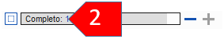

**Introduction**  You use the Assignments and Progress to help organise your work and to see which tasks to do next. Una vez finalizada la tarea, debe marcarla como completada para poder informar de lo que se ha alcanzado. [Si ha utilizado una versión anterior, verá que ha mejorado notablemente en Paratext 9.]

**Before you start**  Before you can use the plan, it must have been configured. [Esto suele hacerlo el administrador del proyecto, que añadirá el plan de organización adecuado y lo configurará para su equipo.]

**Why is this important?**  There are so many tasks to be done in a translation project. Es importante disponer de un sistema para asegurarse de que todo esto se hace. Ahora que ha configurado su plan, puede utilizarlo para ver qué tareas se le han asignado para realizar en seguida. Cuando termine la tarea, puede marcarla como completada y ver la siguiente tarea por hacer. Puede utilizar esta información para generar informes para supervisores y donantes (vea [Progreso del proyecto](https://manual.paratext.org/Training-Manual/Stage-1/PP2)).

**What are we going to do?**  You will mark a variety of tasks as complete. Los pasos exactos variarán ligeramente en función de si la tarea se establece una vez por proyecto, una vez por libro o por capítulo. El lugar para marcar el progreso de todo tipo de tareas es la columna Estado.

## 3.1 Ver las tareas pendientes {#85dfcb5c87ec4d4ba3afad5489b6d5c4}

- In your project, click **Assignments and Progress** button

  
 
  
  

    

    
    

    

  

  
  

    O
  

  
  <ul>
    <li>
      [<strong x-id="1">≡ Tab</strong> under  <strong x-id="1">Project</strong>  menu, select <strong x-id="1">Assignments and progress</strong>]
    </li>
  </ul>
  
  

- From the first dropdown menu, choose either **My tasks** or **All tasks**

    
    

      
 
      
      

        

        
        

        

      

      
      

        :::tip
      

      
      

        You can see more details on any task by clicking on the name of the task.
      

      
      

:::
      

<h2 id="11b807d65f9a45c8a9da4cd5f798fdb2" spaces-before="0">
  3.2 Identificar la siguiente tarea
</h2>

  La lista de tareas muestra las tareas no completadas, cada una con una barra de color al lado.

<ol start="1">
  <li>
    Identifique la siguiente tarea que debe realizar. Tendrá una barra verde o verde acuchillada.
  </li>
  
  <li>
    Compruebe que no está esperando otra tarea. En este caso tendrá una barra oblicua roja.
  </li>
  
  <li>
    Realice la tarea (consulte otros módulos si es necesario).
  </li>
</ol>

  :::tip

  When the task is finished, see the instructions below to mark it as completed. (Se completa una verificación cuando hay 0 incidencias.)

:::

<h2 id="1e10472de6644e289a8dfb9d8ccde488" spaces-before="0">
  3.3 Marcar una tarea como completa
</h2>

<h3 id="03059c2408d64c30baf38c460e0813ff" spaces-before="0">
  Marcar una tarea del libro como completada
</h3>

- Haga clic en la marca de verificación situada a la izquierda del estado.

  
  

    
 
    
    

      

      
      

      

    

<h3 id="dabedb60bf4143888eb08c8f457c7598" spaces-before="0">
  Marcar una tarea de capítulo como completada
</h3>

<ol start="1">
  <li>
    

      Haga clic en <strong x-id="1">+</strong> para marcar el siguiente capítulo como completo
    

    

      
    

  </li>
</ol>

1. To mark other chapters as complete you can click on the word **Completed [2]**

1. Click the numbers of the chapters that have been completed [3].

1. Click **OK**

  
  

    
 
    
    

      

      
      

      

    

<h2 id="3aa5683d6c7e41f588d4b15d4c498689" spaces-before="0">
  3.4 Verificaciones
</h2>

<ul>
  <li>
    Si la tarea es una verificación, el estado de la verificación dirá <strong x-id="1">Se requiere configuración</strong> o mostrará el número de <strong x-id="1">incidencias</strong> restantes.
  </li>
  <li>
    Una verificación está completa cuando dice <strong x-id="1">No hay problemas</strong>.
  </li>
</ul>

<h3 id="cf9cddb209dd432c92295e5baed75ecc" spaces-before="0">
  Verificaciones - Se requiere configuración (Administrador)
</h3>

<ol start="1">
  <li>
    Haga clic en el enlace azul "Se requiere configuración" <ul>
      <li>
        <em x-id="4">Paratext 9 ejecutará el inventario correspondiente o abrirá la configuración para esa verificación.</em>
      </li>
    </ul>
  </li>
  
  <li>
    Complete la configuración correspondiente.
  </li>
  
  <li>
    Cierra la ventana cuando haya terminado.
  </li>
</ol>

  :::tip

  If there is more than one inventory required for a check (e.g. capitalization) you will need to set them up manually from the Tools menu &gt; Checking Inventories.

:::

<h3 id="86edf92b36dd43a7af95a16dcf743313" spaces-before="0">
  Verificaciones - problemas
</h3>

<ol start="1">
  <li>
    Haga clic en el enlace azul "…problemas" <ul>
      <li>
        <em x-id="4">Aparece una lista de errores.</em>
      </li>
    </ul>
  </li>
  
  <li>
    Haga las correcciones necesarias.
  </li>
  
  <li>
    Cierre la lista de resultados (si lo desea).
  </li>
  
  <li>
    <strong x-id="1">≡ Paratext</strong> under <strong x-id="1">Paratext</strong> &gt; <strong x-id="1">Save all</strong> (or <strong x-id="1">Ctrl</strong>+<strong x-id="1">s</strong>).
  </li>
  
  <li>
    Volver a Asignaciones y Progreso.
  </li>
</ol>

  :::tip

  The check is considered complete when there are 0 issues. Si no puede completar un control, es posible aplazarlo para más adelante.

:::

<h3 id="110391bc0b9647129c47c1ccdebf2ac4" spaces-before="0">
  Posponer la verificación
</h3>

<ol start="1">
  <li>
    <strong x-id="1">≡ Menú del proyecto</strong>, bajo <strong x-id="1">Proyecto</strong>, seleccione <strong x-id="1">Asignaciones y Progreso</strong>
  </li>
  
  <li>
    Cambiar a la vista <strong x-id="1">Todas las tareas</strong>
  </li>
  
  <li>
    Pasa el ratón por encima de una verificación que tiene problemas
  </li>
  
  <li>
    Haga clic en <strong x-id="1">Posponer</strong> (que aparece a la derecha de la columna Estado),
  </li>
  
  <li>
    Elija en qué etapa desea posponer la verificación
  </li>
  
  <li>
    Escriba el motivo de posponer de la verificación. <ul>
      <li>
        <em x-id="4">La verificación pasará a esa etapa.</em>
      </li>
    </ul>
  </li>
</ol>
