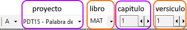
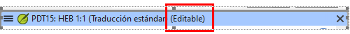
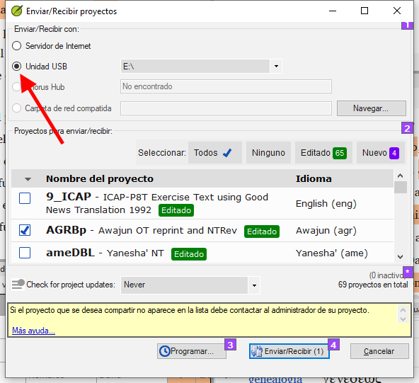

**Introducción** Este módulo explica cómo teclear sus borradores de traducción en un proyecto en Paratext 9.

**Antes de empezar** Estamos a punto de teclear texto en un proyecto existente. Antes de poder hacerlo, alguien debe haber instalado ya Paratext y creado un proyecto para sus datos.

**Por qué es importante** Esta es la primera etapa de la introducción de su traducción en el ordenador. Una vez tecleado el texto, puede realizar diversas verificaciones sobre el contenido y el formato del texto.

## 4.1 Ir a un versículo bíblico {#51581b24aa2e48c3bf3d4017c24abce2}

:::tip

Antes de empezar a teclear el texto, tienes que situar el cursor en el libro, capítulo y versículo correcto. Para ello se utiliza la barra de herramientas.

:::

- Utilizando los iconos de la barra de herramientas, cambie el proyecto, el libro, el capítulo y el versículo según sea necesario.

    

:::info Actualización

En Paratext 9.3 puede copiar y pegar una referencia bíblica en el nombre del libro de la barra de navegación. Por ejemplo, en español: MAT 12.3; Mr 5:4; Gálatas 1:12.

:::

:::tip

Si no conoce la referencia del versículo, puede utilizar la función **Buscar** para buscar una palabra que aparezca en el versículo que busca. Ctrl+F.

:::

## 4.2 Comprobar que el proyecto es editable {#5ace3b29698c4618b278657a58c7cde9}

Mire la barra de título de su proyecto.

- _La barra de título debe tener la palabra (__**Editable****)._

    

1. Si no se puede editar, pruebe a cambiar la vista (véase más abajo).
2. Si el libro no es editable y necesita editarlo, debe hablar con el administrador de su proyecto.

## 4.3 Cambiar la vista {#4ebf0759e8154f6a938ebc6a44d0d3e0}

:::tip

Paratext 9 tiene cinco vistas. Todas las vistas, excepto la vista previa, son editables.

:::

- **Ctrl** + **E** -o-
- **≡ Menú de proyecto** bajo el menú **Ver**, elija la vista (normalmente Estándar).

## 4.4 Tecleando caracteres especiales {#85ef7d3181e44b0a93f3669ef5068d93}

:::caution

Algunos caracteres ortográficos no se encuentran en el teclado. Para escribir estos caracteres, es posible que tenga que pulsar más de una tecla.

:::

1. Cambie el sistema de teclado según sea necesario en su ordenador.
2. If you are using Keyman then choose your keyboard (e.g. Tchad Unicode) (or for MS-Keyboards choose AF or TR/SQ/TZ/AF…)
3. Escriba las teclas correspondientes al carácter especial (consulte la tabla suministrada con su archivo Keyman).

:::tip

Puede utilizar **≡ Menú de proyecto** en **Ver** &gt; **Resaltar caracteres no válidos** para ver rápidamente si ha escrito algún carácter no válido. Si ve muchos signos de puntuación, pida a su instructor o administrador que configure su inventario de caracteres.

:::

## 4.5 Añadir texto en otro marcador - título o introducción {#8ec1c85f258b4da2ae2062a80f9897d1}

:::tip

Cada elemento de texto debe tener un marcador. Los marcadores para los capítulos y versículos ya están en su proyecto. When you want to add text such as headings or introductions, etc., you need to also add the appropriate marker as follows:

:::

1. Mueva el cursor hasta el final del párrafo anterior:
2. Pulse **Entrar**
3. Escriba el marcador (por ejemplo, s1 o ip) y pulse **Entrar** (o selecciónelo de la lista).
4. Teclee el texto
5. Añada un marcador de párrafo después del texto  (por ejemplo: \\p)

:::caution

Siempre debe haber un marcador de párrafo USFM después de un título y antes del versículo. Suele ser \p (párrafo), pero puede ser diferente (por ejemplo \q1).

:::

### Marcadores de caracteres {#a8323ee1f37847e6b1ceaf05b6127968}

:::tip

Paratext tiene marcadores de párrafo y de carácter. Como su nombre indica, los marcadores de párrafo dan formato a todo el párrafo. Los marcadores de carácter permiten formatear parte del párrafo, por lo que necesitan un marcador de inicio y otro de final.

:::

1. Seleccione el texto al que desea aplicar el estilo de carácter
2. Escribir  **\\**
3. Seleccione el marcador de la lista (por ejemplo, nd)
4. Pulse **Entrar**

- Paratext añade los dos marcadores (antes y después del texto)  
  (por ejemplo: \nd Señor*\nd)

:::tip

Es importante tener en cuenta que pulsando **Entrar se muestran los marcadores de párrafo** y tecleando **\\ se muestran los marcadores de carácter.**

:::

## 4.6 Añadir saltos de párrafo {#9920f9d1850246219d4f1eb1dbaebbcb}

:::tip

Dividir el texto en párrafos:

:::

1. Mueva el cursor hasta el punto en el que desee interrumpir el párrafo.
2. Pulse **Entrar**
3. Escriba **p**, luego **Entrar**.

## 4.7 Guardar el trabajo {#a76d8d7a421841f79c4dcb1e87671678}

:::tip

Es importante guardar el trabajo con regularidad.

:::

- **≡ Menú de Paratext**, bajo **Paratext** &gt; **Guardar todo**
- O **Ctrl** + **S**

## 4.8 Insertar notas a pie de página {#0def5155dad145a7a96c40b56fe61974}

:::tip

Puede añadir notas a pie de página en el texto en el lugar donde desee que aparezca la referencia.

:::

- Mueva el cursor hasta el lugar donde desee insertar la nota a pie de página.

1. **≡ Menú de proyecto**, bajo **Insertar** > **Nota a pie de página**
    - _Se añade un conjunto de marcadores de nota a pie de página en el recuadro situado debajo del texto_

2. Teclee el texto después del \ft

:::tip

Si pasa el ratón por encima de la letra en superíndice, aparecerá el texto de la nota a pie de página en un cuadro de consejos.

- Para **cambiar** la nota a pie de página, **haga clic** en la letra superíndice del texto.
- Para **eliminar** la nota a pie de página, puede **borrar** la letra superíndice.
- o haga clic con el botón derecho del ratón en el texto de la nota a pie de página y elija **eliminar nota al pie**.

:::

## 4.9 Enviar/Recibir {#70bb5cddeb3342d8bc10e403e64348ea}

:::tip

Es esencial tener una segunda copia de la traducción y compartir el trabajo con otros miembros del equipo. Esto se hace haciendo un Enviar/Recibir como sigue:

:::

### Enviar/Recibir este proyecto en Internet {#062239d736b749eba1e1ab44dd3be2d4}

1. Asegúrese de que su ordenador está conectado a Internet.
2. **≡ Menú de proyecto**, bajo **Proyecto** &gt; **Enviar/Recibir este proyecto**
    - _Paratext realizará inmediatamente un Enviar/Recibir, es decir, sin ofrecer las diferentes opciones._

### Enviar/Recibir a Internet {#57f34914b58f4c3b8e50ea49450d0b8a}

1. Asegúrese de que su ordenador está conectado a Internet.
2. Si desea enviar/recibir otros proyectos, o cambiar la forma de enviar/recibir
3. **≡ Menú de Paratext**, bajo **Proyecto** &gt; **Enviar/Recibir proyectos**
4. Elija **Servidor de Internet**
5. Marque la casilla junto a los proyectos para Enviar/Recibir.
6. Haga clic en **Enviar/Recibir**.
    - _El ordenador hará una copia de sus archivos. Aparecerá un medidor de progreso. Sólo aparecerá un cuadro de mensaje si hay algún problema._

### Enviar/Recibir a una memoria USB para hacer una copia de seguridad de sus datos {#d6ce92480ac444279ffa54dc26dc945b}

Es esencial tener una segunda copia de su traducción. Si no tiene acceso a Internet, puede utilizar una memoria USB. Para hacer una copia de seguridad de sus datos en una memoria USB, realiza un Enviar/Recibir de la siguiente manera:

1. Inserta la memoria USB en el ordenador.

2. **≡ Paratext**, bajo **Paratext** > **Enviar/Recibir proyecto(s)**

3. Seleccione **Unidad USB**.

4. Marque la casilla junto a los proyectos para Enviar/Recibir.

5. Haga clic en **Enviar/Recibir**.
    - _El ordenador hará una copia de sus archivos. Aparecerá un medidor de progreso. Sólo aparecerá un cuadro de mensaje si hay algún problema._

### Enviar/Recibir de nuevo {#19ba693a99554a0eb9ffcd86a15367c2}

:::tip

La próxima vez que desee Enviar/Recibir puede utilizar la barra de herramientas para Enviar/Recibir utilizando la misma configuración que la vez anterior. Esta opción no le permite elegir otro método ni otros proyectos.

:::

- Inserte la memoria USB en el ordenador o conéctese a Internet.

- Haga clic en el icono Enviar/Recibir
    - _Paratext enviará/recibirá inmediatamente._

## 4.10 Mover el cursor con eficacia {#f79550c3c28c4ac6a277a839e6c8546d}

Se pierde mucho tiempo desplazando el cursor hasta el lugar donde hay que añadir texto o hacer correcciones. Aquí tienes algunas teclas útiles para mover el cursor rápidamente.

- Las teclas
    - teclas de flecha **←** **↑** **→** **↓**
    - **Inicio**, **Fin**, **PgUp**, y **PgDn**,
    - **F8** (capítulo), **F9** (libro)
- Prueba a pulsar **Ctrl** y cualquiera de esas teclas.  Algunos pueden ser muy diferentes de lo que usted espera.
    - Ctrl + Flecha abajo = versículo siguiente (Ctrl + Flecha arriba para el versículo anterior)
    - F8 = Capítulo siguiente (Ctrl + F8 para el capítulo anterior)
    - F9 = Libro siguiente (Ctrl + F9 para el libro anterior)
    - Alt + Flecha izquierda/derecha = referencia anterior/siguiente en el historial
    - Alt + Flecha arriba/abajo = referencia anterior/siguiente en una lista
    - Ctrl + B = ir al área de navegación de la barra de herramientas.

## 4.11 Repasar: {#b43d69d9dc4a44029b365e87160c50be}

Si la barra de título no dice Editable (o su nombre), debería intentar cambiar la __________.

Para añadir un marcador diferente (como el encabezado de una sección) pulse _______.

Para añadir un marcador de párrafo, teclee ________.

Para insertar una nota a pie de página, utilice el menú ______ y elija ______________.

Para hacer Enviar/Recibir, utiliza el menú _______ y luego ________________.

:::info

[Respuestas: Vista, Entrar o \, Entrar, Insertar, Nota a pie de página, del Proyecto, Enviar/Recibir]

:::

