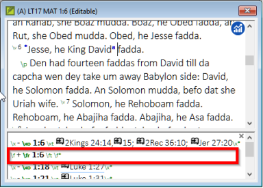

**Introduction**  This module explains how to keyboard your draft translations into a project in Paratext 9.

**Before you start**  We are about to keyboard text into an existing project. Antes de poder hacerlo, alguien debe haber instalado ya Paratext y creado un proyecto para sus datos.

**Why this is important**  This is the first stage of entering your translation into the computer. Una vez tecleado el texto, puede realizar diversas verificaciones sobre el contenido y el formato del texto.

## 4.1 Ir a un versículo bíblico {#51581b24aa2e48c3bf3d4017c24abce2}

:::tip

Antes de empezar a teclear el texto, tienes que situar el cursor en el libro, capítulo y versículo correcto. Para ello se utiliza la barra de herramientas.

:::

- Using the icons on the toolbar, change the project, book, chapter and verse as needed.

    

:::info Upgrade
In Paratext 9.3 you can copy and paste a scripture reference into the book name on the navigation bar. Por ejemplo, en español: MAT 12.3; Mr 5:4; Gálatas 1:12.
:::

:::tip

If you don't know the verse reference, you could use the **Find** feature to look for a word that occurs in the verse you are looking for. Ctrl+F.

:::

## 4.2 Comprobar que el proyecto es editable {#5ace3b29698c4618b278657a58c7cde9}

1. Look at the titlebar of your project.

1. Si no se puede editar, pruebe a cambiar la vista (véase más abajo).

1. If the book is still not editable, and you need to edit it, you should talk with your project administrator.

  
 
  
  

    

    
    

    

  

<h2 id="4ebf0759e8154f6a938ebc6a44d0d3e0" spaces-before="0">
  4.3 Cambiar la vista
</h2>

  :::tip

  Paratext 9 tiene cinco vistas. Todas las vistas, excepto la vista previa, son editables.

:::

<ul>
  <li>
    <strong x-id="1">Ctrl</strong> + <strong x-id="1">E</strong> -o-
  </li>
  <li>
    <strong x-id="1">≡ Menú de proyecto</strong> bajo el menú <strong x-id="1">Ver</strong>, elija la vista (normalmente Estándar).
  </li>
</ul>

<h2 id="85ef7d3181e44b0a93f3669ef5068d93" spaces-before="0">
  4.4 Tecleando caracteres especiales
</h2>

  :::caution

  Algunos caracteres ortográficos no se encuentran en el teclado. Para escribir estos caracteres, es posible que tenga que pulsar más de una tecla.

:::

<ol start="1">
  <li>
    Cambie el sistema de teclado según sea necesario en su ordenador.
  </li>
  
  <li>
    

      If you are using Keyman then choose your keyboard (e.g. Tchad Unicode (or for MS-Keyboards choose AF or TR/SQ/TZ/AF…)
    

  </li>
  
  <li>
    

      Type the keys for the special character (see the chart provided with your Keyman file).
    

  </li>
</ol>

  :::tip

  You can use <strong x-id="1">≡ Tab</strong> under <strong x-id="1">View</strong> &gt; <strong x-id="1">Highlight Invalid Characters</strong> to quickly see if you have typed any invalid characters. Si ve muchos signos de puntuación, pida a su instructor o administrador que configure su inventario de caracteres.

:::

<h2 id="8ec1c85f258b4da2ae2062a80f9897d1" spaces-before="0">
  4.5 Añadir texto en otro marcador - título o introducción
</h2>

  :::tip

  Cada elemento de texto debe tener un marcador. Los marcadores para los capítulos y versículos ya están en su proyecto. When you want to add text such as headings, or introductions etc you need to also add the appropriate marker as follows:

:::

<ol start="1">
  <li>
    Mueva el cursor hasta el final del párrafo anterior:
  </li>
  
  <li>
    Type <strong x-id="1">Enter</strong>
  </li>
  
  <li>
    Escriba el marcador (por ejemplo, s1 o ip) y pulse <strong x-id="1">Entrar</strong> (o selecciónelo de la lista).
  </li>
  
  <li>
    Teclee el texto
  </li>
  
  <li>
    Add a paragraph marker after the text (for example: \\ p)
  </li>
</ol>

  :::caution

  You must always have a USFM marker after a title and before the verse. This is usually \p (normal paragraph), but it can be different (for example \q1).

:::

<h3 id="a8323ee1f37847e6b1ceaf05b6127968" spaces-before="0">
  Character markers
</h3>

  :::tip

  Paratext tiene marcadores de párrafo y de carácter. Como su nombre indica, los marcadores de párrafo dan formato a todo el párrafo. Los marcadores de carácter permiten formatear parte del párrafo, por lo que necesitan un marcador de inicio y otro de final.

:::

<ol start="1">
  <li>
    Seleccione el texto al que desea aplicar el estilo de carácter
  </li>
  
  <li>
    Escribir  **\\**
  </li>
  
  <li>
    Seleccione el marcador de la lista (por ejemplo, nd)
  </li>
  
  <li>
    Pulse <strong x-id="1">Entrar</strong>
  </li>
</ol>

<ul>
  <li>
    Paratext adds the two markers (before and after the text)  (for example: \\nd LORD*\nd)
  </li>
</ul>

  :::tip

  It is important to note that pressing <strong x-id="1">Enter displays paragraph markers</strong> and <strong x-id="1">\\ displays character markers.</strong>

:::

<h2 id="9920f9d1850246219d4f1eb1dbaebbcb" spaces-before="0">
  4.6 Añadir saltos de párrafo
</h2>

  :::tip

  Dividir el texto en párrafos:

:::

<ol start="1">
  <li>
    Mueva el cursor hasta el punto en el que desee interrumpir el párrafo.
  </li>
  
  <li>
    Pulse <strong x-id="1">Entrar</strong>
  </li>
  
  <li>
    Type <strong x-id="1">p</strong>, then <strong x-id="1">Enter</strong>.
  </li>
</ol>

<h2 id="a76d8d7a421841f79c4dcb1e87671678" spaces-before="0">
  4.7 Guardar el trabajo
</h2>

  :::tip

  Es importante guardar el trabajo con regularidad.

:::

<ul>
  <li>
    <strong x-id="1">≡ Paratext</strong> under <strong x-id="1">Paratext</strong> &gt; <strong x-id="1">Save All</strong>
  </li>
  <li>
    –or- <strong x-id="1">Ctrl</strong> + <strong x-id="1">S</strong>
  </li>
</ul>

<h2 id="0def5155dad145a7a96c40b56fe61974" spaces-before="0">
  4.8 Insertar notas a pie de página
</h2>

  :::tip

  Puede añadir notas a pie de página en el texto en el lugar donde desee que aparezca la referencia.

:::

<ul>
  <li>
    Mueva el cursor hasta el lugar donde desee insertar la nota a pie de página.
  </li>
</ul>

1. **≡ Tab**, under **Insert** > **Footnote**

1. Type the text after the \ft

  
  

    
 
    
    

      

      
      

      

    

    
    

      ::::::tip  Si pasa el ratón por encima de la letra en superíndice, el texto de la nota a pie de página aparecerá en un cuadro de consejos.
    

    
    <ul>
      <li>
        Para cambiar <strong x-id="1"></strong> la nota a pie de página, <strong x-id="1">haga clic en</strong> la letra superíndice del texto.
      </li>
      <li>
        Para <strong x-id="1">eliminar</strong> la nota a pie de página, puede <strong x-id="1">borrar</strong> la letra superíndice.
      </li>
      <li>
        or right-click the footnote text and choose <strong x-id="1">delete</strong>.
      </li>
    </ul>
    
    

:::
    

<h2 id="70bb5cddeb3342d8bc10e403e64348ea" spaces-before="0">
  4.9 Enviar/Recibir
</h2>

  :::tip

  It is essential to have a second copy of your translation and to share your work with others in your team. This is done by doing a send/receive as follows:

:::

<h3 id="062239d736b749eba1e1ab44dd3be2d4" spaces-before="0">
  Enviar/Recibir este proyecto en Internet
</h3>

<ol start="1">
  <li>
    Asegúrese de que su ordenador está conectado a Internet.
  </li>
  
  <li>
    <strong x-id="1">≡ Tab</strong> under <strong x-id="1">Project</strong>,&gt; <strong x-id="1">Send/Receive this project</strong> <ul>
      <li>
        <em x-id="4">Paratext will immediately Send/Receive i.e. without offering the different options.</em>
      </li>
    </ul>
  </li>
</ol>

<h3 id="57f34914b58f4c3b8e50ea49450d0b8a" spaces-before="0">
  Enviar/Recibir a Internet
</h3>

<ol start="1">
  <li>
    Asegúrese de que su ordenador está conectado a Internet.
  </li>
  
  <li>
    Si desea enviar/recibir otros proyectos, o cambiar la forma de enviar/recibir
  </li>
  
  <li>
    <strong x-id="1">≡ Paratext</strong> under <strong x-id="1">Paratext</strong> &gt; <strong x-id="1">Send/Receive projects</strong>
  </li>
  
  <li>
    Elija <strong x-id="1">Servidor de Internet</strong>
  </li>
  
  <li>
    Marque la casilla junto a los proyectos para Enviar/Recibir.
  </li>
  
  <li>
    Haga clic en <strong x-id="1">Enviar/Recibir</strong>. <ul>
      <li>
        <em x-id="4">El ordenador hará una copia de sus archivos. Aparecerá un medidor de progreso. Sólo aparecerá un cuadro de mensaje si hay algún problema.</em>
      </li>
    </ul>
  </li>
</ol>

<h3 id="d6ce92480ac444279ffa54dc26dc945b" spaces-before="0">
  Enviar/Recibir a una memoria USB para hacer una copia de seguridad de sus datos
</h3>

  Es esencial tener una segunda copia de su traducción. Si no tiene acceso a Internet, puede utilizar una memoria USB. To backup your data to a USB stick you do a Send/Receive as follows:

1. Inserta la memoria USB en el ordenador.

1. **≡ Paratext**, under **Paratext** > **Send/Receive project(s**)

1. Choose **USB drive**.

1. Marque la casilla junto a los proyectos para Enviar/Recibir.

1. Click **Send/Receive**.

  
  

    
 
    
    

      

      
      

      

    

<h3 id="19ba693a99554a0eb9ffcd86a15367c2" spaces-before="0">
  Enviar/Recibir de nuevo
</h3>

  :::tip

  The next time you want to Send/Receive you can use the toolbar to Send/Receive using the same settings as the previous time. Esta opción no le permite elegir otro método ni otros proyectos.

:::

<ul>
  <li>
    Inserte la memoria USB en el ordenador o conéctese a Internet.
  </li>
</ul>

- Haga clic en el icono Enviar/Recibir

  
  

    
 
    
    

      

      
      

      

    

<h2 id="f79550c3c28c4ac6a277a839e6c8546d" spaces-before="0">
  4.10 Mover el cursor con eficacia
</h2>

  Se pierde mucho tiempo desplazando el cursor hasta el lugar donde hay que añadir texto o hacer correcciones. Aquí tienes algunas teclas útiles para mover el cursor rápidamente.

<ul>
  <li>
    Las teclas <ul>
      <li>
        teclas de flecha <strong x-id="1">←</strong> <strong x-id="1">↑</strong> <strong x-id="1">→</strong> <strong x-id="1">↓</strong>
      </li>
      <li>
        <strong x-id="1">Inicio</strong>, <strong x-id="1">Fin</strong>, <strong x-id="1">PgUp</strong>, y <strong x-id="1">PgDn</strong>,
      </li>
      <li>
        <strong x-id="1">F8</strong> (capítulo), <strong x-id="1">F9</strong> (libro)
      </li>
    </ul>
  </li>
  <li>
    Try pressing <strong x-id="1">Ctrl</strong> + any of those keys.  Algunos pueden ser muy diferentes de lo que usted espera. <ul>
      <li>
        Ctrl + Flecha abajo = versículo siguiente (Ctrl + Flecha arriba para el versículo anterior)
      </li>
      <li>
        F8 = Capítulo siguiente (Ctrl + F8 para el capítulo anterior)
      </li>
      <li>
        F9 = Libro siguiente (Ctrl + F9 para el libro anterior)
      </li>
      <li>
        Alt + Flecha izquierda/derecha = referencia anterior/siguiente en el historial
      </li>
      <li>
        Alt + Flecha arriba/abajo = referencia anterior/siguiente en una lista
      </li>
      <li>
        Ctrl + B = ir al área de navegación de la barra de herramientas.
      </li>
    </ul>
  </li>
</ul>

<h2 id="b43d69d9dc4a44029b365e87160c50be" spaces-before="0">
  4.11 Repasar:
</h2>

  If the titlebar doesn’t say Editable (or your name), you should try changing the __________.

  To add a different marker (such as section heading) you press _______.

  To add paragraph marker you type ________.

  To insert a footnote, you use the _______ menu and choose ______________.

  To send/receive, you use the _<strong x-id="1">_ menu then _</strong>_________.

  :::info

  [Answers: view, Enter or \, Enter, Insert, Footnote, Project, Send/Receive this project]

:::

