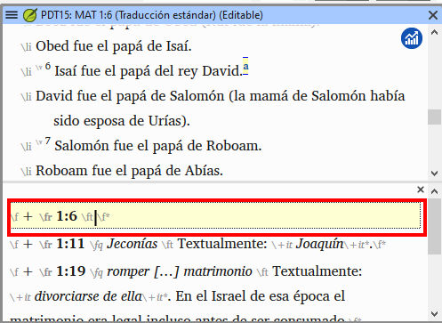

**Introduction**  This module explains how to keyboard your draft translations into a project in Paratext 9.

**Before you start**  We are about to keyboard text into an existing project. Antes de poder hacerlo, alguien debe haber instalado ya Paratext y creado un proyecto para sus datos.

**Why this is important**  This is the first stage of entering your translation into the computer. Una vez tecleado el texto, puede realizar diversas verificaciones sobre el contenido y el formato del texto.

## 4.1 Go to a Biblical verse {#51581b24aa2e48c3bf3d4017c24abce2}

:::tip

Antes de empezar a teclear el texto, tienes que situar el cursor en el libro, capítulo y versículo correcto. Para ello se utiliza la barra de herramientas.

:::

- Utilizando los iconos de la barra de herramientas, cambie el proyecto, el libro, el capítulo y el versículo según sea necesario.

  

:::info Upgrade

En Paratext 9.3 puede copiar y pegar una referencia bíblica en el nombre del libro de la barra de navegación. Por ejemplo, en español: MAT 12.3; Mr 5:4; Gálatas 1:12.

:::

:::tip

If you don't know the verse reference, you could use the **Find** feature to look for a word that occurs in the verse you are looking for. Ctrl+F.

:::

## 4.2 Check that the project is editable {#5ace3b29698c4618b278657a58c7cde9}

Mire la barra de título de su proyecto.

- _The titlebar should have the word (****Editable****)._

  

1. Si no se puede editar, pruebe a cambiar la vista (véase más abajo).
2. Si el libro no es editable y necesita editarlo, debe hablar con el administrador de su proyecto.

## 4.3 Changing the view {#4ebf0759e8154f6a938ebc6a44d0d3e0}

:::tip

Paratext 9 tiene cinco vistas. Puede editar todas las vistas excepto la vista previa.

:::

- **Ctrl** + **E** -or-
- **≡ Tab** under **View** menu, choose the view (usually Standard).

## 4.4 Typing special characters {#85ef7d3181e44b0a93f3669ef5068d93}

:::caution

Algunos caracteres ortográficos no se encuentran en el teclado. Para escribir estos caracteres, es posible que tenga que pulsar más de una tecla.

:::

1. Cambie el sistema de teclado según sea necesario en su ordenador.
2. Si utiliza Keyman, elija su teclado (por ejemplo, Tchad Unicode)
   (o para MS-Keyboards elija ES o TR/SQ/TZ/AF…)
3. Escriba las teclas correspondientes al carácter especial (consulte la tabla suministrada con su archivo Keyman).

:::tip

You can use **≡ Tab** under **View** &gt; **Highlight Invalid Characters** to quickly see if you have typed any invalid characters.
Si ve muchos signos de puntuación, pida a su instructor o administrador que configure su inventario de caracteres.

:::

## 4.5 Adding text in another marker – title or introduction {#8ec1c85f258b4da2ae2062a80f9897d1}

:::tip

Cada elemento de texto debe tener un marcador. Los marcadores para los capítulos y versículos ya están en su proyecto. Cuando desee añadir texto, como encabezamientos o introducciones, etc., deberá añadir también el marcador correspondiente, como se indica a continuación:

:::

1. Mueva el cursor hasta el final del párrafo anterior:
2. Type **Enter**
3. Type the marker (e.g. s1 or ip) press **Enter** (or select it from the list).
4. Teclee el texto
5. Añada un marcador de párrafo después del texto
    (por ejemplo: \\p)

:::caution

Siempre debe haber un marcador de párrafo USFM después de un título y antes del versículo. Suele ser \p (párrafo), pero puede ser diferente (por ejemplo \q1).

:::

### Character markers {#a8323ee1f37847e6b1ceaf05b6127968}

:::tip

Paratext tiene marcadores de párrafo y de carácter. Como su nombre indica, los marcadores de párrafo dan formato a todo el párrafo. Los marcadores de carácter permiten formatear parte del párrafo, por lo que necesitan un marcador de inicio y otro de final.

:::

1. Seleccione el texto al que desea aplicar el estilo de carácter
2. Escribir  \*_\*_
3. Seleccione el marcador de la lista (por ejemplo, nd)
4. Press **Enter**

- Paratext adds the two markers (before and after the text)\
  (for example: \\nd LORD\nd\*)

:::tip

It is important to note that pressing **Enter displays paragraph markers** and typing **\ displays character markers.**

:::

## 4.6 Add paragraph breaks {#9920f9d1850246219d4f1eb1dbaebbcb}

:::tip

Dividir el texto en párrafos:

:::

1. Mueva el cursor hasta el punto en el que desee interrumpir el párrafo.
2. Press **Enter**
3. Type **p**, then **Enter**.

## 4.7 Saving your work {#a76d8d7a421841f79c4dcb1e87671678}

:::tip

Es importante guardar el trabajo con regularidad.

:::

- **≡ Paratext** under **Paratext** &gt; **Save All**
- OR **Ctrl** + **S**

## 4.8 Insert Footnotes {#0def5155dad145a7a96c40b56fe61974}

:::tip

Puede añadir notas a pie de página en el texto en el lugar donde desee que aparezca la referencia.

:::

- Mueva el cursor hasta el lugar donde desee insertar la nota a pie de página.

1. **≡ Tab**, under **Insert** > **Footnote**
   - _A set of footnote markers is added in the box below the text_

2. Teclee el texto después del \ft

:::tip

Si pasa el ratón por encima de la letra en superíndice, aparecerá el texto de la nota a pie de página en un cuadro de consejos.

- To **change** the footnote, **click** the superscript letter in the text.
- To **delete** the footnote, you can **delete** the superscript letter.
- or right-click the footnote text and choose **delete**.

:::

## 4.9 Send/receive {#70bb5cddeb3342d8bc10e403e64348ea}

:::tip

Es esencial tener una segunda copia de la traducción y compartir el trabajo con otros miembros del equipo. Esto se hace haciendo un Enviar/Recibir como sigue:

:::

### Send/receive this project to the Internet {#062239d736b749eba1e1ab44dd3be2d4}

1. Asegúrese de que su ordenador está conectado a Internet.
2. **≡ Tab** under **Project**,&gt; **Send/Receive this project**
   - _Paratext will immediately Send/Receive i.e. without offering the different options._

:::info Upgrade

En 9.4, Paratext puede indicar cuándo hay actualizaciones en cualquiera de sus proyectos.

:::

En el cuadro de diálogo Enviar/Recibir, debajo de la lista de proyectos

1. Click the dropdown list beside “**Check for project updates**”

2. Elige la frecuencia de las comprobaciones
   - _If a project has changed, a green dot is shown on the project menu icon._

For more details watch [What's new main menu](https://vimeo.com/857678678).

:::

### Send/receive to the Internet {#eeef5150739042cebaf6ba88512fe809}

1. Asegúrese de que su ordenador está conectado a Internet.
2. Si desea enviar/recibir otros proyectos, o cambiar la forma de enviar/recibir
3. **≡ Paratext** under **Paratext** &gt; **Send/Receive projects**
4. Choose **Internet Server**
5. Marque la casilla junto a los proyectos para Enviar/Recibir.
6. Haga clic en **Enviar/Recibir**.
   - _The computer will make a copy of your files. Aparecerá un medidor de progreso. Sólo aparecerá un cuadro de mensaje si hay algún problema._

### Send/receive to a USB stick to backup your data {#d6ce92480ac444279ffa54dc26dc945b}

Es esencial tener una segunda copia de su traducción. Si no tiene acceso a Internet, puede utilizar una memoria USB. Para hacer una copia de seguridad de sus datos en una memoria USB, realiza un Enviar/Recibir de la siguiente manera:

1. Inserta la memoria USB en el ordenador.

2. **≡ Paratext**, under **Paratext** > **Send/Receive project(s**)

3. Seleccione **Unidad USB**.

4. Marque la casilla junto a los proyectos para Enviar/Recibir.

5. Haga clic en **Enviar/Recibir**.
   - _The computer will make a copy of your files. Aparecerá un medidor de progreso. Sólo aparecerá un cuadro de mensaje si hay algún problema._

### Send/Receive Again {#19ba693a99554a0eb9ffcd86a15367c2}

:::tip

La próxima vez que desee Enviar/Recibir puede utilizar la barra de herramientas para Enviar/Recibir utilizando la misma configuración que la vez anterior. Esta opción no le permite elegir otro método ni otros proyectos.

:::

- Inserte la memoria USB en el ordenador o conéctese a Internet.

- Click the Send/Receive icon
  - _Paratext will immediately Send/Receive._

## 4.10 Moving your cursor efficiently {#f79550c3c28c4ac6a277a839e6c8546d}

Se pierde mucho tiempo desplazando el cursor hasta el lugar donde hay que añadir texto o hacer correcciones. Aquí tienes algunas teclas útiles para mover el cursor rápidamente.

- Las teclas
  - arrow keys **←** **↑** **→** **↓**
  - **Home**, **End**, **PgUp**, and **PgDn**,
  - **F8** (chapter), **F9** (book)
- Try pressing **Ctrl** + any of those keys.  Algunos pueden ser muy diferentes de lo que usted espera.
  - Ctrl + Flecha abajo = versículo siguiente (Ctrl + Flecha arriba para el versículo anterior)
  - F8 = Capítulo siguiente (Ctrl + F8 para el capítulo anterior)
  - F9 = Libro siguiente (Ctrl + F9 para el libro anterior)
  - Alt + Flecha izquierda/derecha = referencia anterior/siguiente en el historial
  - Alt + Flecha arriba/abajo = referencia anterior/siguiente en una lista
  - Ctrl + B = ir al área de navegación de la barra de herramientas.

## 4.11 Recall: {#b43d69d9dc4a44029b365e87160c50be}

Si la barra de título no dice Editable (o su nombre), debería intentar cambiar la __________.

Para añadir un marcador diferente (como el encabezado de una sección) pulse _______.

Para añadir un marcador de párrafo, teclee ________.

Para insertar una nota a pie de página, utilice el menú _______ y elija ______________.

Para hacer Enviar/Recibir, utiliza el menú ____y luego __________.

:::info

[Respuestas: Vista, Entrar o \, Entrar, Insertar, Nota a pie de página, del Proyecto, Enviar/Recibir]

:::
