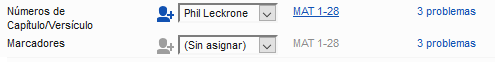

# 5. Verificaciones básicas 1 {#584144d4a3454570845a09cb69b1318f}

**Introducción**En este módulo, comprobará los capítulos/versículos y los marcadores utilizando dos métodos: Asignaciones y Progreso y los menús del proyecto (4a.Verificación).

**Antes de empezar**  Ya debes haber escrito algún texto en Paratext 9. Ahora quiere empezar a comprobar. En este módulo empezamos con las dos primeras verificaciones básicas. Las verificaciones restantes se tratan en [Verificaciones básicas 2](/12.BC2).

**Por qué es importante** Estas verificaciones le permiten asegurarse de que tiene todos los capítulos y versículos y de que los demás marcadores son correctos. Es importante realizar primero la verificación del capítulo/versículo porqué todas las demás verificaciones dependen de ella. Estas verificaciones le permitirán completar la etapa de borrador.

**What you are going to do**  You are going to run the first two basic checks using two different methods. The easiest way is to run the checks from the Assignments and Progress. No obstante, también puede realizar las comprobaciones desde el menú del proyecto **(Herramientas)** si necesita comprobar más de un libro a la vez.

## 5.1 Running checks from the Assignments and Progress {#28ad38164bcc4c688e8e4d2f4a392b64}

It is easier to run the checks from the Assignments and Progress.

### **Ver y corregir errores** {#8dab705513394c93b89c6f71228b4783}

1. View the Assignments and Progress by clicking on the **blue icon** (at the top right of your project window).

1. If there are any "issues" (errors), click the <u>blue link</u> to the right

    

    - _Aparece una ventana con una lista de los errores_.
2. Haga doble clic en una línea de la lista.
3. Corrija el error en su proyecto.
4. Haga doble clic en la línea siguiente de la lista.
5. Continúe para cada error.

### **Confirmar que se han corregido los errores** {#648ac1a433e748dd82299215b61cb8b3}

1. Haga clic en el botón **Repetir**.
    - _La lista de resultados muestra los errores restantes_.
2. Corregir cualquier error
3. Close the results list window (if desired).
4. Return to the **Assignments and Progress**
5. Haga clic en el enlace para ver los resultados de la verificación de marcadores.

:::tip

Cuando haya terminado con una verificación, a algunas personas les gusta cerrar la lista de resultados, a otras les gusta mantenerla abierta, sobre todo si cambia el diseño de las ventanas. También puede moverlo a una pestaña de otra ventana.

:::

:::info

Watch the video  [How to use Checking Tools](https://vimeo.com/127298551)’ for examples of how to correct some common errors.

:::

## 5.2 Running the checks from the menu {#3d7c1c2bb72b412c84fa0be8315c0899}

Si desea comprobar más de un libro a la vez, puede ejecutar las verificaciones desde el menú del proyecto \> **Herramientas**.

### Capítulo/Versículo {#ac301c02271b4d2cbe873464d1494925}

Encontrar los errores

1. Haga clic en la ventana de su proyecto
2. **≡ Tab**, under **Tools** &gt; **Run Basic Checks**
3. Marque solamente **Números de capítulo/versículo**
4. Desmarque cualquier otras verificaciones
5. Si es necesario, haga clic en **Elegir…** y elija el libro que desea verificar
6. Haga clic en **Aceptar**
    - _Aparece una ventana con una lista de los errores._

### Corregir los errores {#2724585e15974d88b2f788b23d7711dc}

1. Haga doble clic en una línea de la lista.
2. Corrija el error en su proyecto.
3. Haga doble clic en la línea siguiente de la lista.
4. Continúe para todos los errores.
5. Haga clic en el botón **Repetir** para comprobar que se han corregido todos los errores.
6. Cierre la ventana de la lista de resultados (si desea).

### Verificación de marcadores {#b9296e794a82435ca258a466eb7c9ee4}

La verificación de marcadores muestra un resumen de los marcadores de su texto. No puede cambiar nada, pero puede buscar marcadores que puedan ser errores.

1. **≡ Tab**, under **Tools** &gt; **Checking Inventories** then **Markers Inventory**
    - _Aparecerá una lista con los marcadores de su texto_.
2. Revise la lista de marcadores (véase más abajo)
3. Cierre el inventario de marcadores (si lo desea).
4. **≡ Tab**, under **Tools** &gt; **Run Basic Checks**
5. Marque **Marcadores**
6. Haga clic en **Aceptar**
7. Corrija cualquier error.

:::info

En qué fijarse. Marcadores que sólo aparecen unas pocas veces. Marcadores similares \q y \q1. Marcadores que aparecen juntos pero no tienen el mismo recuento (por ejemplo, \f y \f*).

:::

