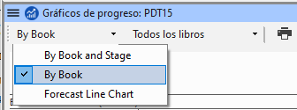

**Introduction**  In this module, you will learn how to update your progress by marking tasks as completed. También creará un informe de progreso.

**Before you start**  You have been working on your translation and have finished a task. Ahora quiere actualizar su progreso.

**Why this is important**  For the Assignments and Progress to work well, you need to mark the tasks you have finished. Esto permite a Paratext 9 poner la siguiente tarea a disposición de los demás miembros del equipo. También proporciona a Paratext información precisa sobre su progreso para los informes. Crear un informe de progreso le ayuda a preparar un informe para sus supervisores y financiadores.

**What you are going to do**  You will open the assignments and progress window and update the progress made. A continuación, elaborará un informe.

## 6.1 Asegúrese de que el progreso del plan está actualizado {#1baa7ce081654a3a9aa755bf4ebdfc4d}

1. Open the Assignments and Progress (using the blue button)
1. Actualice el progreso de todas las tareas (consulte PP1 para obtener instrucciones sobre cada tipo de tarea).

## 6.2 Modificar una asignación {#420f3c9ae4d6494d8246e72237cc8030}

:::caution

This can only be done if you have **progress permissions**.

:::

1. Desde el **≡ Menú del proyecto**, bajo **Proyecto**, seleccione **Asignaciones y Progreso**
1. En la primera lista desplegable de la parte superior izquierda del cuadro de diálogo, seleccione **Todas las tareas**.
1. En la columna **Asignado a**, utilice la lista desplegable para elegir quién tendrá la responsabilidad para la tarea o la verificación (que aparece en la columna **Tareas/Verificaciones requeridas** en el extremo izquierdo).

## 6.3 Produce a Project Health Report {#5164035c401f4b409f6e8addbc7d0167}

1. Desde el menú **Proyecto**, seleccione **Informe de salud del proyecto…**.
1. Elije el proyecto o proyectos sobre los que desea informar
1. Haga clic en **Aceptar**.
    - _The report will contain a column for each project you selected._

## **6.4 Ver los gráficos de progreso del equipo** {#6d88f283bc7643daa88084ac0d8a055f}

- Desde el **≡ Menú del proyecto**, bajo **Proyecto**, seleccione **Gráficos de progreso**

1. Use the first dropdown box to choose the type of chart

1. Elige los libros que necesites.

1. Click the print icon

1. Click the **Print** icon

1. Choose your printer (or PDF printer)

1. Click **OK**.

  
 
  
  

    

    
    

    

  

