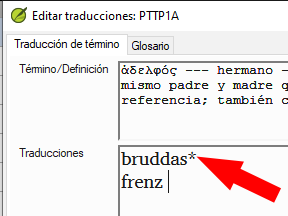
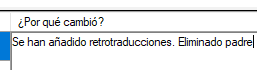
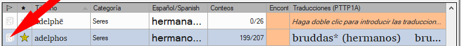
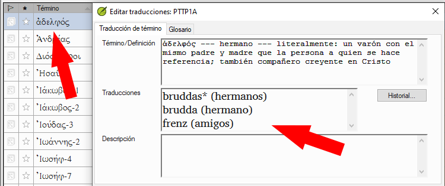
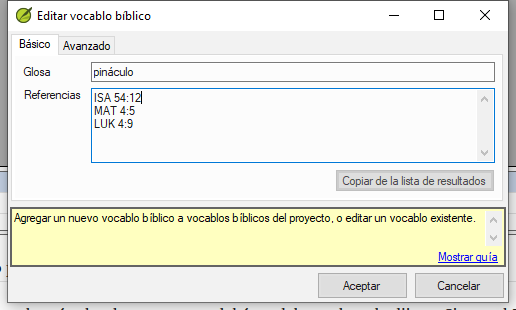

**Introduction**  The _Biblical terms rendering_ window and the separate _Biblical terms_ tool are very useful to make sure you are consistent in the use of terms, especially key terms. Con muchos términos en muchos libros, esto puede convertirse en una tarea larga. Este módulo explica un sencillo proceso de 4 pasos para que sus Vocablos Bíblicos sean coherentes. Este proceso debe considerarse parte del proceso de traducción y no una verificación.

**Before you start**  You are translating a verse in Paratext 9, and you want to see what renderings have already been chosen for the terms in the current verse, and then make sure they are consistent with other verses.

**Why this is important**  For your readers to understand your text, you need to be consistent in your use of terms. Es una gran tarea hacer que sean completamente coherentes. Si empieza por el versículo que está traduciendo y trabaja a partir de ahí, la tarea es más manejable. El objetivo es que los vocablos bíblicos sean coherentes y que las decisiones sobre los motivos de los cambios estén bien documentadas.

**What you are going to do**  This method boils down to a short list of steps:

1. **[A]** Busque todas las formas en que ha traducido este término e introdúzcalas en el cuadro de diálogo de traducciones.
1. **[B]** Elije cuál o cuáles son las mejores traducciones y explique por qué son las mejores.
1. **[C]** Documente por qué rechazó las otras traducciones.
1. **[D]** Limpie su texto haciendo que esta traducción sea coherente en todo el texto. (Hacer coherente, Estandarizar, Normalizar, Armonizar).
- Repita el procedimiento con el siguiente vocablo bíblico que encuentre en la ventana Traducciones de vocablos bíblicos.

## 10.1. Abrir la ventana de Traducciones de vocablos bíblicos {#f8f57567e6ff4b9193367abfbee7302a}

1. Haga clic en su proyecto
1. **≡ Tab**, under **Tools** &gt; **Biblical terms rendering**
1. **≡ Tab** (of the new window), under **Biblical Terms** &gt; **Select Biblical terms list**
1. Seleccione la lista deseada
1. Haga clic en **Aceptar**.

## 10.2 A: Busca todas las formas en que has traducido este término {#df4c8121b667426ca013ce2feace7348}

### Buscar los términos del versículo actual {#3ffdc542c5f84c369b2c4cdfcc8569e1}

- ¿Hay una marca en la columna "encontrado"?
- Si hay una marca, el versículo utiliza el término, y puedes continuar con el siguiente término.
- Si no es así, debe corregir su texto o añadir la nueva traducción que ha utilizado (véase más abajo).

### Añadir otra traducción {#dae5da6bfb1b40c99e9eb4f0c7fe1f06}

Si el término que ha utilizado debe añadirse a la lista:

1. Seleccione la traducción del término en su texto.

1. Copy it (**Ctrl**+**C**)

1. Double-click in the renderings cell of the Biblical Terms rendering window.

1. Paste (**Ctrl**+**V**) the rendering in the dialog box.

1. Click **OK**.

  
 
  
  

    

    
    

    

  

<h3 id="bbdc4762638048adb945ccfff0f3c9e3" spaces-before="0">
  Buscar otros versículos del libro actual con el mismo término bíblico
</h3>

  In the Biblical Terms rendering window

1. Double-click on a word in the **Term** column

1. From the second filter button choose **current book**

1. Añada las traducciones del término en los versículos hasta que se hayan identificado los términos en todos los versículos (véase más abajo).

  
  

    
 
    
    

      

      
      

      

    

<h3 id="a5212cc460da4fabb7cb3db81d405280" spaces-before="0">
  Añadir traducciones de los otros versículos
</h3>

<ol start="1">
  <li>
    Seleccione la traducción en el versículo
  </li>
  
  <li>
    Añada la traducción utilizando <strong x-id="1">Ctrl</strong>+<strong x-id="1">A</strong>
  </li>
  
  <li>
    Siga hasta que haya identificado todos los términos de esos versículos.
  </li>
</ol>

<h3 id="3867de64e3064e85a08eed2cdab64dad" spaces-before="0">
  Versículos que no utilizan el término
</h3>

  :::tip

  Hay veces en que un versículo se traduce sin utilizar el término real. Por ejemplo, cuando se utiliza un pronombre. En este caso, debe negar que se trate de un error.

:::

- Click the red cross to the left of the verse reference link

  
  

    
 
    
    

      

      
      

      

    

    
    

      :::caution
    

    
    

      If you click on the cross by mistake, click the green tick and it will return to the red cross.
    

    
    

:::
    

<h2 id="55582923eae649c9964c1e0068ec29ac" spaces-before="0">
  10.3 B: Identificar el mejor término
</h2>

1. Double-click on the term in the top pane.

1. Decide on the best rendering

1. Section, then Cut (**Ctrl**+**x**) and paste (**Ctrl**+**v**) it to the top of the dialogue box

1. Add ***** as necessary to combine similar renderings

  
  

    
 
    
    

      

      
      

      

    

    
    

      :::tip
    

    
    

      You can use ***** in a number of different ways: before the word for prefixes and after the word for suffixes. You can also put an ***** in the middle of a word. See the guide for more ways of using the *****.
    

    
    

:::
    

<h2 id="91a3dcb7525c41919b79cdc020e1ca63" spaces-before="0">
  10.4 C: Reject all the others
</h2>

<ul>
  <li>
    Select and cut the other renderings.
  </li>
</ul>

<h2 id="c70df72e555f44d4a73cd41076bd8718" spaces-before="0">
  10.5 D: Document the reason for the change
</h2>

- Click on the **History** button

  
  

    
 
    
    

      

      
      

      

    

    
    

- Type in the reason why the others were rejected and why the first was the best.

- Click **OK**

      
      

        
 
        
        

          

          
          

          

        

<h3 id="7efa68af7a544631bf7f24302fa0449e" spaces-before="0">
  If you need more than one rendering
</h3>

  :::tip

  You can add more than one rendering if appropriate. It is good to add a back translation in brackets after the rendering. For example, slave (slave) guy * work fo (guy that works for)

:::

<ol start="1">
  <li>
    Open the Edit renderings dialog box
  </li>
  
  <li>
    Edit the renderings as needed.
  </li>
</ol>

<h3 id="ad15f3d2b6c24b35a1bb0ef7a8c04731" spaces-before="0">
  Clean up other books (as time permits)
</h3>

<ol start="1">
  <li>
    Change the filter so that all the published books are displayed.
  </li>
  
  <li>
    Clean up verses as necessary.
  </li>
</ol>

<h3 id="90110e260d7c40ca81c55c8e3604926b" spaces-before="0">
  Add the Biblical terms notes — ongoing discussion
</h3>

<ol start="1">
  <li>
    

      Double-click on the note icon (in the second column)
    

    

      
    

  </li>
  
  <li>
    

      Type in the note
    

  </li>
  
  <li>
    Assign the note as necessary.
  </li>
  
  <li>
    Haga clic en <strong x-id="1">Aceptar</strong>.
  </li>
</ol>

<h3 id="1d89b36b75b14ab2a712924ef0e101e5" spaces-before="0">
  Add the decision to the renderings description
</h3>

1. Double-click on the term

1. Type the agreed-on rendering in the description field

1. Click **OK**

  
  

    
 
    
    

      

      
      

      

    

<h2 id="1ec5422db83c4bdeb51842a53f7df352" spaces-before="0">
  10.6 Add a term – from the source language text
</h2>

  :::tip

  You can create a list of verses for a specific Greek/Hebrew word and then use that list to add the word/phrase to your project Biblical terms list.

:::

1. Click in the window with the Source text.

1. Right-click on a lemma (blue word) in the source language text window

1. Choose **Add to project biblical terms for**

1. Choose your project

1. Edit the gloss if necessary

1. Click on the **Advanced** tab

1. Edit the terms if necessary

1. Click **OK**

  
  

    
 
    
    

      

      
      

      

    

<h3 id="f269fc949f124cd5b1b68bb9a60766ad" spaces-before="0">
  View the new term
</h3>

<ol start="1">
  <li>
    Change to the <strong x-id="1">Biblical Terms Tool</strong>
  </li>
  
  <li>
    Double-click on the term.
  </li>
</ol>

<h2 id="f683ccf4cdcf45f09c516c09c78ab277" spaces-before="0">
  10.7 Add a term – from reference text search
</h2>

  :::tip

  There will be terms which are important for your language and culture that are not in the list. You can add these terms to your project list.

:::

  In Paratext

<ul>
  <li>
    From your reference text, do a find (using <strong x-id="1">≡ Tab</strong>, under <strong x-id="1">Edit</strong> &gt; <strong x-id="1">Find</strong>) and search for the term. <ul>
      <li>
        <em x-id="4">A list is displayed showing the verses with that term.</em>
      </li>
    </ul>
  </li>
</ul>

  From the list of results

1. **≡ Tab**, under **Edit**> **Add to Project Biblical Terms**, then choose your project

1. Edit the gloss if necessary

1. Click on the **Advanced** tab

1. Type in a name for the term

1. Click **OK**

  
  

    
 
    
    

      

      
      

      

    

