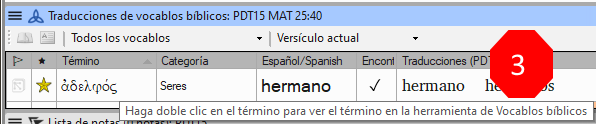
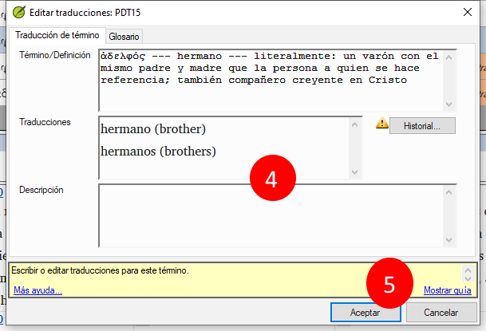
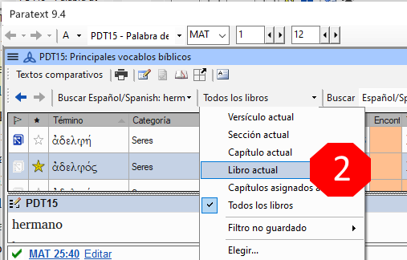
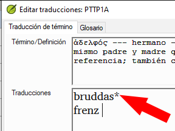
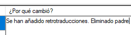
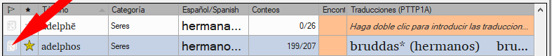
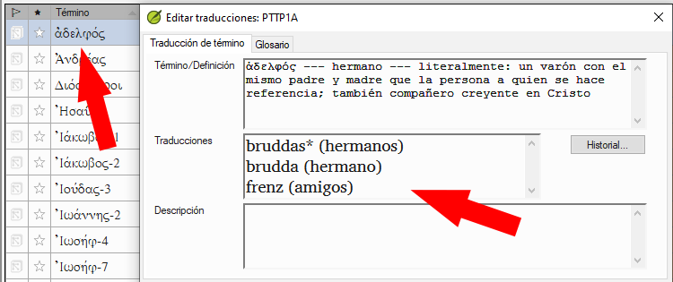
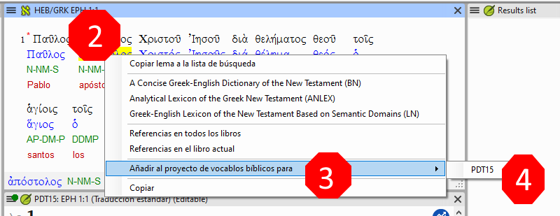
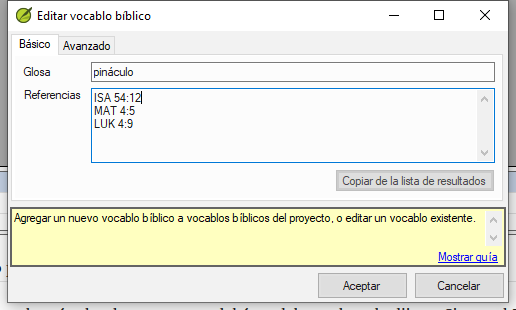

**Introducción** La ventana _Representación de términos bíblicos_ y la herramienta separada _Términos bíblicos_ son muy útiles para asegurarse de que es coherente en el uso de los términos, especialmente de los términos clave. Con muchos términos en muchos libros, esto puede convertirse en una tarea larga. Este módulo explica un sencillo proceso de 4 pasos para que sus Vocablos Bíblicos sean coherentes. Debe considerar este proceso como parte del proceso de traducción y no como una comprobación.

**Antes de empezar** Está traduciendo un versículo en Paratext 9 y quiere ver qué traducciones ha elegido ya para los términos del versículo actual y asegurarse de que son coherentes con otros versículos.

**Por qué es importante** Para que sus lectores comprendan su texto, debe ser coherente en el uso de los términos. Es una gran tarea hacer que sean completamente coherentes. Si empieza por el versículo que está traduciendo y trabaja a partir de ahí, la tarea es más manejable. El objetivo es tener los vocablos bíblicos coherentes y unas decisiones bien documentadas sobre por qué has hecho los cambios.

**Qué va a hacer** Este método se reduce a una breve lista de pasos:

1. **[A]** Busque todas las formas en las que ha renderizado este término e introdúzcalas en el diálogo de renderizaciones.
2. **[B]** Elija cuál o cuáles son los mejores renders y anote por qué son los mejores.
3. **[C]** Documente por qué rechazó las otras traducciones.
4. **[D]** Limpie su traducción haciendo que esta interpretación sea coherente en toda su traducción. (Hacer coherente, Estandarizar, Normalizar, Armonizar).

- Repita el procedimiento con el siguiente vocablo bíblico que encuentre en la ventana Traducciones de vocablos bíblicos.
- También podrá utilizar la nueva función de Paratext 9.4 para exportar términos de la lista de vocablos bíblicos y compartirla con sus colegas.

## 10.1 Abra la ventana de términos bíblicos {#f8f57567e6ff4b9193367abfbee7302a}

1. Haga clic en su proyecto
2. **≡ Menú del proyecto**, bajo **Herramientas** &gt; **Traducciones de vocablos bíblicos**
3. **≡ Menú del proyecto** (de la nueva ventana), en **Vocablos bíblicos** &gt; **Seleccionar lista de vocablos bíblicos**
4. Seleccione la lista deseada
5. Haga clic en **Aceptar**.

## 10.2 A: Encuentre todas las formas en las que ha representado este término {#df4c8121b667426ca013ce2feace7348}

### Encuentre los términos para el verso actual {#3ffdc542c5f84c369b2c4cdfcc8569e1}

- ¿Hay una marca en la columna "encontrado"?
- Si hay una marca, el versículo utiliza el término, y puede continuar con el siguiente término.
- Si no es así, debe corregir su texto o añadir la nueva traducción que ha utilizado (véase más abajo).

### Agregar otra traducción {#dae5da6bfb1b40c99e9eb4f0c7fe1f06}

Si el término que ha utilizado no está en la lista, puede añadirlo:

1. Seleccione la traducción del término en su texto.

2. Cópialo (**Ctrl**+**C**)

3. Haga doble clic en la celda de la traducción de la ventana de Traducciones de vocablos bíblicos.
  - _Aparece el cuadro de diálogo de edición de traducciones_.

4. Pega (**Ctrl**+**V**) la traducción en el cuadro de diálogo.

5. Haga clic en **Aceptar**.

### Encontrar otros versículos en el libro actual con el mismo término bíblico {#bbdc4762638048adb945ccfff0f3c9e3}

En la ventana de Traducciones de vocablos bíblicos

1. Haga doble clic en una palabra de la columna **Término**
  - _Se abre la herramienta de Vocablos bíblicos_

2. En el segundo botón de filtro elija **Libro actual**

3. Añada traducciones para el término en los versículos hasta que haya identificado los términos en todos esos versículos (véase más abajo).

### Añadir renders de los otros versos {#a5212cc460da4fabb7cb3db81d405280}

1. Seleccione la traducción en el versículo
2. Agrega la traducción usando **Ctrl**+**A**
3. Continúe hasta que haya identificado los términos en todos esos versículos.

### Cómo tratar los versículos que no utilizan el término {#3867de64e3064e85a08eed2cdab64dad}

:::tip

Hay veces en que un versículo se traduce sin utilizar el término real. Por ejemplo, cuando se utiliza un pronombre. En este caso, debe negar que se trate de un error.

:::

- Haga clic en la cruz roja a la izquierda del enlace de referencia del versículo
  - _La cruz roja se convierte en un tick verde con una pequeña x roja_

:::caution

Si hace clic en la cruz por error, haga clic en la marca verde y volverá a la cruz roja.

:::

## 10.3 B: Identifique el mejor término {#55582923eae649c9964c1e0068ec29ac}

1. Haga doble clic en el término en el panel superior.
  - _Se muestra el diálogo de edición de renderizados con una lista de todos los renderizados que ha añadido._

    

2. Decida cuál es la mejor traducción

3. Seleccione, luego Corte (**Ctrl**+**x**) y péguelo (**Ctrl**+**v**) en la parte superior del cuadro de diálogo

4. Añada \*\*\*\*\* si es necesario para combinar traducciones similares

:::tip

Puede utilizar \*\*\*\*\* de varias maneras: antes de la palabra para los prefijos y después de la palabra para los sufijos. También puede poner una \*\*\*\*\* en medio de una palabra. Consulte la guía para conocer más formas de utilizar el \*\*\*\*\*.

:::

## 10.4 C: Rechazar todas las demás {#91a3dcb7525c41919b79cdc020e1ca63}

- Selecciona y recorta las otras traducciones.

## 10.5 D: Documente la razón del cambio {#c70df72e555f44d4a73cd41076bd8718}

- Haga clic en el botón **Historial**

- Escriba la razón por la que rechazó a los demás y por qué el primero era el mejor.

- Haga clic en **Aceptar**

### Si necesita más de un renderizado {#7efa68af7a544631bf7f24302fa0449e}

:::tip

Si lo desea, puede añadir más de una traducción. Es bueno añadir una retrotraducción entre paréntesis después de la traducción. Por ejemplo,
slave (esclavo)
guy \* work fo (chico que trabaja para)

:::

1. Abrir el cuadro de diálogo Editar traducciones
2. Edite las traducciones según sea necesario.

### Limpie otros libros (cuando el tiempo lo permita) {#ad15f3d2b6c24b35a1bb0ef7a8c04731}

1. Cambie el filtro para que se muestren todos los libros traducidos.
2. Limpia los versículos según sea necesario.

### Añadir las notas de los términos bíblicos - discusión en curso {#90110e260d7c40ca81c55c8e3604926b}

1. Haga doble clic en el icono de la nota (en la primera columna)

  

2. Escriba la nota

3. Las notas no se pueden asignar.

4. Haga clic en **Aceptar**.

### Añada la decisión a la descripción de los renders {#1d89b36b75b14ab2a712924ef0e101e5}

1. Haga doble clic en el término

2. Escriba la traducción acordada en el campo de descripción

3. Haga clic en **Aceptar**

## 10.6 Añadir un término - del texto de la lengua de origen {#1ec5422db83c4bdeb51842a53f7df352}

:::tip

Puede crear una lista de versículos para una palabra griega/hebrea específica y luego usar esa lista para añadir la palabra/frase a la lista de vocablos bíblicos de su proyecto.

:::

1. Haga clic en la ventana con el texto hebreo/griego.

  

2. Haga clic con el botón derecho del ratón en un lema (palabra azul) de la ventana de texto del idioma original

3. Elija **Añadir al proyecto de vocablos bíblicos para**

4. A continuación, elija su proyecto

5. Editar la glosa si es necesario

6. Haga clic en la pestaña **Avanzado**

7. Editar el término si es necesario

8. Haga clic en **Aceptar**

### Ver el nuevo término {#f269fc949f124cd5b1b68bb9a60766ad}

1. Cambiar a la **herramienta de vocablos bíblicos**
2. Haga doble clic en el término.

## 10.7 Añadir un término - desde la búsqueda de texto de referencia {#f683ccf4cdcf45f09c516c09c78ab277}

:::tip

Habrá términos importantes para su lengua y cultura que no figuren en la lista. Puede añadir estos términos a su lista de proyectos.

:::

En Paratext

- A partir de su texto de referencia, haga un find (utilizando **≡ Tab**, en **Edit** &gt; **Find**) y busque el término.
  - _Aparecerá una lista con los versículos que contienen ese término._

De la lista de resultados

1. **≡ Menú del proyecto**, en **Editar**> **Agregar a los vocablos bíblicos del proyecto**, después elija su proyecto

2. Editar la glosa si es necesario

3. Haga clic en la pestaña **Avanzado**

4. Escriba un nombre para el término

5. Haga clic en **Aceptar**

## 10.8 Comparta una lista de términos bíblicos (opcional) {#b6ca108e1c374004b5acb581e61ebecc}

:::info Actualización

En Paratext 9.4 puede importar o exportar términos de una lista de vocablos bíblicos. A continuación, puede compartir esa lista exportada con los miembros de su equipo. He aquí un resumen. Para más detalles vea [Novedades en Paratext 9.4 Términos bíblicos](https://vimeo.com/858020833)

:::

1. Del **≡ Proyecto**, Abrir **Vocablos bíblicos**
2. Seleccione o filtre los términos deseados
3. En la **≡ Menú del proyecto**, elija **Exportar Vocablos bíblicos filtrados**
4. Escriba un nombre para el archivo
5. Comparte el archivo con un colega.
6. Pueden abrir la lista compartida, **≡ Menú del proyecto**, elegir **Importar lista de Vocablos bíblicos filtrados** en la herramienta de vocablos bíblicos.
