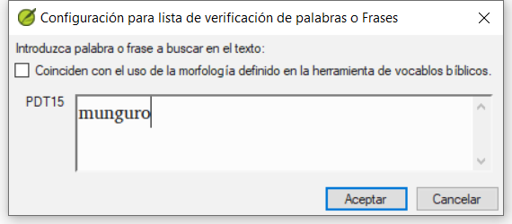
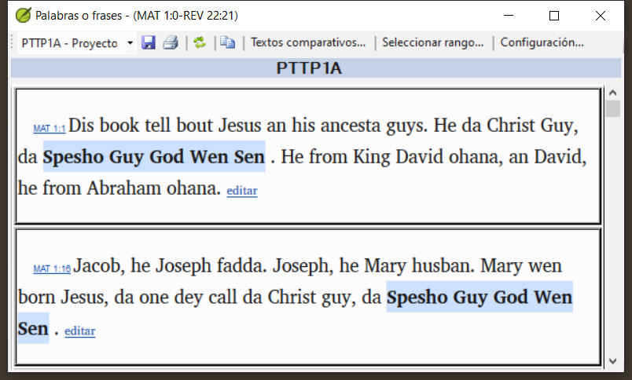
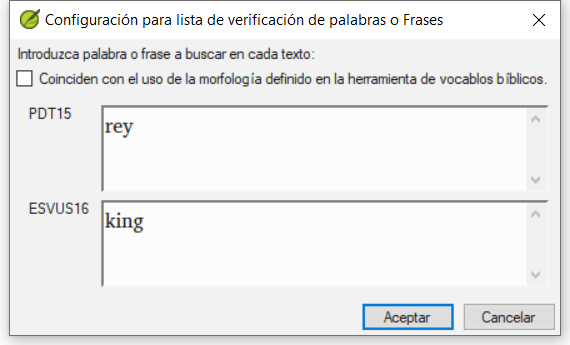
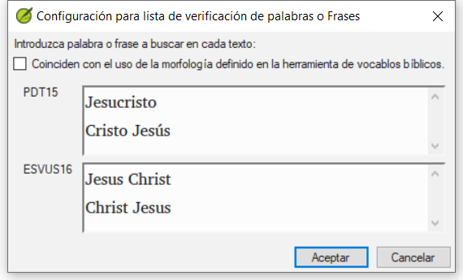

**Introduction**  In this module, you will search for a word or phrase in a project and compare it with the translation of that word or phrase in another project.

**Why this is important?**  In Paratext 9 (and above), you can see where a word or phrase is found in one project and compare it with the equivalent word or phrase in one or more other projects. Por ejemplo, puede ver dónde se encuentra "roi" en un proyecto francés y compararlo con "rey" en un proyecto español.

Usted va a

- utilice la lista de verificaciones "Palabras o Frases" tanto del texto como de la Herramienta de vocablos bíblicos.
- cambia la configuración y los textos comparativos
- escriba la palabra o frase a comparar para cada proyecto

## 11.1 Compare a word of phrase – from the text {#659828b2f3ee4616a7b10dd9380b9ce2}

:::tip

Su primera comparación no funcionará porque aún no se han elegido textos comparativos. Es necesario introducir una palabra a buscar antes de que le permita establecer los textos comparativos.

:::

1. Click in the project that you want to compare

2. En la **≡ Menú de proyecto**, bajo **Herramientas**, señale **Lista de verificaciones** y seleccione **Palabras o frases**.

3. Enter the word or phrase that you want to see into the textbox for each project of the dialogue
   - _The Settings dialog is displayed_.

4. Haga clic en **Aceptar**

   - _A window is displayed_.

### Choose the texts to compare {#1b10fbeee1314150907b71b710e97dbd}

1. Haga clic en **Textos Comparativos**…

2. Elija los textos que desea comparar y haga clic en **Aceptar**.
   - _The_ _**Settings**_ _dialogue is displayed._

### Type the word or phrase to compare {#ed9ce5e42eee4988945547297f12b1e0}

1. Escriba la palabra o frase que desea comparar en el cuadro de texto de cada uno de los proyectos

2. Haga clic en **Aceptar**.

   - _A window is displayed with a button_ _**Hide matches**_ _on the toolbar._

:::tip

You can use the **Hide matches** button to show only those references where there are differences. La palabra o frase aparece resaltada en azul claro.

:::

## 11.2 Compare using a Word or Phrase from the Biblical Terms tool {#14e18bd78f934875aa5084b16c1d7269}

### In the Biblical Terms tool {#20feff24077248faa227e0c7cdef2fec}

1. Elija un término que tenga una traducción

2. Click on the tool icon

   - _The Settings dialogue is displayed with the rending filled-in._

3. Type the word or expression for the other projects

4. Haga clic en **Aceptar**

:::tip

If you want to compare more than one word or phrase at a time, type **Enter** after each word or phrase so that they are on separate lines.

:::
