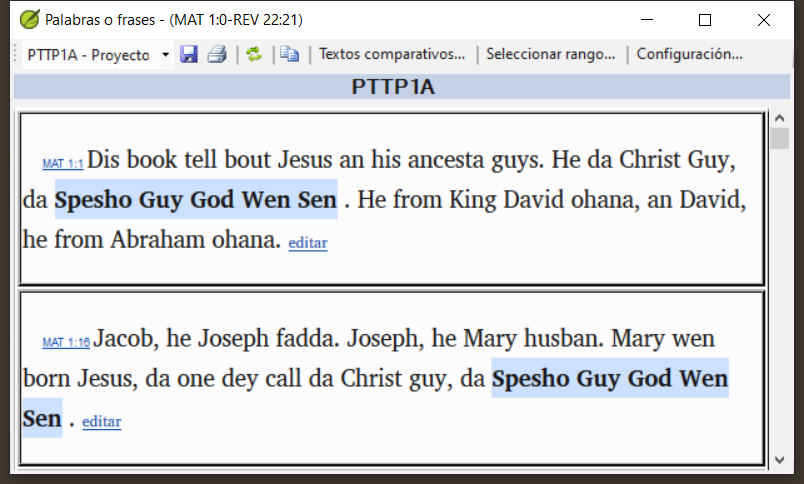
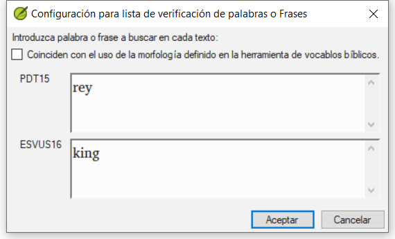
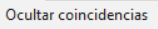
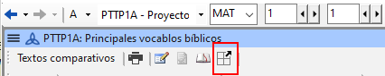
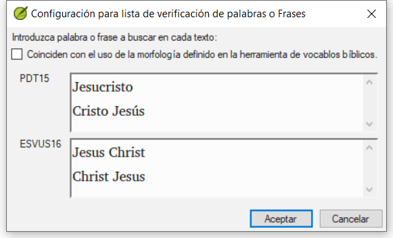

**Introducción** En este módulo, buscará una palabra o frase en un proyecto y la comparará con la traducción de esa palabra o frase en otro proyecto.

**¿Por qué es importante?** En Paratext 9 (y versiones superiores), puede ver dónde se encuentra una palabra o frase en un proyecto y compararla con la palabra o frase equivalente en otro u otros proyectos. Por ejemplo, puede ver dónde se encuentra "roi" en un proyecto francés y compararlo con "rey" en un proyecto español.

Usted va a

- use the checklist “Word or Phrase” from both the text and also from the Biblical Terms Tool.
- change the settings and comparative texts
- type the word or phrase to compare for each project

## 11.1 Comparar una palabra o frase - del texto {#659828b2f3ee4616a7b10dd9380b9ce2}

:::tip

Su primera comparación no funcionará porque aún no se han elegido textos comparativos. Es necesario introducir una palabra a buscar antes de que le permita establecer los textos comparativos.

:::

1. Haga clic en el proyecto que desea comparar

2. En la **≡ Menú de proyecto**, bajo **Herramientas**, señale **Lista de verificaciones** y seleccione **Palabras o frases**.

3. Introduzca la palabra o frase que desea ver en el cuadro de texto de cada proyecto del cuadro de diálogo
    - _Se muestra el cuadro de diálogo Configuración_.

4. Click **OK**

    - _A window is displayed_.

### Elegir los textos para comparar {#1b10fbeee1314150907b71b710e97dbd}

1. Click **Comparative Texts**…

2. Choose the texts that you want to compare and click **OK**.
    - _The_ _**Settings**_ _dialogue is displayed._

### Escribir la palabra o frase que desea comparar {#ed9ce5e42eee4988945547297f12b1e0}

1. Type the word or phrase that you want to compare in the textbox for each of the projects

2. Haga clic en **Aceptar**.

    - _A window is displayed with a button_ _**Hide matches**_ _on the toolbar._

:::tip

Puede utilizar el botón **Ocultar coincidencias** para mostrar sólo las referencias en las que hay diferencias. La palabra o frase aparece resaltada en azul claro.

:::

## 11.2 Comparar utilizando una palabra o frase de la herramienta Vocablos bíblicos {#14e18bd78f934875aa5084b16c1d7269}

### En la herramienta de vocablos bíblicos {#20feff24077248faa227e0c7cdef2fec}

1. Choose a term which has a rendering

1. Click on the tool icon
    - _The Settings dialogue is displayed with the rending filled-in._

2. Type the word or expression for the other projects

3. Click **OK**

:::tip

Si desea comparar más de una palabra o frase a la vez, teclear **Entrar** después de cada palabra o frase para que queden en líneas separadas.

:::

