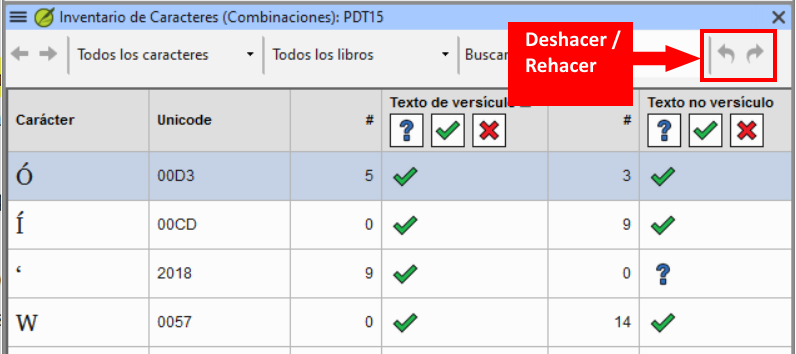
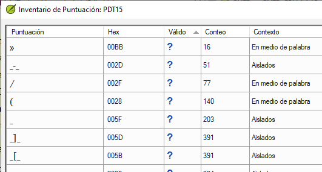

**Introducción** En este módulo aprenderá a realizar otras comprobaciones básicas (**caracteres**, **puntuación**, **capitales** y **palabras repetidas)**. Al igual que en el primer módulo de Verificaciones básicas (5. [Comprobaciones básicas 1](/5.BC1)), lo más fácil es ejecutar estas comprobaciones desde las Asignaciones y el Progreso. Sin embargo, si desea consultar varios libros, deberá utilizar el menú **Herramientas**.

**Antes de empezar** Ha escrito su traducción en Paratext 9. Asegúrese de haber comprobado los números de capítulo/versículo y los marcadores, como se describe en 5. [Comprobaciones básicas 1](/5.BC1), antes de continuar y que su administrador haya realizado la configuración de las comprobaciones o esté con usted para realizarla ahora.

**¿Por qué es importante?** Paratext 9 tiene once **Comprobaciones básicas**. Ya ha visto los dos primeros, los números de capítulo/versículo y los marcadores. Este módulo le ayudará a encontrar errores relacionados con los caracteres, la puntuación, las mayúsculas y las palabras repetidas. Aunque estos errores no influyan en el contenido del texto, corregirlos facilita su lectura.

**Qué vamos a hacer:** La mayoría de las comprobaciones requieren que su administrador haya realizado un inventario. En este módulo, aprenderá

- Confirme que se ha realizado la configuración (o pida al administrador que la realice)
- realice las verificaciones básicas
- corrija cualquier error.

## 12.1 Confirme la configuración {#96b5c12dac164c719816a72af9b6bdea}

Antes de poder realizar estas otras verificaciones básicas, alguien debe configurarlas. Algunas verificaciones requieren un inventario, y otras requieren reglas o configuración.

:::caution

Usted puede hacer la mayoría de los inventarios, pero **sólo su Administrador** puede hacer las reglas o ajustes.

:::

## 12.2 Cambios en los inventarios {#1ba598a5fd408085bb05d1fb347c38e9}

:::info

En Paratext 9.5, los inventarios han cambiado. Ahora se ven y se comportan como el panel Lista de palabras. Una nueva función permite aprobar un elemento basado en su ubicación. Es decir, ahora puede aprobar un elemento basado en si está en texto versículo o no versículo.

- Haga clic en el menú Inventario y elija "Establecer el estado de versículo y no versículo por separado".

:::

- hay iconos de deshacer y rehacer (arriba a la derecha)
- **filtrado** para ayudar a los usuarios a encontrar y organizar fácilmente los elementos del inventario.
- los paneles de inventario también pueden acoplarse

## 12.3 Uso de inventarios para configurar {#2af0f49b3c8248368dd82611ad6daed7}

:::tip

Estos inventarios muestran lo que hay actualmente en su texto, es decir, tanto lo bueno como lo malo. Tiene que trabajar con el inventario y decirle a Paratext 9 qué elementos son correctos (válidos) y cuáles son errores (no válidos).

:::

Una vez que haya terminado el inventario, estará listo para hacer la verificación.

1. En la **≡Menú del proyecto**, en el menú **Herramientas** &gt; **Inventarios de verificación**, elija el inventario apropiado (por ejemplo, Inventario de caracteres).
2. Haga clic en un elemento de la lista del panel superior.
    - _Los versos se muestran en el panel inferior._
3. Para cada elemento del panel superior, elija **Válido** o **Inválido**.
4. Repita la operación para cada elemento.
5. Haga clic en **Aceptar**.

:::tip

En lugar de utilizar el ratón, puede utilizar **Ctrl** + **y** para marcar una entrada como **Válida** o **Ctrl** + **n** para marcar una entrada como **Inválida**.

:::

## 12.4 Caracteres {#62a1b14481984178905fe3720ad81e98}

:::tip

Esta comprobación (e inventario) le ayuda a identificar todos los caracteres incorrectos, es decir, los caracteres que no están en su alfabeto (tal y como se define en el **≡ Menú del proyecto**, en **Propiedades del proyecto** &gt; **Configuración del idioma** &gt; **Caracteres alfabéticos**.

:::

### Configuración necesaria {#e87d6701d2f546faa45b5584b3b45d3a}

1. **≡ Menú del proyecto**, en **Herramientas** &gt; **Inventarios de verificación** &gt; **Inventario de caracteres**
2. Para cada elemento, elija **Válido** o **Inválido**.

:::caution

Si uno de sus caracteres alfabéticos es actualmente "Desconocido", entonces ese carácter debe ser añadido a su configuración de idioma por el administrador.

:::

### Comprobar {#26d95e0dcad04a3a99dff3ea83702c82}

**Menú de proyecto**, bajo **Herramientas** &gt; **Ejecutar Verificaciones Básicas**

1. Verificar **Caracteres**
2. Haga clic en **Aceptar**.
    - _Aparece una lista de errores._
3. Haga las correcciones necesarias.

## 12.5 Puntuación {#7a03d8fd1d3d4de38e992c7820f94bc7}

:::tip

Esta verificación (y los inventarios) le ayudan a identificar todos los signos de puntuación incorrectos o mal colocados. (Utilice la columna de Unicode para identificar claramente los signos de puntuación.)

:::

### Configuración necesaria {#21350c0dd462479184cc36dc9fc50d24}

1. **≡ Menú del proyecto**, en **Herramientas** &gt; **Inventarios de verificación** &gt; **Inventario de puntuación**

2. Verificar cada signo de puntuación en su contexto.
    - Los contextos pueden ser:
        - **palabra inicial**, **palabra media**, **palabra final** o **aislada**
    - Para cada signo de puntuación en su contexto,

        - elija **Válido** o **No válido** o déjelo como **Desconocido**

        

3. Cuando haya terminado pulse **Aceptar**.

4. **≡ Menú del proyecto**, en **Herramientas** &gt; **Inventarios de verificación** &gt; **Marcadores faltando puntuación final**

5. Para cada elemento, elija **Válido** o **Inválido**.

### Comprobar {#a24bedcb31944326a9c14889a7bf5a29}

1. **Menú de proyecto**, bajo **Herramientas** &gt; **Ejecutar Verificaciones Básicas**
2. Verificar **Puntuación**
3. Haga clic en **Aceptar**.
    - _Aparece una lista de errores._
4. Haga las correcciones necesarias.

## 12.6 pares coincidentes {#829c1d30e9d044ce9808a2a1c3ce63fd}

### Configuración necesaria {#458176d1cea940d5aa50db2af73cf078}

1. **≡ Menú del proyecto**, en Herramientas &gt; **Inventarios de verificación** &gt; **Puntuación sin par coincidente**:
2. Si la lista está vacía, no hay errores con estos pares de caracteres.
3. Si es necesario, pulse **Opciones...** para añadir otros pares

### Comprobar {#b1cbb995508b4d5eb82eec2f09af40ec}

1. **Menú de proyecto**, bajo **Herramientas** &gt; **Ejecutar Verificaciones Básicas**
2. Comprobar **Pares de puntuación no coincidentes**
3. Haga clic en **Aceptar**.
    - _Aparece una lista de errores._
4. Haga las correcciones necesarias.

## 12.7 Palabras repetidas {#17ce3bddd4ed49c4afaceb8f4b874e20}

:::info

Esta verificación sirve para identificar las palabras que se han repetido en el texto. Esto puede indicar un error, pero no necesariamente.

:::

### Configuración necesaria {#9d08869684634685aa5a788e974cda3e}

1. **≡ Menú del proyecto**, en **Herramientas** &gt; **Inventarios de verificación** &gt; **Inventario de palabras repetidas:**
2. Para cada elemento, elija **Válido** o **Inválido**.

### Comprobar {#ef2ea7921ac94cbca127e812b46341dc}

1. **Menú de proyecto**, bajo **Herramientas** &gt; **Ejecutar Verificaciones Básicas**
2. Verificar **Palabras repetidas**
3. Haga clic en **Aceptar**.
    - _Aparece una lista de errores._

- Haga las correcciones necesarias.

## 12.8 Capitalización {#7f4309ed10a44e7cae14a3c07da88d72}

:::info

La verificación de mayúsculas busca varios tipos de problemas de mayúsculas. Hay tres inventarios para el uso de mayúsculas, pero solo una verificación. Puede que tenga que hacer clic en el botón **Opciones** para añadir marcadores o signos de puntuación.

:::

### **Se requiere configuración** {#4ffe45925e6249d19d3c3d98f5a2a6eb}

1. **≡ Tab**, en **Herramientas** &gt; **Comprobar inventarios** &gt; **Marcadores seguidos de una letra minúscula**
2. Para cada elemento, elija **Válido** o **Inválido**.
3. **≡ Tab**, en **Herramientas** &gt; **Comprobar inventarios** &gt; **Puntuación seguida de una letra minúscula**
4. Para cada elemento, elija **Válido** o **Inválido**.
5. **≡ Menú del proyecto**, en **Herramientas** &gt; **Inventarios de verificación** &gt; **Combinación de mayúsculas y minúsculas**
6. Si tiene prefijos en minúsculas, pulse **Opciones** e introduzca los detalles.
7. Para cada elemento, elija **Válido** o **Inválido**.

### **Comprobar** {#491e80502e594776829f3545b770e886}

1. **Menú de proyecto**, bajo **Herramientas** &gt; **Ejecutar Verificaciones Básicas**
2. Verificar **Uso de mayúsculas**
3. Haga clic en **Aceptar**.
    - _Aparece una lista de errores._
4. Haga las correcciones necesarias.

## 12.9 Realización de correcciones menores {#69410b6613db4a8b8cba359728e2caf1}

:::caution

Es posible realizar pequeñas correcciones desde un inventario abierto. Sin embargo, si hay varios errores es mejor ejecutar la verificación para hacer las correcciones.

:::

1. Haga clic en un versículo del panel inferior
2. Mantenga pulsada la tecla **Mayúsculas** y haga doble clic
3. Hacer la corrección
4. Haga clic en **Aceptar**.

:::caution

En algunos casos, es preferible utilizar la Lista de palabras o el corrector ortográfico para corregir varios errores a la vez.

:::

### **Revisión** {#555ab76059a54d4689dd06ae94ccb00c}

Hay muchas verificaciones básicas en Paratext 9. La tabla siguiente resume la configuración necesaria para cada una de las verificaciones.

| **Verificación**                              | **Configuración**                                                                                                                                   |
| --------------------------------------------- | --------------------------------------------------------------------------------------------------------------------------------------------------- |
| Números de capítulo/versículo                 | ninguno                                                                                                                                             |
| Marcadores                                    | ninguno. (El inventario de marcadores muestra todos los marcadores actuales)                                     |
| Caracteres (Combinaciones) | Inventario de caracteres                                                                                                                            |
| Puntuación                                    | El inventario de puntuación El inventario de marcadores faltando puntuación final                                                               |
| Uso de mayúsculas                             | 3 inventarios: Marcadores seguidos de minúsculas; Puntuación seguida de una letra minúscula; Combinación de mayúsculas y minúsculas |
| Palabras repetidas                            | El inventario de palabras repetidas                                                                                                                 |
| Puntuación sin par coincidente                | El inventario de puntuación sin par coincidente                                                                                                     |
| Comillas                                      | **≡ Menú del proyecto**, en **Configuración del proyecto** > **Reglas de comillas**                                                                 |
| Números                                       | **≡ Menú del proyecto**, en **Configuración del proyecto** > **Configuración de números**                                                           |
| Referencias                                   | **≡ Menú del proyecto**, en **Configuración del proyecto** > **Configuración de referencias bíblicas**                                              |
| Citas de notas al pie                         | ninguno                                                                                                                                             |

:::caution

Es posible ejecutar todas las verificaciones al mismo tiempo, sin embargo cuando se ejecutan las verificaciones por primera vez es mejor ejecutarlas de una en una para evitar una gran lista de errores.

:::

