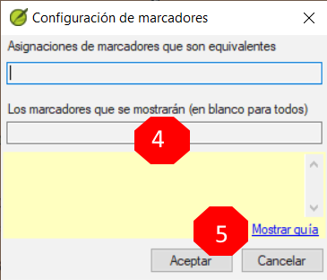
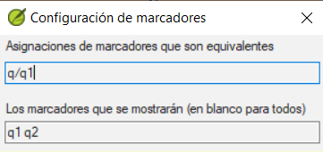

**Introduction**  In this module, you will find and correct formatting and layout errors.

**Before you start**  You have typed your draft into a project in Paratext. Utilizará la lista de verificaciones para encontrar y corregir errores relacionados con los errores de formato y diseño.

**Why this is important**  A New Testament contains more than just chapters and verses. También hay títulos, encabezamientos de sección y varios tipos de párrafos. Estas verificaciones le permitirán asegurarse de que el diseño del texto es correcta y de que los títulos, etc., son coherentes.

**What are you going to do?**  You will use the checklists to

- comparar sus títulos y encabezamientos de sección
- verifcar los saltos de párrafo
- comparar los marcadores de párrafo de su texto con los de un texto de referencia
- añadir marcadores para el formato de texto especial.

## 13.1 Utilizar las listas de verificaciones - genéricas {#ab06f030df1d407db09305cfb4731d3d}

:::caution

There are a number of checklists which differ slightly but they have the following in common:

:::

**Cómo mostrar una lista de verificación**

- **≡ Tab**, under &gt; **Tools** &gt; **Checklists** &gt; choose the desired list
- Add a comparative text (if desired) by clicking on the Texts button. **Comparative text** button
- Seleccione los versículos/libros (según sea necesario) utilizando **Seleccionar rango**

**Hacer correcciones**

- Haga clic en el enlace Editar para corregir los errores
- Haga clic en el enlace de referencia para ver más contexto

**Cerrar la lista**

- Cuando hayas terminado con la lista, ciérrala haciendo clic en la X de la esquina superior derecha de la ventana.

## 13.2 Utilizar una lista de verificación - Encabezados de sección {#3bb3fb489ec245438ee65525a4671432}

- **≡ Tab**, under &gt; **Tools** &gt; **Checklists** &gt; **Section Headings**

Verificar que

- los encabezados son coherentes con el texto de referencia (extensión, gramática, estilo)
- todos los encabezados empiezan por mayúscula
- there is no punctuation at the end
- no son demasiado largos

## 13.3 Saltos de párrafo {#4beb41c77b7b41588a954c89f01a44d6}

1. **≡ Tab**, under > **Tools** > **Checklists** > **Markers**

1. Choose your reference text as the **comparative text**

1. Click **Settings**

1. Type the paragraph makers to be displayed
(e.g. p m)

1. Click **OK**.

1. Make any corrections by clicking on the blue **Edit** link.

O

1. Haga clic en el enlace azul de **referencia del versículo**.
1. Haga las correcciones necesarias en Paratext.
1. Vuelva a la lista de verificaciones haciendo clic en el icono de la barra de tareas.

## 13.4 Diseño y sangrías {#17698276f8084544a20d3d426679de1d}

1. **≡ Tab**, under **Tools** &gt; **Checklists** &gt; **Markers**
1. Elija su texto de referencia como texto comparativo.
1. Haga clic en **Configuración**

- Teclear los marcadores que desea comparar.

- Click **OK**.

- Look for passages that have been formatted with different markers such as q1 and q2

- Make any necessary changes (see below).

## 13.5 Añadir USFM para formatear texto especial {#2fed410218164e21834d0949e5ab3c07}

- Consulte la lista de pasajes con formato especial [Apéndice A](https://manual.paratext.org/Training-Manual/Appendix/A.st).
- Añada el USFM según sea necesario (consulte el módulo KD o la ayuda si es necesario).
