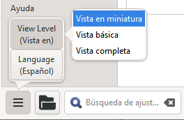

**Introducción** En este módulo aprenderá a imprimir un borrador de su traducción para comprobarlo y revisarlo.

**Antes de empezar** Ha introducido y comprobado su traducción en Paratext 9 y ahora está listo para imprimir una copia. In Paratext 9.4, your project does not need to be registered before you can print.

**¿Por qué es importante?** Es mucho más fácil revisar y comprobar su trabajo en papel que en el ordenador. También puede dárselo a más gente si está en papel.

**Lo que vas a hacer** Primero elaborará una versión en PDF de su traducción, que podrá imprimir o compartir con otras personas (incluidos los usuarios que no utilicen Paratext). Si es necesario, puede copiar el archivo PDF en su memoria USB y llevarlo a un ordenador con impresora.

:::info Actualizar Paratext 9.4

**PTXPrint** ha reemplazado a Exportar borrador a PDF. Si no está instalado, le pedirá que lo descargue e instale primero. PTXPrint es muy potente y tiene muchas opciones. Le recomendamos que utilice la Vista en miniatura. 

:::

## 14.1 Crear su primer archivo PDF {#f6c39f92a81d44aead7aa92c0f6bb317}

:::caution

Asegúrese de haber completado la **verificación de marcadoras** antes de imprimir un borrador.

:::

1. **≡ Menú de proyecto**, bajo **Proyecto** &gt; **Exportar borrador PDF** **(PTXprint)**
2. En la parte inferior izquierda, haga clic en el **botón del menú**
3. Haga clic en **Nivel de vista &gt;**  **Vista en miniatura**
4. Haga clic en **Básico** en la parte superior izquierda de la barra lateral
5. Compruebe que su proyecto está seleccionado.
6. **O bien** elija **Libro individual**, luego elija el libro y los capítulos
7. **O** Si desea imprimir su prioridad o más de un libro, elija **Porciones o varios libros** e introduzca las referencias manualmente.

### Elija la configuración de la página de la siguiente manera {#ff7614d604f1485c8c6c4de117939575}

1. Haga clic en **Diseño** en el panel lateral izquierdo. Elija la configuración de la página de la siguiente manera
2. Tamaño de la página:
    - 210 mm, 297 mm (A4) o
    - 148mm, 210mm (A5)
3. Establezca el **Tamaño de fuente base** según sea necesario (normalmente 11pt)
4. Establezca el **Línea base espacio** (el interlineado sencillo es el 120% de la fuente)
5. Desactive **Diseño de dos columnas**

### Elija el tipo de letra para el texto {#2f450c521a5a46e69f24dc8ef01b4262}

1. Haga clic en **Fuentes+Alfabetos** en la barra lateral izquierda
2. Elija el fuente para el **Cuerpo de texto (Regular)**: Charis SIL (o Charis SIL Compact)
3. Talla: 10 (u 11)

### Imprimir (Hacer PDF) {#bcd83f846ef549d2ac75fcb83c8df8e6}

1. Haga clic en el botón **Imprimir (Hacer PDF)**
2. PTXPrint creará el PDF
    - _El PDF se abre en su programa de PDF predeterminado._

### ¿Necesita más cambios? {#d80d8aac8a4a43f7a53d3502637d61c0}

:::tip

La vista miniatura sirve para probar el PDF. Si desea realizar algún cambio, puede cambiar el nivel de vista a **Vista básica**. La vista completa es muy avanzada y buena para una publicación final.

:::

1. Cambiar a vista básica
    1. En la parte inferior izquierda, haga clic en el **botón del menú**
    2. Haga clic en **Nivel de vista >**  **Vista básica**
2. Haga clic en **Diseño** en la parte superior izquierda de la barra lateral
    1. Elija los **márgenes**
    2. Haga clic en **Reflejar las páginas**
3. Haga clic en **Encabezado+Pie de página** en la barra lateral.
    1. Elija lo que desea en el **Encabezado** (el texto de la parte superior de la página).
    2. Elija lo que desea en el **Pie de página**
    3. Haga cualquier otra elección que sea necesaria.
4. Haga clic en **Imprimir (Hacer PDF)**y espere, el archivo se abrirá en su lector de PDF.

### Imprimir un folleto A5 {#4ef8b4336abd46cf8f7383fcd9ae08c2}

:::tip

Asegúrese de que ha cambiado a la vista básica

:::

En PTXPrint

1. Haga clic en **Finalizando** en la barra lateral
2. En **Paginación del folleto, páginas por vista de páginas**
3. Elija **2-up**
4. Verifique que el tamaño físico del papel es correcto.
5. Haga clic en **Imprimir (Hacer PDF)**

En su lector de PDF

1. **Archivo** &gt; **Imprimir**
2. Imprima la versión 2-up a doble cara
- Pulse el botón **Propiedades de la impresora**
    - _Aparecerá un cuadro de diálogo que puede ser diferente pero que tendrá una forma de configurar las dos lados._ Por ejemplo
    - Pulse en **Acabado**
    - Elija **dúplex** o **dos caras**.
    - Haga clic en **Aceptar**
- Pulse **Imprimir**

:::tip

Si desea seguir un sistema de puntuación (como el francés) y que se inserten espacios automáticamente antes de los signos de puntuación complejos, consulte a un consultor para que realice cambios en su PrintDraftChanges.txt

:::

## 14.3 Copie el archivo PDF en una memoria USB {#2f0e6aec647e495db41b1992e5f40094}

:::info

Paratext guarda el archivo PDF en la carpeta PrintDrafts de la carpeta de su proyecto. Por ejemplo, C:\My Paratext 9 Projects\XXX\local\ptxprint

:::

:::tip

Hay muchas formas de copiar archivos. A continuación se describe un método.

:::

1. Mantenga pulsada la tecla Windows y escriba **E**
    - _Se abre el Explorador de Windows_
2. Navegue a su carpeta **My Paratext 9 Projects**
3. Haga doble clic en la carpeta de su proyecto
4. Haga doble clic en la carpeta **local** y, a continuación, en **ptxprint**
5. Haga clic con el botón derecho en el archivo PDF deseado
6. Seleccione **Enviar a**
7. Elija su memoria USB.
