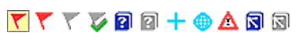

**Introducción** A medida que traduce y revisa, es posible que desee hacer comentarios sobre diversos errores o cuestiones. También puede grabar sus discusiones sobre términos clave y cuestiones ortográficas. Paratext 9 permite registrar estos comentarios en el texto, en la lista de vocablos bíblicos o en la lista de palabras.

**Antes de empezar** Está escribiendo o revisando su texto, lista de palabras o vocablos bíblicos y necesita hacer comentarios sobre un tema que ha visto.

:::caution

Las notas y las notas a pie de página son muy diferentes. Las notas a pie de página están impresas en el Nuevo Testamento, mientras que las notas son para preguntas y comentarios y no están impresas en el texto.

:::

**Lo que vas a hacer** Lo harás:

- crear más tipos de notas (sólo administrador)
- crear notas en el texto utilizando iconos diferentes
- abrir, editar, y resolver notas
- abrir una lista de notas
- filtrar la lista
- imprimir una lista de las notas

## 15.1 Diferentes tipos de notas de proyecto {#fe71e7bac96d4755bb40630bd0c2b1c0}

Puedes elegir entre muchos iconos diferentes para tus notas de proyecto en Paratext 9:

:::tip

No tengas demasiados iconos!

:::

**Un icono puede tener cuatro colores o formas diferentes**

| Descripción                                                                       | Significado                                                                                                                        |
| --------------------------------------------------------------------------------- | ---------------------------------------------------------------------------------------------------------------------------------- |
| El icono tiene un borde **** y un color de fondo amarillo ****.                   | La nota tiene al menos un comentario sin leer.                                                                                     |
| Icono **rojo, morado,** o **azul claro**.                                         | Una nota de proyecto asignada a usted, o a todo el equipo, o sin asignar.                                                          |
| El icono es **gris**.                                                             | Una nota de proyecto asignada a otra persona.                                                                                      |
| El icono es **gris** con una **marca verde**.                                     | Una nota de proyecto con estado resuelto. (No aparecerá en el texto, sino sólo en la lista de notas)                               |
| El icono es un **signo de interrogación blanco** en la **portada de un libro**.   | Hay una nota de discusión ortográfica para esta palabra. (Sólo lista de palabras.)                                                 |
| El icono es **gris** con un **signo de interrogación** en la portada de un libro. | NO existe una nota de discusión ortográfica para esta palabra. (Sólo lista de palabras.)                                           |
| El icono es un **signo más azul claro** +.                                        | Nota del consultor (de proyecto de notas del consultor).                                                                           |
| El icono es un **globo azul claro**.                                              | Nota de un consultor global.                                                                                                       |
| El icono es un **signo de exclamación negro !** dentro de un **triángulo rojo.**  | Hay un conflicto de combinación de Enviar/Recibir porque dos usuarios han hecho cambios diferentes en el mismo versículo.          |
| El icono es una **flecha blanca** sobre un **fondo azul**.                        | Existe una nota de debate sobre la interpretación de este término bíblico. (Sólo ventana o herramienta de vocablos bíblicos)       |
| El icono es **gris** con una **flecha en la portada de un libro**.                | NO existe una nota de discusión sobre la interpretación de este término bíblico. (Sólo ventana o herramienta de vocablos bíblicos) |

### **Configurar etiquetas de notas adicionales** {#04231dff267d4df992012fdcfb7f5b49}

:::caution

Uno debe ser Administrador

:::

1. **≡ Menú de proyecto**, bajo **Proyecto** &gt; **Configuración del proyecto** &gt; **Propiedades del proyecto**
2. Haga clic en la pestaña **Notas**
3. Haga clic en el botón **Agregar etiqueta**
    - _Se añade una nueva línea._
4. Haga clic en el icono de la nueva etiqueta
5. Elija el icono deseado
6. Escriba un nombre para el nuevo tipo de nota
7. Continúe para cualquier otra nota nueva.

## 15.2 Utilizar notas {#c8c21c6181cc4529a478dba32d984ba5}

**Insertar una nota de proyecto**

1. Haga clic en el texto donde desee la nota (y seleccione el texto que corresponda).

2. **≡ Menú de proyecto**, bajo **Insertar** > **Nota del proyecto**

3. Elija de la lista la etiqueta deseada para la nota

4. Escriba el texto de la nota

5. Haga clic en **Aceptar**.
    - _Aparece un icono junto al texto._

.

### **Añadir comentarios a una nota existente** {#958963568fb4491bb7fedc24d80585bb}

- Haga clic en el icono del texto
    - _Se abre la nota_.

        

- Escriba una nota
- Haga clic en **Aceptar**

### **Asignar una nota a alguien** {#9a602aedc3974606bf478a02d0e2015a}

1. Haga clic en el icono de la nota en el texto.

1. Escriba sus comentarios
2. Haga clic en **Asignar a**
3. Elija como desee
4. Haga clic en **Aceptar**

### **Aplicar notas a varios proyectos** {#6536405a9e4842f29a1f267c60b4337d}

1. Abrir la nota desde el texto
2. Pulse el botón **Múltiple**
3. Elegir los proyectos
4. Haga clic en **Aceptar**
5. Vuelva a pulsar **Aceptar** para cerrar el cuadro de diálogo.

### **Volver a colocar la nota** {#fe4f817bb1724ed6889d543fb3f4bbc8}

- Haga clic en el icono de nota en el texto para abrir la nota.

    

- Haga clic en el botón Volver a adjuntar nota (en la barra de herramientas)

- Seleccione la(s) palabra(s) a la(s) que desea adjuntarlo.
- Haga clic en **Aceptar**.
    - _La nota se adjunta a la(s) palabra(s)._

### **Resolver una nota** {#3f7599da36934413b855ecb7e595d63a}

1. Haga clic en el icono de la nota en el texto

2. Escriba otro comentario si es necesario.

3. Haga clic el botón **Resolver** 

4. Haga clic en **Aceptar**

.

### **Borrar notas** {#2f83955761a8491fb260cae2b8a7515e}

1. Haga clic en el icono de nota

2. Haga clic en la papelera pequeña

3. Haga clic en **Sí** para eliminar permanentemente su comentario.

4. Si hay más comentarios, continúe para borrar el siguiente comentario.

.

:::tip

Sólo puedes borrar tus propios comentarios si son los últimos de la lista.

:::

## 15.3 Abrir una lista de notas {#c87dc9e1b95e46919469ec3681242fb0}

Al repasar las notas, suele ser útil verlas en una lista.

1. ≡ **Menú de proyecto**, bajo **Herramientas** &gt; **Lista de notas**
2. Elegir tus proyectos.
3. Haga clic en **Aceptar**.
    - _Se abre una ventana con la lista de notas (véase más abajo)._
4. Ajuste los filtros según sea necesario.

    :::tip

    Si la ventana está en blanco, cambie los filtros utilizando los botones de filtro de la barra de herramientas (véase más abajo).

:::

### **Barra de herramientas de la ventana Notas** {#16ec056e5f1a44c18f715698dcfd0baa}

En la barra de herramientas hay cuatro cuadros desplegables

1. Filtro para notas
2. Filtro de versículos
3. Buscar
4. Ordenar por [versículo, fecha, asignado a]

### **Filtro de la lista de notas** {#58384e92b3154b6d87c93ea6b7fc5073}

- Haga clic en el primer botón/lista
- Elija un filtro existente según corresponda

### **Definir un nuevo filtro** {#ae915757c45d40c79820d8588c7173c9}

- Haga clic en el primer botón/lista

- Elija **Nuevo filtro**

- Elija el estado, la etiqueta, la persona y la fecha que desee.

- Haga clic en **Aceptar**

### **Guardar un filtro** {#c943f2ad210e4b65b07b60a324e4331b}

1. Defina el filtro según sea necesario.

2. Haga clic en el cuadro de texto de la parte superior izquierda (1).

3. Escriba un nombre para el filtro

4. Haga clic en el icono de guardar (2).

## 15.4 Añade comentarios en la ventana de notas {#229174addf7e4280a3da1b08d9b11d7c}

- Haga clic en la flecha para ampliar la nota
    - _La nota se abre_

- Escriba sus comentarios en el cuadro de texto.

    

- Resuelva o asigne la nota según sea necesario.
- Haga clic en la flecha para contraer la nota.

:::tip

También puede hacer clic en el enlace **Abrir** para abrir la ventana de la nota.

:::

## 15.5 Imprimir un informe de notas {#a6ef1b8b74ec4e569f5211f8384d8c8e}

1. Haga clic en una ventana de notas.
2. Filtre la lista como desee.
3. ≡ **Menú de proyecto**, bajo **Proyecto** &gt; **Imprimir**
4. Elija la impresora y las opciones que desee.
5. Haga clic en **Aceptar**.
6. Cierra la ventana.
