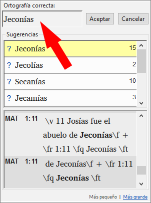
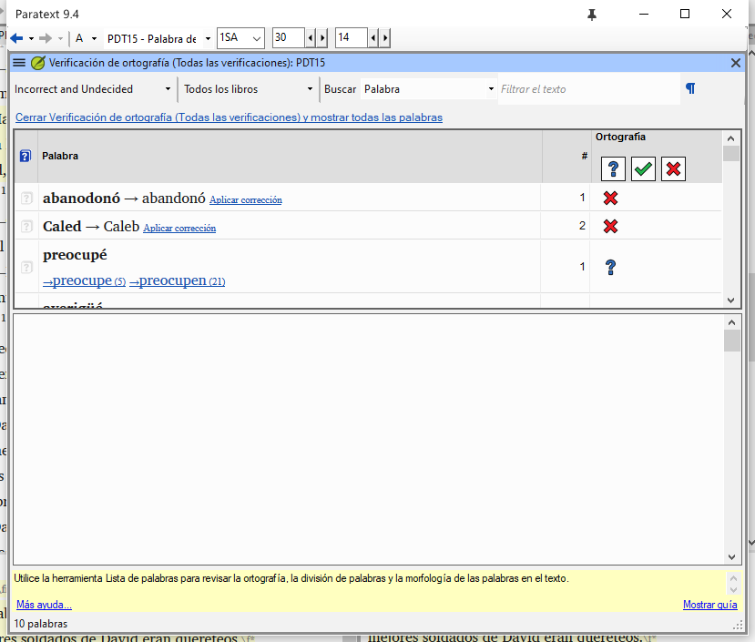
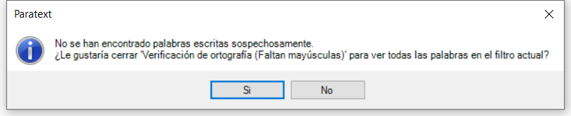
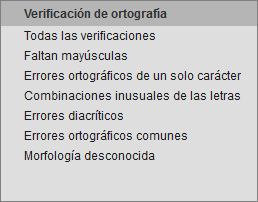
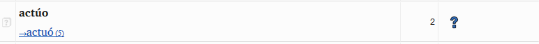
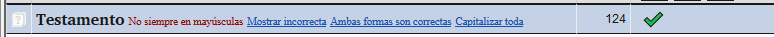
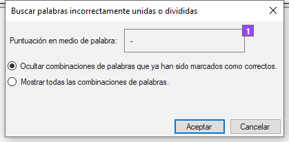
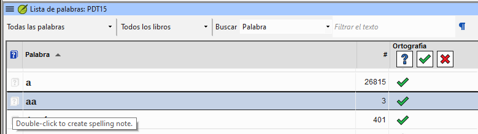

**Introduction**  This module explains how to check for spelling mistakes in the text you have typed into your project in Paratext 9.

**Before you start**  You have typed your text in Paratext 9 and have done some checks, but there may still be spelling mistakes.

**Why is this important?**  It is important to correct any spelling mistakes so that your text will communicate clearly.

**What you are going to do**  Configure the wordlist to build up a base of correct words.

- Revisa el texto con líneas rojas garabateadas que muestran las palabras que Paratext no sabe si son correctas.
- Revisa la lista de palabras, corrigiendo los errores o indicando a Paratext 9 que las palabras son correctas.
- Use a variety of checks from the wordlist.
- Añade una nota de discusión ortográfica a las palabras que necesiten más discusión antes de decidir la ortografía correcta.

## 8.1 Configurar la lista de palabras {#7490cb4639dc4f2d9eb8ac343d7e79c2}

:::tip

Antes de comprobar la ortografía, es importante tener una base de palabras que se sepa que son correctas. Podemos hacer tres cosas:

:::

### Aprobar la ortografía de las palabras comunes {#c86b35e4794640e980a0796316c04f29}

En Paratext

- **≡ Tab**, under **Tools** &gt; **Wordlist**

En la lista de palabras

1. **≡ Tab**, under **Tools** &gt; **Approve spelling of common words**
2. Introduce un número

    :::tip

    El número es el número de veces que debe aparecer la palabra para que se marque automáticamente como escrita correctamente. El valor predeterminado es 100, pero puede elegir más (si tiene dudas sobre el texto) o menos (si confía en la precisión del mecanógrafo).

:::

3. Haga clic en **Aceptar**
4. Haga clic en **Sí** (para confirmar que no puede deshacer y desa continuar)

### Comprueba las palabras que Paratext considera incorrectas {#bf5578928c41416f955b0ffa478e72af}

- Asegúrese de que está en la Lista de palabras.
    - _If you are back in Paratext Window, go to the Wordlist (__**≡ Tab**_ _under_ _**Tools**_ _>_ _**Wordlist****)*
- **≡ Tab**, under **Tools** &gt; **Spell Check &gt; All checks**
    - _Aparece una lista de palabras._

- Click on a word in the top pane.
    1. If the word is **correct** – click on the green icon at the top of the column
    2. If the word is **incorrect**, but Paratext 9 has **suggested** the correct word, then click the **blue link** for the correct word.
    3. If the word is **incorrect**, and Paratext 9 **hasn’t suggested** the correct word, click on the red checkbox and correct the word. (See 8.1)

### Comprobar palabras con ortografía similar {#1fdc348be8334ff6841f08689c4aaae5}

En la lista de palabras

1. **≡ Tab**, under **Tools** &gt; **Find Similar Words**
2. Introduzca letras que suenen igual separadas por / (p. ej. s/sh/z)

    :::tip

    Dependiendo de su idioma, marque o desmarque "Ignorar todos los diacríticos al comparar palabras".

:::

 3.  Haga clic en **Aceptar**

    - _Aparece una lista de palabras._

 4.  Corrija las palabras (como se ha descrito anteriormente).

## 8.2 Verificación ortográfica - a partir del texto {#66602cff1c654a81ae88a1f8b7e7842f}

En Paratext

- **≡ Tab**, under **View** &gt; **Display spelling**

:::tip

Al principio se muestra un medidor de progreso y, a continuación, las palabras desconocidas o incorrectas tienen líneas rojas debajo.

:::

### Hacer correcciones {#a468ce2f5f594dcbbd8446fd4225814b}

:::tip

Paratext 9 subrayará en rojo las palabras que no hayan sido aprobadas en la lista de palabras. Esto significa que la palabra está mal escrita o es desconocida.

:::

1. Right-click a word which is underlined in either red or grey
    - _A dialogue is displayed_

2. Either type the correction in the box or select the correct word from the list

3. Click **OK**

:::tip

Siempre que sea posible, es mejor utilizar la verificación ortográfica incluso cuando se realicen correcciones menores, ya que Paratext 9 recordará la corrección y podrá aplicarla si vuelve a ocurrir.

:::

When there is more than one correction, a dialog box is displayed.

Choose as appropriate:

- **Sí** = cambia este versículo y busca el siguiente
- **No** = se salta este versículo y busca el siguiente
- Sí a todo - **es peligroso**, utilizar con precaución
- **Cancelar** = detiene los cambios

## 8.3 Verificación ortográfica - libro actual {#8e6b30ac29584b0a89ef0fee37d20f8f}

1. **≡ Tab**, under **Tools** > **Spell Check Current Book**
    - _A window appears with a list of some words in the current book._

2. Make corrections as explained above [8.2](/8.SP#66602cff1c654a81ae88a1f8b7e7842f)

3. Click **More items available** to see additional words.

4. Continúe según sea necesario.

## 8.4 Verificación ortográfica - a partir de la lista de palabras {#5de76f0b6fe1460ea6c8a341b2fff194}

### Utilización de las verificaciones {#a440e07d85cf494eb7a3263ba280aa60}

En la lista de palabras

1. **≡ Tab**, under **Tools**> **Spell check >**

2. Choose the desired check (see descriptions below)
    - _A list of words is displayed_.

3. Haga las correcciones necesarias.

4. Click **More items available** to see more words.

5. Continúe según sea necesario.

6. When the list is finished, a message is displayed

    

7. Click **Yes**.

### Todas las verificaciones {#039b8b6f676f4a8fbe3e75ec8918ecb6}

Esto ejecuta todas las verificaciones. Esto es muy útil ya que encontrará todo tipo de errores, especialmente palabras con múltiples tipos de errores.

### Faltan mayúsculas {#cfe2c818fa2249c0bcb5d219ae76e8eb}

1. Se muestra una lista de palabras que tienen formas en mayúscula pero que no siempre están en mayúscula (es decir, se utilizan ambas formas). La lista muestra la palabra con minúscula y, a continuación, la forma con mayúscula inicial, que tiene un enlace azul con la palabra

    

2. Haga clic en el enlace azul del formulario en mayúsculas

    

3. Haga clic en el enlace azul correspondiente.
4. _Mostrar_ incorrecto (para ver los versículos)
5. _Las dos formas son aceptables_ (para aceptar ambas formas)
6. _Capitalizar Todo_ (para corregir todas las palabras)

### Errores ortográficos de un solo carácter {#92974e1cd65443aeb4191d34b42a0468}

Se muestra una lista de palabras con enlaces a otras que son similares pero sólo tienen una letra diferente.

### Combinaciones inusuales de las letras {#d8cc2055dd494b7ab955c85deb277795}

Se muestra una lista de palabras que tienen combinaciones inusuales de letras (como grupos de consonantes o vocales…).

### Errores diacríticos {#a802e37a792c4d63b2eb3c041d251e7d}

Aparece una lista de palabras con enlaces a otras que son iguales salvo por los diacríticos.

### Errores ortográficos comunes {#718eac9af3e8429da63cb91677bc90fd}

Se muestra una lista de palabras con el mismo tipo de problema que ya se han corregido en otras palabras. Por ejemplo, si ya has corregido "teh" como "the", y encuentra "tehm" te sugerirá "them".

### Morfología desconocida {#bfac7ce2ba6a48449f1af20604181ae6}

Se muestra una lista de palabras cuya morfología el ordenador no ha podido conjeturar basándose en otras palabras.

### Buscar palabras incorrectamente unidas o divididas {#2f1d11a1518a454d8cc4d33c9c70ef3f}

En Paratext (**≡ Menú de proyecto**, en **Herramientas** - Lista de palabras)

- **≡ Tab**, under **Tools**&gt; **Find Incorrectly Joined or Split Words**

    

- Se abre una ventana de opciones. Cambie según sea necesario
- Haga clic en **Aceptar**
    - _A list of words is displayed with similar words grouped together._

        

### Corregir una palabra mal marcada {#db3081f9aaa14b6299225b8af9fb3be0}

1. Buscar la palabra en la lista (utilizando el filtro si es necesario)
2. Haga clic en la línea para ver la palabra en su contexto
3. Haga clic en el estado ortográfico correcto.

## 8.5 Notas de discusión de ortografía {#0fc290656fb540eda14989e1ad48876b}

:::tip

Si no ha tomado una decisión definitiva sobre la ortografía, puede añadir una nota de discusión ortográfica.

:::

1. Haga doble clic en el icono de la nota (en la primera columna)

    

2. Escriba la nota
3. Asigna la nota según sea necesario y haga clic en **Aceptar**.
