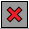
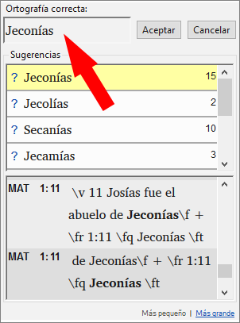
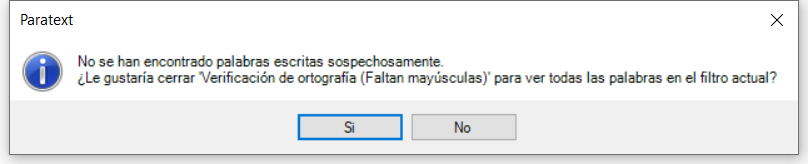
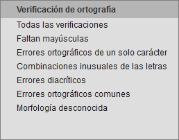
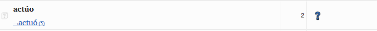
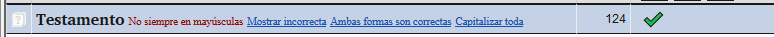
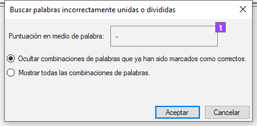
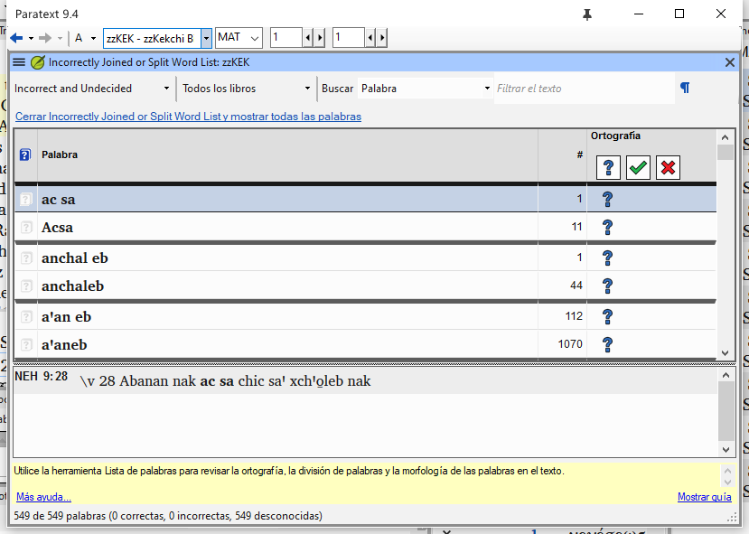
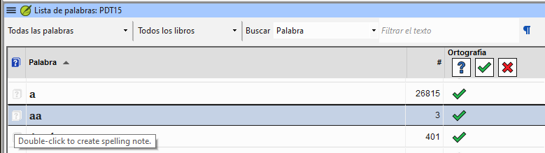

**Introducción** Este módulo explica cómo comprobar los errores ortográficos en el texto que ha escrito en su proyecto en Paratext 9.

**Antes de empezar** Ha escrito tu texto en Paratext 9 y ha hecho algunas verificaciones, pero aún puede haber errores ortográficos.

**¿Por qué es importante?** Es importante corregir las faltas de ortografía para que el texto comunique con claridad.

**Lo que va a hacer**  Configurar la lista de palabras para crear una base de palabras correctas.

- Revisa el texto con líneas rojas garabateadas que muestran las palabras que Paratext no sabe si son correctas.
- Revisa la lista de palabras, corrigiendo los errores o indicando a Paratext 9 que las palabras son correctas.
- Utiliza varias verificaciones de la lista de palabras.
- Añade una nota de discusión ortográfica a las palabras que necesiten más discusión antes de decidir la ortografía correcta.

## 8.1 Configurar la lista de palabras {#7490cb4639dc4f2d9eb8ac343d7e79c2}

:::tip

Antes de comprobar la ortografía, es importante tener una base de palabras que se sepa que son correctas. Podemos hacer tres cosas:

:::

### Aprobar la ortografía de las palabras comunes {#c86b35e4794640e980a0796316c04f29}

En Paratext

- **≡ Menú de proyecto**, bajo **Herramientas** &gt; **Lista de palabras**

En la lista de palabras

1. **≡ Pestaña**, bajo **Herramientas** &gt; **Aprobar ortografía de las palabras comunes**
2. Introduce un número

    :::tip

    El número es el número de veces que debe aparecer la palabra para que se marque automáticamente como escrita correctamente. El valor predeterminado es 100, pero puede elegir más (si tiene dudas sobre el texto) o menos (si confía en la precisión del mecanógrafo).

:::

3. Haga clic en **Aceptar**
4. Haga clic en **Sí** (para confirmar que no puede deshacer y desa continuar)

### Comprueba las palabras que Paratext considera incorrectas {#bf5578928c41416f955b0ffa478e72af}

- Asegúrese de que está en la Lista de palabras.
    - _Si vuelve a la ventana Paratext, vaya a la lista de palabras (__**≡ Menú de proyecto**_ _bajo_ _**Herramientas**_ _>_ _**Lista de palabras****)*
- **≡ Pestaña**, bajo **Herramientas** &gt; **Verificación de ortografía &gt; Todas las verificaciones**
    - _Aparece una lista de palabras._

- Haga clic en una palabra del panel superior.
    1. Si la palabra es **correcta** - haga clic en el icono verde de la parte superior de la columna
    2. Si la palabra es **incorrecta**, pero Paratext 9 ha **sugerido** la palabra correcta, entonces haga clic en el **enlace azul** para la palabra correcta.
    3. Si la palabra es **incorrecta**, y Paratext 9 **no ha sugerido** la palabra correcta, haga clic en la casilla roja y corrija la palabra. (Véase 8.1)

### Comprobar palabras con ortografía similar {#1fdc348be8334ff6841f08689c4aaae5}

En la lista de palabras

1. **≡ Pestaña**, en **Herramientas** &gt; **Buscar palabras similares**
2. Introduzca letras que suenen igual separadas por / (p. ej. s/sh/z)

    :::tip

    Dependiendo de su idioma, marque o desmarque "Ignorar todos los diacríticos al comparar palabras".

:::

3. Haga clic en **Aceptar**
    - _Aparece una lista de palabras._
4. Corrija las palabras (como se ha descrito anteriormente).

## 8.2 Verificación ortográfica - a partir del texto {#66602cff1c654a81ae88a1f8b7e7842f}

En Paratext

- **≡ Menú de proyecto**, bajo **Ver** &gt; **Mostrar errores ortográficos**

:::tip

Al principio se muestra un medidor de progreso y, a continuación, las palabras desconocidas o incorrectas tienen líneas rojas debajo.

:::

### Hacer correcciones {#a468ce2f5f594dcbbd8446fd4225814b}

:::tip

Paratext 9 subrayará en rojo las palabras que no hayan sido aprobadas en la lista de palabras. Esto significa que la palabra está mal escrita o es desconocida.

:::

1. 1. Haga clic con el botón derecho del ratón en una palabra subrayada en rojo o en gris
    - _Se abre un diálogo_

2. Escriba la corrección en la casilla o seleccione la palabra correcta de la lista

3. Haga clic en **Aceptar**

:::tip

Siempre que sea posible, es mejor utilizar la verificación ortográfica incluso cuando se realicen correcciones menores, ya que Paratext 9 recordará la corrección y podrá aplicarla si vuelve a ocurrir.

:::

Cuando hay más de una corrección, aparece un cuadro de diálogo.

Elija lo que considere apropiado:

- **Sí** = cambia este versículo y busca el siguiente
- **No** = se salta este versículo y busca el siguiente
- Sí a todo - **es peligroso**, utilizar con precaución
- **Cancelar** = detiene los cambios

## 8.3 Verificación ortográfica - libro actual {#8e6b30ac29584b0a89ef0fee37d20f8f}

1. **≡ Menú de proyecto**, bajo **Herramientas** > **Verificar ortografía del libro actual**
    - _Aparece una ventana con una lista de algunas palabras del libro actual._

2. Realice las correcciones como se ha explicado anteriormente [8.2](/8.SP#66602cff1c654a81ae88a1f8b7e7842f)

3. Haga clic en **Más palabras disponibles** para ver palabras adicionales.

4. Continúe según sea necesario.

## 8.4 Verificación ortográfica - a partir de la lista de palabras {#5de76f0b6fe1460ea6c8a341b2fff194}

### Utilización de las verificaciones {#a440e07d85cf494eb7a3263ba280aa60}

En la lista de palabras

1. **≡Pestaña**, bajo **Herramientas** > **Verificación de ortografía >**

2. Elija la verificación deseada (ver descripciones más abajo)
    - _Se muestra una lista de palabras_.

3. Haga las correcciones necesarias.

4. Haga clic en **Más palabras disponibles** para ver más palabras.

5. Continúe según sea necesario.

6. Cuando finaliza la lista, se muestra un mensaje

    

7. Haga clic en **Sí**.

### Todas las verificaciones {#039b8b6f676f4a8fbe3e75ec8918ecb6}

Esto ejecuta todas las verificaciones. Esto es muy útil ya que encontrará todo tipo de errores, especialmente palabras con múltiples tipos de errores.

### Faltan mayúsculas {#cfe2c818fa2249c0bcb5d219ae76e8eb}

1. Se muestra una lista de palabras que tienen formas en mayúscula pero que no siempre están en mayúscula (es decir, se utilizan ambas formas). La lista muestra la palabra con minúscula y, a continuación, la forma con mayúscula inicial, que tiene un enlace azul con la palabra

    

2. Haga clic en el enlace azul del formulario en mayúsculas

    

3. Haga clic en el enlace azul correspondiente.
4. _Mostrar_ incorrecto (para ver los versículos)
5. _Las dos formas son aceptables_ (para aceptar ambas formas)
6. _Capitalizar Todo_ (para corregir todas las palabras)

### Errores ortográficos de un solo carácter {#92974e1cd65443aeb4191d34b42a0468}

Se muestra una lista de palabras con enlaces a otras que son similares pero sólo tienen una letra diferente.

### Combinaciones inusuales de las letras {#d8cc2055dd494b7ab955c85deb277795}

Se muestra una lista de palabras que tienen combinaciones inusuales de letras (como grupos de consonantes o vocales…).

### Errores diacríticos {#a802e37a792c4d63b2eb3c041d251e7d}

Aparece una lista de palabras con enlaces a otras que son iguales salvo por los diacríticos.

### Errores ortográficos comunes {#718eac9af3e8429da63cb91677bc90fd}

Se muestra una lista de palabras con el mismo tipo de problema que ya se han corregido en otras palabras. Por ejemplo, si ya has corregido 'teh' como 'the', y encuentra 'tehm' te sugerirá 'them'.

### Morfología desconocida {#bfac7ce2ba6a48449f1af20604181ae6}

Se muestra una lista de palabras cuya morfología el ordenador no ha podido conjeturar basándose en otras palabras.

### Buscar palabras incorrectamente unidas o divididas {#2f1d11a1518a454d8cc4d33c9c70ef3f}

En Paratext (**≡ Menú de proyecto**, en **Herramientas** - Lista de palabras)

- **≡ Pestaña**, bajo **Herramientas** &gt; **Buscar palabras incorrectamente unidas o divididas**

    

- Escriba cualquier signo de puntuación que pueda estar en medio de una palabra, por ejemplo - '
- Haga clic en **Aceptar**
    - _Se muestra una lista de palabras con palabras similares agrupadas._

        

### Corregir una palabra mal marcada {#db3081f9aaa14b6299225b8af9fb3be0}

1. Buscar la palabra en la lista (utilizando el filtro si es necesario)
2. Haga clic en la línea para ver la palabra en su contexto
3. Haga clic en el estado ortográfico correcto.

## 8.5 Notas de discusión de ortografía {#0fc290656fb540eda14989e1ad48876b}

:::tip

Si no ha tomado una decisión definitiva sobre la ortografía, puede añadir una nota de discusión ortográfica.

:::

1. Haga doble clic en el icono de la nota (en la primera columna)

    

2. Escriba la nota
3. Asigna la nota según sea necesario y haga clic en **Aceptar**.
