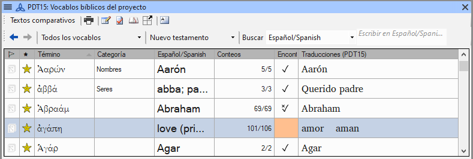
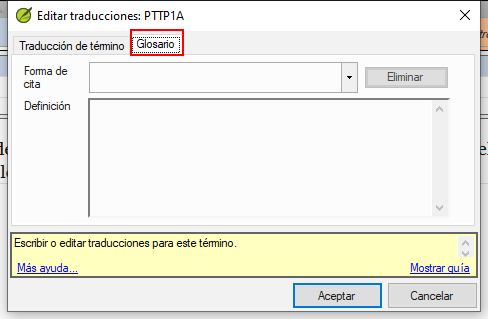
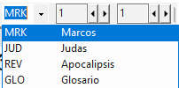

**Introduction**  This module explains how to add entries to the glossary using the **Biblical terms** tool.

**Before you start**  You have drafted and entered your text in Paratext 9. Ahora añadirá algunas entradas en el glosario para explicar algunos términos.

**Why this is important**  It is good to have a list of important words and their explanations so that the readers can understand the text well. En lugar de escribir directamente en el glosario, es mejor utilizar la herramienta **Vocablos bíblicos**, ya que mantiene el Glosario en orden alfabético. La herramienta también realiza un seguimiento de los cambios introducidos en el glosario.

**What you are going to do**  You will use the Biblical terms tool to add a rendering for the term and then use the glossary tab to enter the citation form and the definition.

There are four training videos available on [adding](https://vimeo.com/manage/videos/451195974), [linking](https://vimeo.com/manage/videos/499553868) and [editing](https://vimeo.com/manage/videos/503489533) and getting [permission to edit](https://vimeo.com/manage/videos/476293601) glossaries. (P9 1A.4a-d).

## 9.1 Abrir la herramienta vocablos bíblicos {#137d8af8c8314fdba16891790c49c178}

1. Within Paratext, move to a verse which contains the word(s) you want to add to the glossary.
1. Right-click and choose **View Biblical Terms**, then **Current Verse(s)**
1. Check that you have the correct list open (e.g. your project list or the NT Key Biblical Terms [SIL])

    

1. To change the list, from the **≡ Tab**, under **Biblical terms** menu choose **Select biblical terms list.**

:::info

If the Biblical Term is not on either list, ask your Administrator to add the Biblical term to your project list.

:::

## 9.2 Añadir una entrada {#99fd9ee0be454494b0e01a773eee6f96}

1. Double-click on the term in the list in the top pane

1. Click the **Glossary** tab

1. Type the citation form of the term (i.e. the way you want it in the glossary) [1]

1. Type the Definition [2]

1. Click **OK**

## 9.3 Link an existing entry {#b9f4ff025225434cbba15665f0894328}

:::tip

If the word is already in the glossary, you can link a biblical term to the existing entry in the glossary. Later in stage 6 you will link the biblical term to the text to add the * in the printed text or the link in the electronic app.

:::

### Find the Biblical term {#120bd663b5ff4b7a840f4ef3c26b06d8}

1. From the **Biblical Terms** tool
1. Check that you have the correct list open (e.g. your project list or the NT Key Biblical Terms [SIL])
1. Double-click on the word in the list in the top pane

### Link to glossary entry {#dd6a347260a34a9ab7c52f8b91f9b165}

1. Click the **Glossary** tab
1. Click the down arrow near the citation form [1]
1. Choose the entry from the glossary
1. Click **OK**

## 9.4 View the glossary {#ebf2c2a15ff946199b5764dfe7af56a8}

In Paratext

1. Use the navigation bar to change the book

1. Choose the **GLO** book

## 9.5 Edit an entry – in the GLO book {#059626f045a34c24bcdd466553c8e18a}

In Paratext

:::tip

It is recommended to use the Biblical Terms tool to work on glossary entries. However, it can be useful to edit the definitions from the GLO book.

:::

1. Open the **GLO** book
1. Edit the text as normal.

## 9.6 Edit an entry – in the Biblical Terms {#b1ea5eaaee78499bbffe70a892a4ce81}

1. **≡ Tab**, under **Tools** &gt; **Biblical terms…**
1. Double-click on the word in the list in the top pane.
1. Click the **Glossary** tab
1. Edit the definition
1. Click **OK**.

:::info PARATEXT 9.3
You can now edit the citation form in this tab without breaking the link to the entry.
:::

## 9.7 Add a Biblical Term {#717471a3fbf3477fbab8e730af1b1ad7}

- see the section [**10.7 Add a term – from reference text search**](https://manual.paratext.org/Training-Manual/Stage-1/BT#107-add-a-term--from-reference-text-search)

## 9.8 Recall {#2843edbecf5e4950944e24a78538bc99}

- You can open the Biblical Terms tool from the _**__**_ menu.
- The **Glossary** tab is on the _____ dialogue. To open this dialogue you ___-click on the term in the ____ pane.
- To view the glossary, you change to the _____ book (after Revelation).

:::info

[Answers: right-click, Edit Rendering, double, top, GLO]

:::

