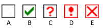

**Introduction**  In preparing for a consultant check, the consultant will need one or more versions of your text in a language they understand. A menudo se denomina retrotraducción. Existen dos tipos de retrotraducciones. Este módulo explica cómo realizar una retrotraducción gratuita y mantenerla actualizada. El siguiente módulo explica cómo realizar una retrotraducción palabra por palabra utilizando el interlinealizador del proyecto.

**Before you start**  You have typed, checked and revised your translation in Paratext and are now preparing for a consultant check. Before you can start, your Administrator must have created a separate project for your back translation.

**Why is this important?**  Your text needs to be checked by a consultant. Pero como el consultor no conoce su idioma, tiene que traducir su texto a un idioma que pueda entender. De ahí viene el término "retrotraducción". El consultor utilizará esta traducción para ayudar a su equipo a mejorar sus opciones exegéticas en el texto.

Es preferible que lo haga alguien que no haya participado en su traducción. Así tecleará lo que dice el texto y no lo que usted quiso decir. Esto también debe hacerse sin mirar ninguna ayuda u otras Biblias.

**¿Qué vas a hacer?**

- Abra su proyecto y proyecto de retrotraducción
- Disponga el texto en la pantalla.
- Redacte su retrotraducción
- Marque el estado como finalizado cuando complete un capítulo.
- Compruebe que su texto está actualizado (o sincronizado), visualice cualquier diferencia pasando al siguiente cambio si procede.

## 16.1 Cree un nuevo proyecto para la retrotraducción {#44530c9822fc4c2d9677cc06c747491c}

:::caution

El proyecto es creado una vez por un administrador. If a projects exists see 16.2 below.

:::

- **≡ Paratext** under **Paratext** &gt; **New Project**

### **Introduzca los nombres para el proyecto** {#c929f129f8d848d890d32d1ed85ed86a}

- Haga clic en **Editar**
- Escriba un nombre completo para el proyecto y un nombre corto
- Click **OK**

### **Choose the settings** **of the project** {#2db659565b714589be113884683c1f1f}

1. Elija el idioma para su retrotraducción (por ejemplo, español)
1. Deje la versificación
1. Para el Tipo de proyecto elija **Retrotraducción**
1. Para **Basado en:** elija su proyecto
    - _Si es necesario, Paratext cambiará la versificación para adaptarla a su proyecto._
1. Click **OK**
    - _El nuevo proyecto se abre con enlaces a Crear libro(s) o Importar libro(s_).

:::info

Este proyecto no necesita ser registrado, ya que hereda el registro de su proyecto.

:::

### **Crear libros** {#53659e0ab6c34a939d0e69dcdfd786e4}

- Pulse el enlace **Crear libro(s** )
- Cree libros según sea necesario.

:::caution

Utilice la opción **Crear en base a** [su proyecto] para que todos los marcadores se añadan de forma que coincidan con su proyecto.

:::

## 16.2 Redacte su retrotraducción {#e6cb21ddb31146938d0576ea7f4f3b06}

1. Abra su proyecto
1. Abra su proyecto de retrotraducción
1. Disponga las ventanas de forma que pueda ver fácilmente ambas ventanas.
1. Haga clic en la ventana de retrotraducción, (el versículo de su proyecto aparece resaltado).
1. Type your back translation into each verse (after the check box).
1. Continúe con cada versículo del capítulo.

## 16.3 Marque el capítulo como terminado {#a1bc8a251f9148009ea57dd4fbd96e44}

Cuando haya terminado el capítulo

- En la barra de herramientas situada en la parte superior de la ventana de traducción inversa, haga clic en la flecha situada junto a la marca de verificación.

    

- Elija **Marcar todos los versículos del capítulo como terminados**.
    - _All the check boxes for the chapter are marked with green checks._

## 16.4 Cuando se realiza un cambio en su proyecto {#0f230b5f95404967a3537e86379eaf33}

Paratext will detect any saved changes to your text and will change the back translation checkbox to a red question mark and add issues to the back translation status in Assignments and Progress.

1. Click in a verse with the red question mark.
1. Review and correct the back translation.
    - _If the changes are not clear, see the “View the differences for outdate verses” below._
1. When it is correct, click the red question mark
    - _It changes to a green check mark_

### **View the differences for outdated verses** {#fe5fdc6b632b4f3cbafe2f390961a391}

- Click on the  icon on the toolbar to see the differences.

### **Move to the next differences** {#b59e604df6cc42b7b68abda3173fde99}

- Click on the up and down arrows to move to the previous or next differences.

    

## 16.5 Check your **Assignments and Progress** {#860fd280ce5d4bb2bed1d1e4fb5d878c}

- Click the Assignments and Progress icon

- Expand Stage 3, the back translation checks are at the end
    - _The number of unapproved or changed verses (if any) are listed as_ _issues_

        

### 16.6 Back translation verse check in Assignments and Progress {#e861e8ecf8a142e99d31c5630c1f21a4}

- Click on the issues link
    - _A result list window lists any errors._
    - _And the back translation window is also displayed with the cursor in the first verse with problems._
- Correct the problem and move to the next outdated verse by clicking on the arrows on the toolbar.

### 16.7 Back translation status complete in Assignments and Progress {#631313ddd7ac4707adba5762ef16b842}

- The back translation status is complete when there are no issues.

### 16.8 Learning task {#639f58c0e08342e390afddee7236d11f}

The checkboxes in a back translation can have a number of different symbols.

| 1 | Inconsistent verse number |
| - | ------------------------- |
| 2 | No text/verse             |
| 3 | Not finished              |
| 4 | Finished                  |
| 5 | Out of date               |

:::note

[Answers: A3, B4, C5, D1, E2]

:::

