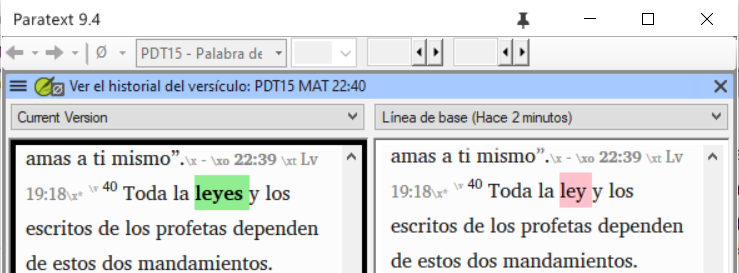

**Introducción** Para preparar por una revisión por parte de un consultor, el consultor necesitará una o varias versiones de su texto en un idioma que comprenda. A menudo se denomina retrotraducción. Existen dos tipos de retrotraducciones. Este módulo explica cómo realizar una retrotraducción gratuita y mantenerla actualizada. El siguiente módulo explica cómo realizar una retrotraducción palabra por palabra utilizando el interlinealizador del proyecto.

**Antes de empezar** Ha mecanografiado, comprobado y revisado su traducción en Paratext y ahora se prepara para la revisión de un consultor. Antes de poder empezar, su administrador deberá haber creado un proyecto independiente para su retrotraducción.

**¿Por qué es importante?** Su texto debe ser revisado por un consultor. Pero como el consultor no conoce su idioma, tiene que traducir su texto a un idioma que pueda entender. De ahí viene el término "retrotraducción". El consultor utilizará esta traducción para ayudar a su equipo a mejorar sus opciones exegéticas en el texto.

Es preferible que alguien no directamente involucrado en su traducción la revise. Así tecleará lo que dice el texto y no lo que usted quiso decir. No deben mirar ninguna ayuda ni otras Biblias.

**¿Qué vas a hacer?**

- Abra su proyecto y proyecto de retrotraducción
- Disponga el texto en la pantalla.
- Redacte su retrotraducción
- Marque el estado como finalizado cuando complete un capítulo.
- Compruebe que su texto está actualizado (o sincronizado), visualice cualquier diferencia pasando al siguiente cambio si procede.

:::info Actualización

Su proyecto es el proyecto base de su proyecto de retrotraducción. En 9.4, ahora puede abrir su proyecto desde la retrotraducción (**≡ Proyecto** elija **Abrir proyecto base …**).

:::

## 16.1 Cree un nuevo proyecto para la retrotraducción {#44530c9822fc4c2d9677cc06c747491c}

:::caution

El proyecto es creado una vez por un administrador. Si existe un proyecto, véase [16.2](/16.BT1#e6cb21ddb31146938d0576ea7f4f3b06) más abajo.

:::

- **≡ Paratext** bajo **Paratext** &gt; **Nuevo proyecto**

### **Introduzca los nombres para el proyecto** {#c929f129f8d848d890d32d1ed85ed86a}

- Haga clic en **Editar**
- Escriba un nombre completo para el proyecto y un nombre corto
- Haga clic en **Aceptar**

### **Elija la configuración** **del proyecto** {#2db659565b714589be113884683c1f1f}

1. Elija el idioma para su retrotraducción (por ejemplo, español)
2. Deje la versificación
3. Para el Tipo de proyecto elija **Retrotraducción**
4. Para **Basado en:** elija su proyecto
    - _Si es necesario, Paratext cambiará la versificación para adaptarla a su proyecto._
5. Haga clic en **Aceptar**
    - _El nuevo proyecto se abre con enlaces a Crear libro(s) o Importar libro(s_).

:::info

Este proyecto no necesita ser registrado, ya que hereda el registro de su proyecto.

:::

### **Crear libros** {#53659e0ab6c34a939d0e69dcdfd786e4}

- Pulse el enlace **Crear libro(s)**
- Cree libros según sea necesario.

:::caution

Utilice la opción **Crear basado en** [su proyecto]. para que todos los marcadores se añadan para que coincidan con su proyecto.

:::

## 16.2 Redacte su retrotraducción {#e6cb21ddb31146938d0576ea7f4f3b06}

1. Abra su proyecto
2. Abra su proyecto de retrotraducción
3. Disponga las ventanas de forma que pueda ver fácilmente ambas ventanas.
4. Haga clic en la ventana de retrotraducción, (el versículo de su proyecto aparece resaltado).
5. Escriba su retrotraducción en cada versículo (después de la casilla de verificación).
6. Continúe con cada versículo del capítulo.

## 16.3 Marque el capítulo como terminado {#a1bc8a251f9148009ea57dd4fbd96e44}

Cuando haya terminado el capítulo

- En la barra de herramientas situada en la parte superior de la ventana de traducción inversa, haga clic en la flecha situada junto a la marca de verificación.

    

- Elija **Marcar todos los versículos del capítulo como terminados**.
    - _Todas las casillas de verificación del capítulo están marcadas con un check verde._

## 16.4 Cuando realice un cambio en su proyecto {#0f230b5f95404967a3537e86379eaf33}

Paratext detectará cualquier cambio guardado en su texto y cambiará la casilla de verificación de retrotraducción por un signo de interrogación rojo y añadirá problemas al estado de retrotraducción en Asignaciones y Progreso.

1. Haga clic en un versículo con el signo de interrogación rojo.
2. Revise y corrija la retrotraducción.
    - _Si los cambios no son claros, consulte la sección "Ver las diferencias de los versículos desfasados" más abajo._
3. Cuando sea correcto, haga clic en el signo de interrogación rojo
    - _Cambia a una marca de verificación verde_

    :::info

    Los proyectos derivados pueden abrir el proyecto base.

:::

### **Ver las diferencias de los versículos obsoletos** {#fe5fdc6b632b4f3cbafe2f390961a391}

- Haga clic en el icono en la barra de herramientas para ver las diferencias.
    - _Aparecerá una ventana de comparación_.

        

### **Pasar a las siguientes diferencias** {#b59e604df6cc42b7b68abda3173fde99}

- Pulse las flechas arriba y abajo para pasar a las diferencias anterior o siguiente.

    

## 16.5 Compruebe su **Asignaciones y progreso** {#860fd280ce5d4bb2bed1d1e4fb5d878c}

- Haga clic en el icono de Asignaciones y Progreso

- Ampliar la fase 3, las comprobaciones de la traducción inversa se realizan al final
    - _El número de versículos no aprobados o modificados (si hay) se enumeran como_ _cuestiones_

        

### 16.6 Comprobación del versículo de la retrotraducción en Asignaciones y progreso {#e861e8ecf8a142e99d31c5630c1f21a4}

- Haga clic en el enlace de temas
    - _Una ventana con la lista de resultados enumera los posibles errores._
    - _Y la ventana de retrotraducción también aparece con el cursor en el primer versículo con problemas._
- Corrija el problema y pase al siguiente verso obsoleto haciendo clic en las flechas de la barra de herramientas.

### 16.7 Estado de retrotraducción completa en Asignaciones y Progreso {#631313ddd7ac4707adba5762ef16b842}

- El estado de la retrotraducción es completo cuando no hay problemas.

### 16.8 Tarea de aprendizaje {#639f58c0e08342e390afddee7236d11f}

Las casillas de verificación de una traducción inversa pueden tener varios símbolos diferentes.

| 1 | Número de versículo incoherente |
| - | ------------------------------- |
| 2 | Sin texto/versículo             |
| 3 | No terminado                    |
| 4 | Terminado                       |
| 5 | Texto del versículo es obsoleto |

:::info

[Respuestas: A3, B4, C5, D1, E2]

:::

