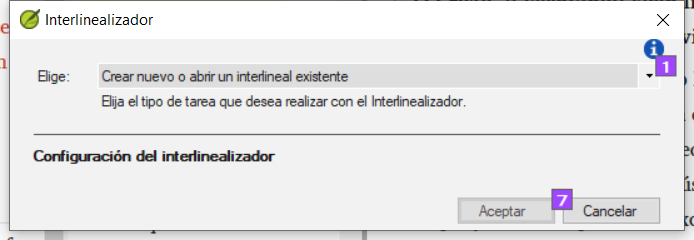
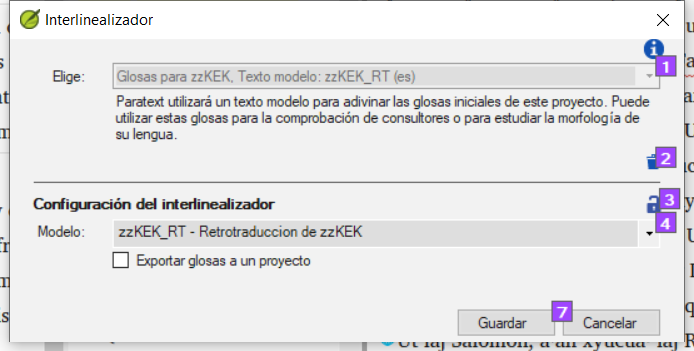
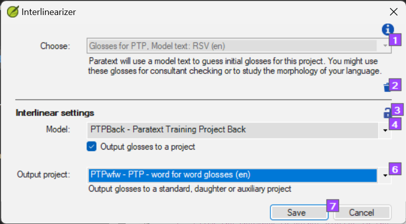

**Introducción** El módulo anterior explicaba cómo crear una retrotraducción que exprese lo que un lector entiende cuando lee o escucha el texto. Hay otro tipo de retrotraducción que se utiliza a veces y es la retrotraducción estilo palabra por palabra. Algunos consultores pueden pedir este estilo de retrotraducción. Si necesita hacer uno de estos, puede utilizar la función Interlinearizador de proyectos de Paratext.

:::caution

Tenga en cuenta que en Paratext 9 sólo puede utilizar el interlinearizador en proyectos registrados.

:::

**Antes de empezar:** Usted ha mecanografiado, revisado y corregido su traducción en Paratext y ahora se prepara para la revisión de un consultor haciendo una retrotraducción palabra por palabra. Si desea exportar el interlineal a un proyecto separado, antes de poder empezar, su administrador deberá haber creado un proyecto separado para su retrotraducción palabra por palabra. [Esto es independiente de la retrotraducción legible del módulo anterior]

**Por qué es importante:** Su asesor necesita tener una copia de su traducción en un idioma que pueda entender. La retrotraducción realizada en el módulo anterior es muy útil, pero hay ocasiones en las que una traducción literal resulta más provechosa.

**Lo que hará:** Utilizará el interlinearizador del proyecto para producir una glosa palabra por palabra del texto. En primer lugar, configurará el interlinealizador y, a continuación, corregirá los posibles errores. Las conjeturas iniciales del ordenador suelen ser erróneas, pero aprende sobre la marcha y se vuelve bastante preciso con rapidez. La idea es que la glosa sea correcta aunque el orden de las palabras no lo sea. Cuando esté satisfecho con el versículo, puede aprobar las glosas y pasar al siguiente versículo con glosas no aprobadas.

## 17.1 Configure el interlineador del proyecto {#85a79610577747e588eb6de3f3764b58}

1. Haga clic en su proyecto

2. **≡ Pestaña**, en **Herramientas** &gt; **Interlinearizador**

    

3. Haga clic para desplegar la lista [1].

4. Elija Crear glosas para [Proyecto] basadas en un texto modelo. Suele tratarse de su texto de referencia o de su proyecto de retrotraducción libre [2].

### Exportar glosas a un proyecto {#187c0a7da78942f085a0b0ce7cd23c79}

1. Si es necesario, haga clic el icono del candado [3] para desbloquear la configuración.

2. Elija su texto modelo [4].

    

3. Haga clic en la casilla de verificación para dar salida a las glosas en el proyecto que creó el administrador

4. Elija el proyecto de salida creado por su administrador

    

5. Haga clic en **Aceptar**

## 17.2 Corregir el texto interlinealizado {#5692bdbcfc5e493e9eaca52bf0dbcaa0}

Para corregir brillos

1. Haga clic en la glosa incorrecto
    - _Se muestra una lista_.
2. O bien haga clic en la glosa correcto de la lista
    - _o escriba la glosa correcta en el cuadro de texto_
3. Pulse **Intro**

## 17.3 Traducir/glosar una frase {#5dcf6d99cb4c4653a4d3426c32e41623}

1. Haga clic entre dos palabras
2. Haga clic en el icono de la cadena **(Palabras de enlace)**
3. Haga clic en la línea roja
4. Escriba la glosa

## 17.4 Añadir palabras adicionales {#397336e9e1e34f43953ba179210b763c}

1. Haga clic en el espacio entre dos glosas
2. Escriba la(s) palabra(s) extra(s)

## 17.5 Especifique la morfología - descomponga una palabra en morfemas {#4be396e96f22469ea459ab6501e55386}

1. Pulse sobre la palabra en la línea de traducción (línea superior)
2. Haga clic en **Añadir palabra analizada**
3. Añada **espacios** para separar los morfemas y añada **+** prefijos y sufijos (consulte la guía)
4. Haga clic en **Aceptar**

## 17.6 Aprobar y exportar el texto {#9295ee6e6c294b8591bbab695a814ea1}

Cuando apruebe y exporte el texto, se aprobarán las glosas rojas que queden.

1. Haga clic en **Aprobar glosas**
2. Para continuar, haga clic en **Siguiente verso no aprobado**

## 17.7 Ayuda {#192a271a080f459886a47400bde27014}

Para obtener más ayuda sobre el uso de la función Interlinearizador, consulte los siguientes temas en la Ayuda de Paratext:

1. Introducción al Interlinealizador
2. ¿Cómo se abre el Interlinealizador de proyectos?
3. ¿Cómo se genera una retrotraducción interlineal?
4. ¿Cómo puedo crear un proyecto de retrotraducción con el interlinealizador?
5. ¿Cómo puedo crear un proyecto de revisión/adaptación de texto con el Interlinealizador?
6. ¿Qué significan los colores de las glosas en el Interlinealizador?
