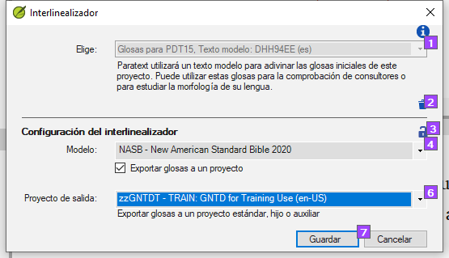

**Introduction**  The previous module explained how to create a back translation that expresses what a reader understands when he reads or hears the text. Hay otro tipo de retrotraducción que se utiliza a veces y es la retrotraducción estilo palabra por palabra. Algunos consultores pueden pedir este estilo de retrotraducción. Si necesita hacer uno de estos, puede utilizar la función Interlinearizador de proyectos de Paratext.

:::caution

Tenga en cuenta que en Paratext 9 sólo puede utilizar el interlinearizador en proyectos registrados.

:::

**Before you start:** You have typed, checked, and revised your translation in Paratext and are now preparing for a consultant check by doing a word-for-word back translation. Si desea exportar el interlineal a un proyecto separado, antes de poder empezar, su administrador deberá haber creado un proyecto separado para su retrotraducción palabra por palabra. [Esto es independiente de la retrotraducción legible del módulo anterior]

**Why this is important:** Your consultant needs to have a copy of your translation in a language they can understand. La retrotraducción realizada en el módulo anterior es muy útil, pero hay ocasiones en las que una traducción literal resulta más provechosa.

**What you will do:** You will use the project interlinearizer to produce a word-for-word gloss of the text. En primer lugar, configurará el interlinealizador y, a continuación, corregirá los posibles errores. Las conjeturas iniciales del ordenador suelen ser erróneas, pero aprende sobre la marcha y se vuelve bastante preciso con rapidez. La idea es que la glosa sea correcta aunque el orden de las palabras no lo sea. Cuando esté satisfecho con el versículo, puede aprobar las glosas y pasar al siguiente versículo con glosas no aprobadas.

## 17.1 Configure the project interlinearizer {#85a79610577747e588eb6de3f3764b58}

1. Haga clic en su proyecto

2. **≡ Tab**, under **Tools** &gt; **Interlinearizer**

   

3. Haga clic para desplegar la lista [1].

4. Elija Crear glosas para [Proyecto] basadas en un texto modelo. Suele tratarse de su texto de referencia o de su proyecto de retrotraducción libre [2].

### Export glosses to a project  {#187c0a7da78942f085a0b0ce7cd23c79}

1. Si es necesario, haga clic el icono del candado [3] para desbloquear la configuración.

2. Elija su texto modelo [4].

   

3. Haga clic en la casilla de verificación para dar salida a las glosas en el proyecto que creó el administrador

4. Elija el proyecto de salida creado por su administrador

   

5. Haga clic en **Aceptar**

## 17.2 Correct the interlinearized text {#5692bdbcfc5e493e9eaca52bf0dbcaa0}

Para corregir brillos

1. Haga clic en la glosa incorrecto
   - _A list is displayed_.
2. O bien haga clic en la glosa correcto de la lista
   - _or type the correct gloss in the textbox_
3. Click **Enter**

## 17.3 Translate/gloss a phrase {#5dcf6d99cb4c4653a4d3426c32e41623}

1. Click between two words
2. Click the chain icon  **(Link words)**
3. Click the red line
4. Escriba la glosa

## 17.4 Add extra words {#397336e9e1e34f43953ba179210b763c}

1. Haga clic en el espacio entre dos glosas
2. Escriba la(s) palabra(s) extra(s)

## 17.5 Specify the morphology – break a word into morphemes {#4be396e96f22469ea459ab6501e55386}

1. Pulse sobre la palabra en la línea de traducción (línea superior)
2. Click **Add word parse**
3. Add **spaces** to separate the morphemes and add **+** prefixes and suffixes (see guide)
4. Haga clic en **Aceptar**

## 17.6 Approve and Export the text {#9295ee6e6c294b8591bbab695a814ea1}

Cuando apruebe y exporte el texto, se aprobarán las glosas rojas que queden.

1. Click **Approve glosses**
2. To continue, click **Next Unapproved Verse**

## 17.7 Help {#192a271a080f459886a47400bde27014}

Para obtener más ayuda sobre el uso de la función Interlinearizador, consulte los siguientes temas en la Ayuda de Paratext:

1. Introducción al Interlinealizador
2. ¿Cómo se abre el Interlinealizador de proyectos?
3. ¿Cómo se genera una retrotraducción interlineal?
4. ¿Cómo puedo crear un proyecto de retrotraducción con el interlinealizador?
5. ¿Cómo puedo crear un proyecto de revisión/adaptación de texto con el Interlinealizador?
6. ¿Qué significan los colores de las glosas en el Interlinealizador?
