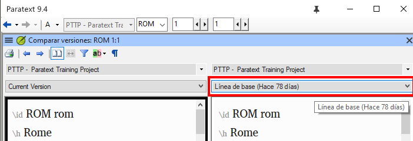
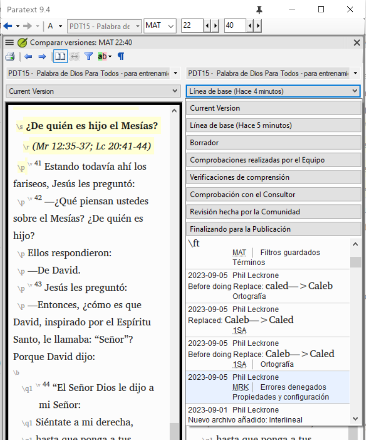
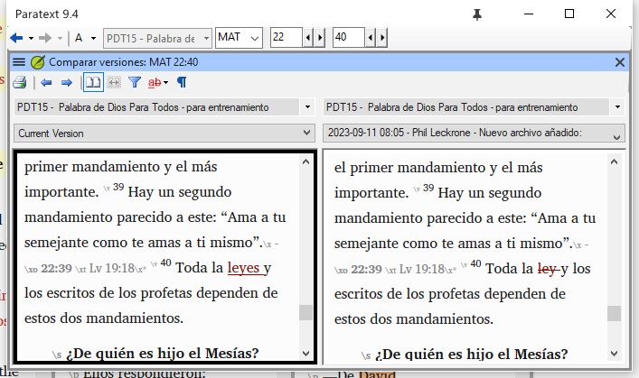

**Introducción** En este módulo aprenderá a guardar su texto en varios puntos y a revisarlos más tarde.

**Antes de empezar** Ha trabajado en su texto y ha llegado a una etapa importante de su proyecto.

**¿Por qué es importante?** A medida que trabaje en su traducción, irá introduciendo cambios continuamente. Es bueno tener una copia de su texto tal y como estaba en un momento determinado, por ejemplo, como estaba antes de acudir a un control de consultores.

**¿Qué vas a hacer?** Marcará un punto en la historial del proyecto. Más tarde podrá comparar el texto en diferentes puntos.

### 18.1 Marcar un punto en el historial del proyecto {#6bc0d79911234870b4fe00d7193f8414}

1. Haga clic en la ventana de su proyecto para activarla (en Paratext).
2. **≡ Menú de proyecto** bajo **Proyecto** &gt; **Marcar un punto en el historial...**
3. Escriba un comentario para describir el punto.
4. Haga clic en **Aceptar**

:::tip

Es bueno empezar el comentario con algunos símbolos, como **##**, para identificar fácilmente los puntos que ha añadido en la larga lista de puntos automáticos que crea Paratext.

:::

### 18.2 Comparar dos versiones {#b1533bd8ac644603a394e939685a6d4a}

:::tip

Cualquier texto que se haya borrado aparece tachado. Cualquier texto que se haya añadido aparece en rojo o subrayado.

:::

- **≡Menú de proyecto** desplegar los menús y luego bajo **Proyecto** &gt; **Comparar versiones**

- Haga clic en la lista desplegable de la versión
    - _Se muestra una lista de versiones_.

- Elija el punto deseado en el historial
    - _La ventana muestra las diferencias_.
    - 

