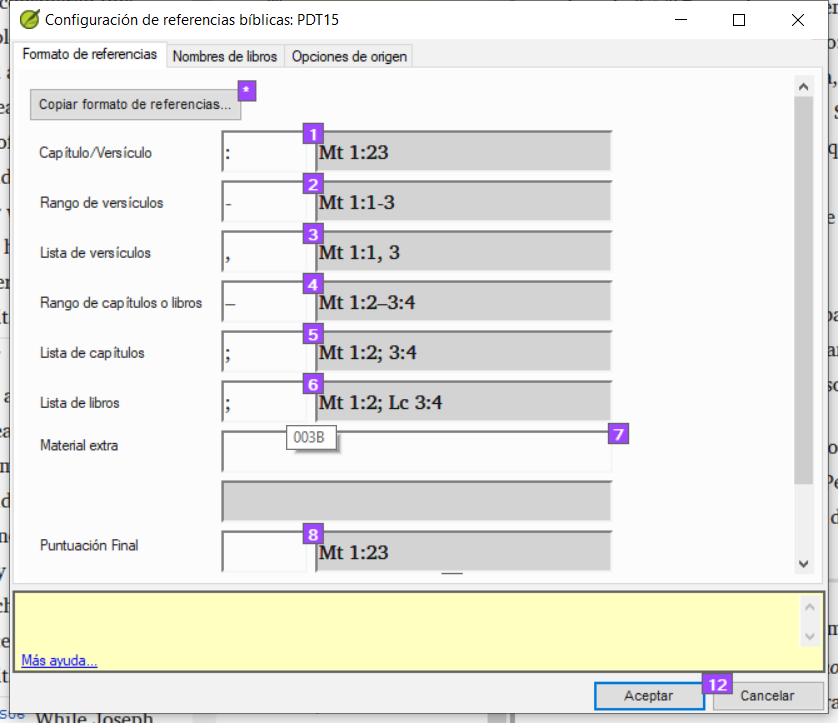
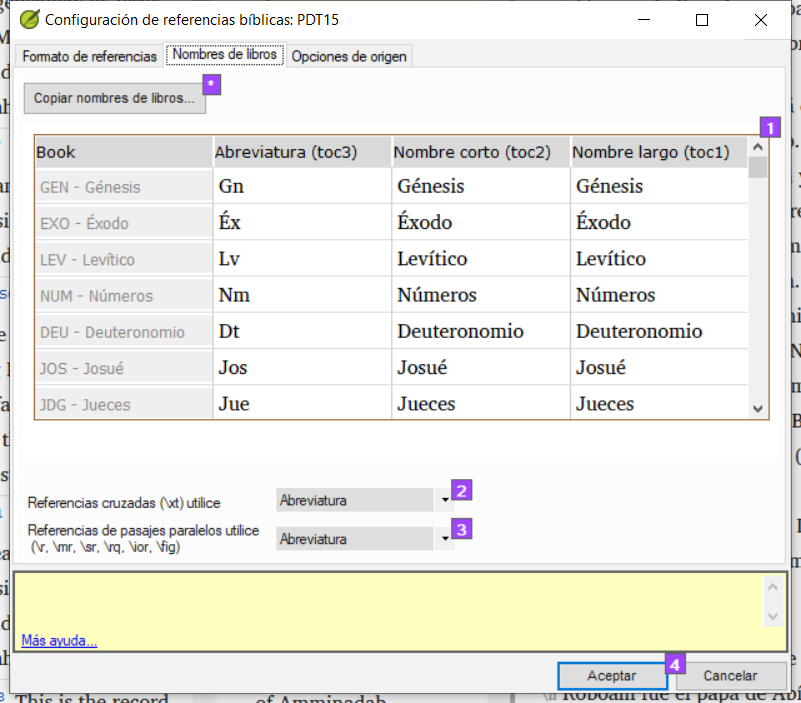
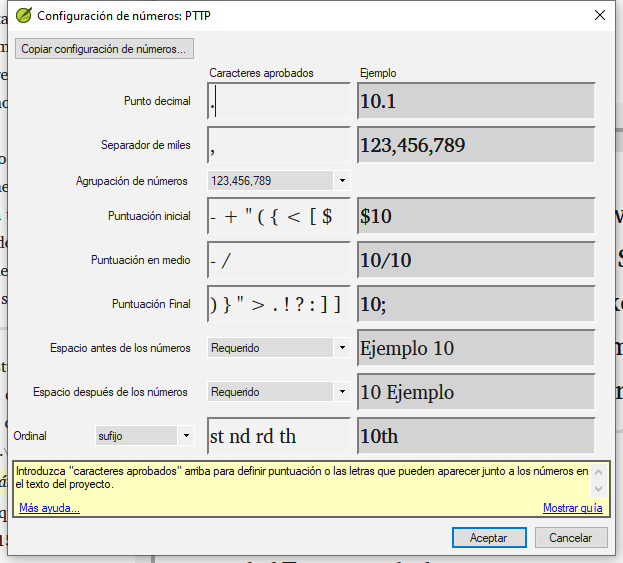

**Introducción** En este módulo aprenderá a realizar el resto de comprobaciones básicas (referencias, texto citado, números, puntuación en pares y citas). Como en los dos primeros módulos de verificaciones básicas, es más fácil ejecutar las verificaciones desde Asignaciones y Progreso. Sin embargo, si desea comprobar más de un libro, deberá ejecutar las verificaciones desde el menú de verificación.

**Antes de empezar** Ha tecleado su traducción en Paratext. Asegúrese de haber realizado las comprobaciones descritas en los módulos [BC1](/5.BC1) y [BC2](/12.BC2) antes de continuar. Y que su administrador haya realizado la configuración de las verificaciones o esté disponible para realizarla con usted.

**Por qué es importante** Paratext tiene once verificaciones básicas. Ya ha visto los seis primeras verificaciones. Este último conjunto de verificaciones le ayuda a encontrar errores relacionados con material referido de otros libros. Debe asegurarse de que las referencias son exactas para que el lector pueda encontrar esos pasajes.

**Lo que va a hacer** Como antes, la mayoría de las comprobaciones requieren que su administrador realice alguna configuración. En este módulo aprenderá:

- Confirme que la configuración está hecha
- Ejecute la verificación básica
- Corrija cualquier error.

## 19.1 Pares no coincidentes de puntuación {#37c2805933944d69852bddc3b8b8c520}

:::tip

Esta verificación examina la puntuación que aparece en pares (apertura y cierre) y enumera los errores en los que no coincide con la otra mitad del par. Puede ser deliberado, pero es más probable que se trate de un error, por ejemplo ( ), [ ], etc.

:::

**Ajuste - inventario**

1. **≡ Pestaña**, en **Herramientas** &gt; **Comprobar inventarios** &gt; **Pares de puntuación no coincidentes**:
 - _Si la lista está vacía, entonces no hay errores._
2. Si es necesario, pulse **Opciones...** para añadir otros pares.
3. Haga clic en **Aceptar**.

**Haga la comprobación**

1. **Menú de proyecto**, bajo **Herramientas** &gt; **Ejecutar Verificaciones Básicas**
2. Compruebe "**Pares de puntuación no coincidentes**"
3. Haga clic en **Aceptar**
 - _Aparece una lista de errores._
4. Haga las correcciones necesarias.

## 19.2 Referencias {#03533bb10f7a4a0a9d600b3684876edf}

### Ajustes {#13450fc38203431a8a92bfadc41599a8}

:::caution

Antes de poder ejecutar la comprobación de referencias, su **Administrador** debe definir varios ajustes.

:::

1. **≡ Pestaña**, en **Proyecto** > **Configuración de la referencia de la escritura**

2. Para cada ajuste, escriba la puntuación en la casilla
 - _La muestra se actualizará a la derecha._

Nombres de los libros

1. Haga clic en la pestaña **Nombres de libros**

2. Rellene las tres columnas [1] con la abreviatura, el nombre corto y el nombre largo.

3. Elija **Abreviaturas** [2] y [3] tanto para referencias cruzadas como para referencias

4. Haga clic en **Aceptar.**
 - _Paratext actualizará los campos \toc del texto._

:::caution

Paratext le informará si hay alguna incoherencia entre estos ajustes del nombre del libro y las líneas \\toc y le aconsejará que Resuelva los conflictos. El administrador debe hacer esto.

:::

### Comprobar {#fb34163adfba4da4980a20476539efe8}

1. **Menú de proyecto**, bajo **Herramientas** &gt; **Ejecutar Verificaciones Básicas**
2. Pulse **Referencias**
3. Haga clic en **Aceptar**
4. Corrija cualquier error.

## 19.3 Comprobación de números {#038fe67d3fd342c591ee4004ab5d4819}

### Ajustes {#e3ccf79de0524459a0cb1c6860b1c22c}

:::caution

Antes de poder ejecutar la verificación de números, su administrador debe definir varios ajustes de números.

:::

1. **≡ Ficha,** en **Configuración del proyecto** > **Configuración del número**

2. Rellene el cuadro de diálogo con la información correcta.

3. Haga clic en **Aceptar.**

:::caution

Es posible que tenga que eliminar elementos innecesarios.

:::

### Comprobar {#6bc0906c4efa4d44bc49ef74f42c53b5}

1. **≡ Pestaña**, en **Herramientas** &gt; **Ejecutar comprobaciones básicas**
2. Pulse **Números**
3. Haga clic en **Aceptar**

## 19.4 Cotización {#9764347cc21744099fe2122e180c5cd2}

La verificación de las comillas garantiza que ha marcado correctamente el discurso directo. Sólo comprueba las comillas que has marcado.

:::info Actualizar

La nueva comprobación básica de "Tipos de cita" sabe dónde deben aparecer las citas en el texto basándose en los datos de Glyssen (audio) y puede garantizar que todas estén marcadas adecuadamente. Es más avanzado que este curso. Pero si quiere más detalles, vea el vídeo sobre [Tipos de cita en Paratext 9.4.](https://vimeo.com/859138745)

:::

### Ajustes {#22033012b57b40c7a8e2a901cd735140}

:::caution

Antes de poder ejecutar la verificación de comillas, un administrador debe definir las reglas para las comillas.

:::

1. **≡ Pestaña**, en **Configuración del proyecto** &gt; **Reglas de cita**
2. Rellene las comillas utilizadas para cada nivel [1] - [9]
3. **Compruebe Marcar todas las comillas cerca de otros errores [12]**
4. Haga clic en **Aceptar**.

### Comprobación de cotización {#62f2574a47824607bcca515faed0a6da}

1. **≡ Pestaña**, en **Herramientas** &gt; **Ejecutar comprobaciones básicas**
2. **Citas**
3. Haga clic en **Aceptar**.
 - _Se muestra una lista de errores. También incluye cuatro citas correctas antes y después del posible error._
4. Haga doble clic en el primer elemento que no empiece por …
5. Corrija lo que sea necesario.
6. Pulse el botón **Reiniciar** para confirmar que ha corregido el error.

## 19.5 Citas a pie de página {#dba28acec0d943519d752763b6afa537}

:::caution

La verificación de Citas de notas al pie (anteriormente Texto citado) busca coincidencias entre el texto de una nota a pie de página (después del marcador \fk o \fq) o de una referencia cruzada (después del marcador \xk o \xq) para asegurarse de que coincide con el texto del versículo en el que se encuentra la nota a pie de página o la referencia cruzada.

:::

1. **≡ Pestaña**, en **Herramientas** &gt; **Ejecutar comprobaciones básicas**
2. **Citas de pie de página**
3. Haga clic en **Aceptar**.
 - _Aparece una lista de errores._
4. Haga las correcciones necesarias.
