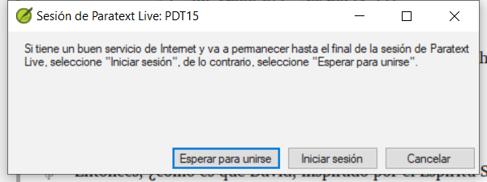
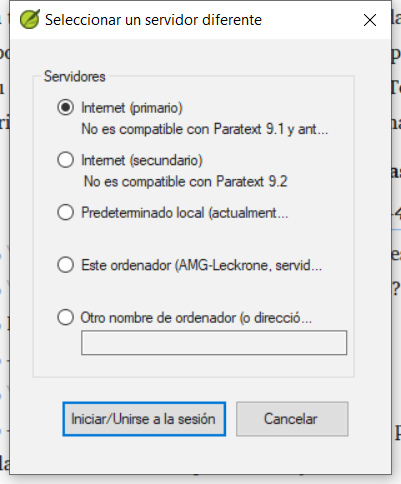
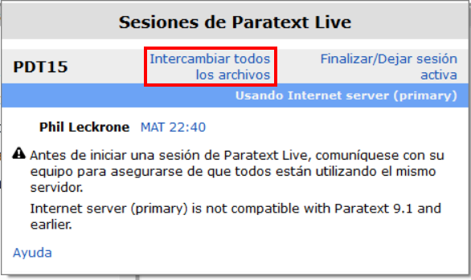

:::caution

Paratext Live ha cambiado en Paratext 9.3.

:::

**Introducción** En este módulo utilizarás Paratext Live como una forma de que el equipo pueda colaborar de forma que todos puedan ver los cambios en el texto en sus propios ordenadores.

**Antes de empezar** Ya hemos visto cómo colaborar con Enviar/Recibir. Hay ocasiones, por ejemplo durante una sesión de consultoría, en las que varias personas tienen que ver el mismo texto, y tal vez editarlo juntas. Paratext Live permite a cada persona consultar el texto en su propio ordenador y ver los cambios en tiempo real.

**Por qué esto es importante** Hay varias otras formas de permitir que todos vean el mismo texto. Pero Paratext Live no solo permite que cada persona vea el texto, sino que más de una persona pueda editarlo.

\*_¿Qué vas a hacer?_

- Conecta a todos los usuarios a la misma red.
- Enviar/Recibir.
- Iniciar Paratext Live y unirse a una sesión
- Editar el documento
- Intercambiar todos los archivos
- Salir de Paratext Live
- Enviar/Recibir

:::info

[4.1 Herramientas de colaboración](https://vimeo.com/641947293) El vídeo ha sido revisado para Paratext 9.3.

:::

:::tip

Puede intentar compartir la pantalla (con una herramienta como Skype o Zoom) mientras trabaja en ortografía, vocablos bíblicos, etc., para que todos puedan ver los cambios. Y luego volver a utilizar Paratext Live, ya que requiere menos ancho de banda de Internet.

:::

:::caution Actualización

Paratext 9.3 le permite elegir un servidor. Todo el mundo en una sesión en directo concreta sigue necesitando utilizar el mismo servidor (ya sea el primario o el secundario), sólo que a partir de la 9.3 puede trabajar con alguien en la 9.1 o con otra persona en la 9.2 (**sólo que no al mismo tiempo**)

:::

## 20.1 Paratexto en directo {#cfbebfcb20e14db89426a01336737f92}

:::tip

No es necesario que todos los usuarios hagan un **envío/recepción** antes de empezar, pero si Paratext detecta demasiados cambios le aconsejará que haga un envío/recepción. Todos deben estar conectados a la misma red.

:::

### Conectarse a la misma red {#8778ba22200442839f4c522b484c84a0}

Paratext Live puede utilizar

- Internet
- una red local
- router WiFi sin conexión
- hotspot con los datos móviles desactivados.

## Iniciar paratexto en directo {#2e0fa70f644940e48f58e61cd2d84e22}

1. Abra el **menú** del proyecto.
2. En **Herramientas**, haga clic en **Paratext Live**.
3. O utilice el icono de la barra de herramientas.
    - _Se muestran dos opciones_

## Elija el servidor {#b0daa071fd094d97ae558c23c7708d56}

Si todos los usuarios utilizan 9.2 o superior

- Puede elegir la primera opción **Internet (primario)** para conectarse a Internet.
    - _Se muestra un cuadro de diálogo_

        

- Haga clic en "Esperar para unirse" o en "Iniciar sesión" (para ser el anfitrión), según corresponda.
    - _Puede aparecer un cuadro de diálogo_
    - _Si no está activado el guardado automático en la configuración del paratexto, la sesión en directo lo activará mientras dure la sesión._

Si no es así,

- Elija la segunda opción **Seleccionar servidor diferente**.
    - _Se muestra un cuadro de diálogo con las cinco opciones._

        

\*_¿Cuál elige?_

- Elija la primera opción Internet (primaria) si todos los usuarios tienen Paratext 9.2 o superior
- Elija la segunda opción Internet (secundaria) si algún usuario dispone de Paratext 9.0 o 9.1.
- Elige la tercera opción si todos estáis conectados a una red de área local y queréis utilizar esa LAN para conectaros.
- Haga clic en **Aceptar**.

**Iniciar o esperar**

- Haga clic en **Iniciar/unirse a la sesión en directo**.
    - _Paratext le pregunta entonces efectivamente si usted es el anfitrión (es decir, que permanecerá hasta el final)_
- Si usted **no** es el editor/anfitrión principal, pulse **esperar**, no pulse cancelar ya que eso anulará su incorporación a la sesión en directo.
- Si usted **es** el anfitrión, haga clic en **Iniciar sesión**.
    - _Con una sesión activa, el botón Paratext Live está verde_

## Compartir cambios desde Herramientas {#33584bd1b18248b3bc576745a8aba544}

Todo el texto de las Escrituras se comparte en Paratext Live. Sin embargo, los cambios realizados con diversas herramientas no se comparten automáticamente. Ejemplos de estos cambios no compartidos son el estado ortográfico, el estado de los pasajes paralelos, los vocablos bíblicos y sus traducciones identificadas, y las notas. Para compartir estos cambios:

- Haga clic en el botón Paratext Live de la barra de herramientas,

- Haga clic en "**Intercambiar todos los archivos**"
    - a continuación, todos los usuarios reciben actualizaciones de estos archivos

:::caution

Los cambios de todos los usuarios se comparten, pero si dos personas han cambiado exactamente el mismo elemento de forma diferente, sólo se guardará el cambio de una persona.

:::

## Finalizar la sesión de Paratext Live {#092ea72d954c4c68a6f1c1fc61a7f15e}

- Haga clic en el icono Paratext Live.
- Elija **Finalizar/Salir de la sesión en directo**.
- Si eres el editor principal (anfitrión), verás un mensaje.
- Haga clic en **Finalizar la sesión normalmente**.
- Enviar/Recibir.

:::info

**Para obtener más ayuda**, busque **en vivo** en el cuadro de búsqueda de la barra de título. Hay muchos temas útiles sobre Paratext Live.

:::

