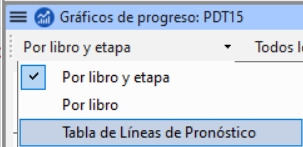

\*\*Introducción
En este módulo creará un informe de progreso.

**Antes de empezar**
A medida que ha ido trabajando en su traducción, ha ido actualizando sus Tareas y Progreso con sus avances en los capítulos y libros completados. Ahora preparará un informe del proyecto.

**Por qué es importante**
Sus administradores y financiadores necesitan informes precisos sobre sus progresos.

\*_¿Qué vas a hacer?_

- Compruebe que sus Asignaciones y Progreso está actualizado.
- Elabora varios informes.

## 21.1 Compruebe sus tareas y progresos {#6e6096ccce1e431a9cd5997eeed7e123}

1. Abra su proyecto
2. Haga clic en el icono **Asignaciones y Progreso**
3. Actualice su progreso según sea necesario.

## 21.2 Elabore un gráfico de progreso del equipo {#92fecf537c1b45be9afc57099f361f65}

1. En el menú **Tab**, en **Proyecto** elija **Gráficos de progreso**

2. Haga clic en la lista desplegable de la parte superior izquierda.

   

3. Seleccione según corresponda (por ejemplo, Tabla de Líneas Pronóstico).
   - _Aparece una ventana con el gráfico_

4. Haga clic en el icono de imprimir
   - _Se abre una ventana_

5. Pulse el botón **Imprimir**
   - _Se muestra el diálogo de impresión._

6. Elija su impresora (o impresora PDF)

7. Haga clic en **Aceptar**.
