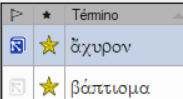

**Introduction** One task in this stage is to produce a report of the changes made in the key Biblical terms.

**Before you start** In working on your translation, you have identified and changed a number of key Biblical terms.

**¿Por qué es importante?** Aunque no puede utilizar Paratext para redactar el informe, puede producir una lista de los términos con los que has estado tratando y que puede que necesite incluir en el informe.

**What are you going to do?** In the Biblical terms tool, you will filter on the book(s) that you want to include in your report. A continuación, guardará la lista de términos en un archivo HTML independiente. También puede filtrar la lista a partir de las notas de discusión que haya tomado.

### 22.1 Herramienta de vocablos bíblicos {#4623aa1ae72343009f7497174d3c68ca}

1. Haga clic en su proyecto
2. **≡ Menú de proyecto**, bajo **Herramientas** &gt; **Vocablos bíblicos**
    - Si no aparece esta opción de menú, haga clic en la flecha hacia abajo situada en la parte inferior de los menús para mostrar los menús completos.
3. Establecer el filtro de términos
4. Establezca el filtro de versículos (para los libros en los que ha estado trabajando).
5. Ordene la lista como desee.

### 22.2 Guardar la lista en un archivo {#ea281a10dd8242029b54b4fa3e413408}

1. **≡ Pestaña**, bajo **Vocablos bíblicos** &gt; **Exportar a HTML**
2. Escriba un nombre para el archivo
3. Haga clic en **Guardar**
4. Abra el archivo en **Word/LibreOffice**

### 22.3 Otras formas de identificar las traducciones {#73e7e3a90122427a8502e3c2df78672f}

**Ordenar en notas de términos**

- Haga clic en el icono de la bandera (encabezado de la primera columna) para ordenar las notas de discusión.

**Buscar términos con texto específico en la** **descripción de la traducción**

1. Haga clic en el primer filtro de la barra de herramientas
2. Elija **Descripciones de las traducciones**
3. En el cuadro de texto de la derecha, escriba el texto que desea buscar
    - _Se filtra la lista._
4. Guarda la lista en HTML (como arriba).
