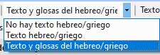
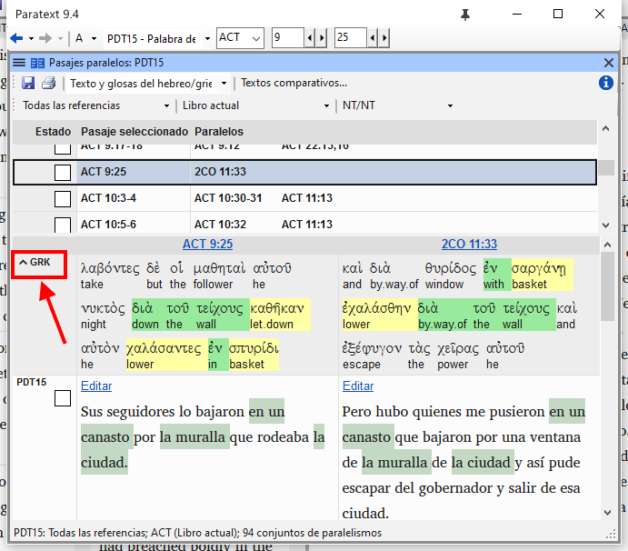
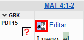
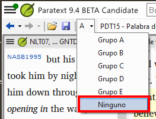

**Introducción** Hay miles de pasajes en el NT en los que se describe el mismo evento o se cita otro versículo del Antiguo o del Nuevo Testamento. Es necesario comparar estos versículos para asegurarse de que son coherentes.

**Antes de empezar** Normalmente, antes de comparar los textos, habrá traducido y comprobado el texto de ambos libros con un consultor. Aunque hay veces que querrá comparar los otros versículos antes de traducir el segundo pasaje.

**Por qué es importante** Los pasajes paralelos deben ser coherentes, pero no siempre tienen que ser exactamente iguales. La herramienta Pasajes paralelos muestra los distintos pasajes y destaca el texto que es el mismo. Pero lo importante es el significado (no necesariamente la forma).

Normalmente, las comparaciones se hacen después de haber traducido el pasaje, porque no se quiere estar influenciado por lo que podría ser una mala traducción anterior. Pero hay ocasiones en las que querrá poder ver un segundo pasaje mientras traduce.

**Lo que vas a hacer**

- utilice la herramienta Pasajes paralelos para comparar los versículos.
- utilice las casillas de verificación para indicar a Paratext que ha marcado los pasajes
- filtro de versículos cambiados
- abrir una ventana de referencia rápida en Paratext para ver otro pasaje mientras traduce.
- abrir un tercer pasaje en una ventana.

### 23.1 Abrir la ventana de Pasajes paralelos {#925421753cc849dbb0b0e5c29c6f549c}

1. Navegue hasta el capítulo y el versículo deseados.
2. **≡ Menú de proyecto**, bajo **Herramientas** &gt; **Pasajes paralelos**
    - _Aparece una ventana con una lista y pasajes paralelos_.

### 23.2 Mostrar textos en los idiomas originales {#63b7d3882a4f4eb7845d2ed8e45ca813}

1. Haga clic en la flecha desplegable situada junto a las opciones de textos originales

    

2. Elija lo que considere apropiado
    - _La pantalla cambia para mostrar el texto del idioma original en la parte superior de la tabla._

:::tip

En Paratext 9.3 puede reducir o ampliar el griego / hebreo haciendo clic en la flecha pequeña.

:::

### 23.3 Seleccionar textos comparativos {#2341540c08b34e67b22aa556a7a3d12d}

1. Haga clic en el botón **Textos comparativos**
2. Haga clic en un recurso (a la izquierda)
3. Haga clic en la flecha de la derecha
4. Repita la operación si es necesario
5. Haga clic en **Aceptar**

### 23.4 Filtros {#bddd1bb153c84ee9bca3bc97ffb62b3b}

- Elija los filtros que desee: [por ejemplo, Todas las referencias, Libro actual, Evangelios sinópticos]

### 23.5 Comparar los pasajes {#15c4aeb5a832426887603cefb4fe4e37}

- Haga clic en una línea de referencias del panel superior.
    - _Los textos se muestran en el panel inferior._

:::info

- El texto aparece en **verde** en un proyecto cuando el texto es exactamente el mismo que en el otro pasaje.
- En el texto en hebreo o griego, el texto se muestra en **amarillo** cuando tiene el mismo significado (o pensamiento) aunque no tenga exactamente la misma forma que en el otro pasaje.
- Para muchas personas el gris (en 9.3) es muy difícil de ver. Puede oscurecerlo yendo a la configuración principal del Paratext y cambiando el resaltado a **Brillante**. Esto también afectará a los resaltes en el texto y los menús.

:::

:::tip

Si el texto es **verde** en griego, entonces **su texto** también debería ser el mismo. Normalmente, si el texto es diferente en griego, debería ser diferente en su texto, pero no siempre.

:::

### 23.6 Corregir el texto {#7337f71cd3c44034befaf9a302214031}

1. Haga clic en el enlace azul **Editar**
2. Hacer las correcciones.
3. Haga clic en **Aceptar**.

### 23.7 Copiar un texto {#f792366370e34edaa04a467ba812183e}

:::tip

Si dos pasajes tienen que ser iguales, debe elegir uno (normalmente su traducción posterior) y copiarlo sobre el otro.

:::

**Copia**

1. Haga clic en el enlace azul **Editar**
2. Seleccione el texto
3. Copiar (Ctrl+C)
4. Haga clic en **Aceptar**.

**Pegar**

1. Haga clic en el enlace azul para ver el otro texto
2. Seleccione el texto
3. Pegar (Ctrl+V)
4. Haga clic en **Aceptar**.

:::caution

Ten cuidado cuando haya más de un versículo. No quieres pegar el \v.

:::

### 23.8 Marque el pasaje como comprobado {#d2196130c2104131b84a2bea4a95ad68}

- Haga clic en la casilla situada junto a la referencia.
    - _El conjunto de referencias está aprobado_.

### Tres modos de aprobación {#08445ce9fc804dc1afac9e744e6025c0}

En esta versión de Paratext existen tres modos de aprobación.

1. Abra el **menú** para la ventana.
2. Bajo **Ver** puede elegir entre
    - **Aprobar Conjuntos de paralelos** - que es el predeterminado -
    - **Aprobar pasajes individualmente** casillas de verificación individuales
    - **Aprobar por conjunto o individualmente**, que le permite alternar entre los modos.

### Para cambiar de conjunto a individualmente {#d8817e289b6245e385115906581f599b}

1. Abra el menú de la ventana.
2. Bajo Ver, seleccione Aprobar por conjunto o Individualmente.
    - _Inicialmente, se muestra una casilla de verificación para todo el conjunto en la columna Estado_.
3. Pase el ratón por encima de la casilla inferior del conjunto
4. _El icono de un lápiz aparece_.
5. Haga clic en el **lápiz**
    - _Las casillas de verificación pasan al otro modo, pero sólo para este conjunto de pasajes._

### 23.9 Pasajes que han cambiado {#e989e64519384fff9e358789ba19411e}

Identifique los pasajes que se han modificado desde que se marcaron como finalizados

1. En la herramienta Pasajes paralelos
2. Cambiar el filtro de paso a **Texto cambiado**
3. Haga clic en el icono **ab** bajo la referencia del pasaje.

    

    - _Aparece una ventana de comparación en Paratext._
4. Cambia el texto si es necesario.
5. Volver a la herramienta Pasajes paralelos (mediante los iconos de la barra de tareas)
6. Haga clic en la casilla de verificación para marcarla como finalizada.

### 23.10 Comparar el texto mientras traduce {#ff56ce1d6f24468a8b5c84e7eedbf652}

1. Haga clic en su proyecto.
2. **≡ Menú de proyecto**, bajo **Herramientas** &gt; **Referencia rápida** (Ctrl+q)
    - _Se abre una ventana flotante_ __ _con el grupo de desplazamiento establecido en ninguno._
3. Cambia la referencia al otro pasaje.

### 23.11 Ver un tercer pasaje {#c0a5d24f77314597a326fd75e4fbc55c}

1. Abra su proyecto por segunda vez [**≡ Paratext** > **Paratext** > **Abrir** y haga doble clic en su proyecto]

2. Cambiar el grupo de desplazamiento de **[A]** a **Ninguno**.

3. Cambia la referencia al otro pasaje.

