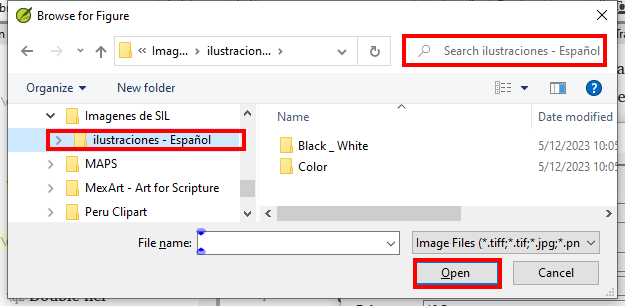

**Introducción** En este módulo se examinan las diversas tareas necesarias para finalizar el texto para su publicación.

**Qué harás**

- Añadir **ilustraciones** y leyendas
- Identificar los nombres de los mapas
- Preparar una introducción al NT / Biblia
- Comprobar pasajes paralelos
- Verificar que todas las verificaciones están completos
- Verificación final de los nombres propios
- Comprobación de números, dinero, pesos y medidas
- Verificación de formato.

## 24.1 Elección de ilustraciones y leyendas {#f380fb1fc81e4cbbb72d511558a49bb6}

Hay más de 2.800 imágenes disponibles, por lo que puede resultar difícil elegir las ilustraciones. Afortunadamente, ahora es posible buscar imágenes por referencia de capítulo y por palabras clave en español. Tenga en cuenta que cualquier ilustración que inserte en Paratext aumentará el tamaño de su proyecto. Añada sólo estos pequeños archivos jpg (o alternativamente sólo el nombre del archivo). Al componer, se sustituirán por imágenes de mayor tamaño y alta resolución.

**Crear una carpeta de imágenes para buscar**

Primera vez:

1. Abra el enlace https://tiny.cc/sampleimages en Internet
2. Haga clic con el botón derecho del ratón en la carpeta **Ilustraciones - Español**,
3. Haga clic en **Descargar**
    - _Descargará unos 121MB_.
4. Busque y abra el **archivo . zip** descargado.
5. Extrae la única carpeta del archivo **Ilustraciones - Español** y colóquela en su carpeta **Imágenes**
    - _(Windows empieza a indexar el contenido de las imágenes…)_

**Pruebe varias búsquedas**

Cuando las imágenes estén indexadas, puede probar diferentes búsquedas.

1. Abra esta nueva carpeta en el **explorador de archivos**.

    

2. Escriba en el campo de búsqueda:
3. **Una palabra de búsqueda**, como cruz, oveja, casa, etc.
4. **Una referencia bíblica**, como MAT27, ACT03, etc. (utilizando al menos 2 dígitos para el capítulo).
5. Añada **negro** o **color** para mostrar sólo imágenes en blanco y negro.

## 24.2 Añadir ilustraciones y leyendas {#b8896167ea3a4f46945fbab4670e0e58}

1. En su proyecto, navegue hasta el versículo deseado.
2. En el menú **Insertar**, seleccione **ilustración**

    

3. Introduzca una leyenda**** que se imprimirá con la imagen (en su idioma)[1].
4. Introduzca una **descripción (en español)** que no se imprimirá con la imagen [2].
5. Indique si la imagen debe ocupar el ancho de una columna o de una página. [3]
6. Si aplica, escriba un rango de versículos como ubicación aceptable. \[*\] \[Optional\]
7. Introduzca la información necesaria sobre los derechos de autor de la imagen [4]
8. El paratexto rellenará la referencia del capítulo y el versículo correspondiente a la imagen. [5]

**Buscar el archivo de imagen**

1. Haga clic en **Navegar**… para buscar el archivo de imagen. [7]
    - _Aparece un cuadro de diálogo_.
2. En el cuadro de diálogo, seleccione a la izquierda la carpeta **Figuras - Ilustraciones - Español**

    

3. Haga clic en el campo **Buscar** (arriba a la derecha) y escriba para filtrar las imágenes (como arriba)
4. Haga clic en la imagen deseada y pulse el botón **Abrir**.
5. Haga clic en **Aceptar**.

:::caution

Para facilitar la búsqueda, haga doble clic en la barra de título para **ampliar la ventana**, **mostrar** los iconos muy grandes y **ocultar el panel de visualización**.

:::

## 24.3 Nombres de los mapas {#e649bd9a447840cf8dcc7737ef3ba118}

:::caution

La lista de vocablos bíblicos de los mapas combinados del NT no es una lista estándar en Paratext 9. Está [**disponible en**](pathname:///img/CombinedNTMapBiblicalTerms.xml): y una vez descargado, el archivo debe copiarse en "My Paratext 9 Projects"

:::

1. Haga clic en su proyecto.
2. **≡ Menú de proyecto**, bajo **Herramientas** &gt; **Vocablos bíblicos**
3. **≡ Pestaña**, bajo **Vocablos bíblicos** &gt; **Abrir lista de vocablos bíblicos**
4. Elegir MapBiblicalTerms
5. Añadir traducciones para todos los términos
6. **≡ Pestaña**, bajo **Vocablos bíblicos** &gt; **Exportar a HTML**
7. Escriba un nombre para el archivo
8. Haga clic en **Guardar**.

### 24.4 Preparar una introducción al NT / Biblia {#8dbe5d1eded645b4b7399b7445e87c9b}

1. Cambie al libro INT
2. Asegúrese de que hay una línea \h
3. Escriba su introducción utilizando los siguientes marcadores:
    - \mt1
    - \is
    - \ip
4. Escriba la introducción general a la Biblia/NT en el libro **INT**

## 24.5 Comprobar pasajes paralelos {#41283e7f0e9e4ad0b0cc096515eaea02}

- Ver módulo [PP Comparar pasajes paralelos](https://sillsdev.github.io/paratext-manual/23.PP)

## 24.6 Verificar que todas las verificaciones están completos {#bad57bb5b1164152978a284244e46078}

**Libro actual**

1. Abra **Asignaciones y Progreso**.
2. Confirme que no hay problemas en ninguno de las verificaciones.

**Varios libros**

1. Rehaz los inventarios.
2. **≡ Menú de proyecto**, bajo **Herramientas** &gt; **Ejecutar verificaciones básicas**
3. Asegúrese de que todas las casillas están marcadas.
4. Asegúrese de que se eligen todos los libros que se van a publicar.
5. Haga clic en **Aceptar**.
6. Corrija cualquier error.

**Verificaciones de la lista de palabras**

A partir de la lista de palabras, realiza las siguientes verificaciones:

1. **≡ Pestaña**, bajo **Herramientas** &gt; **Verificación de ortografía** &gt; **Todas las verificaciones**
2. **≡ Pestaña**, en **Herramientas** &gt; **Buscar palabras similares**
3. **≡ Pestaña**, bajo **Herramientas** &gt; **Buscar palabras incorrectamente unidas o divididas**

## 24.7 Verificación final de los nombres propios {#9848258611574d89b055afe4eb493920}

1. **≡ Menú de proyecto**, bajo **Herramientas** &gt; **Vocablos bíblicos**
2. **≡ Pestaña**, bajo **Vocablos bíblicos** &gt; **Abrir lista de vocablos bíblicos** y elija la lista **Principales vocablos bíblicos**
3. Filtrar por nombres faltando traducciones
4. Compruebe que todos los nombres tienen una traducción (añádala si es necesario).

## 24.8 Comprobar números, dinero, pesos y medidas {#1ab8c0f85ac14e36ba936d5d546c8dbd}

1. Haga clic en su proyecto.
2. **≡ Menú de proyecto**, bajo **Herramientas** &gt; **Vocablos bíblicos**
3. **≡ Pestaña**, bajo **Vocablos bíblicos** &gt; **Abrir lista de vocablos bíblicos**
4. Seleccione la lista adecuada.
5. Añade traducciones como de costumbre.

## 24.9 Verificación de formato {#6468aa6cc0bb4ed7bc531a2111ee63ee}

1. Rehacer el módulo FC: Comprobaciones de formato.
2. **≡ Menú de proyecto**, bajo **Herramientas** &gt; **Lista de verificaciones** &gt; **Versículos relativamente largos/cortos**
3. **≡ Menú de proyecto**, bajo **Herramientas** &gt; **Lista de verificaciones** &gt; **Palabras o frases**
4. **≡ Menú de proyecto**, bajo **Herramientas** &gt; **Lista de verificaciones** &gt; **Encabezados de sección**
5. **≡ Menú de proyecto**, bajo **Herramientas** &gt; **Lista de verificaciones** &gt; **Títulos de libros**
6. **≡ Menú de proyecto**, bajo **Herramientas** &gt; **Lista de verificaciones** &gt; **Referencias**
7. **≡ Menú de proyecto**, bajo **Herramientas** &gt; **Lista de verificaciones** &gt; <0>Notas al pie</0>
