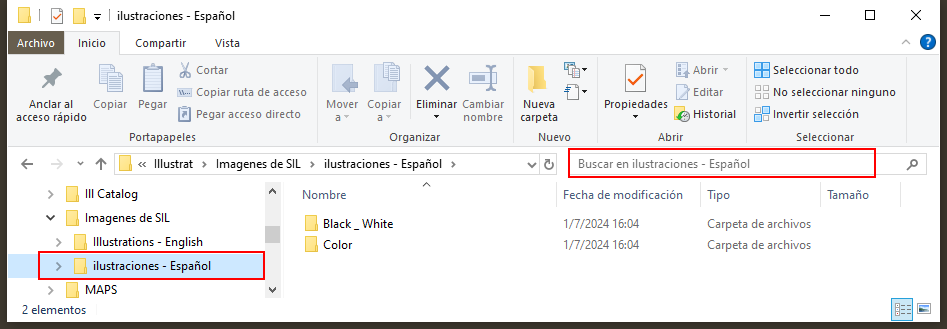
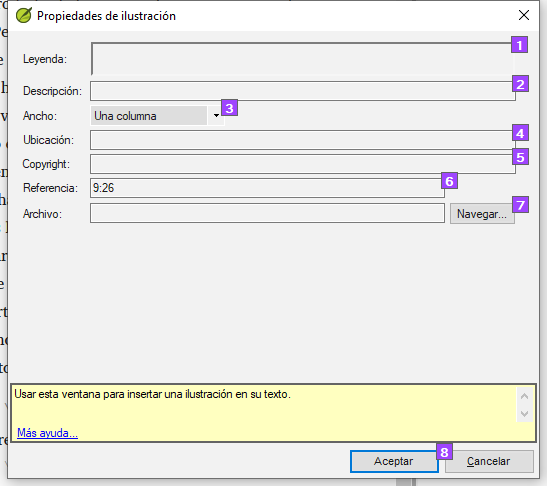
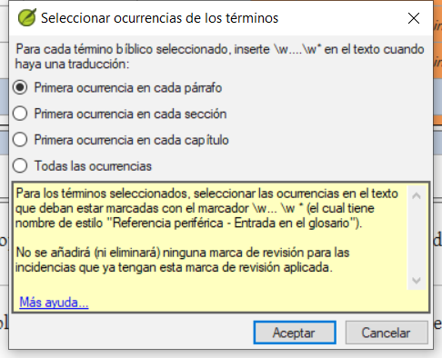

**Introducción**
Este módulo examina las diversas tareas necesarias para finalizar el texto para su publicación.

**Lo que hará**

- Añada **ilustraciones** y pies de foto
- Identificar los nombres de los mapas
- Preparar una introducción al NT / Biblia
- Comprobar pasajes paralelos
- Verificar que todas las verificaciones están completos
- Verificación final de los nombres propios
- Comprobación de números, dinero, pesos y medidas
- Verificación de formato.
- Marque los elementos del glosario en el texto.

## 24.1 Elección de ilustraciones y leyendas {#f380fb1fc81e4cbbb72d511558a49bb6}

Hay más de 2.800 imágenes disponibles, por lo que puede resultar difícil elegir las ilustraciones. Afortunadamente, ahora es posible buscar imágenes por referencia de capítulo y por palabras clave en español. Tenga en cuenta que cualquier ilustración que inserte en Paratext aumentará el tamaño de su proyecto. Añada sólo estos pequeños archivos jpg (o alternativamente sólo el nombre del archivo). Al componer, se sustituirán por imágenes de mayor tamaño y alta resolución.

**Crear una carpeta de imágenes para buscar**

Primera vez:

1. Abra el enlace https://tiny.cc/sampleimages en Internet
2. Haga clic con el botón derecho del ratón en la carpeta **Ilustraciones - Español**,
3. Seleccione **Descargar**
    - descargará unos 121MB_.
4. Busque y abra el **archivo zip** descargado.
5. Extraiga la única carpeta del archivo: **Ilustraciones - Español** y póngala en su carpeta **Imágenes**
    - _(Windows comienza a indexar el contenido de las imágenes...)_

**Pruebe varias búsquedas**

Cuando las imágenes estén indexadas, puede probar diferentes búsquedas.

1. Abra esta nueva carpeta en el **Explorador de archivos**.

    

2. Escriba en el campo de búsqueda:

3. **Una palabra de búsqueda**, como cruz, oveja, casa, etc.

4. **Una referencia bíblica**, como MAT27, ACT03, etc. (utilizando al menos 2 dígitos para el capítulo).

5. Añada **negro** o **color** para mostrar sólo imágenes en blanco y negro.

## 24.2 Añadir ilustraciones y pies de foto {#b8896167ea3a4f46945fbab4670e0e58}

1. En su proyecto, navegue hasta el versículo deseado.

2. En el menú **Insertar**, elija **Figura**

    

3. Introduzca un **título** para imprimir con la imagen (en su idioma)[1].

4. Introduzca una **descripción** que se imprimirá con la imagen (en su idioma) [2].

5. Indique si la imagen debe ocupar el ancho de una columna o de una página. [3]

6. Si aplica, escriba un rango de versículos como ubicación aceptable. [\*] [Optional]

7. Introduzca la información necesaria sobre los derechos de autor de la imagen [4]

8. El paratexto rellenará la referencia del capítulo y el versículo correspondiente a la imagen. [5]

**Buscar para encontrar el archivo de imagen**

1. Haga clic en **Buscar**… para buscar el archivo de imagen. [7]
    - aparece un cuadro de diálogo_.

2. En el cuadro de diálogo, seleccione la carpeta **Imágenes - Ilustraciones - Español** de la izquierda

    

3. Pulse en el campo **Buscar** (arriba a la derecha) y escriba para filtrar las imágenes (como arriba)

4. Haga clic en la imagen deseada y pulse el botón **Abrir**.

5. Haga clic en **OK**.

:::caution

Para facilitar la búsqueda, haga doble clic en la barra de título para **ampliar la ventana**, **mostrar** los iconos muy grandes y **ocultar el panel de visualización**.

:::

## 24.3 Nombres de mapas {#e649bd9a447840cf8dcc7737ef3ba118}

:::info

Pronto estará disponible un plug-in para hacer nombres de mapas (Map Labeler Plugin). Mientras tanto, puede seguir utilizando el antiguo sistema de identificación de nombres de mapas que se explica a continuación.

:::

:::caution

La lista de vocablos bíblicos de los mapas combinados del NT no es una lista estándar en Paratext 9. Está [**disponible aquí**](pathname:///img/CombinedNTMapBiblicalTerms.xml): y una vez descargado, el archivo debe copiarse en "Mis proyectos Paratext 9"

:::

1. Haga clic en su proyecto.
2. Use the Biblical Terms tool
    **(≡ Tab**, under **Tools** &gt; **Biblical Terms)**
3. Open the liste
    **(≡ Tab**, under **Biblical Terms** &gt; **Select Biblical Terms List)**
4. Choose the list **CombinedNTMapBiblicalTerms**
5. Add renderings for all the names
6. Save the HTML file
    **(≡ Tab**, under **Biblical terms** &gt; **Export as HTML)**
7. Escriba un nombre para el archivo
8. Pulse **Guardar**.
9. Fill-in the Word document from the typesetter for the maps.

### 24.4 Draft Introduction to the NT/Bible and the Appendix {#8dbe5d1eded645b4b7399b7445e87c9b}

1. Cambie al libro INT
2. Make sure there is an **\h** line
3. Escriba su introducción utilizando los siguientes marcadores:
    - **\mt1**
    - **\is**
    - **\ip**
4. Escriba la introducción general a la Biblia/NT en el libro **INT**

### Appendix {#23a598a5fd4080bc92c8c3130afa40e0}

- The Appendix/Appendices can be typed in books XXA, XXB, XXC

O

- One of the specific books: Back Matter (**BAK**), Other Matter **OTH**, Topical Index (**TDX**), Names Index (**NDX**)…

:::tip

- Check with your typesetter.

:::

## 24.5 Compruebe los pasos paralelos {#41283e7f0e9e4ad0b0cc096515eaea02}

- Véase el módulo [PP Comparar pasajes paralelos](/23.PP)

## 24.6 Verifique que todas las comprobaciones están completas {#bad57bb5b1164152978a284244e46078}

**Libro actual**

1. Abra las **Asignaciones y Progreso**.
2. Confirme que no hay problemas en ninguno de las verificaciones.

**Varios libros**

1. Rehaz los inventarios.
2. **≡ Pestaña** en **Herramientas** &gt; **Ejecutar comprobaciones básicas.**
3. Asegúrese de que todas las casillas están marcadas.
4. Asegúrese de que se eligen todos los libros que se van a publicar.
5. Haga clic en **Aceptar**.
6. Corrija cualquier error.

**Comprobación de la lista de palabras**

A partir de la lista de palabras, realiza las siguientes verificaciones:

1. **≡ Pestaña**, en **Herramientas** &gt; **Revisión ortográfica** &gt; **Todas las comprobaciones**
2. **≡ Menú del proyecto**, bajo **Herramientas** &gt; **Buscar palabras similares**
3. **≡ Pestaña**, en **Herramientas** &gt; **Encontrar palabras unidas o divididas incorrectamente**

## 24.7 Comprobación final de nombres propios {#9848258611574d89b055afe4eb493920}

1. **≡ Pestaña**, en **Herramientas** &gt; **Términos bíblicos**
2. **≡ Pestaña**, en **Términos bíblicos** &gt; **Seleccione la lista de términos bíblicos** y elija la lista de **Términos bíblicos principales**
3. Filtrar por nombres faltando traducciones
4. Compruebe que todos los nombres tienen una traducción (añádala si es necesario).

## 24.8 Números, dinero, pesos y medidas {#1ab8c0f85ac14e36ba936d5d546c8dbd}

1. Haga clic en su proyecto.
2. **≡ Pestaña**, en **Herramientas** &gt; **Términos bíblicos**
3. **≡ Pestaña**, bajo **Términos bíblicos** &gt; **Seleccione la lista de términos bíblicos**
4. Seleccione la lista adecuada.
5. Añade traducciones como de costumbre.

## 24.9 Comprobaciones de formato {#6468aa6cc0bb4ed7bc531a2111ee63ee}

1. Rehacer el módulo FC: Comprobaciones de formato.
2. **≡ Ficha**, en **Herramientas** &gt; **Listas de comprobación** &gt; **Versos largos/cortos**
3. **≡ Pestaña**, en **Herramientas** &gt; **Listas de comprobación** &gt; **Palabra o frase**
4. \*pestaña \*≡\*\*, en **Herramientas** &gt; **Listas de comprobación** &gt; **Rúbricas de sección**
5. **≡ Pestaña**, en **Herramientas** &gt; **Listas de control** &gt; **Títulos de libros**
6. **≡ Ficha**, en **Herramientas** &gt; **Listas de comprobación** &gt; **Referencias**
7. **≡ Ficha**, en **Herramientas** &gt; **Listas de comprobación &gt; Notas al pie**

## 24.10 puntos (enlace) Glosario Palabras del texto {#53d0e7fe579147988b0f728b5c2c7b7d}

Es habitual marcar las palabras en el texto impreso con un asterisco cuando existe una entrada en el glosario para la palabra/frase o añadir un enlace en las versiones electrónicas. Se recomienda dejarlo para el final para evitar que se pierdan palabras por errores ortográficos. Esto se hace en la herramienta de términos bíblicos mediante el comando Vincular interpretaciones al glosario.

¿Qué ocurre con las entradas del glosario que no figuran en la lista de términos bíblicos? Para ello, debe añadir entradas a su lista de proyectos. Esto implica encontrar la palabra/frase en el texto y crear una entrada en la lista de términos bíblicos de su proyecto. (see [10.7](/10.BT#f683ccf4cdcf45f09c516c09c78ab277)) Se recomienda empezar haciendo unas cuantas entradas del glosario cada vez.

1. Asegúrese de tener permiso de edición para todo el libro.

2. En la herramienta Términos bíblicos, seleccione algunas entradas del glosario.

3. **≡ Pestaña**, en **Editar** &gt; **Enlazar renders al glosario**
    1. Aparece el cuadro de diálogo.

        

4. Elija **Primera aparición en cada sección**.
    - _Paratext buscará en el texto y añadirá \w … \w\* marcadores. A continuación, muestra una lista de resultados de los versos cambiados._

5. Compruebe cuidadosamente la lista de resultados en busca de errores.

:::tip

Si hay muchos resultados no deseados, puede deshacerlos seleccionando las entradas y eligiendo **Desvincular renders del glosario.**

:::

:::tip

- Si tiene tanto una frase como una palabra, enlace primero la entrada más larga.
- Si tiene dos interpretaciones muy diferentes, considere la posibilidad de crear un segundo término en la herramienta de términos bíblicos.
- Si ha utilizado "_" en la traducción, revise detenidamente los resultados y elimine manualmente … \w_ del verso.
- Tenga cuidado si alguna traducción de un término bíblico es un homógrafo de una traducción de otro término bíblico.

:::

