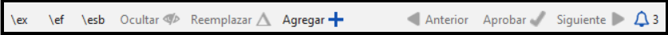

# 25. Creating a Study Bible with Paratext 9.4 {#98137245ea6a44b79015596b67b3c634}

:::info

The **Study Bible Additions (SBA)** features implemented in **9.4 beta** requires that the SBA project be migrated, due to a data format change. The new 9.4 SBA data format is NOT compatible with the PT 9.3 version. In order to use the new SBA features, all project members should move to PT 9.4 beta and the project administrator should migrate the SBA project.

:::

**Introducción**  Con Paratext 9.2 (y superior) puede crear una Biblia de estudio basada en su traducción añadiendo párrafos introductorios, barras laterales y notas a pie de página detalladas y referencias cruzadas adicionales para ayudar al usuario a tener una comprensión más profunda del texto bíblico.

**¿En qué punto del proceso se encuentra?**  Antes de crear una Biblia de estudio, querrá traducir y comprobar por consultor su Nuevo Testamento (o partes de él). A continuación, su administrador puede crear un nuevo proyecto (véase más abajo).

**¿Por qué es importante?**  La información de la Biblia de estudio se crea en un proyecto independiente con enlaces al texto traducido. Si el texto traducido cambia, el enlace puede romperse. Los enlaces pueden arreglarse, pero es menos probable que haya problemas si el texto es estable.

**¿Qué vas a hacer?**  Usted (o su administrador) creará un **Proyecto de adiciones a la Biblia de Estudio**. Como su nombre indica, aquí es donde puede añadir los materiales de estudio (sin que ello afecte a su traducción).

Este proyecto independiente contiene el texto adicional y una copia de sólo lectura de su proyecto. Cuando esté listo, puede combinar el proyecto de adiciones a la Biblia de Estudio con su proyecto de traducción en un tercer proyecto.

- Migrate an earlier version of the Study Bible Additions

or

    - Crear un nuevo proyecto de adiciones a la Biblia de Estudio basado en su traducción
    - Registrar el nuevo proyecto
- Añada el material adicional (introducciones, barras laterales, notas a pie de página y referencias cruzadas)
- Ocultar cualquier texto no bíblico en la traducción base (por ejemplo, los títulos)
- Combinar los proyectos para crear un proyecto de publicación.

## Migrate an earlier version of the Study Bible Additions {#0a743ded6dc24fc399975383664db289}

- Open your Study Bible Additions project.
    - A notice is displayed explaining how to migrate your project.

        

## To Create a new Study Bible Additions project {#7ed7e93951db49deaf2c5cf7d4d15d70}

1. Use the **Paratext menu** to create a **new project**.
2. Set the **type** of project to **Study Bible Additions**.
3. Choose your translation project for the **“based on” project**.
4. You will need to **register** the new project.
    - _Aparecerá una copia en gris de sólo lectura de su proyecto, con una barra de herramientas en la parte superior._

        

## Añadir el material adicional {#e7a1b3e1b97b4eed9be5b9f1c2ed0dcd}

### Material introductorio {#05a4f1d78d3549d9ac44235760b89873}

1. Sitúe el cursor en el lugar en el que desea que aparezca el material adicional
2. Haga clic en **Añadir +** en la barra de herramientas
3. Se añade un recuadro azul con un \ip.
4. Teclee el texto.

### Texto de la barra lateral {#ab2be09dfc0e4fdeb177091e89785b58}

1. Sitúe el cursor en el lugar en el que desea que aparezca el material adicional
2. haga clic en **\esb** en la barra de herramientas
    - _Se abre un panel de la barra lateral con un marcador \ms añadido_
3. Escriba el título después del marcador \ms
4. Pulse Entrar
5. Elija un marcador para el texto siguiente.
6. Teclee el texto.
7. Continúe según sea necesario.

### Referencias cruzadas extendidas {#cbcab8e8c6a64e38bf737472fe26d8e9}

1. Sitúe el cursor en el lugar en el que desea que aparezca el llamador de referencia cruzada
2. haga clic en **\ex** en la barra de herramientas
    1. Se abre un panel de notas a pie de página con un marcador \ex añadido
3. Escriba la referencia cruzada.

### Nota al pie extendida {#864c186270064955922ed758dc7d9fcf}

1. Sitúe el cursor en el lugar donde desea que aparezca la nota a pie de página adicional
2. haga clic en **\ef** en la barra de herramientas
3. Se abre un panel de notas a pie de página con el marcador \ef adecuado
4. Añada notas a pie de página si es necesario.

### Ocultar el material no bíblico {#8fff7769e5ae4060b0f1ffef9a979a79}

Puede ocultar de la traducción el material no bíblico, como los títulos

1. Sitúe el cursor en el lugar donde desea que aparezca la nota a pie de página adicional
2. Haga clic en **Ocultar** en la barra de herramientas
    - _El texto aparece en un recuadro sombreado._

## Combinar los proyectos para crear un proyecto de publicación {#23a03d9d683240a6a21290721a8dbb93}

Para publicar la Biblia de estudio, debe crear un proyecto de publicación.

1. Haga clic en el menú del proyecto de Adiciones a la Biblia de Estudio
2. Elegir “Crear un proyecto de publicación combinado”

    

3. Haga clic en la lista desplegable "**Proyecto de publicación combinado**".
4. Crear un nuevo proyecto o elegir un proyecto anterior
5. Haga clic en **Crear**
    - _Paratext combina el proyecto de traducción y el proyecto de Adiciones a la Biblia de Estudio y muestra el proyecto de publicación combinado._
6. Si es necesario, cambie la vista a **Vista previa**.

### Realizar cambios {#9bd2afcdbf5946038a9b70561fcebc5d}

Ahora tiene tres proyectos.

1. Su proyecto de traducción original,
2. Proyecto de adiciones a la Biblia de Estudio y
3. El proyecto de publicación combinado.
- _Cualquier corrección de la traducción_ debe hacerse en el proyecto de traducción original __.
    - Estas correcciones se actualizarán en el proyecto de Adiciones a la Biblia de Estudio la próxima vez que vuelva a crear el proyecto de publicación.
    - _Cualquier corrección al material de estudio bíblico_ debe hacerse en el proyecto _de Adiciones a la Biblia de Estudio_.
- El proyecto de publicación combinado __ es de sólo lectura y no puede modificarse.
    - Para actualizar los cambios, vuelva a crear el proyecto de publicación combinado.

## Proyecto de Adiciones a la Biblia de Estudio - Comparar versiones {#7b7d078eecd44a71ae7fa6217ba07218}

In Paratext 9.3 (and above), you can now Compare versions

1. Abrir un proyecto de Adiciones a la Biblia de Estudio
2. En el menú **Proyecto**,
3. Bajo **Proyecto**, seleccione **Comparar versiones**
    - _Los cambios en las adiciones se muestran_.

## Imprimir la Biblia de Estudio con PTXPrint {#cfc9e16b905c4aa48c7aad34c7c5ef9a}

PTXPrint versión 2.1.x (y superior) puede imprimir el proyecto de publicación combinado. Para obtener instrucciones detalladas, consulte [https://software.sil.org/ptxprint/how-to-study-bible-layout/](https://software.sil.org/ptxprint/how-to-study-bible-layout/)

