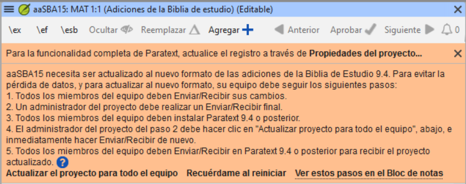
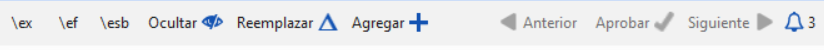
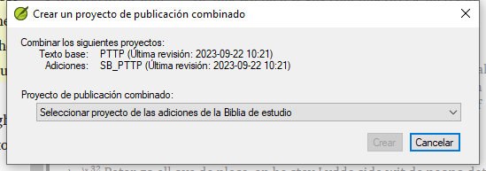

# Creación de una Biblia de estudio con Paratext 9.4 {#98137245ea6a44b79015596b67b3c634}

:::info

Las **características de las Adiciones a la Biblia de Estudio (SBA)** implementadas en **9.4 beta** requieren que se migre el proyecto SBA, debido a un cambio en el formato de los datos. El nuevo formato de datos SBA 9.4 NO es compatible con la versión PT 9.3. Para poder utilizar las nuevas funciones de la SBA, todos los miembros del proyecto deberán pasar a PT 9.4 beta y el administrador del proyecto deberá migrar el proyecto de la SBA.

:::

**Introducción** Con Paratext 9.2 (y superior) puede crear una Biblia de estudio basada en su traducción añadiendo párrafos introductorios, barras laterales y notas a pie de página detalladas y referencias cruzadas adicionales para ayudar al usuario a tener una comprensión más profunda del texto bíblico.

**¿En qué punto del proceso se encuentra?** Antes de crear una Biblia de estudio, querrá traducir y consultar su Nuevo Testamento (o partes de él). A continuación, su administrador puede crear un nuevo proyecto (véase más abajo).

**¿Por qué es importante?** La información de la Biblia de estudio se crea en un proyecto independiente con enlaces al texto traducido. Si el texto traducido cambia, el enlace puede romperse. Los enlaces pueden arreglarse, pero es menos probable que haya problemas si el texto es estable.

**¿Qué hará?** Usted (o su administrador) creará un **proyecto de Adiciones a la Biblia de Estudio**. Como su nombre indica, aquí es donde puede añadir los materiales de estudio (sin que ello afecte a su traducción).

Este proyecto independiente contiene el texto adicional y una copia de sólo lectura de su proyecto. Cuando esté listo, puede combinar el proyecto de adiciones a la Biblia de Estudio con su proyecto de traducción en un tercer proyecto.

- Migrar una versión anterior de adiciones a la Biblia de Estudio

o

- Crear un nuevo proyecto de adiciones a la Biblia de Estudio basado en su traducción
- Registrar el nuevo proyecto
- Añada el material adicional (introducciones, barras laterales, notas a pie de página y referencias cruzadas)
- Ocultar cualquier texto no bíblico en la traducción base (por ejemplo, los títulos)
- Combinar los proyectos para crear un proyecto de publicación.

:::info Actualización

Paratext 9.4 permite reordenar las referencias cruzadas, las notas a pie de página y las barras laterales. Para más detalles, vea [este vídeo sobre las adiciones de la Biblia de Estudio en 9,4](https://vimeo.com/858761672)

:::

## Migrar una versión anterior de la Biblia de Estudio Adiciones {#0a743ded6dc24fc399975383664db289}

- Abrir su proyecto de Adiciones a la Biblia de Estudio.
  - Aparecerá un aviso explicando cómo migrar su proyecto.

    

## Para crear un nuevo proyecto de Adiciones a la Biblia de Estudio {#7ed7e93951db49deaf2c5cf7d4d15d70}

1. Utilice el **menú Paratexto** para crear un **nuevo proyecto**.
2. Establezca el **tipo** de proyecto en **Adiciones a la Biblia de estudio**.
3. Elija su proyecto de traducción para el proyecto **"basado en "**.
4. Deberá **registrar** el nuevo proyecto.
   - aparecerá una copia en gris de sólo lectura de su proyecto, con una barra de herramientas en la parte superior

## Añada el material adicional {#e7a1b3e1b97b4eed9be5b9f1c2ed0dcd}

### Material introductorio {#05a4f1d78d3549d9ac44235760b89873}

1. Sitúe el cursor en el lugar en el que desea que aparezca el material adicional
2. Haga clic en **Añadir +** en la barra de herramientas
3. Se añade un recuadro azul con un \ip.
4. Teclee el texto.

### Texto de la barra lateral {#ab2be09dfc0e4fdeb177091e89785b58}

1. Sitúe el cursor en el lugar en el que desea que aparezca el material adicional
2. haga clic en **\esb** en la barra de herramientas
   - _Se abre un panel de la barra lateral con un marcador \ms añadido_
3. Escriba el título después del marcador \ms
4. Pulse Entrar
5. Elija un marcador para el texto siguiente.
6. Teclee el texto.
7. Continúe según sea necesario.

### Referencia cruzada ampliada {#cbcab8e8c6a64e38bf737472fe26d8e9}

1. Sitúe el cursor en el lugar en el que desea que aparezca el llamador de referencia cruzada
2. haga clic en **\ex** en la barra de herramientas
   1. Se abre un panel de notas a pie de página con un marcador \ex añadido
3. Escriba la referencia cruzada.

### Nota a pie de página ampliada {#864c186270064955922ed758dc7d9fcf}

1. Sitúe el cursor en el lugar donde desea que aparezca la nota a pie de página adicional
2. haga clic en **\ef** en la barra de herramientas
3. Se abre un panel de notas a pie de página con el marcador \ef adecuado
4. Añada notas a pie de página si es necesario.

### Ocultar el material no bíblico {#8fff7769e5ae4060b0f1ffef9a979a79}

Puede ocultar de la traducción el material no bíblico, como los títulos

1. Sitúe el cursor en el lugar donde desea que aparezca la nota a pie de página adicional
2. Haga clic en **Ocultar** en la barra de herramientas
   - _El texto aparece en un recuadro atenuado._

## Fusione los proyectos para crear un proyecto de publicación {#23a03d9d683240a6a21290721a8dbb93}

Para publicar la Biblia de estudio, debe crear un proyecto de publicación.

1. Haga clic en el menú del proyecto de Adiciones a la Biblia de Estudio

2. Elegir “Crear un proyecto de publicación combinado”

   

3. Haga clic en la lista desplegable "**Proyecto de publicación fusionado**".

4. Crear un nuevo proyecto o elegir un proyecto anterior

5. Pulse **Crear**
   - _Paratext fusiona el proyecto de traducción y el proyecto de Adiciones a la Biblia de Estudio y muestra el proyecto de publicación Fusionado._

6. Si es necesario, cambie la vista a **Vista previa**.

### Realización de cambios {#9bd2afcdbf5946038a9b70561fcebc5d}

Ahora tiene tres proyectos.

1. Su proyecto de traducción original,
2. Proyecto de adiciones a la Biblia de Estudio y
3. El proyecto de publicación combinado.

- _Las correcciones de la traducción_ deben hacerse en el _proyecto de traducción original_.
  - Estas correcciones se actualizarán en el proyecto de Adiciones a la Biblia de Estudio la próxima vez que vuelva a crear el proyecto de publicación.
  - _Cualquier corrección al material de la Biblia de Estudio_ debe hacerse en el proyecto _Adiciones a la Biblia de Estudio_.
- El _proyecto de publicación fusionado_ es de sólo lectura y no puede modificarse.
  - Para actualizar los cambios, vuelva a crear el proyecto de publicación combinado.

## Proyecto de adiciones a la Biblia de Estudio - Comparar versiones {#7b7d078eecd44a71ae7fa6217ba07218}

En Paratext 9.3 (y superior), ahora puede Comparar versiones

1. Abrir un proyecto de Adiciones a la Biblia de Estudio
2. En el menú **Proyecto**,
3. En **Proyecto**, elija **Comparar versiones**
   - _Se muestran los cambios en las adiciones_.

## Impresión de la Biblia de Estudio con PTXPrint {#cfc9e16b905c4aa48c7aad34c7c5ef9a}

PTXPrint versión 2.1.x (y superior) puede imprimir el proyecto de publicación combinado. Para obtener instrucciones detalladas, consulte [https://software.sil.org/ptxprint/how-to-study-bible-layout/](https://software.sil.org/ptxprint/how-to-study-bible-layout/)
