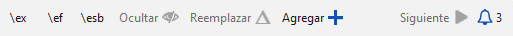

# 25. Crear una Biblia de estudio con Paratext 9.2
(y superiores) {#98137245ea6a44b79015596b67b3c634}

**Introducción**  Con Paratext 9.2 (y superior) puede crear una Biblia de estudio basada en su traducción añadiendo párrafos introductorios, barras laterales y notas a pie de página detalladas y referencias cruzadas adicionales para ayudar al usuario a tener una comprensión más profunda del texto bíblico.

**¿En qué punto del proceso se encuentra?**  Antes de crear una Biblia de estudio, querrá traducir y comprobar por consultor su Nuevo Testamento (o partes de él). A continuación, su administrador puede crear un nuevo proyecto (véase más abajo).

**¿Por qué es importante?**  La información de la Biblia de estudio se crea en un proyecto independiente con enlaces al texto traducido. Si el texto traducido cambia, el enlace puede romperse. Los enlaces pueden arreglarse, pero es menos probable que haya problemas si el texto es estable.

**¿Qué vas a hacer?**  Usted (o su administrador) creará un **Proyecto de adiciones a la Biblia de Estudio**. Como su nombre indica, aquí es donde puede añadir los materiales de estudio (sin que ello afecte a su traducción).

Este proyecto independiente contiene su texto adicional y una copia de solo lectura de su proyecto. Cuando esté listo, puede combinar el proyecto de adiciones a la Biblia de Estudio con su proyecto de traducción en un tercer proyecto.

- Crear un nuevo proyecto de adiciones a la Biblia de Estudio basado en su traducción
- Registrar el nuevo proyecto
- Añada el material adicional (introducciones, barras laterales, notas a pie de página y referencias cruzadas)
- Ocultar cualquier texto no bíblico en la traducción base (por ejemplo, los títulos)
- Combinar los proyectos para crear un proyecto de publicación.

## Crear un proyecto de adiciones a la Biblia de estudio {#0a743ded6dc24fc399975383664db289}

1. Use the Paratext menu to create a new project.
2. Establezca el tipo de proyecto como Adiciones a la Biblia de Estudio.
3. Choose your translation project for the “based on” project.
4. You will need to register the new project.
    - _A grey-out read-only copy of your project is displayed, with a toolbar at the top._

        

## Add the additional material {#e7a1b3e1b97b4eed9be5b9f1c2ed0dcd}

### Introductory material {#05a4f1d78d3549d9ac44235760b89873}

1. Position your cursor where you would like the additional material
2. Click **Add +** on the toolbar
3. A blue box with an \ip is added.
4. Teclee el texto.

### Sidebar text {#ab2be09dfc0e4fdeb177091e89785b58}

1. Position your cursor where you would like additional material
2. click **\esb** on the toolbar
    - _A sidebar panel is opened with a \ms marker added_
3. Type the title after the \ms marker
4. Press Enter
5. Choose a marker for the following text.
6. Teclee el texto.
7. Continúe según sea necesario.

### Extended cross-reference {#cbcab8e8c6a64e38bf737472fe26d8e9}

1. Position your cursor where you would like the cross-reference caller
2. click **\ex** on the toolbar
    1. A footnote panel is opened with a \ex markers added
3. Type in the cross-reference.

### Nota al pie extendida {#864c186270064955922ed758dc7d9fcf}

1. Position your cursor where you would like the additional footnote
2. click **\ef** on the toolbar
3. A footnote panel is opened with the appropriate \ef markers
4. Add footnotes as needed.

### Hide non-scriptural material {#8fff7769e5ae4060b0f1ffef9a979a79}

You can hide non-scriptural material such as headings from the translation

1. Position your cursor where you would like the additional footnote
2. Click **Hide** on the toolbar
    - _The text is displayed in a greyed-out box._

## Merge the projects to create a publication project {#23a03d9d683240a6a21290721a8dbb93}

Para publicar la Biblia de estudio, debe crear un proyecto de publicación.

1. Haga clic en el menú del proyecto de Adiciones a la Biblia de Estudio
2. Choose “Create merged publication project”

    

3. Click the dropdown list “**Merged publication project**”.
4. Create a new project or choose a previous project
5. Click **Create**
    - _Paratext combina el proyecto de traducción y el proyecto de Adiciones a la Biblia de Estudio y muestra el proyecto de publicación combinado._
6. If necessary change the view to **Preview**.

### Making changes {#9bd2afcdbf5946038a9b70561fcebc5d}

You now have three projects.

1. Your original translation project,
2. El proyecto de Adiciones a la Biblia de Estudio y
3. The Merged publication project.
- _Any corrections to the translation_ should be made to the _original translation project_.
    - Estas correcciones se actualizarán en el proyecto de Adiciones a la Biblia de Estudio la próxima vez que vuelva a crear el proyecto de publicación.
    - _Cualquier corrección al material de estudio bíblico_ debe hacerse en el proyecto _de Adiciones a la Biblia de Estudio_.
- The _merged publication project_ is read-only and cannot be changed.
    - To update the changes, recreate the merged publication project again.

## Proyecto de Adiciones a la Biblia de Estudio - Comparar versiones {#7b7d078eecd44a71ae7fa6217ba07218}

In Paratext 9.3, you can now Compare versions

1. Abrir un proyecto de Adiciones a la Biblia de Estudio
2. From the **Project** menu,
3. Under **Project**, choose **Compare Versions**
    - _The changes in the additions are displayed_.

## Imprimir la Biblia de Estudio con PTXPrint {#cfc9e16b905c4aa48c7aad34c7c5ef9a}

PTXPrint version 2.1.x (and above) can print the merged publication project. Para obtener instrucciones detalladas, consulte [https://software.sil.org/ptxprint/how-to-study-bible-layout/](https://software.sil.org/ptxprint/how-to-study-bible-layout/)

