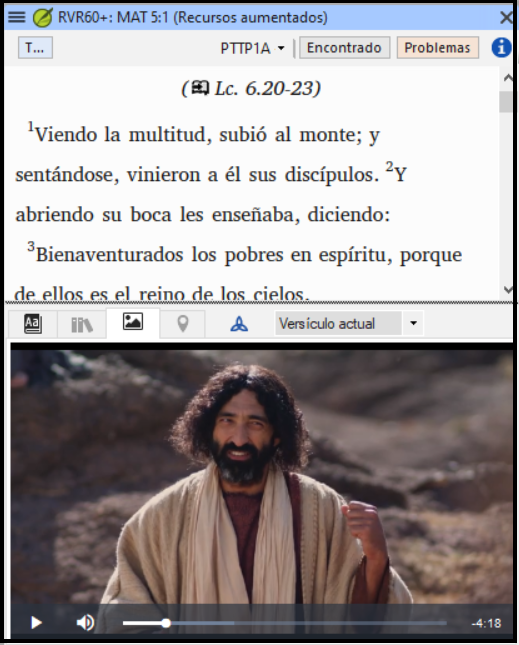

## **Novedades de Paratext 9.4 Beta** {#ef25a726728f449c90b3fdabf820eab6}

(extraído de [https://paratext.org/features/whats-new/whats-new-in-paratext-9-4-beta/](https://paratext.org/features/whats-new/whats-new-in-paratext-9-4-beta/))

**Algunos aspectos destacados**

- **Notificación de actualizaciones de proyectos en el ordenador del usuario:** Ahora, Paratext puede comprobar si los proyectos del propio ordenador se han actualizado en el servidor de Enviar/Recibir. Si se ha editado el proyecto, se notificará a los usuarios con un punto verde tanto en el menú principal como en el del proyecto (véase la imagen inferior). Los ajustes para comprobar si hay actualizaciones están disponibles en la ventana **Enviar/Recibir proyectos**. [Vídeo de demostración del menú principal](https://paratext.org/features/whats-new/whats-new-in-paratext-9-4-beta/?vimeography_gallery=157&vimeography_video=857678678)

    

- **Notificación de actualizaciones de los recursos instalados.** Un punto verde en el menú principal también puede indicar actualizaciones de textos de recursos en el ordenador local. El acceso a la configuración de esta función se encuentra en la ventana **Descargar/Instalar recursos**.
- **Interfaz de derecha a izquierda mejorada.** Paratext ahora muestra correctamente interfaces de usuario de derecha a izquierda (como el árabe). [Vídeo de demostración de derecha a izquierda](https://paratext.org/features/whats-new/whats-new-in-paratext-9-4-beta/?vimeography_gallery=157&vimeography_video=858761461)

    

- **Opción de ocultar las notas del proyecto.** Las numerosas banderas rojas en el texto pueden convertirse fácilmente en un obstáculo para la lectura. Ahora los usuarios pueden elegir entre ocultar o mostrar las banderas de notas de proyecto en el texto. Acceda desde el **menú Ver &gt; Mostrar notas del proyecto**. [Vídeo de demostración del menú del proyecto](https://paratext.org/features/whats-new/whats-new-in-paratext-9-4-beta/?vimeography_gallery=157&vimeography_video=857939433)

    

- **Comprobación de citas mejorada.** La nueva comprobación básica de "Tipos de cita" sabe dónde deben aparecer las citas en el texto basándose en los datos [de Glyssen](https://software.sil.org/glyssen/) y puede garantizar que todas estén marcadas adecuadamente. [Vídeo de demostración de los tipos de cotización](https://paratext.org/features/whats-new/whats-new-in-paratext-9-4-beta/?vimeography_gallery=157&vimeography_video=859138745)
- **Añadido vídeo a Recursos aumentados.** Ahora la pestaña Media de Recursos aumentados contiene videoclips de [LUMO](https://lumoproject.com/) y las series "Tierras bíblicas como aula" de UBS. [Vídeos de recursos mejorados - demostración en vídeo](https://paratext.org/features/whats-new/whats-new-in-paratext-9-4-beta/?vimeography_gallery=157&vimeography_video=858761461)

    

- **Importar/exportar listas de vocablos bíblicos.** Esta función debería mejorar el flujo de trabajo de los equipos de proyecto con la herramienta de vocablos bíblicos, permitiéndoles crear e intercambiar las listas de vocablos bíblicos a medida que avanza el proyecto. Por favor, instale la última actualización Beta (próximamente) para una funcionalidad completa. [Vídeo de demostración de vocablos bíblicos](https://paratext.org/features/whats-new/whats-new-in-paratext-9-4-beta/?vimeography_gallery=157&vimeography_video=858020833)

**¡Y muchas más mejoras!**

- Se ha añadido la posibilidad de utilizar el diccionario de FieldWorks con el Interlinealizador de Paratext. [▶ Vídeo de demostración de la integración de FieldWorks](https://paratext.org/features/whats-new/whats-new-in-paratext-9-4-beta/?vimeography_gallery=157&vimeography_video=859073261)
- Se ha añadido la posibilidad de cambiar el orden de las referencias cruzadas, notas a pie de página y barras laterales en los proyectos de Adiciones a la Biblia de Estudio. [▶ Vídeo de demostración de las Adiciones a la Biblia de Estudio](https://paratext.org/features/whats-new/whats-new-in-paratext-9-4-beta/?vimeography_gallery=157&vimeography_video=858761672)
- Añadida la capacidad de "Gestionar diseños". [▶ Vídeo demostrativo del menú principal](https://paratext.org/features/whats-new/whats-new-in-paratext-9-4-beta/?vimeography_gallery=157&vimeography_video=857678678)
- Ha facilitado la visualización de las coincidencias de pasajes paralelos.
- Elementos nuevos/mejorados en el menú Proyecto[(▶ Vídeo de demostración del menú Proyecto](https://paratext.org/features/whats-new/whats-new-in-paratext-9-4-beta/?vimeography_gallery=157&vimeography_video=857939433)):
    - La exportación a PTXprint está ahora disponible en el menú del proyecto.
    - Mejoras en "Insertar tabla".
    - Los proyectos derivados pueden abrir el proyecto base.
- Características adicionales[(▶ Demostración en vídeo de las características adicionales](https://paratext.org/features/whats-new/whats-new-in-paratext-9-4-beta/?vimeography_gallery=157&vimeography_video=859466352)):
    - Comparación de versiones mejorada para ofrecer un contraste claro entre las diferencias.
    - Capacidad para manejar comillas alternativas
    - La comprobación de referencias ofrece mensajes de error más específicos
- Asignaciones y Progreso acepta los códigos de libros conocidos (por ejemplo: "GEN")
- Los términos del diccionario de recursos aumentados ya no se repiten
- Cuando utilice "Dar comentario", Paratext marcará un punto en el Historial del proyecto
- [Scripture Burrito](https://docs.burrito.bible/en/latest/) 1.0 importación/exportación
- Varias correcciones de errores
