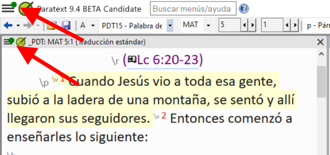
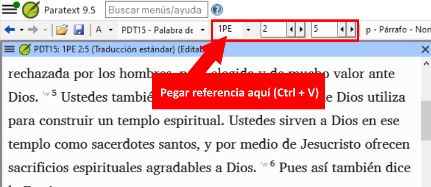

## Paratext 9.4 {#16154c54093a4476b7397c214e78e49f}

See Paratext website - [**What’s New in Paratext 9.4 Beta**](https://paratext.org/features/whats-new/whats-new-in-paratext-9-4-beta/)

Highlights

- **Notification of updates for projects on the user’s computer:**  A green dot on the project menu. Settings for checking for updates are available in the **Send/Receive projects** window. [Main menu video demo](https://paratext.org/features/whats-new/whats-new-in-paratext-9-4-beta/?vimeography_gallery=157&vimeography_video=857678678)

    

- **Notification of updates for installed resources.** A green dot in the main menu can also indicate updates to resource texts on the local computer. Access to the settings for this feature is in the **Download/Install resources**
- **Improved Right-to-Left interface.** Paratext now correctly displays right-to-left user interfaces (like Arabic). [RTL video demo](https://paratext.org/features/whats-new/whats-new-in-paratext-9-4-beta/?vimeography_gallery=157&vimeography_video=858761461)

    

- **Option to hide project notes.** Access from the **View menu &gt; Show Project Notes**. [Project menu video demo](https://paratext.org/features/whats-new/whats-new-in-paratext-9-4-beta/?vimeography_gallery=157&vimeography_video=857939433)

    

- **Improved quotation checking.** The new “Quotation Types” Basic Check knows where quotations should occur in the text based on [Glyssen](https://software.sil.org/glyssen/) data and can ensure that they are all marked appropriately. [Quotation types video demo](https://paratext.org/features/whats-new/whats-new-in-paratext-9-4-beta/?vimeography_gallery=157&vimeography_video=859138745)
- **Added video to Enhanced Resources.** Now the Media tab for Enhanced Resources contains video clips from [LUMO](https://lumoproject.com/) and UBS’s “Bible Lands as Classroom” series. [Enhanced resources videos – video demo](https://paratext.org/features/whats-new/whats-new-in-paratext-9-4-beta/?vimeography_gallery=157&vimeography_video=858761461)
- **Import/Export Biblical terms lists.** Allows users to create and exchange the Biblical Terms lists as the project progresses. [Biblical terms video demo](https://paratext.org/features/whats-new/whats-new-in-paratext-9-4-beta/?vimeography_gallery=157&vimeography_video=858020833)

**And Many More Improvements!**

## Paratext 9.3 {#4c850f9665ff4ab8870f1ae0fed0e870}

  [What’s new in Paratext 9.3](https://paratext.org/features/whats-new/whats-new-in-paratext-9-3/)

### Paratext Live uses a couple of servers {#14973ac6c79843a3a94db72e3348418d}

- Paratext 8, 9.0 y 9.1 utilizan un servidor llamado Internet (secundario) WCF y Paratext 9.2 utiliza Internet (primario) AMQP.
    - _Esta es la razón por la que no puede utilizar Paratext Live con 9.2 y 9.1 al mismo tiempo_
- En Paratext 9.3, cuando inicie Paratext live, elija qué servidor desea utilizar.
    - **Internet (primario)**, que es 9.2 y 9.3.
    - **Internet (secundario)** que es 9.0, 9.1 o Paratext 8.

:::note

Todo el mundo en una sesión en vivo en particular todavía tiene que utilizar el mismo servidor, es sólo que a partir de la 9.3 se puede trabajar con alguien en la 9.1 o con otra persona en la 9.2 (sólo que no al mismo tiempo)

:::

## Adiciones a la Biblia de estudio {#8c8628c57aa04e48b5d33488872d0b29}

La novedad más evidente es la posibilidad de **comparar versiones**.

1. Abrir un proyecto de Adiciones a la Biblia de Estudio
2. En el menú **Proyecto**,
3. Bajo **Proyecto**, seleccione **Comparar versiones**
    - _Los cambios en las adiciones se muestran_.

## Referencia bíblica en la barra de navegación {#3c00a0202ad949bc8909f66660badb73}

En Paratext 9.3 puede copiar y pegar una referencia bíblica en la barra de navegación.

1. Copiar el texto de una referencia (de otro archivo)
2. Haga clic en el **nombre del libro** en la barra de navegación
3. Pegar utilizando **Ctrl+V**

    

La referencia debe estar en un formato que se corresponda al idioma de la interfaz.

Por ejemplo,

- en inglés: MAT 12.3, Mrk 5:4, Galatians 1:12
- en español: Romanos 8:28

:::note

Los nombres deben coincidir con los que aparecen en los títulos. Actualmente no puede copiar desde Paratext, pero esa función se añadirá en una actualización posterior.

:::

## Herramienta de pasajes paralelos {#f660aff19a7541efaa453398f11dbacd}

- The colours have changed from **green** to **grey (and back to green in 9.4)**

- You can reduce or expand the Greek / Hebrew by clicking the little arrow.

## Abrir una colección de textos {#fd1736d1bd07444fb6902b8dccf951dc}

Hay un nuevo elemento en el **menú principal**

1. En el **menú de Paratext**
2. Seleccione **Abrir colección de textos**
    - _Esta ventana se parece a la que se utilizaba en versiones anteriores de Paratext_.

        

3. Abra una **colección de textos guardadas** desde la parte inferior izquierda
4. También puede abrir una colección de textos desde la ventana **Abrir**.

## Colocación de ventanas {#b526a01da9e04357804f4849c39f2fdc}

- Organice las ventanas tanto por **filas** como por **columnas**.

:::tip

¡Recuerda guardar tu diseño!

:::

## Ventanas flotantes {#493f51aae2f5480893f25897c408c26c}

- Desplegable para cambiar el proyecto activo

    

### Otros nuevos/cambiados {#4796465de7ac4f3190c47faa4b9750b8}

- **RegEx Pal** - desde el menú principal &gt; Avanzado o el menú del Proyecto &gt; Avanzado.
- La **sincronización** con Logos y otros programas compatibles está ahora **activada por defecto**
- Se han realizado cambios para facilitar la localización de los archivos de ayuda y de la interfaz de usuario
- Los **módulos de la Biblia** ahora pueden manejar **los marcadores de capítulos** en los libros adicionales
