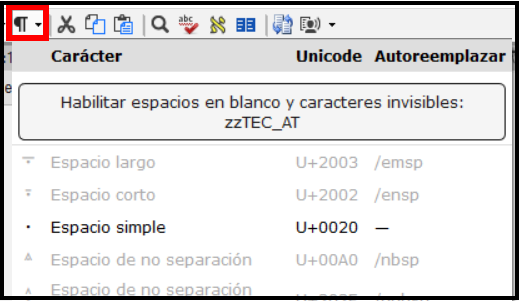
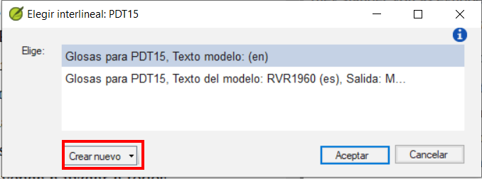
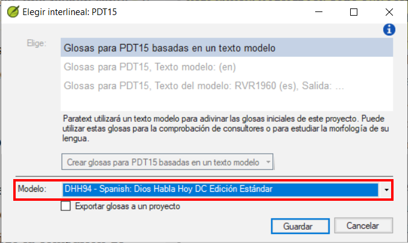
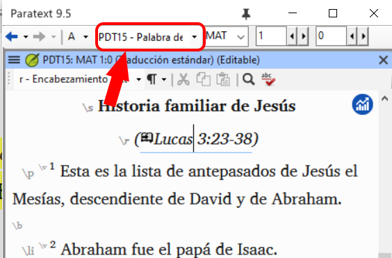

## Paratext 9.5 {#16154c54093a4476b7397c214e78e49f}

Consulte el sitio web de Paratext - [Novedades de Paratext 9.5](https://paratext.org/features/whats-new/whats-new-in-paratext-9-5)

Reflejos

- **Compatible con espacios en blanco y caracteres invisibles**\*
  - Nota: Todo el equipo debe actualizarse a 9.5
  - El administrador lo activa haciendo clic en el menú desplegable del icono del párrafo

    

- Disponible en
  - Editor de texto, lista de palabras, lista de resultados, Configuración de referencias bíblicas y Configuración de números
  - Inventario de caracteres, diálogos de corrección ortográfica, reglas de comillas.

- Mejoras en las adiciones a la Biblia de Estudio (SBA)
  - Asignaciones y Progreso
  - Ilustraciones en notas a pie de página y barras laterales
  - La configuración de referencia de la escritura dentro de las adiciones a la Biblia de Estudio ahora puede anular la configuración del proyecto base
  - Mejora de las funciones de comprobación, garantizando procesos de revisión más precisos y eficaces.

- Inventarios
  - Deshacer y rehacer

  - Paneles de inventario del muelle

  - Los paneles de inventario tienen ahora un aspecto y un comportamiento similares a los de la lista de palabras.

    

  - La aprobación se gestiona en función de la ubicación: texto en verso, texto sin verso o contenido de estudio dentro de SBA.

  - Filtrado para ayudar a encontrar y organizar los artículos del inventario.

- Mejoras adicionales
  - Mostrar **múltiples lenguas de glosa** en términos bíblicos (Principales términos bíblicos)

    

  - Botones de filtro para la ventana de recursos de descarga/instalación

    

  - Simplificación de la creación y edición de las configuraciones del interlinealizador.
    - Elija entre los existentes o haga clic en **Crear nuevo**

      

    - Elija el texto del modelo, haga clic en **guardar**

      

  - Lista de notas de proyecto - filtro "no leído y no resuelto

    

### Mejoras adicionales {#1ba598a5fd40807f8592f94edb9bef69}

También hemos introducido estas mejoras adicionales:

- Se ha añadido la posibilidad de mostrar **múltiples idiomas de glosa** en las ventanas de **Términos bíblicos**.
- Añadidos **botones de filtro** a la ventana **Descargar/Instalar recursos**.
- **Simplifica** el proceso de creación y edición de las **configuraciones del interlinealizador**.
- Añadido un filtro **"No leídas y no resueltas "** a la **lista de notas del proyecto**.
- Apoyo al nuevo formato de Flora, Fauna y Realia en la pestaña Enciclopedia de recursos mejorada.
- Apoyo a Flora, Fauna y Realia en varios idiomas.
- Se ha añadido un enlace de ayuda para la abreviatura de aparatos en el texto del lenguaje fuente GRK.
- Mejora de la localización de la interfaz de usuario.
- Mejora de la fusión de cambios para datos de proyectos.
- Permite modificar los inventarios y la configuración de los proyectos de transliteración.
- Se ha añadido la posibilidad de dar formato automáticamente a las referencias cuando se actualizan la Configuración de referencias bíblicas.
- Se ha incorporado una invitación a la encuesta anual Paratext.
- Muchas correcciones de errores.

Consulta el tema de ayuda _¿Qué hay de nuevo en Paratext 9.5?_ para obtener más información sobre estas mejoras.

## Paratexto 9.4 {#192598a5fd408046bbd6d5ee536dc483}

Consulte el sitio web de Paratext - [**Qué hay de nuevo en Paratext 9.4 Beta**](https://paratext.org/features/whats-new/whats-new-in-paratext-9-4-beta/)

Reflejos

- **Notificación de actualizaciones de proyectos en el ordenador del usuario:** Un punto verde en el menú del proyecto. Los ajustes para comprobar si hay actualizaciones están disponibles en la ventana **Enviar/Recibir proyectos**. [Vídeo de demostración del menú principal](https://paratext.org/features/whats-new/whats-new-in-paratext-9-4-beta/?vimeography_gallery=157&vimeography_video=857678678)

  

- **Notificación de actualizaciones de los recursos instalados.** Un punto verde en el menú principal también puede indicar actualizaciones de los textos de los recursos en el ordenador local. El acceso a la configuración de esta función se encuentra en los **Recursos de descarga/instalación**

- **Interfaz de derecha a izquierda mejorada.** Paratext muestra ahora correctamente las interfaces de usuario de derecha a izquierda (como el árabe). [Demostración en vídeo RTL](https://paratext.org/features/whats-new/whats-new-in-paratext-9-4-beta/?vimeography_gallery=157&vimeography_video=858761461)

  

- **Opción para ocultar las notas del proyecto.** Acceda desde el **menú Ver &gt; Mostrar notas del proyecto**. [Vídeo de demostración del menú del proyecto](https://paratext.org/features/whats-new/whats-new-in-paratext-9-4-beta/?vimeography_gallery=157&vimeography_video=857939433)

  

- **Comprobación de citas mejorada.** La nueva comprobación básica de "Tipos de citas" sabe dónde deben aparecer las citas en el texto basándose en los datos de [Glyssen](https://software.sil.org/glyssen/) y puede garantizar que todas están marcadas adecuadamente. [Demostración en vídeo de los tipos de cotización](https://paratext.org/features/whats-new/whats-new-in-paratext-9-4-beta/?vimeography_gallery=157&vimeography_video=859138745)

- **Agregado vídeo a los Recursos Mejorados.** Ahora la pestaña Media de los Recursos Mejorados contiene clips de vídeo de [LUMO](https://lumoproject.com/) y de la serie de UBS "Tierras de la Biblia como Aula". [Vídeos de recursos mejorados - demostración en vídeo](https://paratext.org/features/whats-new/whats-new-in-paratext-9-4-beta/?vimeography_gallery=157&vimeography_video=858761461)

- **Importar/Exportar listas de términos bíblicos.** Permite a los usuarios crear e intercambiar las listas de términos bíblicos a medida que avanza el proyecto. [Demostración en vídeo de términos bíblicos](https://paratext.org/features/whats-new/whats-new-in-paratext-9-4-beta/?vimeography_gallery=157&vimeography_video=858020833)

**¡Y muchas más mejoras!**

## Paratexto 9.3 {#4c850f9665ff4ab8870f1ae0fed0e870}

[Novedades de Paratext 9.3](https://paratext.org/features/whats-new/whats-new-in-paratext-9-3/)

### Paratext Live utiliza un par de servidores {#14973ac6c79843a3a94db72e3348418d}

- Paratext 8, 9.0 y 9.1 utilizan un servidor llamado Internet (secundario) WCF y Paratext 9.2 utiliza Internet (primario) AMQP.
  - _Esta es la razón por la que no puede utilizar Paratext Live con 9.2 y 9.1 al mismo tiempo_
- En Paratext 9.3, cuando inicie Paratext live, elija qué servidor desea utilizar.
  - **Internet (primario)**, que es 9.2 y 9.3.
  - **Internet (secundario)** que es 9.0, 9.1 o Paratext 8.

:::note

Todo el mundo en una sesión en vivo en particular todavía tiene que utilizar el mismo servidor, es sólo que a partir de la 9.3 se puede trabajar con alguien en la 9.1 o con otra persona en la 9.2 (sólo que no al mismo tiempo)

:::

## Adiciones a la Biblia de Estudio {#8c8628c57aa04e48b5d33488872d0b29}

La novedad más evidente es la posibilidad de **comparar versiones**.

1. Abrir un proyecto de Adiciones a la Biblia de Estudio
2. En el menú **Proyecto**,
3. En **Proyecto**, elija **Comparar versiones**
  - _Se muestran los cambios en las adiciones_.

## Referencia bíblica en la barra de navegación {#3c00a0202ad949bc8909f66660badb73}

En Paratext 9.3 puede copiar y pegar una referencia bíblica en la barra de navegación.

1. Copiar el texto de una referencia (de otro archivo)
2. Haga clic en el **nombre del libro** en la barra de navegación
3. Pegar con **Ctrl+V**

  

La referencia debe estar en un formato que se corresponda al idioma de la interfaz.

Por ejemplo,

- en inglés: MAT 12.3, Mrk 5:4, Galatians 1:12
- en español: Romanos 8:28

:::note

Los nombres deben coincidir con los que aparecen en los títulos.
Actualmente no puede copiar desde Paratext, pero esa función se añadirá en una actualización posterior.

:::

## Herramienta de pasajes paralelos {#f660aff19a7541efaa453398f11dbacd}

- Los colores han pasado de **verde** a **gris (y de nuevo a verde en 9.4)**

- Puede reducir o ampliar el griego / hebreo haciendo clic en la flechita.

## Abrir una colección de textos {#fd1736d1bd07444fb6902b8dccf951dc}

Hay un nuevo elemento de menú en el **menú principal**

1. Desde el **menú de Paratext**

2. Seleccione **Abrir colección de textos**
  - _Esta ventana se parece a la que se utilizaba en versiones anteriores de Paratext_.

    

3. Abrir una colección de **textos** previamente guardada desde la parte inferior izquierda

4. También puede abrir una colección de textos desde la ventana **Abrir**.

## Disposición de las ventanas {#b526a01da9e04357804f4849c39f2fdc}

- Ordenar las ventanas tanto por **filas** como por **columnas**.

:::tip

¡Recuerda guardar tu diseño!

:::

## Ventanas flotantes {#493f51aae2f5480893f25897c408c26c}

- Desplegable para cambiar el proyecto activo

  

### Otros nuevos/modificados {#4796465de7ac4f3190c47faa4b9750b8}

- **RegEx Pal** - desde el menú Principal &gt; Avanzado o el menú Proyecto &gt; Avanzado.
- **La sincronización** con Logos y otros programas compatibles está ahora **activada por defecto**
- Se han realizado cambios para facilitar la localización de los archivos de ayuda y de la interfaz de usuario
- **Los módulos de la Biblia** ahora pueden manejar **marcadores de capítulos** en los libros adicionales
