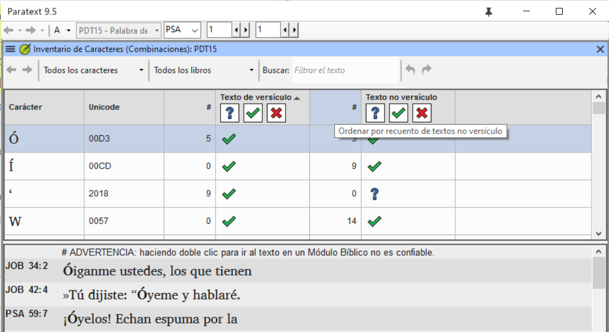
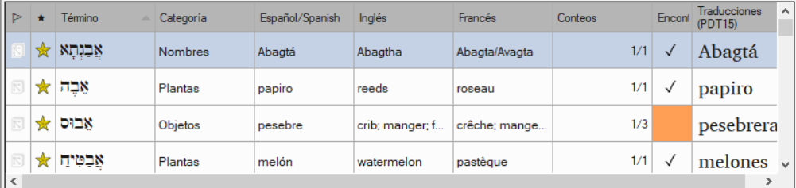
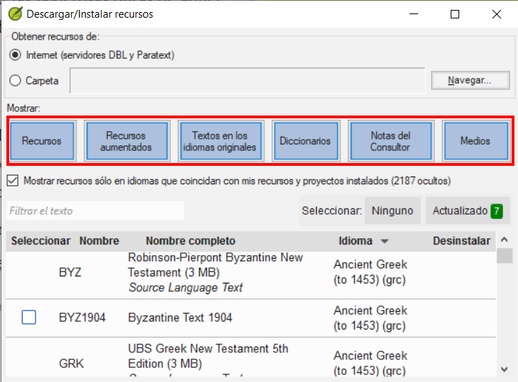
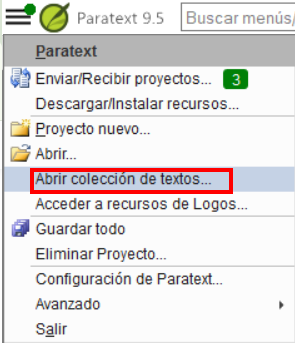
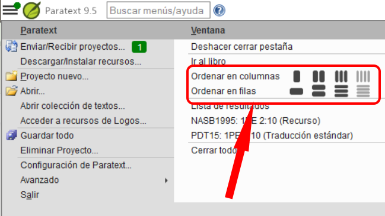

## Paratext 9.5 {#16154c54093a4476b7397c214e78e49f}

Consulte el sitio web de Paratext - [Novedades de Paratext 9.5](https://paratext.org/features/whats-new/whats-new-in-paratext-9-5)

Destacados

- **Compatible con espacios en blanco y caracteres invisibles**\*
  - Nota: Todo el equipo debe actualizarse a 9.5
  - El administrador lo activa haciendo clic en el menú desplegable del icono del párrafo

    

- Disponible en
  - Text editor, wordlist, results list, scripture reference settings and number settings
  - Character Inventory, Spell checking dialogs, Quotation rules.

- Study Bible Additions (SBA) Improvements
  - Asignaciones y Progreso
  - Figures in footnotes and sidebars
  - Scripture Reference Settings within SBA projects can now override the settings of the base project
  - Improved checking features, ensuring more accurate and efficient review processes.

- Inventories
  - Undo and redo

  - Dock Inventory panels

  - Inventory panels now consistent appearance and behaviour to Wordlist.

    

  - Approval is managed based on location - verse text, non-verse text, or study content within SBA.

  - Filtering to help find and organize inventory items.

- Additional improvements
  - Display **multiple gloss languages** in Biblical terms (Major Biblical Terms)

    

  - Filter buttons to the Download/Install resources window

    

  - Simplified creating and editing Interlinearizer settings.
    - Choose from existing or click **Create New**

      

    - Choose the model text, click **save**

      

  - Project notes list - “unread and unresolved” filter

    

### Additional Improvements {#1ba598a5fd40807f8592f94edb9bef69}

We’ve also made these additional improvements:

- Added the ability to display **multiple gloss languages** in **Biblical Terms** windows.
- Added **filter buttons** to the **Download/Install resources** window.
- **Simplified** the process of creating and editing **Interlinearizer settings**.
- Added an **“Unread and unresolved”** filter to the **Project notes list**.
- Provided support for the new format of Flora, Fauna, and Realia in the Enhanced Resource Encyclopedia tab.
- Provided support for multi-language Flora, Fauna, and Realia.
- Added a Help link for apparatus abbreviation in GRK Source Language Text.
- Improved UI localization implementation.
- Improved merging changes for project data.
- Allowed changing inventories and settings for Transliteration projects.
- Added ability to automatically format references when Scripture Reference settings are updated.
- Provided a built-in Paratext annual survey invitation.
- Many bug fixes.

Please see the _What’s new in Paratext 9.5?_ Help topic for more info about these improvements.

## Paratext 9.4  {#192598a5fd408046bbd6d5ee536dc483}

See Paratext website - [**What’s New in Paratext 9.4 Beta**](https://paratext.org/features/whats-new/whats-new-in-paratext-9-4-beta/)

Destacados

- **Notification of updates for projects on the user’s computer:**  A green dot on the project menu. Los ajustes para comprobar si hay actualizaciones están disponibles en la ventana **Enviar/Recibir proyectos**. [Vídeo de demostración del menú principal](https://paratext.org/features/whats-new/whats-new-in-paratext-9-4-beta/?vimeography_gallery=157&vimeography_video=857678678)

  

- **Notificación de actualizaciones de los recursos instalados.** Un punto verde en el menú principal también puede indicar actualizaciones de los textos de los recursos en el ordenador local. Access to the settings for this feature is in the **Download/Install resources**

- **Interfaz de derecha a izquierda mejorada.** Paratext muestra ahora correctamente las interfaces de usuario de derecha a izquierda (como el árabe). [Demostración en vídeo RTL](https://paratext.org/features/whats-new/whats-new-in-paratext-9-4-beta/?vimeography_gallery=157&vimeography_video=858761461)

  

- **Option to hide project notes.** Access from the **View menu &gt; Show Project Notes**. [Vídeo de demostración del menú del proyecto](https://paratext.org/features/whats-new/whats-new-in-paratext-9-4-beta/?vimeography_gallery=157&vimeography_video=857939433)

  

- **Comprobación de citas mejorada.** La nueva comprobación básica de "Tipos de citas" sabe dónde deben aparecer las citas en el texto basándose en los datos de [Glyssen](https://software.sil.org/glyssen/) y puede garantizar que todas están marcadas adecuadamente. [Demostración en vídeo de los tipos de cotización](https://paratext.org/features/whats-new/whats-new-in-paratext-9-4-beta/?vimeography_gallery=157&vimeography_video=859138745)

- **Agregado vídeo a los Recursos Mejorados.** Ahora la pestaña Media de los Recursos Mejorados contiene clips de vídeo de [LUMO](https://lumoproject.com/) y de la serie de UBS "Tierras de la Biblia como Aula". [Vídeos de recursos mejorados - demostración en vídeo](https://paratext.org/features/whats-new/whats-new-in-paratext-9-4-beta/?vimeography_gallery=157&vimeography_video=858761461)

- **Import/Export Biblical terms lists.** Allows users to create and exchange the Biblical Terms lists as the project progresses. [Demostración en vídeo de términos bíblicos](https://paratext.org/features/whats-new/whats-new-in-paratext-9-4-beta/?vimeography_gallery=157&vimeography_video=858020833)

**¡Y muchas más mejoras!**

## Paratext 9.3  {#4c850f9665ff4ab8870f1ae0fed0e870}

[What’s new in Paratext 9.3](https://paratext.org/features/whats-new/whats-new-in-paratext-9-3/)

### Paratext Live uses a couple of servers {#14973ac6c79843a3a94db72e3348418d}

- Paratext 8, 9.0 y 9.1 utilizan un servidor llamado Internet (secundario) WCF y Paratext 9.2 utiliza Internet (primario) AMQP.
  - _Esta es la razón por la que no puede utilizar Paratext Live con 9.2 y 9.1 al mismo tiempo_
- En Paratext 9.3, cuando inicie Paratext live, elija qué servidor desea utilizar.
  - **Internet (primary)**, which is 9.2 and 9.3.
  - **Internet (secondary)** which is 9.0, 9.1 or Paratext 8.

:::note

Todo el mundo en una sesión en vivo en particular todavía tiene que utilizar el mismo servidor, es sólo que a partir de la 9.3 se puede trabajar con alguien en la 9.1 o con otra persona en la 9.2 (sólo que no al mismo tiempo)

:::

## Study Bible Additions {#8c8628c57aa04e48b5d33488872d0b29}

The most obvious new feature the ability to **compare versions**.

1. Abrir un proyecto de Adiciones a la Biblia de Estudio
2. En el menú **Proyecto**,
3. En **Proyecto**, elija **Comparar versiones**
  - _Se muestran los cambios en las adiciones_.

## Scripture reference in navigation bar {#3c00a0202ad949bc8909f66660badb73}

En Paratext 9.3 puede copiar y pegar una referencia bíblica en la barra de navegación.

1. Copiar el texto de una referencia (de otro archivo)
2. Click in the **book name** in the navigation bar
3. Paste using **Ctrl+V**

  

La referencia debe estar en un formato que se corresponda al idioma de la interfaz.

Por ejemplo,

- en inglés: MAT 12.3, Mrk 5:4, Galatians 1:12
- en español: Romanos 8:28

:::note

Los nombres deben coincidir con los que aparecen en los títulos.
Actualmente no puede copiar desde Paratext, pero esa función se añadirá en una actualización posterior.

:::

## Parallel Passages Tool {#f660aff19a7541efaa453398f11dbacd}

- The colours have changed from **green** to **grey (and back to green in 9.4)**

- You can reduce or expand the Greek / Hebrew by clicking the little arrow.

## Open a text collection {#fd1736d1bd07444fb6902b8dccf951dc}

There is a new menu item on the **main menu**

1. From the **Paratext menu**

2. Choose **Open text collection**
  - _Esta ventana se parece a la que se utilizaba en versiones anteriores de Paratext_.

    

3. Open a previously **saved text collection** from the bottom left

4. You can still open a text collection from the **Open** window as well.

## Arranging windows {#b526a01da9e04357804f4849c39f2fdc}

- Arrange windows by **rows** as well as by **columns**.

:::tip

¡Recuerda guardar tu diseño!

:::

## Floating Windows {#493f51aae2f5480893f25897c408c26c}

- Desplegable para cambiar el proyecto activo

  

### Other new/changed {#4796465de7ac4f3190c47faa4b9750b8}

- **RegEx Pal** - from Main menu &gt; Advanced or Project menu &gt; Advanced.
- **Synchronizing** with Logos and other compatible programs is now turned **on by default**
- Se han realizado cambios para facilitar la localización de los archivos de ayuda y de la interfaz de usuario
- **Bible modules** can now handle **chapter markers** in the extra books
