## Paratext 9.5 {#16154c54093a4476b7397c214e78e49f}

See Paratext website - [What’s New in Paratext 9.5 Beta](https://paratext.org/features/whats-new/whats-new-in-paratext-9-5-beta/)

Highlights

- **Support for whitespaces and invisible characters**\*
  - Note: The whole team needs to update to 9.5
  - Administrator enables it on by clicking the dropdown on the paragraph icon

    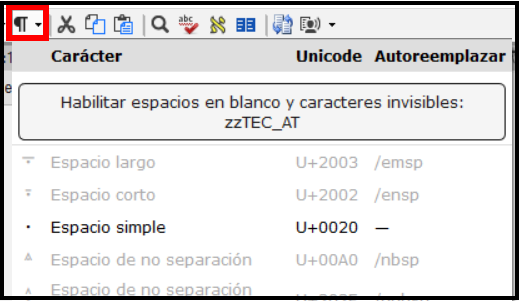

- Available in
  - text editor, wordlist, results list, scripture reference settings and number settings
  - Soon in Character Inventory, Spell checking dialogs, Quotation rules.

- Study Bible Additions (SBA) Improvements
  - Asignaciones y Progreso
  - figures in footnotes and sidebars
  - Scripture Reference Settings within SBA projects can now override the settings of the base project
  - Improved checking features, ensuring more accurate and efficient review processes.

- Inventories
  - undo and redo

  - dock Inventory panels

  - inventory panels now consistent appearance and behaviour to Wordlist.

    

  - Approval is managed based on location - verse text, non-verse text, or study content within SBA.

  - Filtering to help find and organize inventory items.

- Additional improvements
  - Display **multiple gloss languages** in Biblical terms (Major Biblical Terms)

    

  - Filter buttons to the Download/Install resources window

    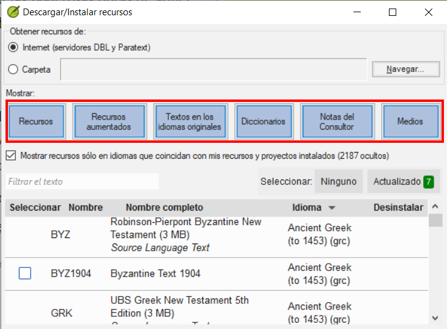

  - Simplified creating and editing Interlinearizer settings.
    - Choose from existing or click **Create New**

      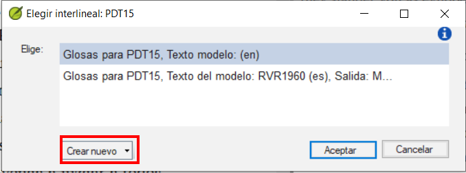

    - Choose the model text, click **save**

      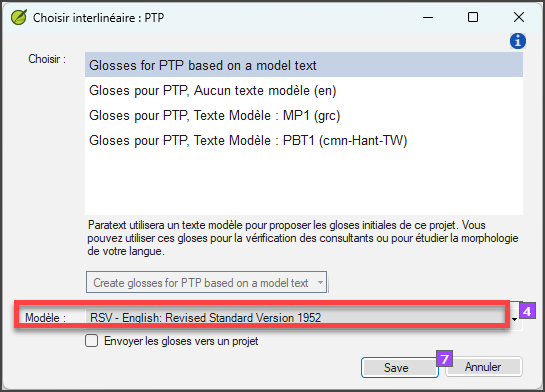

  - Project notes list - “unread and unresolved” filter

    

## Paratext 9.4  {#192598a5fd408046bbd6d5ee536dc483}

See Paratext website - [**What’s New in Paratext 9.4 Beta**](https://paratext.org/features/whats-new/whats-new-in-paratext-9-4-beta/)

Highlights

- **Notification of updates for projects on the user’s computer:**  A green dot on the project menu. Los ajustes para comprobar si hay actualizaciones están disponibles en la ventana **Enviar/Recibir proyectos**. [Vídeo de demostración del menú principal](https://paratext.org/features/whats-new/whats-new-in-paratext-9-4-beta/?vimeography_gallery=157&vimeography_video=857678678)

  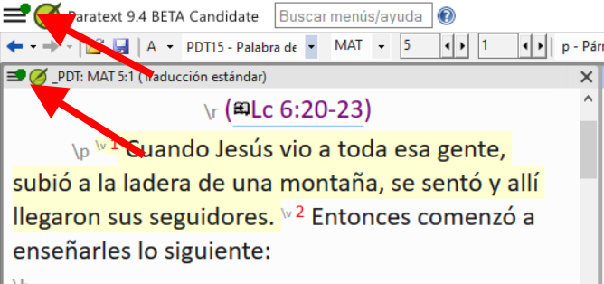

- **Notificación de actualizaciones de los recursos instalados.** Un punto verde en el menú principal también puede indicar actualizaciones de los textos de los recursos en el ordenador local. Access to the settings for this feature is in the **Download/Install resources**

- **Interfaz de derecha a izquierda mejorada.** Paratext muestra ahora correctamente las interfaces de usuario de derecha a izquierda (como el árabe). [Demostración en vídeo RTL](https://paratext.org/features/whats-new/whats-new-in-paratext-9-4-beta/?vimeography_gallery=157&vimeography_video=858761461)

  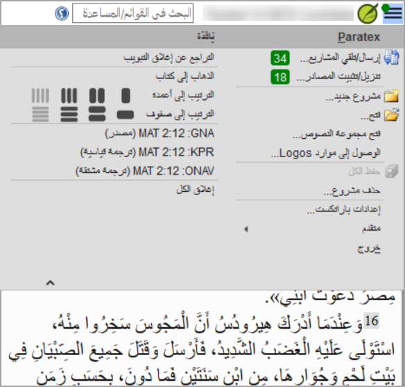

- **Option to hide project notes.** Access from the **View menu &gt; Show Project Notes**. [Vídeo de demostración del menú del proyecto](https://paratext.org/features/whats-new/whats-new-in-paratext-9-4-beta/?vimeography_gallery=157&vimeography_video=857939433)

  

- **Comprobación de citas mejorada.** La nueva comprobación básica de "Tipos de citas" sabe dónde deben aparecer las citas en el texto basándose en los datos de [Glyssen](https://software.sil.org/glyssen/) y puede garantizar que todas están marcadas adecuadamente. [Demostración en vídeo de los tipos de cotización](https://paratext.org/features/whats-new/whats-new-in-paratext-9-4-beta/?vimeography_gallery=157&vimeography_video=859138745)

- **Agregado vídeo a los Recursos Mejorados.** Ahora la pestaña Media de los Recursos Mejorados contiene clips de vídeo de [LUMO](https://lumoproject.com/) y de la serie de UBS "Tierras de la Biblia como Aula". [Vídeos de recursos mejorados - demostración en vídeo](https://paratext.org/features/whats-new/whats-new-in-paratext-9-4-beta/?vimeography_gallery=157&vimeography_video=858761461)

- **Import/Export Biblical terms lists.** Allows users to create and exchange the Biblical Terms lists as the project progresses. [Demostración en vídeo de términos bíblicos](https://paratext.org/features/whats-new/whats-new-in-paratext-9-4-beta/?vimeography_gallery=157&vimeography_video=858020833)

**¡Y muchas más mejoras!**

## Paratext 9.3  {#4c850f9665ff4ab8870f1ae0fed0e870}

[What’s new in Paratext 9.3](https://paratext.org/features/whats-new/whats-new-in-paratext-9-3/)

### Paratext Live uses a couple of servers {#14973ac6c79843a3a94db72e3348418d}

- Paratext 8, 9.0 and 9.1 use a server called Internet (secondary) WCF and Paratext 9.2 uses Internet (primary) AMQP.
  - _This is why you can't use Paratext Live with 9.2 and 9.1 at the same time_
- In Paratext 9.3 when you start Paratext live you choose what server you want to use.
  - **Internet (primary)**, which is 9.2 and 9.3.
  - **Internet (secondary)** which is 9.0, 9.1 or Paratext 8.

:::note

Everyone in a particular live session still needs to use the same server, it is just that from 9.3 you can work with someone on 9.1 or someone else on 9.2 (just not at the same time)

:::

## Study Bible Additions {#8c8628c57aa04e48b5d33488872d0b29}

The most obvious new feature the ability to **compare versions**.

1. Abrir un proyecto de Adiciones a la Biblia de Estudio
2. En el menú **Proyecto**,
3. En **Proyecto**, elija **Comparar versiones**
  - _Se muestran los cambios en las adiciones_.

## Scripture reference in navigation bar {#3c00a0202ad949bc8909f66660badb73}

In Paratext 9.3 you can copy and paste a scripture reference into the navigation bar.

1. Copy the text of a reference (from another file)
2. Click in the **book name** in the navigation bar
3. Paste using **Ctrl+V**

  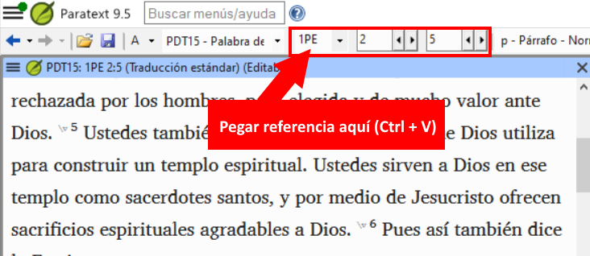

The reference should be in a format that matches the interface language.

For example,

- in English: MAT 12.3, Mrk 5:4, Galatians 1:12
- in Spanish: Romanos 8:28

:::note

The names must matches the names as they are seen in the titles.
Currently can't copy from Paratext, but that feature is being added to a later update.

:::

## Parallel Passages Tool {#f660aff19a7541efaa453398f11dbacd}

- The colours have changed from **green** to **grey (and back to green in 9.4)**

- You can reduce or expand the Greek / Hebrew by clicking the little arrow.

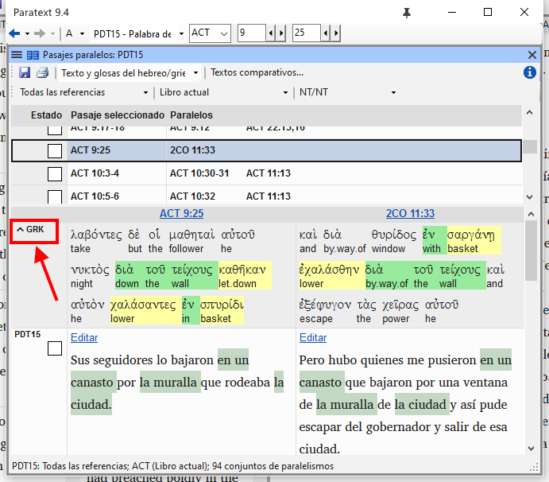

## Open a text collection {#fd1736d1bd07444fb6902b8dccf951dc}

There is a new menu item on the **main menu**

1. From the **Paratext menu**

2. Choose **Open text collection**
  - _This window looks like what was used in earlier versions of Paratext_.

    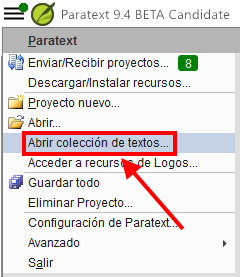

3. Open a previously **saved text collection** from the bottom left

4. You can still open a text collection from the **Open** window as well.

## Arranging windows {#b526a01da9e04357804f4849c39f2fdc}

- Arrange windows by **rows** as well as by **columns**.

:::tip

¡Recuerda guardar tu diseño!

:::

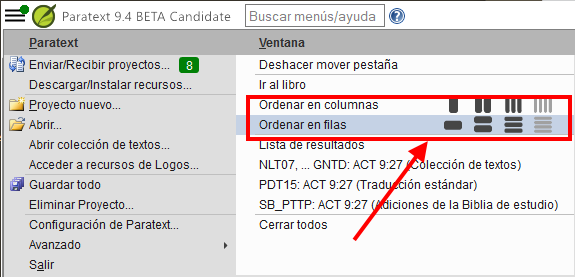

## Floating Windows {#493f51aae2f5480893f25897c408c26c}

- Dropdown to change the active project

  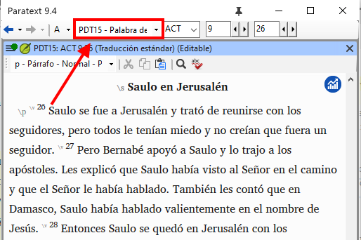

### Other new/changed {#4796465de7ac4f3190c47faa4b9750b8}

- **RegEx Pal** - from Main menu &gt; Advanced or Project menu &gt; Advanced.
- **Synchronizing** with Logos and other compatible programs is now turned **on by default**
- Changes have been made to help with the localization of the help files and the user interface
- **Bible modules** can now handle **chapter markers** in the extra books
