:::danger ÉBAUCHE
Pour révision  
ajouter quelque part help@paratext.org
:::

Les tâches suivantes nécessitent un rôle d'administrateur. Des liens vers le manuel du participant sont inclus lorsqu'ils sont pertinents.

# 1. IP : Installation de Paratext 9

**Introduction**  
Dans ce module, vous installez Paratext 9. Paratext est le principal logiciel mondial pour le développement et la vérification de nouveaux textes de traduction de la Bible ou des révisions aux textes existants. Développé conjointement par ABU et SIL International, il permet une traduction cohérente et précise, basée sur des textes originaux et modélisés sur des versions dans les principales langues. En partie grâce à ses fonctionnalités de collaboration de pointe, Paratext contribue grandement à produire des traductions de meilleure qualité en moins de temps que les outils et les méthodes précédentes ont permis.

**Avant de commencer**  
Il n'est pas nécessaire de désinstaller une version antérieure de Paratext. Mais il faut désinstaller une version BETA antérieure de Paratext 9. 

:::tip
Avant de désinstaller **sauvegardez vos dispositions des fenêtres en 9.3 BETA** si vous voulez la réutiliser dans la version 9.3. 
:::

**Pourquoi cette aptitude est-elle importante ?**  
Paratext 7, Paratext 8 et Paratext 9 peuvent être installées en même temps, mais il faut comprendre la limitation de leur utilisation ensemble.

- Plusieurs versions peuvent être installées
- Certains utilisent différents dossiers
  - My Paratext Projects (Paratext 7)
  - My Paratext 8 Projects (Paratext 9 and 8)
  - My Paratext 9 Projects (Paratext 9)
- Paratext 8 et 9 utilisent le même serveur de données.
- Paratext 7 utilisait un serveur différent (qui est maintenant fermé). 

**Qu’est-ce qu'on va faire ?**  
Vous allez installer Paratext 9 (sans désinstaller Paratext 7 ou 8). Vous installerez également les mises à jour à partir du menu Aide.

## 1.2 Installer Paratext 9

:::info
Téléchargement disponible sur le site <https://paratext.org/download>  
- Standard Installation   
- OU Offline Installer + Latest Update
:::

1. Double-cliquez sur le fichier d’installation
2. Cochez « I agree to the licence terms » (j’accepte les termes de la licence)
3. Cliquez sur **Install** (Installer).  
   - *Cette étape peut prendre quelques minutes si le programme d’installation doit installer .NET 4.8 Framework sur votre ordinateur*.  
   - Si une boîte de dialogue apparaît et demande votre permission, cliquez sur **Oui/Yes** ou fournissez les informations d’identification nécessaires.  
   - *Un message de bienvenue s’affiche*.
4. Cliquez sur **Next** (Suivant)   
   - *L’étape « Dossier de destination » s’affiche*
5. Acceptez les valeurs par défaut du dossier.

:::info
Les données de Paratext 9 et 8 partagent le même répertoire mais Paratext 7 a eu besoin d'un répertoire de données séparé.
:::

1. Cliquez sur **Suivant**, puis **Install**
1. Cliquez sur **Terminer** et puis **Fermer**.

:::tip 
La première fois que vous lancez Paratext 9, vous devrez entrer votre code d’inscription de Paratext. Si vous n'avez pas encore de code, vous pouvez vous inscrire à partir de ce dialogue.
:::

## 1.3 Inscription d’un utilisateur de Paratext 7 
### (à la première exécution de Paratext)

:::tip
Paratext 8 et 9 peuvent utiliser le même inscription, mais tous les utilisateurs de Paratext 7 ont besoin d'un nouvel inscrition pour Paratext 9.
:::
1. Exécuter Paratext 9 (pour la première fois)
1. Choisissez la langue de l’interface
    - *Une boîte de dialogue s’affiche pour demander votre code d’inscription*.

Passez à votre navigateur
1. Accédez à [https://registry.paratext.org](https://registry.paratext.org/)
    - *La page “Sign in”(se connecter) s’affiche.*
1. Tapez votre adresse émail (du Gmail)
1. Sign in avec Google.
    - *Le Nouvel Utilisateur Paratext formulaire s'affiche*. 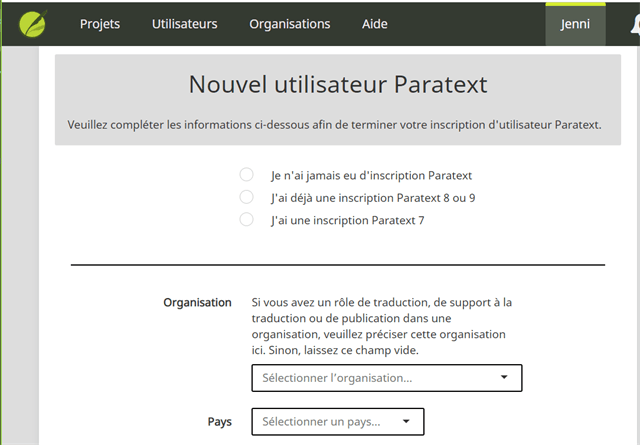
1. Choisissez parmi les trois possibilités d'inscription
1. Saisissez (ou copiez) le code d’inscription Paratext 7 de l’utilisateur (s'ils en ont un)
1. Remplisissez le formulaire (si nécessaire, voir 3.3 pour plus de détails)
1. Copier le nouveau code de Paratext 9

Retournez à Paratext  
1. Paratext va coller le code
2. Remplissez d'autres détails
3. Cliquez sur **OK**.

## 1.4 Mise à jour de votre version existante de Paratext

:::tip
Si votre connexion Internet le permet, nous vous recommandons d'utiliser les mises à jour automatiques. Sinon, vous pouvez télécharger les mises à jour et les installer manuellement.
:::

### Mises à jour automatiques
1. Dans le menu **Paratext**, sous **Aide**, développez le menu, choisissez **Mise à jour automatique du Paratext**.
2. Lorsqu'une mise à jour a été téléchargée, Paratext vous en informe.  
    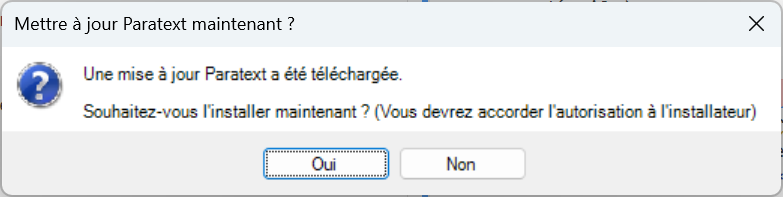  
4. Choisissez **Oui**.
   - Plusieurs boîtes de dialogue s'afficheront pour demander une autorisation.

### Mises à jour manuelles
1. Dans le menu **Paratext**, sous **Aide**, développez le menu, choisissez **Vérification des mises à jour**.
   - Paratext va vérifier les mises à jour et télécharger le fichier MSP.
2. Choisissez **Oui**.
   - Plusieurs boîtes de dialogue s'affichent pour demander une autorisation.

# 2. Inscrire le projet 

:::tip
Le formulaire d'inscription du projet est très long. Il a été découpé en plusieurs sections (fond bleu) avec des commentaires qui vous aider à remplir le formulaire (tableau dans le fond bleu) et des actions à effectuer (fond blanc).
:::

1. Cliquez sur le bouton **S'inscrire en ligne**
2. Remplissez le formulaire web. 

:::tip 
Les champs marqués d'un astérisque rouge sont obligatoires.
:::

:::info Formulaire et explication
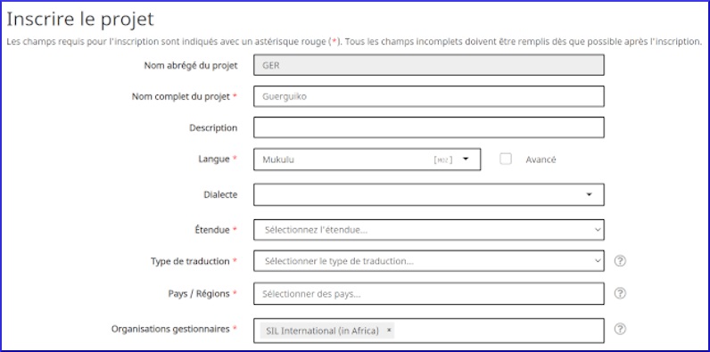

| Nom | Description |
|----|-----|
| **Nom abrégé** | Ce champ est rempli pour vous par le projet. Vous ne pouvez pas modifier le nom abrégé du projets. |
| **Nom complet** | Vous pouvez modifier le nom complet du projet. |
| **Description** | Ajoutez des informations supplémentaires ici si vous le souhaitez. Il y a également des champs pour plus d'informations sur le projet dans la deuxième partie du formulaire.|
| **Langue** | Le nom de la langue doit correspondre à une entrée de la base de données Ethnologue. Voir plus de détails ci-dessous. Paratext 8 nécessite un identifiant de langue pour votre langue. 
:::

**Langue**  

1. Cliquez sur la case "**Avancé**" pour remplir plus d'informations si vous devez distinguer la langue de votre projet de la langue avec ce code Ethnologue.  

    - *Le formulaire avancé ressemble à ceci, où les choix que vous sélectionnez sous Script, Region ou Variant ajoutent des lettres et des chiffres supplémentaires à l'identifiant*.

:::info Formulaire et explication

 |  |  |
 |--|--|
| **L’étendue** | Fait référence aux livres que vous avez l'intention de traduire, par exemple, la Bible entière, le Nouveau Testament, la Bible entière plus le Deutérocanon, des portions, etc. |
| **Le type de traduction**  | - Choisissez **Première** s'il s'agit de la première traduction dans cette langue,|
| |- Choisissez **Revision** s'il s'agit d'une révision d'une traduction antérieure, vous devez préciser que vous avez l'autorisation des détenteurs des droits de la traduction que vous révisez |
| |- Choisissez **Nouveau** s'il s'agit d'une nouvelle traduction mais qu'il existe une traduction antérieure pour cette langue.  
||- Choisissez **Matériel d'étude/d'aide** pour les traductions comprenant du matériel d'étude, tel qu'une Bible d'étude.
| **Pays / Régions** | Sélectionnez le ou les pays dans lesquels la traduction est destinée à être utilisée.
||1. Vous pouvez taper quelques lettres du nom puis choisir le pays souhaité.
||2.  Vous pouvez spécifier plus d'un pays si la langue s'étend au-delà des frontières.
| **Organisations géstionnaires** | Choisissez dans la liste des organisations. Vous pouvez le modifier si nécessaire par la suite. |
:::

:::tip
Si le détenteur éventuel des droits est une organisation qui n'est pas encore formée ou reconnue, choisissez quelque chose dans la liste et modifiez l'enregistrement plus tard.
:::

:::info Formulaire d'enregistrement partie 2
**Plus d'informations**
La deuxième partie du formulaire d'enregistrement contient plusieurs endroits où vous pouvez ajouter des informations supplémentaires sur votre projet. Aucun de ces champs n'est obligatoire.

:::
:::info Formulaire d'inscription partie 3
**Visibilité**

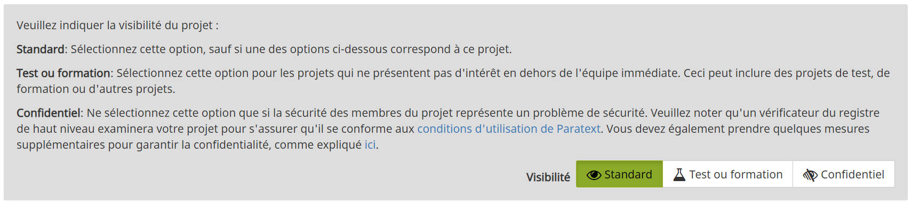

1. **Standard** est le choix par défaut. Les informations sur le projet ne sont pas accessibles au public, mais seulement aux utilisateurs enregistrés de Paratext au sein de la même organisation.
2. **Test ou Formation** est bon pour les projets de test ou les projets que vous créez uniquement pour les utiliser dans un programme de formation ou un atelier.
3. **Confidentiel** est destiné aux situations où la saisie d'informations sur votre projet en ligne est un problème de sécurité. Les informations sont limitées aux membres du projet et aux personnes qui gèrent les données d'inscription pour l'organisation.

**Consentement**
La dernière condition d'inscription est d'indiquer que vous vous conformerez aux directives de traduction du **Forum of Bible Agencies International** (un lien est fourni) et que vous **acceptez** de conserver une copie de sauvegarde de votre projet dans la bibliothèque de Bible Numérique. La bibliothèque biblique numérique ne partagera pas votre projet avec qui que ce soit sans votre autorisation expresse.

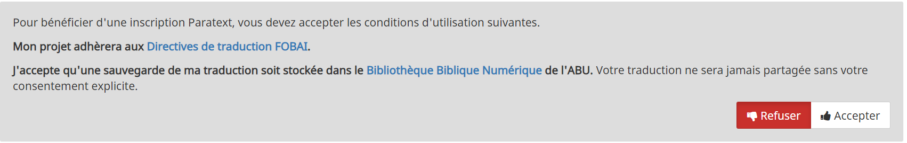  

:::info
La "Digital Bible Library" (Bibliothèque Biblique Numérique) est un outil pour rendre les traductions disponibles en ligne ou pour les utilisateurs mobiles, mais votre projet ne sera disponible à personne jusqu'à ce que vous acceptiez de le rendre disponible.
:::

Lorsque vous avez terminé de remplir les informations d'enregistrement,  

1. Cliquez sur **Envoyer l'inscription**  
    - *Si les informations sont complètes, le site devrait vous indiquer que l'inscription a été acceptée. (Il se peut que vous deviez faire défiler la page jusqu'en haut pour le voir)*.
      
    - *Un message s’affiche « L'inscription du projet a été réalsée avec succès*. »
    
:::note
**Comment mettre à jour ou modifier une inscription**
    Si vous souhaitez ultérieurement mettre à jour ou modifier l'enregistrement de votre projet, vous pouvez dans Paratext  
     1. Aller dans l'onglet **≡**, sous le projet, **Paramètres du projet**, **Propriétés du projet**.
     2. Cliquez sur le lien **Gérer l'enregistrement** en bas de l'onglet **Général**.
     - OU
     1. Accédez au **registry.paratext.org** dans votre navigateur Web,
     1. Trouvez votre projet et cliquez sur "**Modifier**".
:::  

1. Retournez à Paratext  
   - *Il devrait détecter que le projet est maintenant inscrit et vous en informer*.
   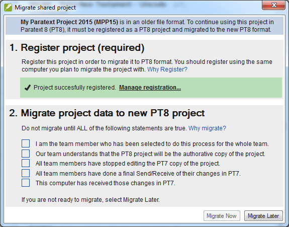

# **3. INS : Inscription des utilisateurs**

**Introduction**  
Tous les utilisateurs doivent être inscrit pour utiliser Paratext. Les utilisateurs de Paratext 8 peuvent utiliser leur inscription existante dans Paratext 9. Les nouveaux utilisateurs et tous les utilisateurs qui n'ont pas mis à jour leur inscription à Paratext 7 devront s'inscrire à Paratext 9.

**Avant de commencer** 
Paratext 9 est déjà installé et vous avez les codes d’inscription Paratext 7 pour les utilisateurs (le cas échéant). Il est préférable que tous les utilisateurs aient leur propre adresse électronique. Si ce n'est pas le cas, l'administrateur peut les inscrire.

**Pourquoi cette aptitude est-elle importante ?**  
Dans Paratext 9, l’on doit inscrire les utilisateurs que les projets. L’accès à des ressources textuelles spécifiques, telles que la Parole de Vie, est déterminé par l'organisation dont vous faites partie.

**Qu’est-ce que vous allez faire ?**  
- Vous allez inscrire un utilisateur de Paratext 9
  - avec une compte google
  - avec une adresse email non-google
  - sans adresse email
- Générer un nouveau code pour un utilisateur. 

## 3.1 S'inscrire avec un compte Google

1. Accédez à [https://registry.paratext.org](https://registry.paratext.org/)  
*L'écran "Connexion" s'affiche*.
1. Tapez votre adresse émail
*Votre adresse sera vérifiée.*
1. Connectez-vous à l’aide de votre adresse email (Gmail)
*Un nouvel écran s'affiche pour demander votre mot de passe*.
1. Tapez votre mot de passe Google
1. Cliquez sur **Yes** (Oui) pour autoriser Paratext à utiliser votre profile.
*New Paratext 9 User s’affiche et vous pouvez remplir le formulaire.*
Si vous n’avez pas d’adresse Gmail, voir section [3.4](#34)

### 3.2 Remplir le formulaire 

1. Choisissez l’un des trois choix d’utilisateur (nouveau, déjà Paratext 7, déjà Paratext 8)
1. Si vous êtes un utilisateur de Paratext 7, fournissez votre code d’enregistrement Paratext 7
1. Choisissez votre organisation (ou laissez le champ vide)
*Toute personne peut s'inscrire pour utiliser Paratext, mais les personnes qui ne sont pas membres d'un organisme de traduction et qui ne sont pas membres d'un projet enregistré ne pourront utiliser toutes les fonctionnalités de Paratext et ne pourront accéder qu'à quelques ressources*.
1. Choisissez votre **pays**
1. Entrez, si pertinent, votre filiale (entité sur le terrain) et votre superviseur
1. Expliquez la raison pourquoi vous voulez utiliser Paratext.
1. Cochez (ou pas) la case pour recevoir les annonces.
1. Cliquez sur **Register** (S’inscrire)
*Vous recevrez votre code d’inscription (et également par émail*.
  
:::tip
Gardez bien cet email, ou le code qui est affiché ici, parce que si vous le perdez, il n'y a aucun moyen de le chercher encore. (Il s'agit d'une fonctionnalité de sécurité, les codes d’utilisateur ne sont pas stockés sur le serveur pour qu'ils ne puissent pas être volés si quelqu'un attaque le serveur.)
:::

## 3.3 S'inscrire sans un compte Google 

Si votre compte email ne se trouve pas sur un serveur Google, ou si vous choisissez de ne pas utiliser Google pour l'authentification, le serveur de registre vous demandera d'entrer un mot de passe.
1. Entrez le mot de passe que vous souhaitez configurer
1. Entrez le mot de passe à nouveau comme confirmation
Le serveur enverra un courrier électronique à votre compte avec un lien de vérification.
1. Ouvrez votre courrier électronique, accédez au lien et procédez à l'enregistrement de Paratext (voir [3.3](#33)).

## 3.5 Changer (générer) un code nouveau

Il existe diverses raisons pour lesquelles vous devrez changer votre code Paratext dans le futur. L'une des raisons les plus courantes est le vol ou la panne de votre ordinateur.

**3.5.1 Changer votre propre code**

1. Accédez au site d'inscription [https://registry.paratext.org](https://registry.paratext.org/).
1. Se connecter (si vous n'êtes pas connecté)
1. Cliquez sur le nom d'utilisateur en haut à gauche.  
   - *Un menu s'affiche*.  
    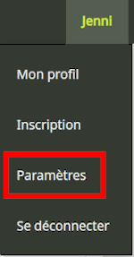
1. Cliquez sur **Paramètres**.
1. Sous Paratext, cliquez sur ‘**Inscription**”.  
L'écran des détails d'inscription s'affiche
1. Cliquez sur le bouton **Generate** pour générer un nouveau code.
   - *Le code sera envoyé à votre adresse email.*
1. Lancer Paratext  
   - *S'il se connecte à Internet, il détecte que l'ancien code n'est plus valide et il vous demandera de mettre à jour vos informations d'inscription*.
1. Allez à votre courrier électronique et copiez le nouveau code.
1. Retournez à Paratext  
   - *Il est possible que Paratext ait déjà trouvé votre nouveau code*.
1. Si ce n'est pas le cas, collez le nouveau code dans le formulaire d'inscription et cliquez sur **OK**.  
   - *Vous êtes réinscrit*.
  
Vous devrez le faire sur n'importe quel autre ordinateur sur lequel votre code de Paratext est installé.

Si Paratext ne signale pas un changement de code, vous pouvez le faire de la façon suivante
- **≡ Onglet**, sous   - **Aide**   - **Informations d'inscription** et collez-y le code.

**3.5.2 Changer un code pour un utilisateur (que vous avez inscrit)**

1. Accédez au site d'inscription [https://registry.paratext.org](https://registry.paratext.org/)
2. Se connecter (si vous n'êtes pas connecté)
3. Cliquez sur **User**
4. Cliquez sur le nom d'utilisateur de la liste
5. Cliquez sur la flèche bas (à droite de View)
6. Choisissez **Generate code**
Un message s'affiche.
   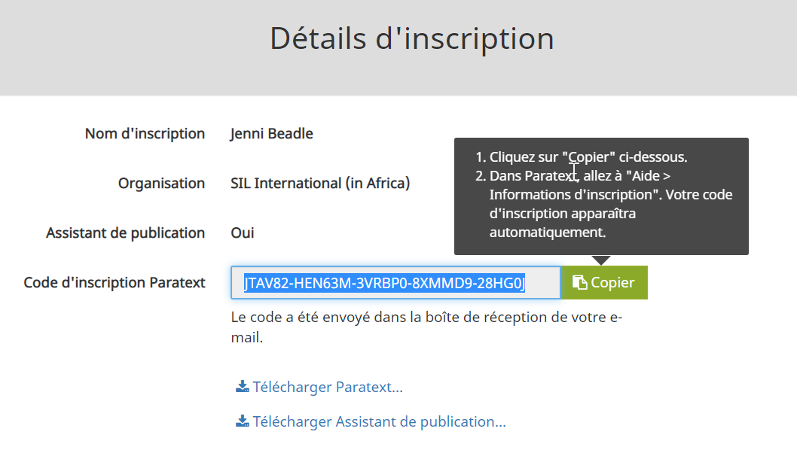
1. Cliquez sur **Proceed**
2. Regardez votre email.

## 3.6 Inscrire un Utilisateur (sans adresse courriel)

:::info
Tout administrateur d'un projet inscrit peut créer de nouveaux inscriptions d'utilisateurs s'ils doivent ajouter des personnes à leur projet. Ces utilisateurs n'ont pas besoin d'avoir une adresse email.
:::

1. Accédez à [https://registry.paratext.org](https://registry.paratext.org/)
1. Connectez-vous à l’aide de votre adresse email
1. Cliquez sur **Users**
1. Cliquez sur **+Register New User**
    - Le dialogue New Paratext 9 User s’affiche.
     
1. Remplissez le formulaire avec leur nom, etc.  

:::caution
Un utilisateur ajouté sans leur propre adresse email, ne peut pas être un administrateur d'un projet ni un conseiller. Si vous souhaitez faire de quelqu'un un conseiller ou un administrateur, doivent s'inscrire pour Paratext eux-mêmes, puis vous pouvez ajouter leur nom au projet.
:::

- Cliquez sur **Créer**   
Le code d’inscription pour le nouvel utilisateur sera envoyé par courrier électronique à l'administrateur après avoir été approuvé.
Gardez bien ce code, car il ne peut pas être récupéré si vous le perdez. Pourtant vous pouvez générer un nouveau code, voir [3.5](#s35)

## 3.7 Si le projet de traduction ne fait pas partie d’une organisation reconnue

- Si un traducteur ne fait pas partie d'un organisme reconnu, on pourra faire une demande à BoG ([boardofgovernors@paratext.org](mailto:boardofgovernors@paratext.org)) pour devenir membre de la pseudo-organisation « Independent Translators ».  
Il se peut que seulement peu de propriétaires de textes ressources accordent l’accès à ce groupe.
  

# 4. CP : Créer un nouveau projet

**4.1 Introduction**  
Dans ce module, vous allez créer et inscrire un nouveau projet.

**Avant de commencer**  
Vous avez déjà installé Paratext 9 et inscrit un utilisateur.

**Pourquoi cette aptitude est-elle importante ?**  
Un aspect nouveau dans Paratext 8 et 9 est que les projets et les utilisateurs doivent être inscrits. Cela peut sembler une complication, mais il offre des avantages aux utilisateurs.

Comme nous avons vu dans la section d'inscription des utilisateurs, l'administrateur d'un projet peut créer des inscriptions pour les utilisateurs dont ils souhaitent faire participer à son projet.

**Qu’est-ce qu'on va faire ?**  
On va créer et inscrire un nouveau projet.

## 4.2 Créer un nouveau projet

- **≡ Paratext**, sous **Paratext** - **Nouveau projet**
*La boîte de dialogue Propriétés et paramètres de projet s'affiche*.
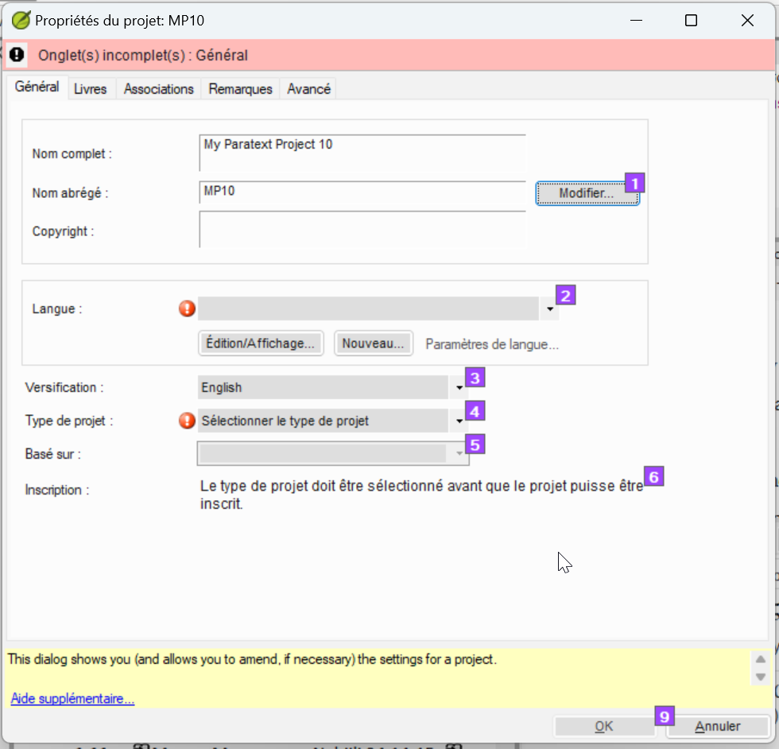

## 4.3 Changer le nom du projet

1. Cliquez sur le bouton **Edit** (Modifier)
*La boîte de dialogue **Modifier le nom complet** s'affiche*
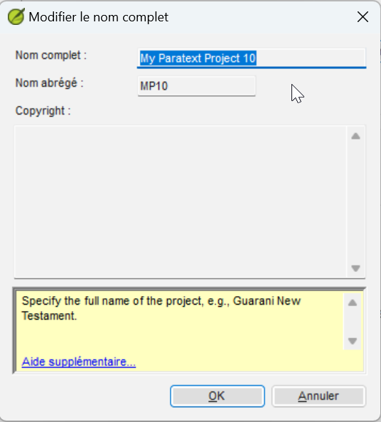
1. Dans la section **Nom complet**, tapez un nom qui inclut le nom de la langue
1. Sous **Nom abrégé**, tapez le code **ISO** pour la langue.

:::info
Une fois que vous créez un nom de projet, le nom abrégé ne peut pas être modifié, car c'est le nom que Paratext donnera au dossier contenant les fichiers de projet, ainsi que le nom donné au projet sur le serveur Internet. (Cependant, vous pouvez convertir le projet vers un nouveau projet avec un nom abrégé diffèrent. Mais la conversion d'un projet peut prendre de nombreuses heures.)
:::

**4.4 Spécifier la langue**

Si vous avez un autre projet Paratext dans la même langue, vous pouvez déjà choisir la langue dans la liste dans Paratext **[2]**. Sinon, vous devrez créer une nouvelle langue.
1. Cliquez sur **Nouveau**  
*La boîte de dialogue **Choisir un identificateur de langue Identifier** s’affiche*.
   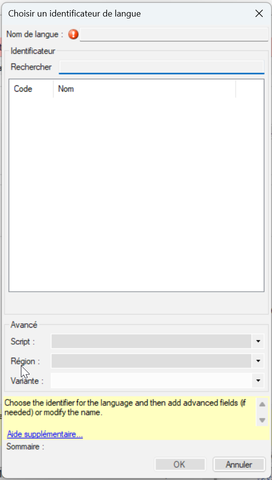
1. Cliquez dans la zone de **Recherche**  
1. Commencez à saisir le nom de votre langue  
Paratext affiche les noms correspondants.
1. Cliquez sur votre langue dans la liste.
Paratext ajoutera le nom de la langue.
1. Remplissez les champs de la section Avancé, si nécessaire.
1. Cliquez sur **OK**.  
Vous pouvez également spécifier des informations supplémentaires si nécessaire dans la section "avancé" de la boîte de dialogue des paramètres de langue.

**4.5 Type de projet**

1. Cliquez sur la liste déroulante à côté de **Type de projet**

1. Choisissez le type approprié pour votre projet.

S'il s'agit d'un projet dépendant comme une retraduction, d'une traduction fille ou d'un projet de translittération, vous devrez définir la source.

**4.6 Inscrire le nouveau projet**

1. Assurez-vous d'avoir donné un nom au projet et choisi le type de projet.
1. Cliquez sur **S'inscrire en ligne** pour accéder à la page d'inscription
1. Remplissez les informations (voir ci-dessus)
1. Cliquez sur **Register** (Inscrire) pour soumettre et retournez à Paratext.
Paratext doit "automagiquement" détecter que le projet est inscrit.
1. Cliquez sur **OK** pour créer le nouveau projet.

Les types de Projets qui n’ont pas besoin d’être inscrits séparément

- Projets qui héritent l’inscription du parent
- Retraduction
- Translittération
- "Auxiliaire"
- Remarques du conseiller

**4.7 Modifier votre inscription**

Lorsque vous travaillez dans votre projet, vous pouvez modifier vos informations d'inscription plus tard.

1. Dans Paratext, vérifiez que vous avez une connexion Internet,
1. **≡ Onglet**, sous **Projet**   - **Propriétés du projet**   - **Paramètres de projet**
1. Cliquez sur le lien **Gérér l'inscription**  
L'information de votre inscription s'affiche. Un administrateur peut modifier l'information.

# 5. **MD : Migrer**
MD : Migration des données
:::caution
La migration n'est nécessaire que pour les projets **Paratext 7**.
:::

**Introduction**  
La migration est le processus qui consiste à déplacer un projet (y compris tous les fichiers de paramètres) de **Paratext 7** vers Paratext 8 (et ensuite ouvert dans Paratext 9). Les projets Paratext 8 peuvent être lus dans Paratext 9 sans migration. Comme Paratext 9 n'a pas de fonction de migration, tous les projets Paratext 7 restants devront d'abord être **migrés vers Paratext 8**. 

**Avant de commencer**  
Le projet Paratext 7 doit se trouver dans le dossier "Mes projets Paratext". Vous devez également avoir installé **Paratext 8 et 9.**.

**Pourquoi est-ce important ?**  
Le serveur Paratext 7 a été fermé il y a plusieurs années, donc aucun projet Paratext 7 n'est sauvegardé sur le serveur. Aussi, afin de bénéficier de toutes les fonctionnalités de Paratext 9, vos données doivent être migrées. Étant donné que Paratext 7 et Paratext 9 utilisent des serveurs d'envoyer/recevoir différents, tous les membres de l'équipe de projet doivent utiliser Paratext 8 ou 9.

Les utilisateurs peuvent avoir Paratext 7 et Paratext 8 (et 9) installés en même temps, et utiliser l'un ou l'autre, mais aucun projet ne peut être partagé simultanément avec des utilisateurs de Paratext 7 et des utilisateurs d'une autre version de Paratext..

Dès que vous avez fait migrer le projet, tout le monde doit recevoir le projet migré, et ne travaille qu'à partir de Paratext 8 (ou 9).

Pour faire migrer un projet, il faut avoir une bonne connexion Internet. Si vous travaillez habituellement sans une connexion Internet, vous pouvez continuer sans connexion dès que le projet aura été migré.

**Qu’est-ce que tu vas faire ?**  
Vous allez  
- assurez-vous d'avoir la copie maîtresse du projet Paratext 7
- ouvrez le projet dans Paratext 8
- enregistrer le projet
- migrer les données

:::tip
Il existe des notes alternatives (en anglais) sur [https://paratext.org/paratext-help-and-support/migration/](https://paratext.org/paratext-help-and-support/migration/)
:::

**2.2 Faire migrer un projet partagé de Paratext 7**  
Si vous administrez un projet existant dans Paratext 7 et que vous souhaitez le faire migrer vers Paratext 8 (puis 9), voici comment vous devez procéder.

**Préparer un projet Paratext 7 pour la migration**  
1. Tous vos utilisateurs doivent faire la mise à jour en même temps.
1. Tous les utilisateurs doivent envoyer / recevoir dans **Paratext 7** par USB clé (et alors, cessez de travailler dans Paratext 7).
1. L'administrateur confirme que le texte est en bon état.
1. L'administrateur lance **Paratext 8.**
1. **Fichier**  \> **Ouvrir projet/ressource**
1. Cliquez sur la case en bas pour afficher les projets Paratext 7
1. Choisissez le projet à faire migrer.
Il sera probablement marqué comme "v7, non-inscrit."
1. Cliquez sur **OK** pour lancer la migration du projet.  
   - *La boîte de dialogue Faire migrer un projet partagé s'affiche*.  
   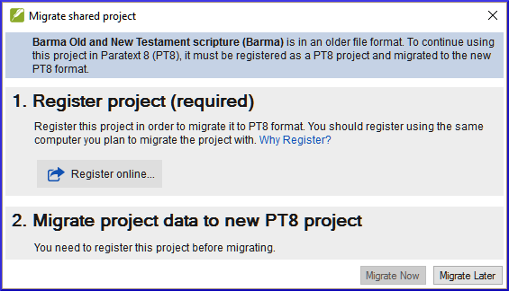  
   - *Paratext 8 peut vous dire que le projet doit être inscrit et qu'il doit être migré vers Paratext 8*. Voir 4.xx Inscription.

**2.2.3 Migration d'un projet inscrit**

Si vous venez d’inscrire votre projet, votre projet est déjà ouvert et vous pouvez continuer avec la migration. Sinon ouvrir le projet à faire migrer.

L'étape de migration comporte plusieurs cases que vous devez cocher pour vérifier que vous comprenez ce qui est impliqué.

* [ ] Je suis le membre de l’équipe qui a été sélectionné pour faire ce processus pour toute l’équipe.
* [ ] Notre équipe comprend que le projet PT8 sera la copie officielle du projet
* [ ] Tous les membres de l’équipe ont cessé de modifier la copie de PT7 du projet.
* [ ] Tous les membres de l'équipe ont effectué un Envoyer/Recevoir final de leurs modifications dans PT7.
* [ ]  Cet ordinateur a reçu les changements dans PT7.
- Si elles sont vraies, cochez ces cases , puis cliquez sur **Migrer Maintenant** pour continuer.
- Si vous avez besoin de faire d'autre chose avant d'être prêt à migrer, cliquez sur **Migrer plus tard**, puis terminez vos préparatifs.

1. Lorsque vous êtes prêt à migrer, cliquez sur **Faire migrer maintenant**
    - * Paratext copiera le projet de votre Paratext 7 dans votre Paratext 8 et effectuera également un envoyer/recevoir à Internet*.
1. Si vous recevez un avertissement au sujet d'un envoyer/recevoir final dans **Paratext 7**,
1. Cliquez sur **OK**
le processus de migration arrete,
1. Marquez un point de repère dans l'historique du projet dans **Paratext 7,**
1. puis **redémarrez la migration**dans Paratext **8**.
1. Maintenant, vos collègues peuvent aller à **Paratext 9** et faire un **envoyer / recevoir** pour recevoir le projet migré.

Si ils ne disposent pas d'une connexion Internet, vous pouvez faire un envoyer / recevoir vers USB ou un dossier réseau, et ils peuvent recevoir le projet dans Paratext 9 de cette façon.

### 2.3 Paramètres supplémentaires du projet

- **Identificateur de langue** Après avoir cliqué sur **Faire migrer maintenant**, il se peut que Paratext 8 vous dise qu'il faut spécifier un identificateur de langue pour votre projet.

Vous pouvez vérifier le nom de la langue et l'identificateur de langue de votre projet en allant dans ≡ Onglet, sous Projet   - Paramètres du projet   - Paramètres du langue. L'identifiant de la langue se trouve soit entre parenthèses après le nom de la langue ou en dessous du nom.
  
- **Livres** : Les paramètres du projet et propriétés du projet comportent un onglet **Livres**, vous spécifiez ici les livres que vous prévoyez d'avoir dans votre projet.  
Vous pouvez choisir des livres individuels, l'un après l'autre, ou spécifier l'Ancien Testament, le Nouveau Testament ou les livres deutérocanoniques en utilisant les boutons. Vous pouvez modifier cette liste de livres plus tard dans le projet si vos attentes pour le projet changent.

:::tip
N.B. Après avoir fait migrer votre projet, il faut également faire migrer la retraduction, et tous les projets de traduction-filles l’un après l’autre.
:::

## 2.4 Migrer un projet non partagé

Si un projet n’a pas été partagé en Paratext 7, vous n’avez pas besoin de l’inscrire avant de le faire migrer, mais c’est fortement recommandé.
1. Lancez Paratext 8
1. **Fichier   - Ouvrir projet/ressource**
1. Cliquez sur **Show Paratext 7 projects (Afficher les projets Paratext 7)**
1. Choisissez le projet à faire migrer.
1. Cliquez sur **Migrate now** (faire migrer maintenant)
Lorsque vous cliquez sur **Migrate Now** le projet sera migré vers le dossier Paratext 8 prêt à être utilisé. Le statut d’enregistrement déterminera les fonctionnalités qui sont disponibles pour le projet.

N.B. Les projets non partagés n’ont pas besoin d’être inscrits, mais il est conseillé.

Rappelez-vous que personne ne devra plus modifier le projet dans Paratext 7. Ce serait un effort gaspillé, car personne d'autre ne verra jamais leurs changements. Pour aider les membres de votre équipe à se souvenir de cela, vous pourriez supprimer le projet de leur Paratext 7 une fois qu'ils l'ont obtenu en Paratext 8. Autrement, ils peuvent désinstaller Paratext 7 de leur ordinateur s'ils n'en ont pas besoin pour d'autres projets.

# 6. IR - Installation des ressources 

**Introduction**  
Dans ce module, vous allez apprendre à installer des ressources.

**Avant de commencer**  
Vous avez déjà installé Paratext 9 et enregistré un utilisateur.

**Pourquoi est-ce important?**  
Dans Paratext 9, les ressources sont téléchargées depuis la DBL (Digital Bible Library). Chaque utilisateur peut les télécharger directement, mais si votre connexion Internet est limitée, vous pouvez partager les fichiers téléchargés avec d'autres utilisateurs.

**Que ferez-vous?**  
- Télécharger des ressources depuis Internet.
- Installer des ressources à partir d'un fichier téléchargé.

## **6.1 Installer des ressources - Internet (DBL)** 

- Cliquez sur le menu **≡ Paratext**, puis sous Paratext, choisissez **Téléchargement/Installation de ressources**.  
	- *Une boîte de dialogue s'affiche*.
- Assurez-vous qu'Internet a été choisi.
- Filtrez la liste en tapant dans la **boîte de filtre** (tapez le nom ou la langue ou + pour les ressources enrichies).
- Cliquez sur les cases à cocher à gauche des ressources souhaitées.
- Cliquez sur **Télécharger/Installer**.

## **6.2 Ressources de l'installateur - à partir de fichiers** 
- Copiez les ressources téléchargées de votre **My Paratext 8 Projects\_Resources** sur une clé USB ou un lecteur réseau.
- Insérez la clé USB dans l'autre ordinateur.
- Cliquez sur le menu **≡ Paratext**, sous le menu **Paratext**, choisissez **Télécharger/Installer des ressources**.  
	- *Une boîte de dialogue s'affiche*.
- Cliquez sur **Dossier**.
- Cliquez sur **Parcourir**.
- Allez dans le dossier qui contient les fichiers de ressources téléchargés.
- Sélectionnez les ressources souhaitées.
- Cliquez sur **Télécharger/Installer**.  
  - *Les ressources sonts installer*.

# 6. **PP1 : Configuration du plan de projet**

**6.1 Introduction**  
Suivre le progrès basé sur un plan du projet est une fonctionnalité améliorée qui aura un impact sur le travail quotidien des équipes de la traduction.

**Avant de commencer**  
Avant d’ajouter un plan, le projet doit être créé ou migré.

**Pourquoi cette aptitude est-elle importante ?**  
Il y a beaucoup de tâches à faire dans un projet de traduction. Il est important d’avoir un système pour s’assurer que tout cela est fait. Il est également bon d’avoir un moyen facile de générer des rapports pour les superviseurs et les bailleurs de fonds (voir PP2 : Rapport sur le plan du projet).

La configuration d’un plan de projet à partir de zéro est intimidante. Diverses organisations de traduction de la Bible (ABU, SIL et The Seed Company) incluront des plans “de base” qui peuvent être appliqués à des projets. Les équipes ne doivent que personnaliser ces plans dans les limites fixées par leurs organisations.

En générale, les organisations veulent la conformité au niveau de l’« étape » afin de faciliter un suivi de l’avancement du projet dans l’ensemble de l’organisation. Cependant, chaque plan devra être personnalisé au niveau des tâches.

Si une tâche est importante pour vous et votre équipe et que vous souhaitez en suivre les progrès, elle peut être incluse dans le plan du projet (même si elle ne nécessite pas l'utilisation de Paratext).

**Qu'est-ce qu'on va faire ?**  
On utilise une combinaison de deux fonctionnalités : les paramètres du **plan du projet** et les **Tâches et avancement** pour gérer le plan.

- On ajoute le plan de base de l’organisation au projet.
- On personnalise le plan pour l’équipe.
- On attribue ensuite les tâches aux différents membres de l’équipe.
- On met à jour le plan de base chaque fois qu'il y a une nouvelle version.

**6.2 Ajouter le plan de base de l’organisation**

:::tip
Si vous aviez un plan déjà, il faut supprimer ce plan avant d’ajouter un autre. (Voir la page suivante pour les instructions de supprimer un plan.)
:::

1. **≡ Onglet** menu, sous Projet **Paramètres du projet**   - **Plan du projet**
1. Cliquez sur **Gérer les plans**
1. Cliquez dessous **Afficher le plan de référence**
1. Choisir le plan de base de votre organisation
1. Cliquez sur la flèche (Copier le plan) (**Copy Plan**).
1. Cliquez sur **OK**.

Le plan et ses tâches sont ajoutés au projet.

**6.2.1 Supprimer le plan existant (avant d’ajouter un autre)**

Si le projet a un ancien plan, vous devez retirer chacune des étapes actuelles avant d’ajouter un nouveau plan de base.

1. **≡ Tab** menu, sous **Projet**   - **Paramètres du projet   - Plan de projet**  
1. Cliquez sur **Gérer les plans**  
1. Cliquez sur la dernière étape  
1. Cliquez sur **Retirer l'étape**.

1. Cliquez sur Oui (deux fois) pour confirmer vous voulez modifier le plan et encore pour confirmer vous voulez retirer les tâches.
1. Répéter pour les étapes restantes
1. Ajouter le nouveau plan (voir ci-dessus)

## 6.3 Configurer le plan

**6.3.1 Configurer — Livres à inclure**

1. **≡ Onglet** sous **Paramètres de projet**   - **Propriétés du projet**
1. Cliquez sur l’onglet **Livres**
1. Choisissez les livres vous voulez suivre.
1. Cliquez sur **OK**

**6.3.2 Configurer — ajouter des vérifications à une étape**

1. **≡ Paratext** menu, sous **Projet**, choisissez **Paramètres de projet** puis **Plan de projet**
1. Cliquez sur l'onglet **Vérifications**
1. Cliquez sur l'onglet "Vérifications".
   - *Deux colonnes sont affichées : Étape obligatoire et Étape facultative*.
1. Pour la vérification désirée, cliquez sur la liste déroulante **Requis dans l'étape [12]**
1. Choisissez l'étape ou *Aucun*
1. Ensuite, réglez l'option Notifier seulement (facultatif) à une étape antérieure, le cas échéant.
1. Répetez pour chaque vérification
1. Cliquez sur **OK**

**6.3.3 Configurer — Réorganiser les tâches**

Il est possible de réordonner des tâches et même déplacer des tâches à une autre étape. Toutefois, pas toutes les organisations le permettent.

1. Du menu **Onglet**, sous **Projet**, choisissez **Paramètres du projet**, puis **Plan du projet**
1. Cliquez sur l’onglet **Étapes/Tâches**
1. Sélectionnez la tâche à déplacer.
1. Cliquez sur la flèche vers le haut ou vers le bas pour déplacer la tâche vers un autre point ou pour la déplacer vers une autre étape.
    - Il se peut que vous recevrez un message de confirmation si la tâche change d’étape.  
5. Cliquez sur **OK**.

**6.3.4 Ajouter une tâche**

1. Cliquez sur la tâche qui sera au-dessus de la nouvelle tâche.
1. Cliquez sur le bouton **Ajouter une tâche**
1. Tapez un nom pour la tâche puis une description.
1. Cliquez sur **OK**.

**6.3.5 Configurer — Supprimer des tâches**

1. Cliquez sur l’onglet Étapes/Tâches
1. Cliquez sur la tâche à supprimer
1. Cliquez sur le bouton **Retirer la tâche**
1. Cliquez sur **OK**.

**6.3.6 Renommer ou modifier les tâches**

1. Cliquez sur la tâche (à gauche)
1. Cliquez sur le nom (à droit).
1. Tapez un nouveau nom de la tâche.
1. Si nécessaire, modifiez la description.

**6.3.7 Copier une tâche d’un plan à votre projet**

N.B. Suivez les étapes ci-dessous pour copier une tâche d'un plan de référence vers le plan de votre projet.

1. Ouvrir votre projet [**≡ Paratext** sous **Projet** choisissez **Ouvrir**].
2. **≡ Onglet** menu, sous **Projet** choisissez **Paramètres du projet**   - **Plan du projet**
3. Cliquez sur **Gérer les plans**
4. Dans la liste déroulante « **Afficher le plan de référence**) », sélectionnez le plan de projet qui contienne la tâche voulue.
5. Dans la partie **Plan actuelle**, cliquez sur la ligne qui précédera la nouvelle tâche.

Si vous voulez que la tâche ajoutée soit la première tâche de l’étape, sélectionnez le nom de l’étape.

1. Sur le côté **Plan de référence** de la boîte de dialogue, passer la souris sur la tâche que vous souhaitez ajouter et cliquez sur la flèche bleue qui apparaît.

*La tâche est copiée dans le plan de votre projet et elle ne peut plus être copiée à nouveau dans celui-ci.*

1. **Facultatif** : Pour déplacer la tâche, cliquez sur la flèche vers le haut ou la flèche vers le bas qui s’affiche lorsque vous survolez une tâche du côté Plan actuel de la boîte de dialogue.
1. Cliquez sur **OK** pour fermer la boîte de dialogue « Gérer les plans ».
1. Cliquez sur **OK** pour fermer la boîte de dialogue « Plan du projet ».

La tâche copiée a le même nom et le même taux de progression que dans le plan de projet pour le projet ORIG.

   - *Le nom court du projet est ajouté au nom du plan.*

**6.4 Vérifier les paramètres pour une tâche**

- Il y a trois paramètres pour chaque tâche
   - comment marquer la complétion de la tâche (par chapitre, livre)
   - quand on peut commencer une tâche (après une autre tâche…)
   - accorder le droit de modifier (donner la permission de modifier le texte)
1. **≡ Onglet** menu, sous **Projet** choisissez **Paramètres du projet**   - **Plan du projet**
1. Cliquez sur la tâche

Les paramètres sont affichés en bas à droite
   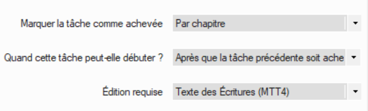
1. Apportez les modifications nécessaires
1. Répétez pour toute autre tâche
1. Cliquez sur **OK**.

**6.5 Groupes de priorité**

Les groupes de priorité sont un moyen de faire savoir à Paratext l'ordre dans lequel les livres ou les chapitres doivent être travaillés.

**6.5.1 Utilisation d’un ensemble présélectionné**
1. Cliquez sur le **≡ Projet** 
1. Sous Projet, choisissez **Paramètres du projet** et allez à **Définir les priorités**.
1. Cliquez sur **Sélectionner la définition des priorités** 
1. Sélectionnez un ensemble (par exemple, "Easy-to-Difficult Priorities (SIL)" (Facile à Difficile(SIL))
    - *un ensemble présélectionné de livres est présenté.*
1. Cliquez sur **OK**

**6.5.2 Établir des priorités**

1. Ouvrez le menu de **projet**, puis choisissez **Paramètres du projet** puis **Définir les priorités**.
1. Sélectionnez les livres, puis cliquez sur l’icône de flèche droit
1. Cliquez sur les trois points, choisissez **Édition**
1. Renommez le groupe (p.ex. Évangiles)
1. Réorganisez les livres selon vos besoins en cliquant sur un livre et en le déplaçant vers le haut ou vers le bas à l'aide des boutons fléchés.
1. Pour définir des chapitres spécifiques,
1. Cliquez sur le lien vers le nom du livre
1. Choisissez les chapitres désirés
1. Cliquez sur OK
- Si vous ajoutez ensuite un livre dont les chapitres sont déjà définis, il n'ajoutera que les chapitres restants.
- Je pourrais réorganiser les livres en cliquant sur un livre et le déplacer vers le haut ou vers le bas.

**6.5.3 Utiliser les priorités**

Une fois que les priorités ont créés, elles peuvent être utilisées partout où vous choisirez normalement des livres. Par exemple, liste de mots, termes bibliques ...

:::tip
Dans cette fenêtre, vous pouvez également définir ou redéfinir vos priorités si nécessaire.
:::

**6.6 Affecter des tâches aux membres de l’équipe**

Les tâches peuvent être attribuées individuellement ou en bloc.

**6.6.1 Attribuer les tâches individuellement**

1. **≡ Onglet** menu, sous **Projet**, choisissez **Tâches et avancement**
1. Cliquez la liste roulante pour la tâche et choisissez qui doit faire la tâche (un membre ou l’équipe)
1. Répétez si nécessaire pour chaque tâche
1. Cliquez sur **OK**.

**6.6.2 Attribuer les tâches en bloc**

1. Cliquez sur le **bouton bleu** Tâches et avancement
1. Choisissez **Tableau des tâches**
1. Utilisez le filtre des versets pour sélectionner les livres
1. Sous la tâche, cliquez sur **Attribuer une tâche**

:::tip
Les chapitres incomplets peuvent être réassignés mais pas les chapitres achevés.
:::

1. *Un message d'avertissement apparaîtra avec des options pour écraser toutes les attributions ou seulement les chapitres non attribués*.

**6.6.3 Attribuer une étage ou un livre**

1. Cliquez sur le bouton **Attribuer une étape** (en haut de chaque étape).
1. Modifiez les affectations de certaines tâches si nécessaires.

Une fois que vous avez terminé le processus d'affectation en bloc, vous pouvez affiner les affectations dans la vue Toutes les tâches.

**6.7 Mettre à jour l'avancement (pour un projet migré)**

Pour les projets qui ont déjà complété plusieurs étapes au moment de passer à Paratext 9 la vue de la "tableau des tâches" et/ou la vue de la "tableau des étapes" peuvent être utiles pour marquer plusieurs livres, étapes ou tâches, comme achevé.

1. Cliquez dans votre projet.
1. Cliquez sur le **Bouton bleu** Tâches et avancements
1. Choisissez **Tableau des étapes**.
1. Cliquez sur le menu **≡ Onglet** et choisissez le **Mode modifier l’avancement en bloc**.
    - *Les vérifications sont temporairement désactivées*.
   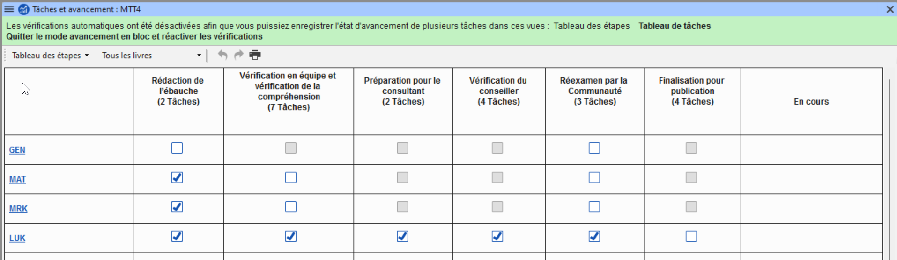
1. Cliquez sur le bouton **Toutes les étapes**
    - *Toutes les étapes sont approuvées*.

:::tip
Lorsque vous avez fini de faire toutes les attributions, vous pouvez revenir en arrière et décocher le Mode modifier l’avancement en bloc.
:::

## 6.8 Enregistrer un plan modifié comme nouveau plan de base

Les modifications que vous avez apportées à votre plan seront envoyées aux membres de votre projet lors de l'envoyer/recevoir. Si vous souhaitez partager le plan révisé avec d'autres équipes, vous pouvez l'enregistrer comme un nouveau plan de référence.

1. Ouvrir **votre** projet.
1. **≡ Onglet** menu, sous **Projet** choisissez **Paramètres du projet**   - **Plan du projet**
1. Maintenez la touche MAJ (shift) et cliquez sur **Gérer les plans**
    - *La boîte de dialogue de gestion des plans s'affiche avec un bouton "Enregistrer comme plan de référence" en bas à droite*.  
    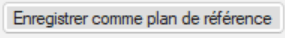
1. Cliquez sur **Enregistrer comme plan de référence**
    - *Une boîte de dialogue s'affiche*  
      
1. Choisissez ce qui convient, puis cliquez sur **OK**
    - *Le fichier est enregistré sur \My Paratext 8 Projects\_StandardPlans*
1. Partagez le fichier de \My Paratext 8 Projects\_StandardPlans avec les autres équipes.

:::info
Le dossier peut-être "My Paratext 8 Projects" ou "My Paratext 9 Projects".
:::

## 6.9 Mise à jour d'un projet avec une nouvelle version du plan de base

Il arrive que le plan de base sur lequel ce plan de projet a été construit soit modifié. Il existe deux façons de mettre à jour le plan de base.

**6.9.1 Méthode 1**

1. **≡ Onglet**, sous **projet**.
2. Choisissez **Paramètres du projet** puis **Plan du projet**.
    - *Un avertissement s'affiche indiquant qu'il existe une nouvelle version du plan et que je peux migrer.*
3. Cliquez sur le lien **Migrer vers une nouvelle version du plan de projet**.
4. Choisissez soit :
    - Conserver les tâches qui ne sont pas dans la nouvelle version.
    - Supprimez toutes les tâches qui ne sont pas dans la nouvelle version.
    - Conserver les tâches qui étaient en cours.
5. Cliquez sur **OK**
    - *Paratext vous prévient que vous devez faire un envoyer/recevoir,*
6. Cliquez sur **OK** pour effacer le message
    - *Le plan a été mis à jour*.
7. Une barre de message verte en haut de l'écran vous offre trois options :
    - Fermer le message
    - Visualiser la progès dans le plan précédent,
    - Annuler la mise à jour du plan de base.
8. *Notez que le numéro de version a été mis à jour.*
9. Cliquez sur **OK**.

**6.9.2 Méthode 2**

1. Cliquez sur affectations et progrès.
    - *Si le plan de base a été mis à jour, un message apparaîtra pour vous indiquer que vous pouvez mettre à jour*.
1. Cliquez sur **Mise à jour de la nouvelle version du plan de projet**.
1. Choisissez de conserver ou de supprimer les tâches.
    - Lorsque vous mettez à jour, il fera un envoyer/recevoir.
1. Choisissez l'une des trois options dans la barre de message verte en haut :
    - Fermer le message
    - Afficher la progès dans le plan précédent,
    - Annuler la mise à jour du plan de base.

# 7. Configurer pour réussir

Les choses à considérer :

**Il s’agit d’un processus dynamique**

- Lorsqu’un projet est tout neuf, il n’y a pas beaucoup de paramètres qui peuvent être fixés.
- À mesure que le projet arrive à maturité, certains des inventaires commencent à avoir un sens.

**Qui travaille sur le projet**

- Configurer les utilisateurs, les rôles et les autorisations
- Serait-il utile d’avoir un « menu simplifié » ?

**Avez-vous besoin de personnaliser les paramètres ?**

- custom.sty
- modifier les paramètres de la feuille de style
- les noms des marqueurs (dans d’autres langues)
- la couleur pour aider à identifier les caractéristiques ?
- custom.vrs
- identifier les versets qui sont différents de la versification par défaut

**Quelle orthographe sera utilisée ?**

- Placez les lettres de l’orthographe dans les paramètres de langue.
- (Rappelez-vous que ce que vous avez mis dans les paramètres de langue pourrait aller dans le « Speech and Language Data Repository ».)

**Comment les caractères seront-ils saisis ?**

- Keyman/MSKLC (Keyman est gratuit !)
- AutoCorrect.txt

**Quel système de citation sera utilisé ?**

- Définir les règles de guillemets [Dynamique]
- Pensez à vos règles
- Testez ce que vous avez choisi
- Ajustez des règles
- Faire des corrections aux règles/au texte si nécessaire

**Lorsque vous avez des données textuelles**

- Commencez avec des inventaires
- Commencez par le début [caractères]
- Recherchez des options dans les inventaires !
- L’élément est-il valable tout le temps ? Ou juste dans certaines situations ?

**Paramètres de référence biblique**

- Quels noms de livres utilisez-vous ?
- Quel est le format d’une référence ?
- Où placer l’origine des notes ? [Première, dernière…]

# 8. CV : Convertir un Projet

**8.1 Introduction**  
Si jamais vous avez eu besoin de renommer le nom abrégé de votre projet, de réduire la taille de votre projet, de modifier les noms d’utilisateur, de modifier l’encodage ou de lutter avec des signes diacritiques composés/décomposés, l’outil **Convertir le projet** vous aidera à résoudre ces problèmes.

**Avant de commencer**  
Vous devez être l’administrateur du projet à faire ces conversions.

**Pourquoi cette aptitude est-elle importante ?**  
Il n’est que possible d’apporter quelques modifications au projet dans le **Propriétés et paramètres** du projet. Les changements majeurs nécessitent qu’un nouveau projet soit créé. L’outil **Convertir le projet** permet le nouveau projet de garder l’historique du projet.

**Qu'est-ce qu'on va faire ?**  
Nous allons travailler les six changements qui peuvent être apportés à votre projet.

- Changer le nom abrégé du projet
- Retirer les fichiers effacés de l'historique de projet
- Nettoyer historique de Paratext Live
- Convertir l’encodage à 65001 — Unicode [UTF8]
- Normalisation — composé ou décomposée
- Remplacement de vieux noms d’utilisateur

## 8.2 La boîte de dialogue de "Convertir un projet"

- **Onglet** sous **Outils**, choisissez **Avancé**, puis **Convertir le projet**  
    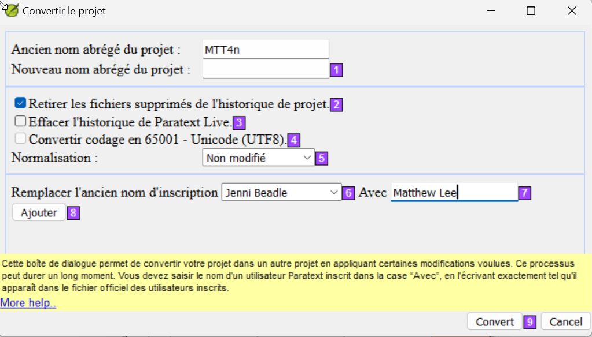
    
**Changer le nom abrégé du projet**

1. Confirmez que l’ancien nom du projet est correct.
    - [Sinon, fermez le dialogue et cliquez dans la fenêtre projet correct et accéder à la boîte de dialogue Nouveau.]
1. Entrez le nouveau nom abrégé pour le projet dans **[1]**.

### Balayage des fichiers supprimé dans l’historique du projet

- **[2]** Sélectionnez cette option si vous avez supprimé des fichiers [tels que les grandes illustrations] dont vous ne souhaitez plus faire partie de l’historique du projet.

### Nettoyer l'historique de Paratext Live  
- **[3]** Sélectionnez cette option si vous avez édité le projet avec Paratext Live et que vous souhaitez remplacer les noms dans l’histoire du projet.

### Convertir l’encodage à 65001 — Unicode [UTF8]

- **[4]** Sélectionnez cette option pour convertir un projet standard d’encodage Unicode.

:::tip
Cela ne fonctionnera pas pour modifier l’encodage si votre projet comporte une « police piratée ». Normalisation – composés ou décomposés.
:::

### Normalisation

- **[5]** Sélectionnez Composé [NFC] ou une des options dans la liste déroulante si les données dans votre projet contiennent un mélange des caractères composés et décomposés.

### Remplacement de vieux noms d’utilisateur

- **[6]** Sélectionnez le nom de l’utilisateur que vous souhaitez remplacer dans la liste déroulante.
- **[7]** Tapez le nom d’un utilisateur inscrit de Paratext dans cette case.
- **[8]** Cliquez sur **Ajouter**
    - Un résumé du remplacement s’affiche avec un bouton "Retirer".
    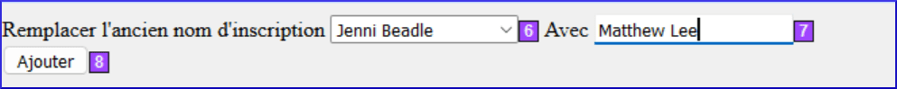
- [Si vous faites une erreur en tapant le nom dans le champ **Avec** ou que vous décidez de ne pas faire le remplacement, cliquez sur **Retirer**]
    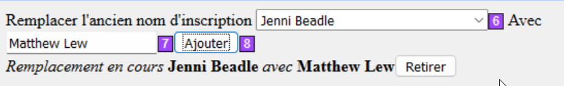.

## Convertir un projet

- **[9]** Cliquez sur **OK** pour convertir le projet.
*Voir la remarque dans le guide au sujet des projets partagés*.

# 9. RE : Renvois

**9.1 Introduction**  
La plupart des langues n'ont pas accès à des concordances et à d'autres documents d'étude de la Bible dans leurs propres langues. Ajouter des renvois à votre Nouveau Testament peut grandement aider votre lecteur à comprendre le texte en l'aidant à trouver des passages sur des thèmes similaires.

**Avant de commencer**  
Avant de pouvoir insérer des renvois d’un texte modèle, votre administrateur doit avoir créé tous les livres (et chapitres et versets) dans votre projet. Ils peuvent être vides, mais ils doivent être présents.

**Pourquoi cette aptitude est-elle importante ?**  
Lire le Nouveau Testament n’est pas comme la lecture d’un roman. Avoir accès à des renvois permet à votre lecteur de trouver des passages similaires sur les thèmes. Néanmoins, l’ajout manuel de renvois un à un est trop fastidieux. Le menu **Insérer les renvois** vous permet d’insérer tous les renvois à la fois (les noms de livre et la ponctuation du renvoi seront convertis également pour correspondre à vos **Paramètres de référence bibliques**).

**Qu'est-ce qu'on va faire ?**  
Nous allons faire trois choses :

Si vous ne disposez pas d'un texte modèle avec la référence croisée souhaitée, vous pouvez créer votre propre liste et l'importer.

## 9.2 Extraire des renvois d'un texte modèle

1. Ouvrir le projet du modèle (p.ex. un autre projet de la filiale).
1. **≡ Onglet** sous **Projet**, choisissez **Avancé** puis **Extraire les renvois**
1. Saisissez un nom du fichier
1. Cliquez sur **OK**.

:::caution
Les ressources ne vous permettent pas d'extraire les renvois.
:::

## 9.3 Vérifier les paramètres des références bibliques

1. **≡ Onglet** sous **Projet**, choisissez **Paramètres du projet**   - **Paramètres des références bibliques**.
1. Vérifiez que les éléments suivants ont été correctement définis pour votre projet (modifiez-les si nécessaire).
1. La ponctuation dans l'onglet **Format de référence**.
1. Les abréviations des livres dans l'onglet **Noms du livre**.
1. Cliquez sur **OK**.

## 9.4 Vérifier les paramètres de langue

1. **≡ Onglet** sous **Projet**, choisissez **Paramètres du projet**   
1. Sélectionnez **Paramètres de langue...**
1. Cliquez l'onglet **Autres caractères**.
1. Dans le champ **Segments de Versets**, saisissez au moins six caractères uniques séparé par des espaces.
1. Cliquer sur **OK**.

## 9.5 Insérer des renvois

1. **≡ Onglet** sous **Projet**, choisissez **Avancé**, puis **Insérer les renvois**.
1. Cliquez sur **Parcourir...**.
1. Naviguez vers le fichier .xrf contenant des renvois extraits.
1. Sélectionnez le ficher, puis cliquer sur **Ouvrir**.
1. Si vous le désirez, sélectionnez une des cases à cocher.

:::tip
Voir le guide pour d'autres informations.
:::

6. Cliquez sur **OK** 

:::caution
*Si une boite de dialogue s'affiche contenant des droits d'auteurs ou d'autres informations, copiez les infos vers l'endroit appropriez de votre projet*.
::: 