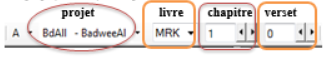
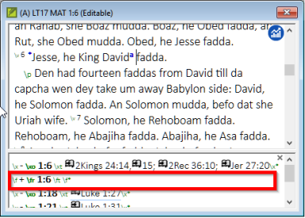
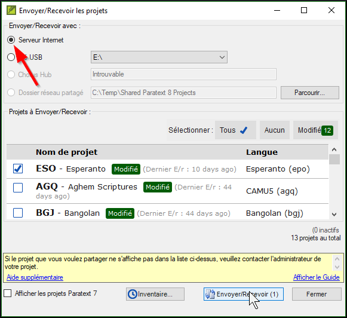
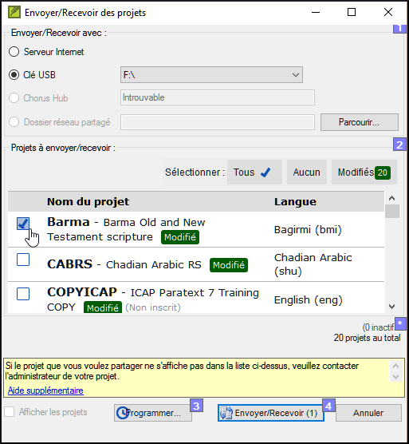

**Introduction**  
Ce module explique comment vous pouvez saisir votre traduction (taper les données) dans un projet existant de Paratext 9.

**Où en sommes-nous dans le processus ?**  
Nous sommes sur le point de saisir du texte dans un projet existant. Avant que vous puissiez faire ceci, quelqu’un doit avoir installé le programme et avoir créé un projet pour vos données.

**Pourquoi cette aptitude est-elle importante ?**  
C’est la première étape de la saisie de votre traduction dans l’ordinateur. Une fois que le texte a été saisi, vous pourrez exécuter divers contrôles sur le contenu et le format du texte.

## 4.1 Naviguer vers une référence biblique
:::tip Conseil
Avant de pouvoir commencer à saisir un texte, vous devez déplacer votre curseur au livre, au chapitre et au verset appropriés. Servez-vous de la barre d’outils Référence pour le faire.
:::
-  Utilisez la barre d’outils Référence pour changer le projet, le livre, le chapitre et le verset selon les besoins.  
    

:::caution Mise à jour
Dans Paratext 9.3, vous pouvez copier et coller une référence biblique dans le nom du livre sur la barre de navigation. Par exemple en français : MAT 12.3, Mrk 5:4, Galates 1:12. 
:::

:::tip
Si vous ne connaissez pas la référence du verset, vous pouvez utiliser la fonction **Rechercher** pour chercher un mot. Ctrl+F.
:::

## 4.2 Vérifier que le projet est modifiable

1.  Regardez la barre de titre de votre projet.  
      
     -   *La barre de titre doit afficher **Modifiable**.*
1.  Si le livre n'est pas modifiable et vous deviez l’éditer, il faut parler avec votre administrateur.
1.  Si votre projet est toujours non-modifiable, essayez de changer l’affichage (voir ci-dessous) pour trouver un affichage modifiable.

## 4.3 Changer l’affichage

:::tip
Paratext 9 a cinq affichages. Seul le mode Aperçu n’est pas modifiable.
:::

-  **Ctrl** + **E** —ou—
-  **≡ Onglet** sous **Affichage**, choisissez l’affichage que vous préférez (p.ex. Standard).

## 4.4 Taper les caractères spéciaux

:::tip
Certains des caractères orthographiques ne se trouvent pas sur le clavier. Pour les taper, vous devez appuyer sur plus d’une touche.
:::

1.  Changez le système de clavier si nécessaire.
1.  Passez de Keyman (p.ex. à Tchad Unicode)  
    (ou changez le clavier virtuel pour passer à une langue appropriée [p.e.x TR/SQ/TZ/AF…])
1.  Tapez les touches de ce caractère (comme dans le tableau pour votre clavier virtuel).

:::tip Remarque
Vous pouvez cliquez sur **≡ Onglet** et sous **Affichage** \> **Surligner les caractères non valides** pour mettre en surbrillance des caractères invalides (= pas acceptable pour écrire cette langue) qui sont dans le texte.
:::

## 4.5 Ajouter texte d'une autre catégorie – titre ou introduction

:::tip
Chaque élément de texte doit avoir un marqueur. Les marqueurs pour les chapitres et versets sont déjà dans votre projet. 
::: 
Pour ajouter d'autre texte, p.ex. un titre à votre texte ou une introduction, vous devez faire ce qui suit

1.  Déplacez votre curseur à la fin du paragraphe qui est au-dessus du titre.
1.  Appuyez sur **Entrée** ou Saisissez **\\**
1.  Saisissez le marquer (comme s1 ou ip), puis tapez Entrée (ou le sélectionnez de la liste).
1.  Saisissez le texte
1.  Ajoutez un marqueur de paragraphe  
    (par exemple : \\p)

:::tip Conseil
Vous devez toujours avoir un marqueur USFM après un titre et avant les versets. C’est habituellement \\p (paragraphe), mais peut être autre chose (par exemple \\q1).
:::

## 4.6 Ajouter des marqueurs de paragraphe

### Pour diviser le texte en paragraphes 

1.  Déplacez le curseur où vous voulez casser le paragraphe.
1.  Appuyez sur **Entrée**.
1.  Saisissez **p** puis tapez **Entrée** (ou le sélectionnez de la liste).

## 4.7 Enregistrer votre travail

:::tip
Il est important d’enregistrer votre travail régulièrement.
:::

-  **≡ Paratext** sous **Paratext**\> **Enregistrer tout**
-  ou **Ctrl** + **S**

## 4.8 Insérer une Note de bas de page

:::tip
Vous pouvez ajouter les notes de bas de page dans le texte à l’endroit où la référence apparaît dans votre texte.
:::

1.  Déplacez le curseur où vous voulez insérer la note de bas de page.
1.  **≡ Onglet**, sous **Insérer** \> **Note de bas de page,**
1.  Un ensemble de marqueurs de note en bas de page est ajouté dans la boîte au-dessous du texte  
    
1.  Saisir le texte de la note après \\ft

:::tip
- Pour **voir** la note de bas de page, déplacez la souris au-dessus de la petite lettre sans cliquer sur les boutons. [La note de bas de page s’affiche dans une petite boîte.]
- Pour **modifier** la note de bas de page, cliquez sur la petite lettre et modifiez le texte dans le petit volet en bas.
- Pour **supprimer** la note en bas de page, vous pouvez supprimer la petite lettre.
:::

## 4.9 Envoyer/Recevoir

:::caution
Il est essentiel d’avoir une seconde copie de votre traduction et de partager votre travail avec votre équipe. 
:::
Pour sauvegarder une copie vers Internet, c’est idéal d’envoyer/recevoir comme suit :

### Envoyer/Recevoir ce projet vers Internet
1.  Assurez-vous que votre ordinateur est connecté à l'Internet.
1.  **≡ Onglet**, sous **Projet** \> **Envoyer/Recevoir ce projet**…  
     -  *Paratext fera l'Envoyer/Recevoir tout de suite, c.à.d. sans proposer les différentes options.*

### Envoyer/Recevoir des projets vers Internet
1.  Assurez-vous que votre ordinateur est connecté à l'Internet.
1.  **≡ Paratext**, sous **Paratext** \> **Envoyer/Recevoir des projet**…  
    
1.  Choisissez **Serveur Internet**
1.  Choisissez les projets à Envoyer/Recevoir.
1.  Cliquez sur le bouton **Envoyer/Recevoir**.  
     -  *L’ordinateur fera une copie des fichiers. Un indicateur de progrès s’affiche jusqu’à ce que le processus soit fini. Une boîte de message vous dit s’il y a des problèmes.*

### Envoyer/Recevoir à une clé USB pour sauvegarder
Il est essentiel d’avoir une seconde copie de votre traduction. Si vous n'avez pas accès à l'Internet, vous pouvez utiliser une clé USB. Pour sauvegarder une copie sur une clé USB, vous pouvez envoyer/recevoir comme suit :

1.  Insérez votre clé USB dans un port de l’ordinateur.
1.  **≡ Paratext**, sous **Paratext** \> **Envoyer/Recevoir des projets**.  
    
1.  Choisissez **Clé USB**.
1.  Choisissez les projets à Envoyer/Recevoir.
1.  Cliquez sur le bouton **Envoyer/Recevoir**.  
     -  *L’ordinateur fera une copie des fichiers. Un indicateur de progrès s’affiche jusqu’à ce que le processus soit fini. Une boîte de message vous dit s’il y a des problèmes.*

### Envoyer/Recevoir encore
La prochaine fois que vous voulez faire un Envoyer/Recevoir vous pouvez utilisez la barre d'outils pour envoyer/recevoir selon les paramètres précédents. Cette option ne vous laisse pas l'option de sélectionner le moyen ou les projets:

1.  Si nécessaire, insérez votre clé USB dans un port de l’ordinateur ou se connectez à l'Internet.
1.  Cliquez sur l’icône Envoyer/Recevoir   
     -   *Paratext fera l'Envoyer/Recevoir tout de suite, c.à.d. sans proposer les différentes options.*

## 4.10 Déplacer votre curseur rapidement
:::tip
Voilà quelques touches utiles pour déplacer votre curseur rapidement sans perdre de temps :
:::
-  Les touches
   -  flèches, **←** **↑** **→** **↓**  
     -  **début** (Home), **fin** (End), **PgPréc**, et **PgSuiv**,  
     -  **F8** (chapitre), **F9** (livre)
-  et **Ctrl** + les touches

## 4.11 Bilan : Complétez les champs vides :

Si la barre de titre ne mentionne pas Modifiable (ou votre nom), on peut changer l’__________.

Pour ajouter une autre balise (marqueur), on appuie \_______.

Pour ajouter d'autres balises (marqueurs) de paragraphe, vous appuyez \________.

Pour insérer une Note de bas de page, on utilise ≡ onglet, puis sous le menu \_\_**\_ vous choisissez \_**\______________.

Pour Envoyer/recevoir, on utilise ≡ onglet puis sous le menu \____\_**\_ vous choisissez \_**\____________\_

:::info
[Réponses : affichage, entre ou \\, entre, Insérer, Note de bas de page, Projet, Envoyer/Recevoir]
:::