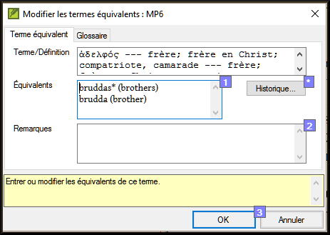
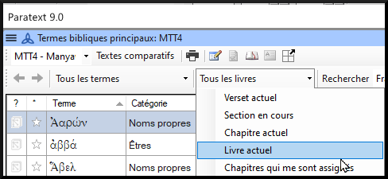
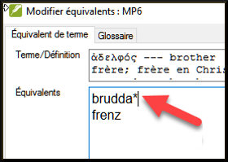

**Introduction**  
La fenêtre d’*Équivalents de termes bibliques* et l’outil *Termes bibliques* sont liés et sont très utiles pour vérifier que vous avez été cohérent avec les termes, surtout les termes clés. Avec de nombreux termes répartis sur de nombreux livres, cela peut devenir une véritable tâche. Ce module explique un simple processus de 4 étapes pour assurer que les termes bibliques sont cohérents. C'est un processus et doit être considéré comme une partie du processus de traduction et pas comme une vérification.

**Où en sommes-nous dans le processus ?**  
Vous êtes en train de traduire un verset en Paratext 9 et vous voulez voir les équivalents qui sont déjà choisis pour les termes de verset actuel puis vérifier qu’ils sont cohérents avec les autres versets.

**Pourquoi cette aptitude est-elle importante ?**  
Pour que votre texte communique le message clairement, vous devez utiliser les termes de manière cohérente. C’est une grande tâche pour les rendre complètement cohérents. Si vous commencez à partir du verset que vous traduisez, et travaillez à partir de là, la tâche est plus facile à gérer. Le but est de s'assurer que vous avez été cohérent dans votre utilisation des termes bibliques et des décisions sont bien documentées sur les raisons pour lesquelles les changements ont été apportés.

**Qu’est-ce qu’on va faire ?**  
Cette méthode contient quatre étapes :  
1.  **[A]** Trouver tous les mots ou expressions que vous avez utilisés pour ce terme, et entrez les équivalents dans la boîte de dialogue des équivalents.
2.  **[B]** Choisissez l’équivalent(s) qui est le meilleur, et enregistrez pourquoi il est préférable.
3.  **[C]** Expliquez pourquoi vous avez rejeté les autres équivalents.
4.  **[D]** Nettoyez votre traduction en appliquant cet équivalent partout dans votre traduction. (Faire cohérente, Standardiser, Normaliser, Harmoniser).
-  Répétez ce processus avec le prochain terme biblique que vous trouvez dans la fenêtre d’équivalents de termes bibliques.

## 10.1 Ouvrir la fenêtre des équivalents de termes bibliques

1. Cliquez dans votre projet
1. **≡ Onglet** **Outils** \> **Équivalents des termes bibliques**
1. **≡ Onglet** (dans la nouvelle fenêtre) sous **Termes bibliques** \> **Sélectionner la liste de termes**
1. Choisissez la liste désirée
1. Cliquez sur **OK**.

## 10.2 A : Trouver tous les équivalents pour ce terme

### Trouver le terme pour le verset actuel
1. Y a-t-il une coche dans la colonne trouvée ?
1. S’il y a une coche, le verset utilise le terme et vous pouvez continuer avec le prochain terme.
1. Sinon, vous devez soit corriger votre texte soit ajouter le nouveau terme que vous avez utilisé (voir ci-dessous)

### Ajouter un autre équivalent
Si l’équivalent que vous avez utilisé doit être ajouté à la liste :  
1. Sélectionnez l’équivalent dans votre texte.
1. Copiez (**Ctrl** + **C**)
1. Double-cliquez dans la cellule des équivalents.  
      
     -  *Une boîte de dialogue s’affiche.*  
    
1. Collez (**Ctrl** + **V**) l’équivalent dans la boîte de dialogue.
1. Cliquez sur **OK**.

### Trouver d’autres versets dans le livre actuel avec le même termes bibliques
1. Double-cliquez sur un mot dans la colonne **Terme**  
     -  *L’outil termes bibliques s’affiche.*
1. À partir du deuxième champ de filtre, choisissez **Livre actuel**  
    
1. Ajouter les équivalents de tous les versets (voir ci-dessous).

### Ajouter les équivalents d’autres versets
1. Sélectionnez l’équivalent dans le verset
1. Ajoutez l’équivalent en utilisant **Ctrl**+**A**
1. Continuez jusqu’à ce que tous les équivalents soient identifiés.

### Traiter des versets qui n’ont pas le terme dans la traduction 
:::tip
Parfois il arrive qu’un verset soit traduit correctement sans utiliser le nom réel ou le terme. Par exemple, un pronom peut être utilisé à la place du nom. Dans ces cas, il faut indiquer qu’il n’y a pas d’équivalents de ce mot précis dans ce verset.  
:::
-  Cliquez sur la croix rouge  à gauche du lien de verset. La croix rouge se transforme en tique verte avec petit x rouge 

:::caution
Si vous avez cliqué sur la croix par erreur, cliquez sur  et elle reviendra à 
:::

## 10.3 B : Identifier le meilleur équivalent

1. Double-cliquez sur le terme dans le volet en haut.  
     -  *La boîte de dialogue s’affiche avec tous les équivalents qui ont été ajoutés.*
1. Décidez le meilleur équivalent
1. Sélectionnez-le, coupez-le (**Ctrl**+**x**) et collez-le (**Ctrl**+**v**) à la première ligne de la liste.
1. Ajoutez les \* pour combiner les équivalents similaires.  
    
:::tip
Vous pouvez utiliser \* de différentes manières : avant le mot pour les préfixes et après le mot pour les suffixes. Vous pouvez aussi mettre un \* au milieu d'un mot. Consultez le guide pour d'autres façons d'utiliser l'astérisque \*.
:::

## 10.4 C : Rejeter tous les autres

-  Sélectionnez et coupez les autres équivalents.

## 10.5 D : Documenter la raison pour la modification

1. Cliquez sur le bouton **Historique**  
    
1. Saisissez la raison pourquoi les autres équivalents ont été rejetés, et pourquoi le premier est le meilleur.  
    
1. Cliquez sur **OK**

### Si vous avez besoin de plus d’un équivalent
:::tip
Vous pouvez ajouter plus d’un équivalent si nécessaire. Il est bon d’ajouter une retraduction entre parenthèses après l’équivalent. Par exemple,  
     slave (esclave)  
     guy \* work fo (type qui travail pour)
:::
1. Ouvrez la boîte de dialogue pour les équivalents
1. Ajoutez/modifiez les équivalents comme nécessaires.

### Nettoyer d’autres livres (si le temps le permet)
1. Changez le filtre pour que tous les livres publiés soient affichés.
1. Harmonisez les versets si nécessaire.

### Ajouter les remarques des discussions des équivalents discussion en cours
Si vous ne décidez pas définitivement d'un équivalent, vous devez ajouter une remarque des équivalents.

1. Double-cliquez sur l’icône de remarque (dans la deuxième colonne)  
    
1. Saisissez la remarque
1. Confiez (affectez) la remarque comme désiré.
1. Cliquez sur **OK**.

### Ajouter la décision dans la remarque
1. Double-cliquez sur le terme
1. Saisissez l’équivalent décidé dans les **remarques** de la boîte de dialogue.  
    
1. Cliquez sur **OK**

## 10.6 Ajouter un terme – du texte source

1. Cliquez dans la fenêtre avec le texte en langue source
1. Cliquez à droit sur un lemme (bleu) en langue source.  
    
1. Choisissez **Ajouter aux termes bibliques du projet pour**
1. Choisissez votre projet
1. Modifier la glose si nécessaire
1. Cliquez sur l'onglet **Avancé**
1. Modifier la terme si nécessaire
1. Cliquez sur **OK**

### Voir le terme
1. Changez à l’outil de **Termes bibliques**
1. Double-cliquez sur la terme.

## 10.7 Ajouter un terme – du texte de référence{#107Add}
:::tip
Il y aura quelques termes qui sont importants pour votre langue et culture qui ne sont pas dans la liste. Vous pouvez ajouter ces termes à la liste de votre projet.
:::
#### Dans Paratext

1. Cliquez dans votre texte de référence, recherchez le terme
1. **≡ Onglet**, sous **Édition** \> **Rechercher** puis saisissez le terme et cliquez sur **OK**.  
     -  *Une liste s’affiche montrant les verses avec ce terme.*

#### Dans la liste des résultats

1. **≡ Onglet**, sous **Édition** \> **Ajouter aux termes bibliques du projet**, puis choisissez votre projet  
    
2. Modifiez la glose si nécessaire.
3. Cliquez sur l’onglet **Avancé**
4. Saisissez un nom pour le terme
5. Cliquez sur **OK**
