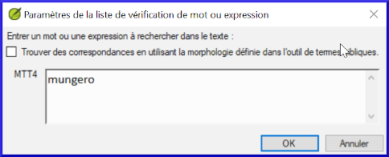
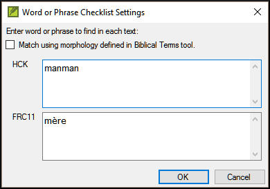

**Introduction**  
Dans ce module, vous allez chercher un mot ou phrase dans un projet et le comparer avec la traduction de ce mot ou phrase dans un autre projet.

**​Pourquoi cette aptitude est-elle importante ?**  
Dans Paratext 9 (et versions ultérieures), vous pouvez voir là où un mot ou une expression se trouve dans un projet et comparer comment le mot ou l’expression (ou une traduction du mot ou de l’expression) se produit dans un ou plusieurs autres projets. Par exemple, vous pouvez voir où le mot **roi** se produit dans un projet français et le comparer avec **rey** dans un projet espagnol.

**​Qu’est-ce qu’on va faire ?**  
On va  
- utiliser la liste **Mot ou expression** **du texte** et également **l’outil termes bibliques**.
- définir les paramètres et textes comparatifs
- saisir le mot ou l'expression à comparer

## 11.1 Comparer un mot ou expression - du texte
:::tip
Votre toute première comparaison ne fonctionnera pas car aucun texte de comparaison n'a encore été choisi. Vous devez saisir un premier mot à rechercher avant de pouvoir définir les textes de comparaison. 
:::
1. Cliquez dans le projet que vous souhaitez comparer.
1. **≡ Onglet**, sous **Outils** \> pointez sur **Listes de vérifications** et sélectionnez **Mot ou expression**   
     -  *La boîte de dialogue **Paramètres** s’affiche*.  
    
1. Entrez le mot ou l’expression que vous souhaitez voir dans chaque projet dans le dialogue
1. Cliquez sur **OK**  
     -  *Une fenêtre s’affiche.*  
    

### Choisir les textes à comparer
1. Cliquez sur **Textes comparatifs**…
1. Sélectionnez les textes que vous souhaitez comparer et cliquez sur **OK**.  
     -  *La boîte de dialogue **Paramètres** s’affiche.*  
    

### Tapez le mot ou la phrase à comparer
-  Saisissez le mot ou l’expression que vous souhaitez comparer dans la zone correspondant à chaque projet, puis cliquez sur **OK**.  
     -  *Une fenêtre s’affiche et le bouton* **Masquer des correspondances** *s’affiche sur la barre d’outils.*  
    

:::tip
Vous pouvez cliquer sur **Masquer les correspondances** pour afficher uniquement les références où le nombre d’occurrences du mot ou de l’expression diffère. Les mots où les phrases sont mises en surbrillance en bleu clair.
:::

## 11.2 Comparer l'utilisation d’un mot ou expression – de l’outil termes bibliques

1. Dans l’outil **Termes bibliques**,
1. Sélectionnez un terme biblique qui a déjà un équivalent.
1. Cliquez sur l’icône à droite **Afficher les équivalents du termes actuels dans la liste de vérification de mot ou expression**  
      
     -   *La boîte de dialogue «* **Paramètres** *» s’affiche avec l’équivalent déjà rempli.*
    
1. Saisissez le mot ou l’expression pour les autres projets.
1. Cliquez sur **OK**.
:::tip
Si vous voulez comparer plus d'un mot ou d'une phrase à la fois, tapez **Entrée** après chaque mot ou phrase afin qu'ils soient sur des lignes séparées.
:::